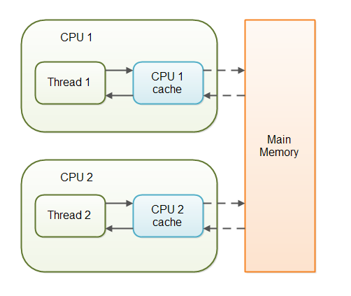

# JAVA

## 基础

### 对象结构

- 对象头(header)   64位为例
  - markwork   8byte 64字节
    - 用于存储对象自身的运行时数据，如哈希码（HashCode）、GC分代年龄、锁状态标志、线程持有的锁、偏向线程ID、偏向时间戳等，这部分数据的长度在32位和64位的虚拟机（未开启压缩指针）中分别为32bit和64bit，官方称它为“MarkWord”。
  - Klass (类型指针) 4byte
    - 对象头的另外一部分是klass类型指针，即对象指向它的类元数据的指针，虚拟机通过这个指针来确定这个对象是哪个类的实例.
    - 一个 class 文件被 load 进去之后会在方法区创建一个 Klass 实例(实际是它的实现类 instanceKlass)，class文件的描述信息都会放在这个实例里面。然后会在堆中创建一个 KlassOop 的实例(实际是它的实现类 instanceKlassOop)，这个实例中有个 Klass* 类型的属性，指向了方法区的那个 instanceKlass 实例
  - 数组长度 4个byte
    - 如果对象是一个数组, 那在对象头中还必须有一块数据用于记录数组长度.
- 实例数据(Instance data)
  - 
- 对齐填充(padding)
  - 


## 容器

### [HashMap](https://snailclimb.gitee.io/javaguide/#/docs/java/collection/HashMap(JDK1.8)源码+底层数据结构分析?id=hashmap-简介)

- 1.7

  - 数组+链表

  - 哈希冲突 --> 拉链法

  - hash方法

    ```java
    static int hash(int h) {
        // This function ensures that hashCodes that differ only by
        // constant multiples at each bit position have a bounded
        // number of collisions (approximately 8 at default load factor).
    
        h ^= (h >>> 20) ^ (h >>> 12);
        return h ^ (h >>> 7) ^ (h >>> 4);
    }
    ```

- 1.8

  - 数组+链表

  - 当链表长度>8,链表转为**红黑树**(但是,treeifyBin方法内部还有个判断,如果当前数组长度<64,那么先进行数组扩容,而不是转为红黑树),目的是为了减少搜索时间.

  - hash方法

    ```java
        static final int hash(Object key) {
          int h;
          // key.hashCode()：返回散列值也就是hashcode
          // ^ ：按位异或 运算规则 0^0=0；  0^1=1；  1^0=1；   1^1=0；
          // >>>:无符号右移，忽略符号位，空位都以0补齐
          return (key == null) ? 0 : (h = key.hashCode()) ^ (h >>> 16);
      }
    ```

- loadFactor 负载因子

  - 控制数组存放数据的疏密程度
  - 如果loadfactor趋近于1,那么数组中存放的数据(entry)也就越多,hash碰撞的概率也就越大,查找效率就越低
  - 如果loadfactor越小,那么数组存放的数据也就越少,扩容次数也就越多,对空间越浪费
  - 至于为什么是0.75,一个数学的概念:[泊松分布](https://baike.baidu.com/item/泊松分布/1442110?fr=aladdin)

- capacity[kəˈpæsəti]  容量 默认 16

- threshold [ˈθreʃhəʊld]

  - threshold = capacity * loadfactor
  - 当size 大于等于threshold的时候,那么就需要数组扩容

- put方法

  - 1.8
    1. 如果table为null或者table.length==0,则进行resize扩容
    2. 通过 (n - 1) & hash 计算出将要插入的数组下标值X
       1. 如果tab[x] == NULL,则直接插入
       2. 如果tab[x] != NULL,如果将要插入的key与存在的key的hash值一样并且两个key也一样的新的value覆盖旧的value
          1. 如不满足,则进行判断tab[x]是否是树节点.
             1. 如果是树节点,则进行遍历插入
             2. 如果不是树节点,则进行链表遍历插入
                1. 如果链表长度小于8,则将最后的数据插入链表**尾节点**
                2. 否则调用**treeifyBin(Node<K,V>[] tab, int hash)**方法
                   1. 进入该方法首先判断tab是否为空,或者tab的长度<64,如果满足则只进行resize扩容,不转为红黑树
                   2. 如果上边不满足,则将tab[x]的链表转为红黑树
    3. 如果经历上边过程,存在相同的key插入(新值替换旧值)
       1. 执行afterNodeAccess(Node<K,V> p) { } HashMap的空方法,jdk中只有LinkedHashMap实现了
       2. 直接return,不做后续操作了
    4. modCount加一
    5. 如果size加一后>threshold,则进行扩容
    6. 最后执行 void afterNodeInsertion(boolean evict) { } HashMap的空方法,jdk中只有LinkedHashMap实现了
  - 1.7
    1. 如果定位到的数组位置没有元素 就直接插入。
    2. 如果定位到的数组位置有元素，遍历以这个元素为头结点的链表，依次和插入的key比较，如果key相同就直接覆盖，不同就采用**头插法插入元素**。

- get方法

  1. 根据hash(key)方法,计算出hash值
     1. 通过(n - 1) & hash 方法计算出tab数组的下标值x
        1. 判断tab[x] 第一个节点的hash值是否等于输入的key的hash值并且判断两个key是否相等,如果相等则直接return
        2. 如果第一个节点不是要找的元素
           1. tab[x] 是树结构,则进行查找,之后return;
           2. tab[x] 是链表,则遍历链表查找,之后return

- resize方法

  1. 第一次put 初始化,比如计算threshold = 16 * 0.75,数组初始化等

  2. 非第一次put

     1. 如果map中的数组超过1 << 30 最大值了,就不在扩容了,直接将threshold=integer.max后return了
     2. 将capacity扩容为以前的两倍,后判断下新的capacity小于1 <<30并且大于16,threshold也扩容以前的2倍

  3. 循环遍历旧的数组

  4. 判断数组中node的next是否为空

     1. 如果为空,直接在新的数组中赋值,比如tab[i] = node
     2. 不为空,说明该node不是链表,就是树
        1. 链表遍历插入
        2. 树直接插入
           1. **树节点插入时,会判断当前树节点是否小于等于6 如果是,则退化成链表**

  5. [源码](https://blog.csdn.net/weixin_42340670/article/details/80503517?utm_medium=distribute.pc_relevant.none-task-blog-BlogCommendFromBaidu-3&depth_1-utm_source=distribute.pc_relevant.none-task-blog-BlogCommendFromBaidu-3)

     ```java
     final Node<K,V>[] resize() {
             Node<K,V>[] oldTab = table; //当前所有元素所在的数组，称为老的元素数组
             int oldCap = (oldTab == null) ? 0 : oldTab.length; //老的元素数组长度
             int oldThr = threshold;	// 老的扩容阀值设置
             int newCap, newThr = 0;	// 新数组的容量，新数组的扩容阀值都初始化为0
             if (oldCap > 0) {	// 如果老数组长度大于0，说明已经存在元素
                 // PS1
                 if (oldCap >= MAXIMUM_CAPACITY) { // 如果数组元素个数大于等于限定的最大容量（2的30次方）
                     // 扩容阀值设置为int最大值（2的31次方 -1 ），因为oldCap再乘2就溢出了。
                     threshold = Integer.MAX_VALUE;	
                     return oldTab;	// 返回老的元素数组
                 }
      
                /*
                 * 如果数组元素个数在正常范围内，那么新的数组容量为老的数组容量的2倍（左移1位相当于乘以2）
                 * 如果扩容之后的新容量小于最大容量  并且  老的数组容量大于等于默认初始化容量（16），那么新数组的扩容阀值设置为老阀值的2倍。（老的数组容量大于16意味着：要么构造函数指定了一个大于16的初始化容量值，要么已经经历过了至少一次扩容）
                 */
                 else if ((newCap = oldCap << 1) < MAXIMUM_CAPACITY &&
                          oldCap >= DEFAULT_INITIAL_CAPACITY)
                     newThr = oldThr << 1; // double threshold
             }
      
             // PS2
             // 运行到这个else if  说明老数组没有任何元素
             // 如果老数组的扩容阀值大于0，那么设置新数组的容量为该阀值
             // 这一步也就意味着构造该map的时候，指定了初始化容量。
             else if (oldThr > 0) // initial capacity was placed in threshold
                 newCap = oldThr;
             else {               // zero initial threshold signifies using defaults
                 // 能运行到这里的话，说明是调用无参构造函数创建的该map，并且第一次添加元素
                 newCap = DEFAULT_INITIAL_CAPACITY;	// 设置新数组容量 为 16
                 newThr = (int)(DEFAULT_LOAD_FACTOR * DEFAULT_INITIAL_CAPACITY); // 设置新数组扩容阀值为 16*0.75 = 12。0.75为负载因子（当元素个数达到容量了4分之3，那么扩容）
             }
      
             // 如果扩容阀值为0 （PS2的情况）
             if (newThr == 0) {
                 float ft = (float)newCap * loadFactor;
                 newThr = (newCap < MAXIMUM_CAPACITY && ft < (float)MAXIMUM_CAPACITY ?
                           (int)ft : Integer.MAX_VALUE);  // 参见：PS2
             }
             threshold = newThr; // 设置map的扩容阀值为 新的阀值
             @SuppressWarnings({"rawtypes","unchecked"})
                 // 创建新的数组（对于第一次添加元素，那么这个数组就是第一个数组；对于存在oldTab的时候，那么这个数组就是要需要扩容到的新数组）
                 Node<K,V>[] newTab = (Node<K,V>[])new Node[newCap];
             table = newTab;	// 将该map的table属性指向到该新数组
             if (oldTab != null) {	// 如果老数组不为空，说明是扩容操作，那么涉及到元素的转移操作
                 for (int j = 0; j < oldCap; ++j) { // 遍历老数组
                     Node<K,V> e;
                     if ((e = oldTab[j]) != null) { // 如果当前位置元素不为空，那么需要转移该元素到新数组
                         oldTab[j] = null; // 释放掉老数组对于要转移走的元素的引用（主要为了使得数组可被回收）
                         if (e.next == null) // 如果元素没有有下一个节点，说明该元素不存在hash冲突
                             // PS3
                             // 把元素存储到新的数组中，存储到数组的哪个位置需要根据hash值和数组长度来进行取模
                             // 【hash值  %   数组长度】   =    【  hash值   & （数组长度-1）】
                             // 这种与运算求模的方式要求  数组长度必须是2的N次方，但是可以通过构造函数随意指定初始化容量呀，
                             // 如果指定了17,15这种，岂不是出问题了就？没关系，
                             // 最终会通过tableSizeFor方法将用户指定的转化为大于其并且最相近的2的N次方。 15 -> 16、17-> 32
                             newTab[e.hash & (newCap - 1)] = e;
      
                             // 如果该元素有下一个节点，那么说明该位置上存在一个链表了（hash相同的多个元素以链表的方式存储到了老数组的这个位置上了）
                             // 例如：数组长度为16，那么hash值为1（1%16=1）的和hash值为17（17%16=1）的两个元素都是会存储在数组的第2个位置上（对应数组下标为1），当数组扩容为32（1%32=1）时，hash值为1的还应该存储在新数组的第二个位置上，但是hash值为17（17%32=17）的就应该存储在新数组的第18个位置上了。
                             // 所以，数组扩容后，所有元素都需要重新计算在新数组中的位置。
      
      
                         else if (e instanceof TreeNode)  // 如果该节点为TreeNode类型
                             ((TreeNode<K,V>)e).split(this, newTab, j, oldCap);  // 此处单独展开讨论
                         else { // preserve order
                             Node<K,V> loHead = null, loTail = null;  // 按命名来翻译的话，应该叫低位首尾节点
                             Node<K,V> hiHead = null, hiTail = null;  // 按命名来翻译的话，应该叫高位首尾节点
                             // 以上的低位指的是新数组的 0  到 oldCap-1 、高位指定的是oldCap 到 newCap - 1
                             Node<K,V> next;
                             // 遍历链表
                             do {  
                                 next = e.next;
                                 // 这一步判断好狠，拿元素的hash值  和  老数组的长度  做与运算
                                 // PS3里曾说到，数组的长度一定是2的N次方（例如16），如果hash值和该长度做与运算，那么该hash值可参与计算的有效二进制位就是和长度二进制对等的后几位，如果结果为0，说明hash值中参与计算的对等的二进制位的最高位一定为0.
                                 //因为数组长度的二进制有效最高位是1（例如16对应的二进制是10000），只有*..0**** 和 10000 进行与运算结果才为00000（*..表示不确定的多个二进制位）。又因为定位下标时的取模运算是以hash值和长度减1进行与运算，所以下标 = (*..0**** & 1111) 也= (*..0**** & 11111) 。1111是15的二进制、11111是16*2-1 也就是31的二级制（2倍扩容）。
                                 // 所以该hash值再和新数组的长度取摸的话mod值也不会放生变化，也就是说该元素的在新数组的位置和在老数组的位置是相同的，所以该元素可以放置在低位链表中。
                                 if ((e.hash & oldCap) == 0) {  
                                     // PS4
                                     if (loTail == null) // 如果没有尾，说明链表为空
                                         loHead = e; // 链表为空时，头节点指向该元素
                                     else
                                         loTail.next = e; // 如果有尾，那么链表不为空，把该元素挂到链表的最后。
                                     loTail = e; // 把尾节点设置为当前元素
                                 }
      
                                 // 如果与运算结果不为0，说明hash值大于老数组长度（例如hash值为17）
                                 // 此时该元素应该放置到新数组的高位位置上
                                 // 例：老数组长度16，那么新数组长度为32，hash为17的应该放置在数组的第17个位置上，也就是下标为16，那么下标为16已经属于高位了，低位是[0-15]，高位是[16-31]
                                 else {  // 以下逻辑同PS4
                                     if (hiTail == null)
                                         hiHead = e;
                                     else
                                         hiTail.next = e;
                                     hiTail = e;
                                 }
                             } while ((e = next) != null);
                             if (loTail != null) { // 低位的元素组成的链表还是放置在原来的位置
                                 loTail.next = null;
                                 newTab[j] = loHead;
                             }
                             if (hiTail != null) {  // 高位的元素组成的链表放置的位置只是在原有位置上偏移了老数组的长度个位置。
                                 hiTail.next = null;
                                 newTab[j + oldCap] = hiHead; // 例：hash为 17 在老数组放置在0下标，在新数组放置在16下标；    hash为 18 在老数组放置在1下标，在新数组放置在17下标；                   
                             }
                         }
                     }
                 }
             }
             return newTab; // 返回新数组
         }
     ```

     
     
     1. 关于下边(e.hash & oldCap) == 0的疑惑(如果等于0则新数组的下标还是用原数组的下标)
        1. 首先确定的是链表中的hash值并不一定是相等的,而是经过(n - 1) & hash 相等的下标
        2. 所以当tab扩容一倍后,同链表在进行(n - 1) & hash 就不一定相等了.
           1. 首先确定的是key的hashcode是不会变的,所以扰动函数计算出来的hashcode也不会变
           2. 数组的下标是通过(n - 1) & hash
        3. 举例,在扰动函数后key计算的hash = 1
           1. 当tab的长度为16时,链表中包涵hash=1,hash=17,hash=33等元素
              1. ( 16 - 1) & 1 = 1
              2. ( 16 - 1) & 17 = 1
              3. ( 16 - 1) & 33 = 1
           2. 所以可以看出,当tab长度为16时,这几个key定位数组的下标都是1
           3. 当扩容后tab的长度就变成了32
              1. ( 32 - 1) & 1 = 1
              2. ( 32 - 1) & 17 = 17
              3. ( 32 - 1) & 33 = 1
           4. 可以看出1,33经过tab扩容后下标还是1,而hash=17的下标变成了17
           5. 通过源码中e.hash & oldcap == 0 我们可以发现规律,1 & 16 = 0,33&16=0,而 17 & 16 = 16
           6. 最后个人觉得,作者这样写是为了性能
     
     ```java
     // 此处是扩容时 链表的处理方法
     // loHead，下标不变情况下的链表头
     // loTail，下标不变情况下的链表尾
     // hiHead，下标改变情况下的链表头
     // hiTail，下标改变情况下的链表尾
     Node<K, V> loHead = null, loTail = null; // 按命名来翻译的话，应该叫低位首尾节点
     Node<K, V> hiHead = null, hiTail = null; // 按命名来翻译的话，应该叫高位首尾节点
     // 以上的低位指的是新数组的 0  到 oldCap-1 、高位指定的是oldCap 到 newCap - 1
     Node<K, V> next;
     do {
     	next = e.next;
     	if ((e.hash & oldCap) == 0) {
     		if (loTail == null) {
     			loHead = e;
     		}
     		else {
     			loTail.next = e;
     		}
     		loTail = e;
     	}
     	else {
     		if (hiTail == null) {
     			hiHead = e;
     		}
     		else {
     			hiTail.next = e;
     		}
     		hiTail = e;
     	}
     } while ((e = next) != null);
     if (loTail != null) {
     	loTail.next = null;
     	newTab[j] = loHead;
     }
     if (hiTail != null) {
     	hiTail.next = null;
     	newTab[j + oldCap] = hiHead;
     }
     ```

- 常见面试题

  - 为什么hashmap每次扩容都是2的幂次?

    - 是为了数据的均匀分布减少hash冲突,原理看下边

    - 基于这个问题,首先可以确定的是,每次get,put,remove时,都会对当前key进行hash计算,计算出的hash值根据(n-1) &hash来定位该key在数组中的下标x.

    - hashmap中的 (N - 1) & hash   其中N是hashmap中数组的长度 tab.length

    - 从上边可以得知,计算出hash后有个数组下标的定位,(n-1) & hash就是关键,如果不同的key,定位到相同的下标,也就是碰撞了

    - 下边例子看下为什么是2的幂次

      | (N - 1)  & hash | n - 1 | &    | Hash |      |
      | --------------- | ----- | ---- | ---- | ---- |
      | (15 - 1) & 4    | 1110  | &    | 0100 | 0100 |
      | (15 - 1) & 5    | 1110  | &    | 0101 | 0100 |
      | (16 - 1) & 4    | 1111  | &    | 0100 | 0100 |
      | (16 - 1) & 5    | 1111  | &    | 0101 | 0101 |

      从上边的例子可以看出,n-1如果n是2的幂数,那么二进制中的所有数都是1,此时 & hash,那么就可以保留hash相应的完整的二进制,相反的如果长度不是2的幂次,则会出现hash碰撞的可用性的大大出现

    - 那么hash(key) 中的hash方法(扰动函数)为什么这么写

      - ```java
        static final int hash(Object key) {
                int h;
                return (key == null) ? 0 : (h = key.hashCode()) ^ (h >>> 16);
            }
        ```

      - 首先>>>16位,16正好是32bit的一半,自己的高半区与低半区做异或,是为了混合原始的哈希码的高位和低位,来加大地位的随机性,而且混合后的地位掺杂高位的部分特征,这样也会把高位的信息也保留下来了

    - 最后使hash()方法得出的hash值与 (n - 1) 做与运算,为什么做与运算呢?如果不做与运算,key.hashcode大约40亿的映射空间,这么大的范围无法写入内存

  - HashMap 什么时候将链表转化成红黑树,又什么时候将红黑树转化为链表

    - 链表 --> 红黑树
      - put时,当链表长度大于等于8并且当前数组的长度大于64时,会将链表转化为红黑树
    - 红黑树 --> 链表
      - remove时,在removeTreeNode方法时有个判断就是当树的root节点为空或root的右节点为空或root的左节点为空,root的左节点的左节点为空时退化
      - 扩容时,在java.util.HashMap.TreeNode#split方法中当low,high两个treeNode的长度小于6时,退化为链表

  - 为什么使用红黑树

    - 链表长度过长,那么插入和查找的效率就很低
    - AVL树,插入删除节点,整体性能不如红黑树,avl每个节点高度不能大于1,所以要维护这个结构比较耗性能,主要还是左旋右旋改变与维护avl高度问题,红黑树比他好的就是只需要改变颜色即可
    - 红黑树的整体查找,增加删除的效率都比较高.
    - 跳表,需要元素之间需要排序关系,还有就是跳表用空间换时间问题
    
  - HashMap什么时候扩容
  
    - 第一次put的时候,hashmap懒加载,new hashmap只是确定了负载因子等参数
    - 还是put的时候,当put完成后,判断当前map的数量如果大于阈值则进行扩容
    - 当链表大于等于8时,要转为红黑树,但是tab的长度小于64,则进行扩容

### [ConcurrentHashMap](https://blog.csdn.net/programmer_at/article/details/79715177)

- [红黑树实现分析](https://www.jianshu.com/p/23b84ba9a498)
  
- 原理
  
  - CAS + synchronized 保证并发安全
  - 数组 + 链表 + 红黑树
  
- 成员变量
  - table,数组,默认null,在第一次put时初始化,默认大小为16,扩容为2的幂
  - nextTable,默认null,扩容时新生成的数组,大小为原来的两倍
  - sizeCtl,默认为0,主要用来table初始化,扩容操作
    - -1 代表table正在初始化
    - -N 代表有N-1个线程正在进行扩容
    - 0 默认值,表示没有被初始化
    - 大于0 表示初始化或下一次扩容的阈值
  - Node,保存key,value以及key的hash值,其中value和next都用了volatile修饰,保证可见性
  - ForwardingNode
    - 一个特殊的node节点,hash值为-1,其中存储着nextTable引用
    - 在table扩容时,该节点才会发挥作用,作为一个占位符放在table中表示当前节点已被移动或当前节点为null
  - basecount (long), counterCells (CounterCell[])   [ˈkaʊntə(r)]   [sel]
    - 这两个参数用于获取concurrenthashmap的 size的
    - 当不存在并发时,数量获取使用basecount
    - 存在并发时,通过countercells遍历获取size大小
  
- 类变量

- initTable() 流程说明
  - 一个while循环,条件为table为空或者table的长度为0
  - 初始化的关键两处判断
    - sizeCtl < 0的话,表示有线程正在初始化,源码中遇到这个情况,直接调用Thread.yield方法让出cpu时间
    - 另一处就是通过cas操作将成员变量将sizeCtl设置为-1,如果成功,则进行初始化.
  - 关于初始化时,sizeCtl的赋值公式  n - (n >>> 2) 推导下
    - n - (n / 4)
    - 4n/4n - n/4
    - 3n/4n
    - 0.75n
  
- put() 方法 流程说明
  - 局部变量 bincount,初始化时为0
    - 当bincount>=8时则进行转化红黑树
  - 首先key或value其中一个为空,直接抛异常,说明concurrenthashmap不允许空的key或者空的value
  - 之后就是一个for忙循环,直到数据插入为止
    - 如果table为空或者长度为0则进行初始化(可以看出,是懒加载)
    - 经过计算hash之后定位插入key的下标x,根据下标x获取数据,判断x下标是否已经被其他key占用了(hash冲突)
      - 如果x下标没有被其他key占用,则直接通过cas(Unsafe类)插入数据,如果cas插入成功,直接break,否则重新循环走逻辑
    - 如果上一步判断计算出的下标x,被其他key占用了,此处先进行判断当前是否在扩容f.hash == MOVE表示正在扩容,则先协助扩容,之后在更新值.**helpTransfer(Node<K,V>[] tab, Node<K,V> f)**稍后仔细解释这个方法
    - 如果hash冲突了,则第一步先锁住冲突的链表头
      - 插入时判断下是链表还是红黑树,根据表头的hash值判断,如果hash>=0表示是链表否则是红黑树
      - 链表插入
        - 遍历链表,并且bincount做自增
          - 遍历时如果hash值相等并且两个key也相等,则进行覆盖,之后break
          - 或者遍历到链表末端则新值插入之后break
      - 红黑树插入(putTreeVal)
        - 没啥说的,如果插入方法返回值不为空,则进行新值覆盖旧值
    - 在for忙循环的最后一步则是判断是否转化为红黑树 treeifyBin 方法
  - 最后最后调用addcount(1L, bincount)方法,该方法后边会详细说
  
- [addCount(long x, int check) 方法](https://juejin.cn/post/6844903607901372423#comment)
  
  - 参数说明
    - x 在putval时 x = 1
    - check, putval时,传入的是bincount,并且bincount局部变量默认是0,当hash冲突时如果是链表表示的就是链表的长度
  - 代码说明 略
  - 主要作用
    - 对table的长度+1,无论是使用basecount还是通过countercells.当countercell被初始化就优先使用他,不再使用basecount
    - 检查是否需要扩容或者正在扩容,如果需要扩容就调用扩容方法,如果正在扩容就协助扩容
  
- [transfer](https://www.jianshu.com/p/f6730d5784ad) 扩容方法
  
  - 首先构建一个nextTable,大小为table的两倍
  - 把table的数据复制到nextTable中
  - 重点: 在扩容过程中,依然支持并发插入,更新操作
    - 再扩容过程中,遍历整个table,当前节点为空,则CAS操作在当前位置放入fwd(fwd中存在nextTable引用)
    - 如果当前节点已经为fwd(他的hash= -1 (move)),则说明已经有线程处理完成了,直接跳过
    - 当前节点为红黑树或链表,移动到nextTable的相关位置,移动完成后用unsafe.putobjectvolatile在tab的原位置赋值fwd,表示当前节点已处理完成
  - 红黑树退化成链表
    - 在扩容时 low、high 两个TreeNode 长度小于6时 会退化为链表。
  
- remove 方法
  - 关键流程,在删除节点时,如果该节点是树结构
  - 则会调用java.util.concurrent.ConcurrentHashMap.TreeBin#removeTreeNode 方法
  - 该方法内部有个判断,如果树太小则会返回 true,否则返回false
      - *在红黑树的root节点为空 或者root的右节点、root的左节点、root左节点的左节点为空时 说明树都比较小了*
  - 如果返回是true,则会将红黑树转化为链表
  
- clear 方法
  - 遍历table
  - 如果节点为空,跳过
  - 如果发现当前节点的hash = -1 (MOVE) 则是在扩容,先协助扩容,然后重头再遍历restart
  - 如果是正常节点,syn锁住,然后进行删除(链表或红黑树 while尾节点置空操作),最后利用cas将tab当当前节点置空
  
- 哈希探针
  
  - [文章](https://blog.csdn.net/L__ear/article/details/106528892)
  
- bug集合
  
- [CSDN](https://blog.csdn.net/anlian523/article/details/107328200)
  
- 面试问题

  - ConcurrentHashMap的若一致性?

    - https://my.oschina.net/hosee/blog/675423
    - happen before

  - ConcurrentHashMap的迭代是强一致还是若一致?

    - 若一致
    - hashmap是强一致性,因为在迭代的时候hashmap中维护了modCount参数

  - ConcurrentHashMap 的并发度是什么？

    - 并发度可以理解为程序运行时能够同时更新 ConccurentHashMap且不产生锁竞争的最大线程数
    - 在JDK1.7中，实际上就是ConcurrentHashMap中的分段锁个数，即Segment[]的数组长度，默认是16，这个值可以在构造函数中设置。
    - 如果并发度设置的过小，会带来严重的锁竞争问题；如果并发度设置的过大，原本位于同一个Segment内的访问会扩散到不同的Segment中，CPU cache命中率会下降，从而引起程序性能下降。
    - 在JDK1.8中，已经摒弃了Segment的概念，选择了Node数组+链表+红黑树结构，并发度大小依赖于数组的大小

  - JDK1.7 与 JDK1.8 中ConcurrentHashMap 的区别？

    - 数据结构：取消了 Segment 分段锁的数据结构，取而代之的是数组+链表+红黑树的结构。
    - 保证线程安全机制：JDK1.7 采用 Segment 的分段锁机制实现线程安全，其中 Segment 继承自 ReentrantLock 。JDK1.8 采用`CAS+synchronized`保证线程安全。
    - 锁的粒度：JDK1.7 是对需要进行数据操作的 Segment 加锁，JDK1.8 调整为对每个数组元素加锁（Node）。
    - 链表转化为红黑树：定位节点的 hash 算法简化会带来弊端，hash 冲突加剧，因此在链表节点数量大于 8（且tab数组总量大于等于 64）时，会将链表转化为红黑树进行存储。
    - 查询时间复杂度：从 JDK1.7的遍历链表O(n)， JDK1.8 变成遍历红黑树O(logN)。

  - 如何提高插入效率?

    - 从扩容操作入手
      - 配置合理的容量和负载因子,减少扩容事件发生
      - 避免锁升级
        - 在 put 方法中会使用 synchonized 对首节点进行加锁，而锁本身也是分等级的，因此我们的主要思路就是尽可能的避免锁升级。我们可以将数据通过 ConcurrentHashMap 的 spread 方法进行预处理，这样我们可以将存在哈希冲突的数据放在一个桶里面，每个桶都使用单线程进行 put 操作，这样的话可以保证锁仅停留在偏向锁这个级别，不会升级，从而提升效率。

  - concurrenthashmap的get put是非原子操作,如果对一个key进行安全操作?

    - java.util.concurrent.ConcurrentHashMap#replace(K, V, V)方法 当前key,旧值,新值

      ```java
      while (true) {
         Integer old = concurrentHashMap.get("yang");
         if (concurrentHashMap.replace("yang", old, old + 1)) {
            break;
         }
      }
      ```

  - 什么时候触发扩容?
    - 当新增加节点时,如果链表长度大于8,则会调用treeifybin方法,试图树化,如果tab的长度小于64,则会进行扩容,不树化
    - 新增加节点后,addcount统计tab中的节点个数大于阈值(sizeCtl),会触发transfer方法,重新调整节点位置
  - 扩容过程
    
    - 上边transfer有说明
  - concurrenthashmap与hashmap的size统计有何不同?
    - 前者使用basecount和counterCell,考虑到并发
    - 后者使用一个size字段
  - ConcurrentHashMap中的哈希探针作用?
  - 什么时候链表转化为红黑树,又什么时候将红黑树转为链表
    - 链表 -> 红黑树
      - 链表长度>=8,并且tab的长度大于64
    - 红黑树 -> 链表
      - remove时,在removeTreeNode方法时有个判断就是当树的root节点为空或root的右节点为空或root的左节点为空,root的左节点的左节点为空时退化.与hashmap一样
      - 扩容时树节点<= 6 转化为链表
  - 为什么链表长度达到阈值8 才转为红黑树
    
    - 红黑树插入为O(lgn),查询为O(lgn)，链表插入为O(1)，查询为O(n)。个数少时，插入删除成本高，用链表；个数多时，查询成本高，用红黑树。需要定一个值，比这个值大就转红黑树，比这个值小就转链表，而且要避免频繁的转换。根据泊松分布，在负载因子0.75（HashMap默认）的情况下，单个hash槽内元素个数为8的概率小于百万分之一，将7作为一个分水岭，等于7时不做转换，大于等于8才转红黑树，小于等于6才转链表。
  - ConcurrentHash为什么不支持key或value为null
    - Doug li
      - (ConcurrentHashMaps, ConcurrentSkipListMaps)这些考虑并发安全的容器中不允许null值的出现的主要原因是他可能会**在并发的情况下带来难以容忍的二义性**。而在非并发安全的容器中，这样的问题刚好是可以解决的。在map容器里面，调用map.get(key)方法得到的值是null，那你无法判断这个key是在map里面没有映射过，还是这个key在map里面根本就不存在。这种情况下，在非并发安全的map中，你可以通过**map.contains(key)**的方法来判断。但是在考虑并发安全的map中，在两次调用的过程中，这个值是有可能被改变的。
    - [如果以前用的是hashmap可以存放null,现在要转换成concurrenthashmap如果解决](https://mp.weixin.qq.com/s?__biz=Mzg3NjU3NTkwMQ==&mid=2247505071&idx=1&sn=5b9bbe01a71cbfae4d277dd21afd6714&source=41#wechat_redirect)
      - 切面
        - 切put方法,判断如果为空使用默认值替换
      - 声明一个static final Object NULL = new Object(),用null替换所有null的地方
  - ConcurrentHashMap 的 put 方法执行逻辑是什么？
    - 根据 key 计算出 hash 值；
    - 判断是否需要进行初始化；
    - 定位到 Node，拿到首节点 f，判断首节点 f：
      - 如果为 null ，则通过 CAS 的方式尝试添加；
      - 如果为 `f.hash = MOVED = -1` ，说明其他线程在扩容，参与一起扩容；
      - 如果都不满足 ，synchronized 锁住 f 节点，判断是链表还是红黑树，遍历插入；
    - 当在链表长度达到 8 的时候，数组扩容或者将链表转换为红黑树。

### [LinkedHashMap](http://www.tianxiaobo.com/2018/01/24/LinkedHashMap-源码详细分析（JDK1-8）/)

- 维护一个双向链表,可以控制顺序(插入顺序和访问顺序),默认插入顺序
- linkedhashmap继承hashmap大多数方法都是hashmap的
- 面试题
  - LRU实现
    - 设置为访问顺序(accessOrder=true)
    - 实现removeEldesEntry方法
    - 因为每次访问key,会把key放到链表尾端,所以当实现removeEldesEntry方法返回为true会删除头结点

### [Arraylist](https://snailclimb.gitee.io/javaguide/#/docs/java/collection/arraylist-source-code)

## JDK一些类

### sun.misc.Unsafe

### 并发

#### 线程

- 状态转换

    

- JAVA线程阻塞的代价

    - java线程的上下文切换需要操作系统接入,java的线程是映射到操作系统原生线程上的
    - 操作系统切换线程需要在用户态与内核态之间切换,因为用户态和内核态内存空间各自独立,故切换要传递变量和参数,这样系统消耗较大,费事

#### 关键字

##### synchronized [参考链接](http://cmsblogs.com/?p=2071) [参考链接](https://blog.csdn.net/zqz_zqz/article/details/70233767?utm_medium=distribute.pc_relevant.none-task-blog-BlogCommendFromMachineLearnPai2-4.control&depth_1-utm_source=distribute.pc_relevant.none-task-blog-BlogCommendFromMachineLearnPai2-4.control) [参考链接](https://www.codercc.com/backend/basic/juc/concurrent-keywords/synchronized.html) [参考链接(重点)](https://juejin.cn/post/6844903805121740814#comment)

- 非公平锁

- 应用 : A a = new A();

- 锁普通方法 (锁的是A的实例)

- 锁静态方法 (锁的是A.class)

- 锁代码块

    - 对象(a,锁的是A的实例)
    - 类 (A.class,锁的是A.class)

- 问:当两个线程同时执行A类中的普通方法和静态方法是否互斥?答:不互斥,因为是两把不同的锁

- 原理(字节码层次,在java语言存在两种语法)

    - 语法
        - 锁 --> 代码块
            - 代码块在源码被编译成bytecode时,会在同步代码的入口位置和退出位置分别插入monitorenter,monitorexit字节指令
        - 锁 --> 方法
            - 在字节码层面没有特别的指令实现被synchronized修饰的方法,而是在Class文件的方法表中将该方法的access_flags字段中的synchronized标志位置1,表示该方法是同步方法并使用调用该方法的对象或者方法所属的Class在jvm的内部对象表示Klass作为对象锁
            - flag ACC_SYNCHRONIZED
    - 对象头
        - synchronized用的锁时存在**对象头**里的
        - 对象头主要包括两部分数据(Mark Work, Klass Pointer)
            - Mark Work (标记字段)
            - Klass Pointer (类型指针)
    - 

- 锁状态

    - 偏向锁
        - 优点
            - 加锁和解锁不需要额外的消耗,和执行费同步方法相比仅存在纳秒级别的差距
        - 缺点
            - 如果线程间存在锁竞争,会带来额外的锁撤销消耗
        - 适用于只有一个线程访问同步代码块
    - 轻量级锁
        - 优点
            - 竞争的线程不会阻塞,提高程序的响应速度
        - 缺点
            - 如果始终得不到锁竞争的线程会使用自旋会消耗cpu
        - 追求响应时间,同步块执行速度非常快
    - 重量级锁
        - 优点
            - 线程竞争不使用自旋,不会消耗CPU
        - 缺点
            - 线程阻塞,响应时间慢
        - 追求吞吐量,同步块执行速度比较长

- [synchronized膨胀过程](https://blog.csdn.net/xueba8/article/details/88753443)

    

    - 

##### [volatile](https://www.cnblogs.com/dolphin0520/p/3920373.html#!comments)

- 功能责任

    - 可见性

        - 初衷
            - 在多线程的应用中,线程在操作变量时,出于性能考虑,每个线程可能会将变量从主内存拷贝到CPU缓存中,如果计算机有多个CPU,那么每个线程可能在不同的CPU中运行,也就意味着,每个线程都有可能把变量拷贝到各自的CPU缓存中,也就表示着,会出现同一个变量在不同线程中数据不一致,所以volatile应运而生.

    - 顺序性(防止**指令重排序**)

        | 是否能重排序Y/N | 第二个操作 | 第二个操作 | 第二个操作 |
        | :-------------: | :--------: | :--------: | :--------: |
        |   第一个操作    |  普通读写  | volatile读 | volatile写 |
        |    普通读写     |     Y      |     Y      |     N      |
        |   volatile读    |     N      |     N      |     N      |
        |   volatile写    |     Y      |     N      |     N      |

        举个例子,为什么volatile读后一个普通读不允许指令重排(A/B两个线程)

        

- 实现原理

    - Java内存屏障
        - LoadLoad屏障
            - 对于这样的语句Load1; LoadLoad; Load2，在Load2及后续读取操作要读取的数据被访问前，保证Load1要读取的数据被读取完毕。
        - StoreStore屏障
            - 对于这样的语句Store1; StoreStore; Store2，在Store2及后续写入操作执行前，保证Store1的写入操作对其它处理器可见。
        - LoadStore屏障
            - 对于这样的语句Load1; LoadStore; Store2，在Store2及后续写入操作被刷出前，保证Load1要读取的数据被读取完毕。
        - StoreLoad屏障
            - 对于这样的语句Store1; StoreLoad; Load2，在Load2及后续所有读取操作执行前，保证Store1的写入对所有处理器可见。**它的开销是四种屏障中最大的。在大多数处理器的实现中，这个屏障是个万能屏障，兼具其它三种内存屏障的功能**
    - volatile语义的内存屏障
        - 每个volatile写操作前都要插入StoreStore屏障,在写操作后插入StoreLoad屏障
        - 每个volatile读操作前都要插入LoadLoad屏障,在读操作后插入LoadStore屏障
    - final语义中的内存屏障
        - 写
            - 新建对象过程中,构造体中对final域的初始化和写入和这个对象赋值给其他引用变量,操作是不能重排序的
            - 在编译器写final域完毕，构造体结束之前，会插入一个StoreStore屏障，保证前面的对final写入对其他线程/CPU可见，并阻止重排序。
        - 读
            - 初次读包涵final域的对象引用和读取这个final域,这操作时不能重排序的(先赋值引用,在调用final值)
            - 在上述规则2中，两步操作不能重排序的机理就是在读final域前插入了LoadLoad屏障。
        - 大概意思,**必须保证一个对象的所有final域被写入完毕后才能引用和读取,这也是内存屏障起的作用**

    - 题外话:内存间的同步操作(一个变量从主内存拷贝到工作内存,从工作内存同步主内存)
        - lock(锁定) 作用于主内存变量，把一个变量标识为一条线程独占的状态
        - unlock(解锁) 作用于主内存变量，把一个处于锁定状态的变量释放,释放后的变量才可以被其它线程锁定 unlock之前必须将变量值同步回主内存
        - read(读取) 作用于主内存变量，把一个变量的值从主内存传输到工作内存，以便随后的load
        - load(载入) 作用于工作内存变量，把read从主内存中得到的变量值放入工作内存的变量副本
        - use(使用) 作用于工作内存变量，把工作内存中一个变量的值传递给执行引擎，每当虚拟机遇到一个需要使用到的变量的值得字节码指令时将会执行这个操作
        - assign(赋值) 作用于工作内存变量，把一个从执行引擎接收到的值赋给工作内存的变量，每当虚拟机遇到一个给变量赋值的字节码指令时执行这个操作
        - store(存储) 作用于工作内存变量，把工作内存中一个变量的值传送到主内存，以便随后的write操作使用
        - write(写入) 作用于主内存变量，把store操作从工作内存中得到的值放入主内存的变量中

    

- 经验之谈

    - 可以将对volatie变量的读写理解为一个刷新操作
        - 写入volatile变量时,线程中的所有变量(非volatile)也会触发写入主内存
        - 读volatile变量时,同样也会触发线程中所有变量从主内存中读取.
        - 所以在写volatile变量,尽可能放在最后,读读volatile放在最前


#### **LookSupport**

- 线程等待唤醒机制(相当于wait/notify 加强版)

- LockSupport通过许可（permit）实现线程挂起、挂起线程唤醒功能。permit可以理解为每个已启动线程维持的一个int类型状态位counter。线程分别通过执行LockSupport静态方法park()、unPark()方法来完成挂起、唤醒操作。

- 主要方法

    - java.util.concurrent.locks.LockSupport#park()
        - 唤醒条件
            - unpark()
                - 当线程执行park时,判断状态位counte为1,表示拥有许可,立马放行,并将状态位counter设置为0
                - 当线程执行park时,判断状态位counter为0,表示未获得许可,线程阻塞
        - 响应中断
            - 当其他线程调用了t.interrupt(),locksupport.park()会效应中断
    - java.util.concurrent.locks.LockSupport#unpark(Thread thread)
        - 现将当前状态位counter设置为1
        - 判断当前线程是否被挂起
            - 挂起,则唤起线程,并将counter设为0
            - 未挂起,无任何操作

- 面试题

    - 先执行unpark在执行park程序会出现什么情况?
        - 先执行unpark,执行线程与locksupport关联的许可(permit)会被设置成1,当执行park时,会进行状态位判断,因为许可被设置成了1,所以表示当前执行的线程拥有许可,立马放行,并将许可设置成0
    - 先唤醒两次,在阻塞两次会出现什么情况?
        - 会阻塞线程
        - 当执行两次unpark时,会将状态位设置为1,且仅为1,状态位counter最大只能设置为1,也就是许可permit最大为1,所以不管先执行几次unpark,都只能唤醒一个park


#### 中断

- 关键方法
    - java.lang.Thread#isInterrupted()   --- public boolean isInterrupted()
        - 会调用private native boolean isInterrupted(boolean ClearInterrupted) 本地方法,true代表重置,false代表不重置,此处ClearInterrupted=false
        - 测试线程是否已经中断。线程的中断状态不受该方法的影响
    - java.lang.Thread#interrupted   --- public static boolean interrupted()
        - 会调用private native boolean isInterrupted(boolean ClearInterrupted) 本地方法,true代表重置,false代表不重置,此处ClearInterrupted=true
        - 测试当前线程是否已经中断。如果线程处于中断状态返回true，否则返回false。同时该方法将清除的线程的中断状态。即，如果连续两次调用该方法，则第二次调用将返回 false。该方法可用于清除线程中断状态使用。
    - java.lang.Thread#interrupt ---- public void interrupt()
        - 中断线程

#### AQS (抽象的队列同步器) [源码解读](https://www.cnblogs.com/waterystone/p/4920797.html)

- 

- state (int)  volatile 修饰的state字段

    -  0 值表示空闲没有任何线程占用,大于0表示有线程正在使用

- AQS中维护一个CLH队列,和一个volatile 修饰的state字段

    - 为什么要使用双向列表? 单向列表不能解决吗?
        - 中断
            - 中断操作需要在 AQS 同步队列中删除线程 Node，这也就转化为在链表中删除节点的问题。
            - 如果想从CLH 单向链表中间删除一个 Node，因为只维护了前一个节点的指针，想要知道后一个节点的指针的话，不通过从tail开始使用快慢指针遍历是无法办到的。
            - 因此直接维护prev、next指针，以降低删除操作的复杂性。
        - 唤醒
            - 了解下CLH数据结构: 他只有前置指针 大概结构如下
                - tail 尾结点，总是指向最后一个CLHNode节点
                - myPred  当前节点的前继节点
                - myNode  当前节点
            - 所以当持有锁的线程想唤醒下一个节点时,如果按照CLH的结构需要从clh队尾向上遍历直到遍历到需要的node节点,然后唤醒
            - 所以aqs在clh上做了变种,增加了next指针,可以快速定位下一个要唤醒的线程
        - 安全
            - 之所以同步队列要设计成双向的，是因为在同步队列中，节点唤醒是接力式的，由每一个节点唤醒它的下一个节点，如果是由next指针获取下一个节点，是有可能获取失败的，因为虚拟队列每添加一个节点，是先用CAS把tail设置为新节点，然后才修改原tail的next指针到新节点的。因此用next向后遍历是不安全的，但是如果在设置新节点为tail前，为新节点设置prev，则可以保证从tail往前遍历是安全的。因此要安全的获取一个节点Node的下一个节点，先要看next是不是null，如果是null，还要从tail往前遍历看看能不能遍历到Node。
    - Node 内部类
        - static final Node SHARED = new Node();   共享锁标识
        - static final Node EXCLUSIVE = null; // 共享锁
        - static final int CANCELLED =  1; 
        - static final int SIGNAL    = -1;
        - static final int CONDITION = -2;
        - static final int PROPAGATE = -3;
        - volatile int waitStatus; //初始值 0
        - volatile Node prev; 前指针
        - volatile Node next; 后指针
        - volatile Thread thread; 当前node的线程
        - Node nextWaiter;
    - Node head 头结点
    - Node tail 尾节点
    
- 流程 (以ReentrantLock为例)

    - new ReentrantLock() 初始化,默认使用非公平锁(NonfairSync)

    - lock

        - ```java
            final void lock() {
                if (compareAndSetState(0, 1))
                    setExclusiveOwnerThread(Thread.currentThread());
                else
                    acquire(1);
            ```

            

        - 当state=0时也就是说没有任何线程占用锁,cas操作成功,将state从0设置成1,并且返回true,然后设置拥有锁的线程,也就是当前线程

        - 当state !=0,也就是已经有线程占有锁了,表示cas操作失败,进入acquire(1);方法

        - ```java
            public final void acquire(int arg) {
                if (!tryAcquire(arg) &&
                    acquireQueued(addWaiter(Node.EXCLUSIVE), arg))
                    // 当acqioreQueued返回true则表示当前线程不是被unpark唤醒的,是被其他线程中断唤醒的,所以要自我中断一次,将中断标志位设为true
                    // 原因是因为,当前线程在阻塞时没有及时响应中断信号,现在要进行补偿,这样的话,如果该线程在lock代码块内部调用sleep()之类的阻塞方法
                    // 就可以抛出异常,响应中断
                  selfInterrupt();
            }
            ```

        - 此时tryAcquire(arg)会再次尝试获取一下锁,如果成功后边的方法就不用再执行了

            - ```java
                protected final boolean tryAcquire(int acquires) {
                    return nonfairTryAcquire(acquires);
                }
                final boolean nonfairTryAcquire(int acquires) {
                    // 获取当前线程
                    final Thread current = Thread.currentThread();
                    int c = getState();
                    // 如果c = 0 也就是state=0尝试cas强锁
                    if (c == 0) {
                        // 抢锁成功的话设置当前线程为持有锁线程并返回true
                        if (compareAndSetState(0, acquires)) {
                            setExclusiveOwnerThread(current);
                            return true;
                        }
                    }
                    // 如果c!=0 也就是state!=0判断,持有锁的线程是不是当前线程(重入锁逻辑)
                    else if (current == getExclusiveOwnerThread()) {
                        int nextc = c + acquires;
                        if (nextc < 0) // overflow
                            throw new Error("Maximum lock count exceeded");
                        setState(nextc);
                        return true;
                    }
                    return false;
                }
                ```

        - 当tryAcquire(arg) 失败,则继续向后执行

            - ```java
                private Node addWaiter(Node mode) {
                	// 创建一个node节点,mode 区分为 共享锁/独占锁,此处是以ReentrantLock为例,
                	// 所以此处是独占锁Node.EXCLUSIVE
                    Node node = new Node(Thread.currentThread(), mode);
                    // 将尾节点赋值给pred
                    Node pred = tail;
                    // 尝试快速将node节点加入队尾
                    if (pred != null) {
                        node.prev = pred;
                        // 将新创建的node设置成尾节点,如果CAS操作失败了走下面的end方法
                        if (compareAndSetTail(pred, node)) {
                            pred.next = node;
                            return node;
                        }
                    }
                    // 上一步失败进入end方法 自旋将node加入队尾
                    enq(node);
                    return node;
                }
                private Node enq(final Node node) {
                	// 一个自旋 直到把node放入尾节点为止
                    for (;;) {
                        Node t = tail;
                        // 第一次进来t 肯定是null
                        if (t == null) { // Must initialize
                        	// 此处创建了一个node实例并将这个实例放置到头结点
                            // 该节点也叫哨兵节点/傀儡节点,只是占位使用
                            if (compareAndSetHead(new Node()))
                            	// 如果CAS设置成功 将将尾节点赋值
                                tail = head;
                        } else {
                            //当 t != null时进入此处
                            node.prev = t;
                            //CAS 操作将尾节点设置成enq入参的node
                            if (compareAndSetTail(t, node)) {
                                // CAS 操作成功,设置t的next节点为node并返回
                                t.next = node;
                                return t;
                            }
                        }
                    }
                }
                ```

                - enq第一次图(t==null)
                - enq第二次图(t!=null)

        - enq方法执行完成后执行acquireQueued(final Node node, int arg) 方法

            - ```java
                final boolean acquireQueued(final Node node, int arg) {
                    boolean failed = true;
                    try {
                        boolean interrupted = false;
                        // 自旋
                        for (;;) {
                            // 获取node的前置节点,该方法会抛出一个npe异常
                            final Node p = node.predecessor();
                            //如果node的前置节点是头结点,则再次尝试抢锁
                            if (p == head && tryAcquire(arg)) {
                                // 抢锁成功设置当前节点为头节点也就是傀儡节点
                                setHead(node);
                                // 将之前的头结点next引用改为null,方便gc
                                // 换句话说就是之前的头结点p已经给任何node没有应用关系了
                                p.next = null; // help GC
                                failed = false;
                                return interrupted;
                            }
                            // 当shouldParkAfterFailedAcquire=true
                            // parkAndCheckInterrupt=false (表示未被中断)
                            // parkAndCheckInterrupt=true (表示被中断) 并赋值interrupted = true;
                            // 此时线程已被前一个node节点唤醒,并且前一个节点已经晋升为头结点,当前线程开始进入下一次自旋
                            if (shouldParkAfterFailedAcquire(p, node) &&
                                parkAndCheckInterrupt())
                                interrupted = true;
                        }
                    } finally {
                        if (failed)
                            cancelAcquire(node);
                    }
                }
                private void setHead(Node node) {
                    head = node;
                    node.thread = null;
                    node.prev = null;
                }
                private static boolean shouldParkAfterFailedAcquire(Node pred, Node node) {
                    int ws = pred.waitStatus;
                    if (ws == Node.SIGNAL)
                        /*
                         * This node has already set status asking a release
                         * to signal it, so it can safely park.
                         */
                        return true;
                    if (ws > 0) {
                		// 当被取消的线程才会进入这里
                        do {
                            node.prev = pred = pred.prev;
                        } while (pred.waitStatus > 0);
                        pred.next = node;
                    } else {
                		// waitStatus的默认值是0,所以第一次进来会进入这里
                        // 执行一个CAS操作,将waitStatus 赋值成SINNAL(-1)
                        compareAndSetWaitStatus(pred, ws, Node.SIGNAL);
                    }
                    return false;
                }
                private final boolean parkAndCheckInterrupt() {
                    // 挂起线程 阻塞在这里了,等待被unpark
                    LockSupport.park(this);
                    // 获取当前线程是否被中断过,并恢复默认中断状态(false)
                    return Thread.interrupted();
                }
                ```

    - 释放锁

        - ```java
            public void unlock() {
                sync.release(1);
            }
            public final boolean release(int arg) {
                if (tryRelease(arg)) {
                    Node h = head;
                    if (h != null && h.waitStatus != 0)
                        unparkSuccessor(h);
                    return true;
                }
                return false;
            }
            protected final boolean tryRelease(int releases) {
                int c = getState() - releases;
                // 在释放锁时,如果不是当前线程占有的锁,则抛出异常
                if (Thread.currentThread() != getExclusiveOwnerThread())
                    throw new IllegalMonitorStateException();
                boolean free = false;
                // 如果c==0表示可以释放锁了,如果非0表示当前线程是重入锁
                if (c == 0) {
                    free = true;
                    setExclusiveOwnerThread(null);
                }
                // 直接setState值,而不是使用CAS,因为reentranLock的addWaiter(Node.EXCLUSIVE) 用的是排它锁,
                // 所以此时直接set即可,此时是没有线程来抢锁的
                setState(c);
                return free;
            }
            // node 传进来的是头结点,也是当前线程的node节点
            private void unparkSuccessor(Node node) {
                    int ws = node.waitStatus;
                    if (ws < 0)
                        compareAndSetWaitStatus(node, ws, 0);
                    Node s = node.next;
                    if (s == null || s.waitStatus > 0) {
                        s = null;
                        for (Node t = tail; t != null && t != node; t = t.prev)
                            if (t.waitStatus <= 0)
                                s = t;
                    }
                    if (s != null)
                        // 唤醒下一个线程
                        
                        LockSupport.unpark(s.thread);
                }
            ```

#### CAS的ABA问题

- AtomicStampedReference

    - 解决CAS操作aba问题

    - 内部维护了对象值和版本号，在创建AtomicStampedReference对象时，需要传入初始值和初始版本号，当AtomicStampedReference设置对象值时，对象值以及状态戳都必须满足期望值，写入才会成功

#### [Condition](https://blog.csdn.net/qq_41125219/article/details/118255779)

- [重点文章](https://blog.csdn.net/qq_45966902/article/details/122837417)

- 与Object的wait notify 系列对比
  
    - condition支持多个等待队列 (内部维护一个单向列表)
    
- 主要维护了等待队列通过next指针寻找下一个节点

    - 	//头节点
            	private transient AbstractQueuedSynchronizer.Node firstWaiter;
            	//尾节点
            	private transient AbstractQueuedSynchronizer.Node lastWaiter;

- Condition中的await()/signal()相比Object中的wait()/notify()，Condition拥有更多的高级特性能够实现更加复杂的等待线程集的场景。

- 但是我们在使用Lock和Condition时在调用await()和signal()要注意必须持有Lock对象（尽管在Lock对象中定义的具体实现，构造一个Condition可以不满足持有Lock对象这个条件）。

- 流程

    - Condition.await()
        - 构造一个新的等待队列节点加入到等待队列队尾
        -  释放锁，也就是将它的同步队列节点从同步队列队首移除
        - 自旋，直到它在等待队列上的节点移动到了同步队列（通过其他线程调用signal()）或被中断
        - 阻塞当前节点，直到它获取到了锁，也就是它在同步队列上的节点排队排到了队首

    - Condition.signal()
        1. 从等待队列的队首开始，尝试对队首节点执行唤醒操作；如果节点CANCELLED，就尝试唤醒下一个节点；如果再CANCELLED则继续迭代。
        2.  对每个节点执行唤醒操作时，首先将节点加入同步队列，此时await()操作的步骤3的解锁条件就已经开启了。然后分两种情况讨论
        3. 如果先驱节点的状态为CANCELLED(>0) 或设置先驱节点的状态为SIGNAL失败，那么就立即唤醒当前节点对应的线程，此时await()方法就会完成步骤3，进入步骤4.
        4. 如果成功把先驱节点的状态设置为了SIGNAL，那么就不立即唤醒了。等到先驱节点成为同步队列首节点并释放了同步状态后，会自动唤醒当前节点对应线程的，这时候await()的步骤3才执行完成，而且有很大概率快速完成步骤4.


#### Semaphore

- 根据构造器permits入参,控制线程并发数
- 构造方法
    - int permits
        - 许可入参,默认使用非公平锁
    - int permits, boolean fair
        - 许可证, 根据布尔值判断使用公平锁或非公平锁
- 流程 (非公平锁)
    - semaphore.acquire()
        - semaphore semaphore new semaphore(3)设置凭证数量 其实就是aqs中的state
        - 每次执行semaphore.acquire()时 state-1是否大于0如果大于零放行否则加入等待队列 
        - 进入队列是将自己包装成一个共享模式的Node节点，然后自旋，如果自己的前驱不是头节点，就会被阻塞
        - 被唤醒后，还在自旋的循环中，然后判断如果前驱是头节点，就会去尝试修改我们的state，修改成功，就会去设置头节点，失败的话就会继续进行自旋
        - 公平锁:被唤醒后，还在自旋的循环中，然后其实也就是看头节点后面是不是有元素，并且这个元素是不是自己,然后尝试修改state,成功则完成,失败的话会继续进行自旋
    
    - semaphore.release()
        - 尝试去自旋的CAS修改我们的state为state+释放的量
        - 修改成功后，自旋的去唤醒节点，然后这些被唤醒的节点又会去尝试获取资源
    

#### [CountDownLatch](https://www.jianshu.com/p/7c7a5df5bda6)

- 等所有线程执行完毕后在执行await后的所有方法
- 有个final修饰的内部类Sync extends AbstractQueuedSynchronizer
    - Sync 只是重写了AQS的两个方法
    - java.util.concurrent.CountDownLatch.Sync#tryAcquireShared(int)
    - java.util.concurrent.CountDownLatch.Sync#tryReleaseShared(int)
- 主要使用方法
    - java.util.concurrent.CountDownLatch#countDown
        - 内部会调用aqs的releaseShared方法,进行一次释放
        - 执行Sync重写的tryReleaseShared方法,主要就是通过cas将state减一 (在一个忙循环中)
        - 再上一步,将state-1成功后会尝试唤醒被await的线程
        - 经过一些列判断最终会调用Lock.unpark
    - java.util.concurrent.CountDownLatch#await()
        - 该方法内部最终会调用aqs的acquireSharedInterruptibly 说明一个问题就是可中断唤醒
        - 将自己当前线程加入到一个CLH队列中(共享锁),自己就是队列头,也是队列尾,因为此时state>0所以要借助与LockSupport.park阻塞当前线程
        - 阻塞自己有两种情况被唤醒(1.被中断, 2.被其他线程唤醒)
    - java.util.concurrent.CountDownLatch#await(long, java.util.concurrent.TimeUnit)
    - java.util.concurrent.CountDownLatch#getCount

#### CyclicBarrier

- 要等待所有线程达到指定位置后再全部一起执行
- 主要实现是使用了ReentrantLock和condition,和一个parties(用来记录栅栏数),count(被parties赋值,每达到一个线程自减)
- 从构造函数开始讲 在使用时 new CyclicBarrier(int parties, Runnable barrierAction);
    - 要确定parties的数量和在执行完后一个函数
- 主要方法
    - java.util.concurrent.CyclicBarrier#await() throws InterruptedException, BrokenBarrierException
        - 从异常信息中可以看出,await是可以被中断和broken破坏唤醒的
        - 最终会调用doWait方法
        - 方法开头就是一把锁,为了保证count自减的原子性
        - 检查broken是否被破坏,如果被标记破坏则直接抛出brokenbarrier异常
        - 如果当前线程被中断了,则唤醒所有阻塞的线程,并重置parties,抛出中断异常
        - count做自减,如果count=0,表示所有线程都到达了指定位置
            - 如果我们在初始化时,在构造函数中传入了runnable函数,则执行该函数
            - 如果在执行runnable函数过程中出现了异常,则唤醒所有线程(该方法块不会捕获异常,也就是说会把异常抛出去)
        - 如果count > 0 表示还有count个线程未到达指定的位置
            - 两种处理在调用await中传了时间参数和没传时间参数
            - 没传时间参数就直接调用condition.await的方法,如果传了时间则是调用condition.awaitNanos(nanos)方法,等待被唤醒(底层最中还是LockSupport)
            - 此处还会处理一个中断异常,主要两个分支
                - broken是false并且generation的实例没发生改变,直接唤醒所有线程,重置count然后把中断异常抛出去
                - 如果实例发生改变了,或broken为true,则进行自我中断
    - java.util.concurrent.CyclicBarrier#await(long, java.util.concurrent.TimeUnit)  超时等待
    - java.util.concurrent.CyclicBarrier#getNumberWaiting 获取等待的线程数
    - java.util.concurrent.CyclicBarrier#getParties 获取创建时的栅栏数
    - java.util.concurrent.CyclicBarrier#reset 重置
        - 该方法主要就是强制标记broken=true,重置count数量,唤醒所有线程
        - 然后创建一个新的generation
    - java.util.concurrent.CyclicBarrier#isBroken 判断当前是否已被破坏

#### 线程池

- 使用线程池的好处

    - 降低资源消耗,通过重复利用已创建的线程减低线程的创建和销毁造成的消耗
    - 提高响应速度,基于线程复用,当任务到达时不需要等待线程创建就能立即执行
    - 提高线程的可管理性,线程是稀有资源,如果无线创建,不仅会消耗系统资源,还会降低系统的稳定性,使用线程池可以统一分配,调优监控

- Executor [ɪɡˈzekjətə(r)]

    - 题外话:有助于避免this逃逸问题

    - 结构

        - 任务

            - Runnable
            - Callable<T>

        - 任务执行(Executor接口)

            - executor执行方法

                - java.util.concurrent.Executor#execute(Runnable command);

            - submit执行方法(ExecutorService extends Executor)

                - ```java
                    Future<?> submit(Runnable task); // 返回null表示执行完成
                    ```

                - ```java
                    <T> Future<T> submit(Runnable task, T result);
                    ```

                - ```java
                    <T> Future<T> submit(Callable<T> task) // 可实现Callable接口
                    ```

        - 异步计算结果(Future)

            - submit后,返回的其实是FutureTask

    - 自带的几种线程池

        - newFixedThreadPool
            - 一共两个方法,①只设置线程数量,②设置线程数量和线程工厂方法
            - 返回一个固定数量的线程池,核心线程=最大线程,存活时间为0,队列为LinkedBlockingQueue(无限大小,integer.max)
        - newSingleThreadExecutor
            - 只创建一个线程,可自定义线程工厂
            - 队列使用LinedBlockingQueue
        - newCachedThreadPool
            - 核心线程为0,最大线程数为integer.max,存活时间60s,队列使用的是SynchronousQueue
            - 可以看出,这是一个无限的线程池,如果空闲线程超过60s,则回收线程
        - newScheduledThreadPool
            - 可设置核心线程数和线程工厂,而最大线程数是integer.max,队列使用的是DelayedWorkQueue
            - 可以看出,创建一个可以指定线程数量的线程池,该线程池自带延迟和周期性执行任务,类似定时器

- ThreadPoolExecutor 类

    ```java
    // 初始 -536870912
    // 该字段控制状态,ctl 封装了 两个字段
    // workerCount 有效的线程数量
    // runState 该字段表明当前线程池 是否是在运行或者停止等等
    // ctl一个变量同时存储runState和workerCount，其中runState占用高3位，workCount占用低29位
    // 每增加一个线程则ctl原子性加一
    private final AtomicInteger ctl = new AtomicInteger(ctlOf(RUNNING, 0));
    private static final int COUNT_BITS = Integer.SIZE - 3;  // 29
    // 00011111 11111111 11111111 11111111
    private static final int CAPACITY   = (1 << COUNT_BITS) - 1; // 536870911
    // runState is stored in the high-order bits 
    // 11100000 00000000 00000000 00000000
    // 高三位  111 running
    private static final int RUNNING    = -1 << COUNT_BITS; // -536870912 无意义 只是翻一下
    // 00000000 00000000 00000000 00000000
    // 高三位 000 shutdown
    private static final int SHUTDOWN   =  0 << COUNT_BITS; // 0 无意义 只是翻一下
    // 00100000 00000000 00000000 00000000
    // 高三位 001 stop
    private static final int STOP       =  1 << COUNT_BITS; // 536870912 无意义 只是翻一下
    // tidying  [ˈtaɪdiɪŋ]  使整洁;使整齐 ;使有条理;整理
    // 01000000 00000000 00000000 00000000
    // 高三位 010 tidying
    private static final int TIDYING    =  2 << COUNT_BITS; // 1073741824 无意义 只是翻一下
    // terminated [ˈtɜːmɪneɪtɪd] 终止,结束
    // 01100000 00000000 00000000 00000000
    // 高三位 011 treminated
    private static final int TERMINATED =  3 << COUNT_BITS; // 1610612736
    
    // Packing and unpacking ctl
    // 解析出来 runState
    // CAPACITY取反 高三位 变成了 111
    // c 如果在 -1 到 -536870912 之间 则表示线程是在运行中状态
    private static int runStateOf(int c)     { return c & ~CAPACITY; }
    // worker线程数量
    private static int workerCountOf(int c)  { return c & CAPACITY; }
    
    
    private static int ctlOf(int rs, int wc) { return rs | wc; }
    ```

    

    - 构造方法参数说明

        - corePoolSize 线程池核心线程数量
        - maximumPoolSize 线程池最大线程数(注意:包涵核心线程)
        - keepAliveTime 当线程数大于核心线程数,多余的空闲线程存活最大时间
        - TimeUnit 时间单位
        - workQueen 任务队列
            - ArrayBlockingQueue 基于数组的有界队列,FIFO
            - LinkedBlockingQueue 链表结构,FIFO,默认integer.max,可设置大小
            - SynchronousQueue  一个不存储元素的阻塞队列,每次插入操作必须等待另一个线程调用移除操作,否则插入操作会处于阻塞状态.
            - PriorityBlockingQueue 具有优先级的无限阻塞队列,数组结构
        - ThreadFactory 线程工厂
            - 主要是对Thread一些参数设置
            - Thread.name 线程名字
            - Thread.daemon 设置线程是否是守护线程,默认false
            - Thread.priority 设置线程优先级 最小:1,最大:10
            - Thread.uncaughtExceptionHandler   [kɔːt]
                - 是为了捕获没有被捕获的异常,包括运行时异常,执行错误(内存溢出等)
                - 子线程抛出的异常等
        - RejectedExecutionHandle拒绝策略
            - AbortPolicy策略：该策略会直接抛出异常
            - CallerRunsPolicy 策略：只要线程池未关闭，该策略直接在调用者线程中，运行当前的被丢弃的任务。(会阻塞调用者线程)
            - DiscardOleddestPolicy策略： 该策略将丢弃最老的一个请求，也就是即将被执行的任务，并尝试再次提交当前任务。
            - DiscardPolicy策略：该策略默默的丢弃无法处理的任务，不予任何处理。

    - 其他变量说明

        - allowCoreThreadTimeOut 默认false,如果设置为true,当线程池空闲超时时可**销毁核心线程**.
        - completedTaskCount：线程池在运行过程中已完成的任务数量.
        - largestPoolSize：线程池里曾经创建过的最大线程数量。通过这个数据可以知道线程池是否曾经满过。如该数值等于线程池的最大大小， 则表示线程池曾经满过。

    - 线程池状态

        - RUNNING 可接受新任务
        - SHUTDOWN 拒接接受新任务,但是可以处理未完成的任务
        - STOP 拒绝新任务并抛弃阻塞队列中的任务,同时会中断正在处理的任务
        - TIDYING [ˈtaɪdiɪŋ]  所有任务都处理完了(包涵队列中的),当前线程池活动线程为0,将要调用terminated方法
        - TERMINATED [ˈtɜːmɪneɪtɪd] 终止状态,terminated方法调用完成后的状态

    - 线程池状态转换过程

        - running -> shutdown 
            - 显示调用了shutdown方法,或者饮隐式调用了线程池的finalize方法
            - 线程池重写了finalize方法,方法内部调用了shutdown方法
        - running 或 shutdown --> stop: 显示调用shutdownnow方法
        - shutdown -> tidying 当线程池和任务队列都完成后
        - stop -> tidying  当线程池为空时候
        - tidying -> terminated 当terminated方法hook方法执行完成后

    - 主要方法

        - shutdown
            - 正常关闭线程,调用该方法,线程不会立马关闭,会处理完未处理的任务再进行关闭.
        - shutdownNow
            - 非正常关闭,调用该方法,线程状态转换为stop,拒绝所有任务屏抛弃队列中的任务,中断正在处理的任务
            - 不过他会返回未处理的任务列表(队列中的)
        - isShutdown
            - 判断是否执行了shutdown或shutdownnow
            - 如果之前调用了shutdown或shutdownnow后返回true,否则false
        - isTerminated
            - 前提调用shutdown后
            - 就是判断线程池中所有任务是否完成
        - isTerminating
            - 程序正在执行shutdown或者shutdownNow之后,正在终止,但是尚未完全终止的过程中,则返回true

        - awaitTerminated
            - 当等待超时设定时间,会检测线程池是否已经关闭,若关闭则返回true,否则false

    - 执行流程图

        - 

        - 代码流程

            - 执行execute(Runnable **command**)方法
            - 核心线程判断
                - 如果当前工作线程小于核心线程
                - 调用addWorker(**command**, boolean core)
                    - 创建一个工作线程,各种校验后启用
                    - 然后在重写run方法里面调用runWorker(work w) 开始执行任务
            - 加入队列
                - 如果当前线程数已达到核心线程数阈值,则尝试将当前任务加入工作队列,加入成功后
                - 重新检查当前线程池是否是运行状态,如果不是运行状态了,则将任务从队列中移除,并且执行拒绝策略
                - 如果线程是运行状态则继续检查当前线程池是否还有线程(线程可能被销毁,核心线程也可能被销毁)
                - 如果线程池中真的没有线程了,则新建工作线程调用方法addWork(null, false);新建一个线程
            - 增加线程(最大线程数判断)
                - 按照上边的流程核心**线程已满**,**队列已满**,则尝试新创建线程
                - 调用方法addWork(**command**, false)
                - 如果当前线程池中工作线程小于设置的最大的线程数,则直接执行
                - 如果超过线程池的最大限度,则执行拒绝策略

        - addWorker(Runnable firstTask, boolean core) 方法流程解析

            写在前面,主要做两件事

            1.采用CAS操作将线程数+1

            2.新建一个线程并运行

            ```java
            private boolean addWorker(Runnable firstTask, boolean core) {
                retry:
                for (;;) {//大循环
                    int c = ctl.get();
                    int rs = runStateOf(c);
            				// 第一处判断
                    // rs >= SHUTDOWN判断表示如果线程已经处于非运行状态,可进入第二个判断条件
                    // 第二个判断解读
                    // 最外层有个取反操作 注意这个取反操作下边会按照取反说明
                    // 如果当前线程池的状态是STOP|TIDYING|TERMINATED一种则直接return false,侧面表达出就算有任务也不会创建线程了
                    // 如果当前线程池状态是SHUTDOWN的话有以下两种情况
                    // 1.如果firstTask != null,表示此时有新任务加入,直接返回false,不接受新任务了
                    // 2.如果firstTask == null,workQueue为空,直接返回false,此时,无新任务,队列也空了,没必要创建线程
                    // 总结:
                    // 1.rs>SHUTDOWN 此时不再接受新任务,
                    // 2.rs=SHUTDOWN 此时不再接受新任务,但是会执行队列中的任务
                    if (rs >= SHUTDOWN &&
                        !(rs == SHUTDOWN && firstTask == null && !workQueue.isEmpty()))
                        return false;
            
                    for (;;) {//小循环
                        int wc = workerCountOf(c);
                        // 是否超过最大线程数
                        // core = true 是否超过核心线程数
                        // core = false 是否超过最大线程数
                        if (wc >= CAPACITY ||
                            wc >= (core ? corePoolSize : maximumPoolSize))
                            return false;
                        // 原子性增加线程数量,执行成功直接跳出大循环,执行之后的逻辑
                        if (compareAndIncrementWorkerCount(c))
                            break retry;
                        c = ctl.get();  // Re-read ctl
                        // 判断线程池状态是否改变,如果改变了,重新进行最外边的大循环,未改变则重新进行for小循环
                        if (runStateOf(c) != rs)
                            continue retry;
                        // else CAS failed due to workerCount change; retry inner loop
                    }
                }
                /********** 上边代码块主要是做状态校验和线程数原子性+1  *********************************************/
            
                boolean workerStarted = false;
                boolean workerAdded = false;
                Worker w = null;
                try {
                    w = new Worker(firstTask);
                    final Thread t = w.thread;
                    if (t != null) {
                        final ReentrantLock mainLock = this.mainLock;
                        mainLock.lock();
                        try {
                            // Recheck while holding lock.
                            // Back out on ThreadFactory failure or if
                            // shut down before lock acquired.
                            int rs = runStateOf(ctl.get());
                            if (rs < SHUTDOWN ||
                                (rs == SHUTDOWN && firstTask == null)) {
                                if (t.isAlive()) // precheck that t is startable
                                    throw new IllegalThreadStateException();
                                workers.add(w);
                                int s = workers.size();
                                if (s > largestPoolSize)
                                    largestPoolSize = s;
                                workerAdded = true;
                            }
                        } finally {
                            mainLock.unlock();
                        }
                        if (workerAdded) {
                            // 这个t是worker类中的,下边详细解释
                            t.start();
                            workerStarted = true;
                        }
                    }
                } finally {
                    if (! workerStarted)
                        addWorkerFailed(w);
                }
                return workerStarted;
            }
            ```

        - Worker类解析

            ```java
            // 从下边代码中可以看出,Worker是ThreadPoolExecutor中的内部类并且实现了Runnable接口
            // 上边addWorker方法中有个w.thread(从new Worker实例中获取的),其实获取的Thread就是Worker自己
            // 看下边的构造方法,其实Thread引用的就是自己
            // 因此addWorker中的t.start(),最后执行的就是worker重写的run方法
            private final class Worker
                extends AbstractQueuedSynchronizer
                implements Runnable
            {
                private static final long serialVersionUID = 6138294804551838833L;
                final Thread thread;
                // 提交的任务线程
                Runnable firstTask;
                volatile long completedTasks;
                Worker(Runnable firstTask) {
                    setState(-1); // inhibit interrupts until runWorker
                    this.firstTask = firstTask;
                    this.thread = getThreadFactory().newThread(this);
                }
                public void run() {
                    runWorker(this);
                }
              ......... //下边略过
            }
            ```

        - runWorker(Worker w) 方法流程解析

            ```java
            final void runWorker(Worker w) {
                Thread wt = Thread.currentThread();
                // 提交的任务
                Runnable task = w.firstTask;
                w.firstTask = null; // 然后将Worker的任务置空
                w.unlock(); // allow interrupts
                boolean completedAbruptly = true;
                try {
                    // 如果task不为空,则直接执行
                    	// task不为空 只有两种情况
                    	// 1.线程池executor时,线程数小于核心线程数
                    	// 2.队列满了,尝试增加工作线程
                    // 如果task为空则从getTask()中获取任务
                    while (task != null || (task = getTask()) != null) {
                        w.lock();
                        // If pool is stopping, ensure thread is interrupted;
                        // if not, ensure thread is not interrupted.  This
                        // requires a recheck in second case to deal with
                        // shutdownNow race while clearing interrupt
                        if ((runStateAtLeast(ctl.get(), STOP) ||
                             (Thread.interrupted() &&
                              runStateAtLeast(ctl.get(), STOP))) &&
                            !wt.isInterrupted())
                            wt.interrupt();
                        try {
                            beforeExecute(wt, task);
                            Throwable thrown = null;
                            try {
                                task.run();
                            } catch (RuntimeException x) {
                                thrown = x; throw x;
                            } catch (Error x) {
                                thrown = x; throw x;
                            } catch (Throwable x) {
                                thrown = x; throw new Error(x);
                            } finally {
                                afterExecute(task, thrown);
                            }
                        } finally {
                            task = null;
                            w.completedTasks++;
                            w.unlock();
                        }
                    }
                    completedAbruptly = false;
                } finally {
                    // 上边代码中可以看出
                    // 当线程运行时出现异常,那么会退出循环进入入该方法
                    // 从getTask()方法中获取结果为null,则也会进入该方法
                    processWorkerExit(w, completedAbruptly);
                }
            }
            ```

        - getTask() 方法解析

            ```java
            // 写在前面
            // 1.线程池中的线程复用关键
            // 2.Woker#run再调用runWorker,while代码块一直调用getTask方法,只要该方法返回不为空,则线程会一直处理
            // 3.getTask方法中首先是一个忙循环,在重点③中,如果timed一直等于true,就算每次从队列里读取的是空也会保证线程不会被销毁
            // 4.从⑤中可以看出,当从队列中获取空的数据时,timeOut就会被设为true
            // 5.当timeOut被设为true后从新走代码逻辑可以看出 关注重点②判断
            // 6.如果当前线程数>核心线程数或者allowCoreThreadTimeOut被设为true 那么timed就会被设置为true,进入if判断,重点⑥
            private Runnable getTask() {
                boolean timedOut = false; // Did the last poll() time out?
                // 忙循环 重点 ①
                for (;;) {
                    int c = ctl.get();
                    int rs = runStateOf(c);
                    // Check if queue empty only if necessary.
                    if (rs >= SHUTDOWN && (rs >= STOP || workQueue.isEmpty())) {
                        decrementWorkerCount();
                        return null;
                    }
                    int wc = workerCountOf(c);
                    // Are workers subject to culling?
                    // 如果allowCoreThreadTimeOut(true)
                    // 或当运行线程数>核心线程数
                    // timed = true
                    // 重点②
                    boolean timed = allowCoreThreadTimeOut || wc > corePoolSize;
                    // 重点⑥
                    // 1.第一个判断你不讲了,上边说了
                    // 2.第二个判断,如果wc>1或者队列为空,则进行cas工作线程减1,返回空,进行线程销毁
                    // 这块逻辑也能看出,核心线程也是可以回收的
                    // 总结下
                    // 1.当工作线程数大于核心线程且队列为空时,线程数-1,并返回空销毁当前线程
                    // 2.当allowCoreThreadTimeOut=true时,并且⑤,也就是队列poll方法超时后,线程数-1,并销毁核心线程
                    if ((wc > maximumPoolSize || (timed && timedOut))
                        && (wc > 1 || workQueue.isEmpty())) {
                        if (compareAndDecrementWorkerCount(c))
                            return null;
                        continue;
                    }
                    try {
                        // 当timed = true 表示从队列里读取任务,超时则是返回空
                        // 当timed = false 队列的task方法,会一直阻塞,等待有新任务添加
                        // 重点③
                        Runnable r = timed ?
                            workQueue.poll(keepAliveTime, TimeUnit.NANOSECONDS) :
                            workQueue.take();
                        if (r != null)
                            return r;
                        // 重点⑤
                        timedOut = true;
                    } catch (InterruptedException retry) {
                        timedOut = false;
                    }
                }
            }
            ```

    - processWorkerExit 线程退出方法

        ```java
        // 写在前边
        // 做线程销毁的收尾操作
        // 1.completedAbruptly=true时,先将线程计数-1
        // 2.移除workers中的worker
        // 4.尝试将线程池设置为terminated状态
        // 5.如果线程池状态是running|shutdown状态进入下边操作
        // 6.completedAbruptly=true时,调用addWorker(null, false)新增加工作线程
        // 7.completedAbruptly=false时,会有个最小线程判断,如果符合最小线程则正常退出到此结束了
        // 8.如果经过判断还需要线程处理队列中的消息会新增加一个工作线程继续工作
        // 注:该方法只是被runWorker方法内部调用,默认completedAbruptly=true,正常执行后会被设置为false,什么时候是true呢?异常情况下
        // 所以 一个面试题来了,如果线程池中的线程出现异常了,线程池怎么处理?答 线程池会新建个线程代替他
        private void processWorkerExit(Worker w, boolean completedAbruptly) {
            if (completedAbruptly) // If abrupt, then workerCount wasn't adjusted
                decrementWorkerCount();
            final ReentrantLock mainLock = this.mainLock;
            mainLock.lock();
            try {
                // 已完成任务统计
                completedTaskCount += w.completedTasks;
                workers.remove(w);
            } finally {
                mainLock.unlock();
            }
            // 尝试终结线程池
            tryTerminate();
            int c = ctl.get();
            if (runStateLessThan(c, STOP)) {
                if (!completedAbruptly) {
                    int min = allowCoreThreadTimeOut ? 0 : corePoolSize;
                    // 如果allowCoreThreadTimeOut=true ,切队列中不为空,将min设置为1
                    if (min == 0 && ! workQueue.isEmpty())
                        min = 1;
                    // 如果线程池中的工作线程>= min,则执行完成,正常退出,否则执行外边的addWorker,增加一个线程执行任务
                    if (workerCountOf(c) >= min)
                        return; // replacement not needed
                }
                addWorker(null, false);
            }
        }
        ```

    - 常见面试题

        - 线程池分配
            - 性质不同的任务可以用不同规模的线程池分开处理。
                - CPU密集型任务应配置尽可能小的线程，如配置cpu个数 +1个线程的线程池。
                - 由于IO密集型任务线程并不是一直在执行任务，则应配置尽可能多的线程，如2*cpu个数 。
                - 混合型的任务,将其拆分成一个CPU密集型任务和一个IO密集型任务
                    - 拆分前提:
                        - 如果cpu密集型任务和IO密集型任务执行时间相差不大,则进行拆分(IO密集型在处理IO时会让出cpu时间)
                        - 这样分解后执行吞吐量会高于串行执行的吞吐量.
            - 优先级不同的任务可以使用优先级队列PriorityBlockingQueue来处理。它可以让优先级高的任务先执行。
            - 如果依赖数据库连接池的任务,因为线程提交sql后需要等待返回,等待时间越长,则cpu空闲时间越长,所以这种可以将线程数设置大点.
        - Worker为什么要继承AbstractQueuedSynchronizer?意义何在?
        - Worker为什么要实现Runnable接口?
        - 线程正在处理任务,断电了怎么办?
            - 借助于mysql redo,undo策略,线程池做事物管理(很麻烦.....)
            - 持久化,线程池是实现了序列化接口,可以在没处理多少数据后,序列化本地,记录下,等重启后先加载序列化文件恢复(会丢失数据)
        - 线程池为什么使用阻塞队列?
            - 一般的队列只能保证一个有限的缓冲区,如果超过了缓冲长度,就无法保证当前的任务了.
            - 阻塞队列自带阻塞,当没有任务时,则阻塞线程,释放cpu资源,如果非阻塞队列的话需要自己实现
        - 线程池中线程创建的时机
            - 小于核心线程
            - 队列满了,最大线程未满
            - 出异常了,将异常线程移除,新创建线程替换

        - 文章
            - [线程池实际场景分析](https://www.cnblogs.com/ll-love/p/13958311.html)

- - 

### ThreadLocal [文章](https://blog.csdn.net/bntx2jsqfehy7/article/details/78315161)

#### 介绍

- 从名字可以看出是一个线程本地变量,每个线程都有自己独立的变量副本
- Thread线程中维护一个ThreadLocalMap,这个map的key就是ThreadLocal本身是个**弱引用**,而value就是我们set的值

#### nextHashCode

- ```java 
    private final int threadLocalHashCode = nextHashCode();
    
    // 从方法来看,每次生成ThreadLocal都会进行递增HASH_INCREMENT
    private static int nextHashCode() {
        return nextHashCode.getAndAdd(HASH_INCREMENT);
    }
    
    // 类变量 也就是说每个ThreadLocal实例的nextHashCode是不一样的
    private static AtomicInteger nextHashCode = new AtomicInteger();
    
    // 斐波那契数(黄金分割数) hash增量为 这个数字，带来的好处就是 hash 分布非常均匀。
    private static final int HASH_INCREMENT = 0x61c88647;
    ```

#### ThreadLocalMap(内部类)

- 每一个Thread都会维护一个只属于当前Thread的ThreadLocalMap

- ```java
    static class ThreadLocalMap {
        // ThreadLocalMap内部又维护了一个Entry,继承了WeakReference<ThreadLocal<?>>
        static class Entry extends WeakReference<ThreadLocal<?>> {
            /** The value associated with this ThreadLocal. */
            // 这个value值就是当前线程要存储的值
            Object value;
            Entry(ThreadLocal<?> k, Object v) {
                // 而传进来的ThreadLocal 交给WeakReference,最后会放入 引用队列
                super(k);
                value = v;
            }
        }
        private static final int INITIAL_CAPACITY = 16;
        private Entry[] table;
        private int size = 0;
        private int threshold;
    }
    ```

#### set

- ```java
    public void set(T value) {
        // 获取当前线程
        Thread t = Thread.currentThread();
        ThreadLocalMap map = getMap(t);
        if (map != null)
            map.set(this, value);
        else
            // 第一次进来map肯定是为null,所以要创建个map
            createMap(t, value);
    }
    // 获取ThreadLocalMap ,从这里可以看出,Thread中维护着一个ThreadLocalMap
    ThreadLocalMap getMap(Thread t) {
        return t.threadLocals;
    }
    // Thread中的ThreadLocals 超时是null,此处创建一个ThreadLocalMap,key为ThreadLocal, value为set传入的值
    void createMap(Thread t, T firstValue) {
        t.threadLocals = new ThreadLocalMap(this, firstValue);
    }
    // ThreadLocalMap的构造器,承接上边的createMap
    ThreadLocalMap(ThreadLocal<?> firstKey, Object firstValue) {
        // 初始 INITIAL_CAPACITY == 16
        table = new Entry[INITIAL_CAPACITY];
        int i = firstKey.threadLocalHashCode & (INITIAL_CAPACITY - 1);
        table[i] = new Entry(firstKey, firstValue);
        size = 1;
        setThreshold(INITIAL_CAPACITY);
    }
    // java.lang.ThreadLocal.ThreadLocalMap#set
    private void set(ThreadLocal<?> key, Object value) {
        Entry[] tab = table;
        int len = tab.length;
      	// 初始len=16 ,并且len始终是2^n ,只有这样len-1的二进制表示的就是低位连续的N个1,
      	// 假设当前线程初始值 threadLocalHashCode = 1640531527  十进制
      	// len - 1 的       二进制是 1111, 进行补码 00000000 00000000 00000000 00001111
        // threadLocalHashCode 的二进制位(直接补码) 01100001 11001000 10000110 01000111
      	// 那么[key.threadLocalHashCode & (len-1)]下边的计算得出结果为
        // 00000000 00000000 00000000 00000111  --> 0111 -> 0*2^3 + 1*2^2 + 1*2^1 + 1*2^0-> 0+4+2+1=7
      	// 分析到这也就确定了,当前线程占得table的坑是7,之后当前线程无论多少次ThreadLocal#set 都不会在改变
      	// 原因在new ThreadLocal<T> 创建实例 时 threadLocalHashCode 的数值已经确定了.
      	// 需要注意的是 每次new ThreadLocal<T>时threadLocalHashCode 都会以原子性做一个递增操作,而每次都是增加1640531527
        int i = key.threadLocalHashCode & (len-1);
        for (Entry e = tab[i];
             e != null;
             e = tab[i = nextIndex(i, len)]) {
         		// e.get() 获取的是一个弱引用的ThreadLocal 	
          	// 也就是或 当前线程绑定的ThreadLocalMap绑定的弱引用ThreadLocal
            ThreadLocal<?> k = e.get();
          	// 如果相等表示是替换value值
            if (k == key) {
                e.value = value;
                return;
            }
            // 进入这个条件,也就是说明 出现了gc,并清除了弱引用
            if (k == null) {
               
               replaceStaleEntry(key, value, i);
               return;
            }
        }
        tab[i] = new Entry(key, value);
        int sz = ++size;
        // 如果没有清理并且操作次数大于等于要扩容的条件则进行扩容
        if (!cleanSomeSlots(i, sz) && sz >= threshold)
            rehash();
    }
    
    // 调整table大小,删除无用的数据(也就是e.get == null)情况
    // java.lang.ThreadLocal.ThreadLocalMap#rehash
    private void rehash() {
        expungeStaleEntries();
        // Use lower threshold for doubling to avoid hysteresis
        if (size >= threshold - threshold / 4)
            resize();
    }
    // java.lang.ThreadLocal.ThreadLocalMap#resize
    private void resize() {
        Entry[] oldTab = table;
        int oldLen = oldTab.length;
        int newLen = oldLen * 2;
        Entry[] newTab = new Entry[newLen];
        int count = 0;
        for (int j = 0; j < oldLen; ++j) {
            Entry e = oldTab[j];
            if (e != null) {
                ThreadLocal<?> k = e.get();
                if (k == null) {
                    e.value = null; // Help the GC
                } else {
                    int h = k.threadLocalHashCode & (newLen - 1);
                    while (newTab[h] != null)
                        h = nextIndex(h, newLen);
                    newTab[h] = e;
                    count++;
                }
            }
        }
        setThreshold(newLen);
        size = count;
        table = newTab;
    }
    
    // java.lang.ThreadLocal.ThreadLocalMap#replaceStaleEntry
    private void replaceStaleEntry(ThreadLocal<?> key, Object value,
                                   int staleSlot) {
        Entry[] tab = table;
        int len = tab.length;
        Entry e;
        // 记录将要删除的slot,这个在清理时是个重要的字段
        int slotToExpunge = staleSlot;
        //以staleSlot开始, 向前遍历N个e != null的节点,
        for (int i = prevIndex(staleSlot, len); (e = tab[i]) != null; i = prevIndex(i, len))
            if (e.get() == null)
                // 如果e不为空,e的Key也就是ThreadLocal为空,记录下要删除的slot
                slotToExpunge = i;
        
    	// 以staleSlot开始,向后遍历N个 e!=nul的节点
        for (int i = nextIndex(staleSlot, len);(e = tab[i]) != null; i = nextIndex(i, len)) {
            ThreadLocal<?> k = e.get();
            if (k == key) {
                e.value = value;
                tab[i] = tab[staleSlot];
                // staleSlot是调用方法时的计算的槽,此处e赋值给他,代表这个就是最新的了
                tab[staleSlot] = e;
                if (slotToExpunge == staleSlot)
                    slotToExpunge = i;
                cleanSomeSlots(expungeStaleEntry(slotToExpunge), len);
                return;
            }
            if (k == null && slotToExpunge == staleSlot)
                slotToExpunge = i;
        }
        // If key not found, put new entry in stale slot
        tab[staleSlot].value = null;
        tab[staleSlot] = new Entry(key, value);
        // If there are any other stale entries in run, expunge them
        if (slotToExpunge != staleSlot)
            cleanSomeSlots(expungeStaleEntry(slotToExpunge), len);
    }
    
    
    ```

#### cleanSomeSlots

```java
// java.lang.ThreadLocal.ThreadLocalMap#cleanSomeSlots

// 启发式清理被作者定义为：试探性地扫描一些单元格以查找过时的条目
private boolean cleanSomeSlots(int i, int n) {
    boolean removed = false;
    Entry[] tab = table;
    int len = tab.length;
    do {
        i = nextIndex(i, len);
        Entry e = tab[i];
        if (e != null && e.get() == null) {
            n = len;
            removed = true;
            i = expungeStaleEntry(i);
        }
    } while ( (n >>>= 1) != 0);
    return removed;
}
```

#### expungeStaleEntry

```java
// java.lang.ThreadLocal.ThreadLocalMap#expungeStaleEntry 
// 探测式清理是以当前Entry 往后清理，遇到值为null则结束清理，属于线性探测清理
private int expungeStaleEntry(int staleSlot) {
    Entry[] tab = table;
    int len = tab.length;
 		// 置空
    tab[staleSlot].value = null;
    tab[staleSlot] = null;
    size--;

    Entry e;
    int i;
    // 继寻找e!=null的下一个节点,
    for (i = nextIndex(staleSlot, len); (e = tab[i]) != null; i = nextIndex(i, len)) {
        ThreadLocal<?> k = e.get();
        if (k == null) {
            e.value = null;
            tab[i] = null;
            size--;
        } else {
            int h = k.threadLocalHashCode & (len - 1);
            if (h != i) {
                tab[i] = null;
                while (tab[h] != null)
                    h = nextIndex(h, len);
                tab[h] = e;
            }
        }
    }
    return i;
}
```


#### get

- ```java
    public T get() {
        Thread t = Thread.currentThread();
        ThreadLocalMap map = getMap(t);  // Thread.threadLocals
        if (map != null) {
            ThreadLocalMap.Entry e = map.getEntry(this);
            if (e != null) {
                @SuppressWarnings("unchecked")
                T result = (T)e.value;
                return result;
            }
        }
        return setInitialValue();
    }
    // java.lang.ThreadLocal.ThreadLocalMap#getEntry
    private Entry getEntry(ThreadLocal<?> key) {
        int i = key.threadLocalHashCode & (table.length - 1);
        Entry e = table[i];
        if (e != null && e.get() == key)
            return e;
        else
            return getEntryAfterMiss(key, i, e);
    }
    
    // java.lang.ThreadLocal.ThreadLocalMap#getEntryAfterMiss
    // 该方法通过一个while条件获取entry,直到 找到与当先线程相等的ThreadLocal
    // 如果找不到,直接返回空
    // 该方法也涉及删除无效的entry
    private Entry getEntryAfterMiss(ThreadLocal<?> key, int i, Entry e) {
        Entry[] tab = table;
        int len = tab.length;
        // tab数组中i位置有值,发生了碰撞,使用线性探索(开放寻址)法解决hash冲突
        while (e != null) {
            ThreadLocal<?> k = e.get();
            if (k == key)
                return e;
            if (k == null)
                expungeStaleEntry(i);
            else
                i = nextIndex(i, len);
            e = tab[i];
        }
        return null;
    }
    ```

#### remove

- ```java
    private void remove(ThreadLocal<?> key) {
        Entry[] tab = table;
        int len = tab.length;
        int i = key.threadLocalHashCode & (len-1);
        for (Entry e = tab[i];
             e != null;
             e = tab[i = nextIndex(i, len)]) {
            if (e.get() == key) {
                e.clear();
                expungeStaleEntry(i);
                return;
            }
        }
    }
    ```

#### 为什么Thread.ThreadLocalMap要是用ThreadLocal的弱引用key?

- **key 使用强引用**：引用的`ThreadLocal`的对象被回收了，但是`ThreadLocalMap`还持有`ThreadLocal`的强引用，如果没有手动删除，`ThreadLocal`不会被回收，导致Entry内存泄漏
- **key 使用弱引用**：引用的ThreadLocal的对象被回收了，由于`ThreadLocalMap`持有`ThreadLocal`的弱引用，即使没有手动删除，`ThreadLocal`也会被回收。`value`在下一次`ThreadLocalMap`调用`set、get、remove`的时候会被清除。
- 比较两种情况，我们可以发现：由于`ThreadLocalMap`的生命周期跟Thread一样长，如果都没有手动删除对应key，**都会**导致内存泄漏，但是**使用弱引用可以多一层保障**：**弱引用**`ThreadLocal`不会内存泄漏，对应的value在下一次`ThreadLocalMap`调用`set、get、remove`的时候会被清除。因此，ThreadLocal内存泄漏的根源是：**由于ThreadLocalMap的生命周期跟Thread一样长，如果没有手动删除对应key就会导致内存泄漏，而不是因为弱引用**

## JVM


### [类加载机制](https://juejin.cn/post/6844903999108284429)

- 加载 -> 连接( 验证 -> 准备 -> 解析) -> 初始化

- 加载
  - 将类的.class文件中的二进制数据读入到内存中,将其放在运行时数据区的方法区内
  - 然后在堆区创建一个java.lang.class文件对象(HotSpot虚拟机将其放在方法区中),用来封装类在方法区内的数据结构
  - Class对象封装了类在方法区内的数据结构,并向程序员提供了访问方法区内的数据结构的接口
  - 来源
    - 本地系统中直接加载
    - 网络下载.class文件
    - 从zip,jar等归档文件中加载.class文件
    - 从数据控中读取.class文件
    - 将java文件动态编译为.class文件
- 验证(验证加载的类的正确性)
  - 文件格式验证
  - 元数据验证
  - 字节码验证
  - 符号引用验证
  - 验证阶段非常重要,但也是不必须的, -Xverifynone 关闭大部分验证,以缩短虚拟机的加载时间
- **准备** (该阶段关键点为 **内存分配的对象以及初始化的类型**)
  - 内存分配的对象 在准备阶段JVM只会为**类变量**分配内存
  - 初始化的类型 
    - 准备阶段JVM会为**类变量**分配内存,并为其初始化,注意此处的初始化只是为了为变量赋予该类型的默认值,而不是用户代码中写的值
      - 例如 public static int a = 333;准备阶段此处a=0而不是333
  - 上边说的都是类变量(被static修饰的),但是有一点除外就是**常量(static final)**,在准备阶段属性会被赋予用户期望的值
    - 例如 public static final int a = 3333;准备阶段a=3333,而不再是0
- 解析 (了解下就行)
  - 将常量池内的符号引用替换为直接引用的过程
  - 针对接口,字段,类方法,接口方法,方法类型,方法句柄和调用点限定符7类符号引用进行
- **初始化** (到了这个阶段,用户定义的java程序代码才会真正执行,java程序对类的使用分为主动使用和被动使用)
  - 主动使用
    - 一般来讲,只有对类的 **首次主动使用** 的时候才会导致类的初始化,所以说主动使用又叫**做类加载过程中 初始化 的开始时机**
    - 主动使用类型
      - 创建实例 new的方式
      - 访问某个类或接口的静态变量,或者说对静态变量的赋值(凡是被final修饰(不完全),更准确的说是在编译器把接口放入常量池的静态字段除外)
      - 调用静态方法
      - 反射(如Class.forName(xxxxx))
      - 初始化某个类的子类,其父类也会被初始化
      - java虚拟机启动时被表明启动类的类
      - 特别注意
        - ：**对于静态字段，只有直接定义这个字段的类才会被初始化（执行静态代码块），这句话在继承、多态中最为明显！**
  - 注意,接口初始化略有不同
    - 当一个类在初始化时,要求他的父类全部都已经初始化过了,但是一个接口在初始化时,并不要求其父接口全部完成初始化,当真正用到父接口时,才会初始化

### 类加载器

- 启动类加载器(BootStrapClassLoader)
  - 主要加载JVM自身需要的类
  - 负责加载存放在JDK\jre\lib(jdk代表安装目录)
  - 或者被-Xbootclasspath参数指定的路径
  - 一句话就是启动类加载器加载java运行过程中核心类库,比如jre\lib\rt.jar等等,jdk提供的常见的比如object,string,list....
- 扩展类加载器(extensionClassLoader)
- 应用程序类加载器(ApplicationClassLoader)
- 线程上线文类加载器
- ClassLoader源码解析(将来补充)
- [双亲委派](https://blog.csdn.net/weixin_45821811/article/details/118885926)
- 破坏双亲委派
    - [mysql (com.mysql.cj.jdbc.Driver)](https://blog.csdn.net/P19777/article/details/100829154)
        - 主要是BootStrapClassLoader加载了lib路径下以外的class

    - tomcat
        - 为什么破坏双亲委派
            1.  一个web容器可能需要部署两个应用程序，不同的应用程序可能会依赖**同一个第三方类库的不同版本**，不能要求同一个类库在同一个服务器只有一份，因此要保证每个应用程序的类库都是独立的，保证相互隔离
            2. 部署在同一个web容器中相同的类库相同的版本可以共享,否则10个一样的项目,jvm将10份一样的类库加载到内存中太浪费
            3. web容器也有自己依赖的类库，不能于应用程序的类库混淆。基于安全考虑，应该让容器的类库和程序的类库隔离开来。
            4. web容器要支持jsp的修改，我们知道，jsp 文件最终也是要编译成class文件才能在虚拟机中运行，但程序运行后修改jsp已经是司空见惯的事情，否则要你何用？ 所以，web容器需要支持 jsp 修改后不用重启

        - 每个webappClassLoader加载自己的目录下的class文件，不会传递给父类加载器。
        - 
        - 


### 运行时数据区


#### 程序计数器

- 一个较小的内存空间,可以看做是当前线程所执行的字节码的行号指示器
- 字节码解释器工作时通过改变这个计数器的值来选取下一个需要执行的字节码指令
- 踏实程序控制流的指示器,分支,循环,跳转,异常处理,线程恢复等基础功能都需要依赖这个计数器来完成
- 此内存区域是唯一一个在java虚拟机规范中没有规定任何OOM情况的区域

#### java虚拟机栈/本地方法栈

- Hotspot 将两者合二为一

- 生命周期与线程相同
- 每个方法被执行的时候,java虚拟机都会同步创建一个栈,用于存储局部变量表,操作数栈,动态链接,方法出口等信息
- 这些数据类在局部变量表中存储空间以局部变量槽(slot)表示,其中long,double 64为的数据会占用两个变量槽
- 该区域的异常情况
  - 栈容量固定的: 线程请求的栈深度大于虚拟机所允许的栈深度,抛出StackOverflowError异常
  - 如果java虚拟机栈容量可以动态扩展,当栈扩展时无法申请到足够的内存会抛出OOM
    - 在HotSpot中不允许栈扩容的,也就是在开始的时候只要线程申请栈空间申请成功就不会OOM,否则申请失败也会出现OOM.
- 作用与java虚拟机栈类似,区别就是本地方法栈使用到的本地(Native)方法服务
- 栈帧(stack frame)
  - 局部变量表
    - 主要用于存储方法参数和定义在方法内的局部变量
    - 局部变量表存放编译期可知的各种java虚拟机基本信息类型(boolean,byte,char....8种),对象引用(reference类型,它不等同于对象本身,可能是一个指针引用)
    - 简历在线程的栈上,是线程的私有数据
    - 槽 (Variable Slot 最小单温) 
      - 32位以内的类型占用1个, 64位占用两个连续的slot
      - 也就是说slot是32位长度空间
  - 操作数栈 (Operand Stack 表达式栈)
      - 栈帧,被创建时是空的,32位存储(比如long需要两个栈帧)
  - 动态链表
      - 指向运行时常量池的方法引用,目的是支持动态代理
      - java多态就是基于动态链表实现的
  - 方法返回地址:  方法正常退出或异常退出的地址
  - 附加信息

#### 堆

##### 简述

- java堆是虚拟机管理的内存中最大的一块,被线程所共享的一块区域,在虚拟机启动时创建

- **几乎**所有的对象实例都应当在这里分配  (栈上分配,标量替换稍后讲)

- 唯一的目的就是存放对象实例,java的对象实例以及数组都应当堆对上分配

- 从分配内存的角度来讲,所有线程共享的堆中可以划分多个线程私有的分配缓冲区(TLAB),以提升对象分配时的效率

##### 堆内内存分配

- 前提: 每一个对象实例都会在堆中开辟一个内存区域
- **指针碰撞**
    - 假设Java堆中内存时完整的，已分配的内存和空闲内存分别在不一样的一侧，经过一个指针做为分界点，须要分配内存时，仅仅须要把指针往空闲的一端移动与对象大小相等的距离。
    - 使用的GC收集器：Serial、ParNew，适用堆内存规整（即没有内存碎片）的状况下。
- **空闲列表法**
    - 事实上，Java堆的内存并非完整的，已分配的内存和空闲内存相互交错，JVM经过维护一个列表，记录可用的内存块信息，当分配操做发生时，从列表中找到一个足够大的内存块分配给对象实例，并更新列表上的记录。
    - 使用的GC收集器：CMS，适用堆内存不规整的状况下。

##### [TLAB](https://juejin.cn/post/6925217498723778568#heading-1)

- 什么是TLAB?
    - TLAB的全称是Thread Local Allocation Buffer，即线程本地分配缓存区，这是一个线程专用的内存分配区域。
- 为什么会出现TLAB?
    - 几乎所有的对象都会在堆内创建,堆是线程共享的,任何线程都能访问堆内的共享数据
    - 在程序运行时,会有很多对象频繁的在堆内创建,在并发场景中,每一个对象创建都需要考虑到线程安全的情况,避免多个线程操作同一个地址,所以要加锁保证安全性,但是这样就会影响到**内存分配的速率**
    - **尽量避免从堆上直接分配内存从而避免频繁的锁争用**
- 解决了什么问题?
    - 多线程同时分配内存时，使用 TLAB 可以避免一系列的非线程安全问题
    - 同时还能提升内存分配的吞吐量，因此我们可以将这种内存分配方式称为**快速分配策略**
- 生命周期
    - 开始
        - **线程初始化的时候**，会创建并初始化 TLAB
        - 题外话: TLAB只有在“分配”这个动作上是线程独占的，而在使用/收集意义上都还是让所有线程共享的；
    - 结束
        - 当前 TLAB 不够分配，并且剩余空间小于**最大浪费空间限制**，那么这个 TLAB 会被退回 Eden，重新申请一个新的
        - 发生 GC 的时候，TLAB 被回收。
        - 题外话
            - GC发生的时候，所有线程的TLAB都会被释放，下次分配对象时再重新申请TLAB，这样做是为了保证对象万一被移动，堆可以被正常压缩。
            - 如果TLAB里的对象被引用怎么办,想象下TLAB也是在堆里的,里面的对象会被放在eden区或者老年代
    

##### 逃逸分析

- 概述: 逃逸分析的基本行为就是分析对象动态作用域

    - 当一个对象在方法中被定义后，对象只在方法内部使用，则认为没有发生逃逸。
    - 当一个对象在方法中被定义后，它被外部方法所引用，则认为发生逃逸。例如作为调用参数传递到其他地方中，称为**方法逃逸**。
    - **在 JDK 6u23 版本之后，HotSpot 中默认就已经开启了逃逸分析**

- JIT编译器

    - JIT 编译器在编译期间根据逃逸分析的结果，发现如果一个对象并没有逃逸出方法的话，就可能被优化成栈上分配。
    - 分配完成后，继续在调用栈内执行，最后线程结束，栈空间被回收，局部变量对象也被回收。这样就无需进行垃圾回收了。
    - 逃逸分析只是JIT众多功能的一小块

- 逃逸分析带来的优化

    - **栈上分配**
        - 将堆分配转化为栈分配。
        - 如果一个对象在子程序中被分配，要使指向该对象的指针永远不会逃逸，对象可能是栈分配的候选，而不是堆分配
    - **同步省略(锁消除)**
        - 如果一个对象被发现只能从一个线程被访问到，那么对于这个对象的操作可以不考虑同步
    - **标量替换**
        - 有的对象可能不需要作为一个连续的内存结构存在也可以被访问到，那么对象的部分（或全部）可以不存储在内存，而存储在 CPU 寄存器
        - 标量
            - 是指一个无法再分解成更小的数据的数据。Java 中的原始数据类型就是标量。
        - 聚合量
            - Java 中的对象就是聚合量，因为其还可以分解成其他聚合量和标量。
        - 在 JIT 阶段，通过逃逸分析确定该对象不会被外部访问，并且对象可以被进一步分解时，JVM 不会创建该对象，而会将该对象成员变量分解若干个被这个方法使用的成员变量所代替。这些代替的成员变量在栈帧或寄存器上分配空间。这个过程就是**标量替换**。

    

#### [方法区](https://www.cnblogs.com/yanl55555/p/13323128.html)

- 与堆一样都是线程共享的
- 它用于存储已被虚拟机加载的类型信息,常量,静态变量,即时编译器编译后的代码缓存等数据
- JDK8以前的**'永久代'**概念
  - 很多人愿意把方法区成为永久代或者将两者混为一谈,本质上两者是不等价的.
  - 当时的HotSpot虚拟机设计团队选择把收集器分代设计扩展到方法区,这样只是为了让HotSpot收集器能够像管理堆一样管理这部分区域,省去专门为方法区编写内存管理的代码
  - 这样设计带来的问题
    - 移除永久代是为了融合HotSpot与JRockit而做出的努力,JRockit没有永久代这个概念
    - 在jdk8之前,永久代是存在堆中(很多人认为永久代不属于堆,其实永久代逻辑上是与堆分开的,但是物理上是属于堆的,也就是说受堆的大小限制)
      - 所以经过上一条的概念问题后,可以分析下为什么移除永久代
      - 确定一点永久代会存放class和元数据信息,class在被加载时会被放入永久区,他和存放的实例不同,GC不会在主程序运行时对永久代清理
        - 此处说的主程序运行时GC清理,可以理解为只有在FULL GC时才会清理(full gc 所有都要停止),又可以知道如果永久代满了会执行FULL GC
        - full gc 回收条件
          - 废弃的字符串常量(代码中无任何地方引用了)
          - 不在被引用的class对象(这个很难)
      - 这样就导致永久代随着加载的Class原来越多而膨胀,最终抛出OOM
  - 需要知道的几件事,其实在JDK6时,HotSpot团队就开始对永久代动手了,逐步改为采用本地内存实现方法区
    - JDK7时,就已经把原本放在永久代的字符串常量池,静态变量等移除
    - JDK8时,完全放弃了永久代的概念,改用与JRockit,J9一样在本地内存中实现元空间来代替,把JDK7永久代还剩余的内容(主要是类型信息) 全部移到元空间中
- 元空间应运而生
  - 主要保存类型信息,字段,方法,常量
  - 元空间的大小受限于本地内存限制
- 运行时常量池
  - 运行时常量池是方法区的一部分
  - Class文件除了有类的版本,字段,方法,接口等描述信息外,还有一项信息就是常量池表(Constant Pool Table),用于存放编译期生成的各种字面量与符号引用.这部分内容在类加载后存放到方法区的运行时常量池中.
  - 动态性,java语言不要求常量一定只有在编译期才能产生,可以在运行期间将新的常量放入池中,比如String.intern()方法,注该方法是native方法
- 总结

  - 方法区的大小决定了jvm可以加载多少类,如果定义类过多,会导致方法区溢出,会抛出OOM
    - 加载过多第三方jar包
    - tomcat部署工程过多
    - 大量动态生成反射类
  - jdk7以及之前永久代默认20.75M,最大可分配64M(32位),82M(64位)
  - jdk8及以后元空间默认21M,如-XX:MaxMetaspaceSize=-1表示不限制
  - 方法区存储
    - 类型信息,常量,静态变量,即时编译器编译后的代码缓存
  - jdk1.8及以后,字符串常量池,静态变量在堆空间

#### 面试问题

- jvm抛出OOM排查过程
  - 首先确定是内存泄漏还是内存溢出
  - 先dump出来堆快照,然后根据eclipse的插件工具analyzer['ænəˌlaɪzə] ,JProfiler
  - 分析工具一般会有相同实例的排序,找出靠前的一些实例,查看类信息,比如包名看看是不是自己公司的包名
  - 然后根据GCRoots引用链信息,就可以确定泄漏的位置
  - 最终看下该类是有必要存活还是务必要存活
  - 如果是内存溢出,则从代码中检查该类实例是否生命周期过长,持有状态时间过长,如果是在没办法加大堆内存(-xmx -xms)
- 字符串常量值(StringTable) 为什么要调整
  - 首先确定jdk7时已经将StringTable放入堆中了
  - 因为永久代的回收率很低,只有在FULL GC时才触发,这就导致StringTable回收率不高,并且我们开发时会有大量的字符串被创建,如果永久代设置少,会导致更多的没必要的FULL GC,更有个可能会导致OOM
- 栈溢出分析
  - 查看是否是栈深度超过了虚拟机所允许的最大深度(递归)
  - 新建线程时无法申请足够的内存去创建虚拟机栈
  - 尝试调整-Xss大小

### 直接内存

- **不是运行时区域的一部分**
- 也会出现OOM
- 可通过-XX:MaxDirectMemorySize指定,默认值与Java堆最大值一直(-Xmx)

#### 面试问题

- 如何确定直接内存溢出?
  - 一个很明显的特征,就是heap dump文件中很小看不出什么明显的特征
  - 内存溢出后产生的dump很小,而程序直接或者间接使用了DirectMemory(典型间接使用NIO)

### 垃圾收集器与内存分配策略

#### 判断对象消亡

- 引用计数法
    -  对每个对象的引用进行计数，每当有一个地方引用它时计数器 +1、引用失效则 -1，引用的计数放到对象头中，大于 0 的对象被认为是存活对象。
    - 循环引用问题
        - 循环引用的问题可通过  算法解决，但是在多线程环境下，引用计数变更也要进行昂贵的同步操作，性能较低，早期的编程语言会采用此算法。

- 可达性分析算法 (通过一系列'GC ROOTS'的跟对象作为起始节点,根据引用关系向下扫描)
    - 从 GC Root 开始进行对象搜索，可以被搜索到的对象即为可达对象，此时还不足以判断对象是否存活/死亡，需要经过多次标记才能更加准确地确定，整个连通图之外的对象便可以作为垃圾被回收掉。目前 Java 中主流的虚拟机均采用此算法。
    - GC Roots根节点
        - 虚拟机栈(栈帧中的本地变量表)中引用的对象
        - 方法区中的类静态属性引用的对象
        - 方法区常量引用的对象
        - 本地方法栈引用的对象
        - java虚拟机内部引用的对象,比如基本数据类型对应的Class对象,一些常驻的异常对象(npe,oom),还有系统类加载器
        - 所有被同步锁(Synchronized)持有的对象
        - 注,关于分代收集器和局部回收(partial GC),如果只收集一部分(典型:青年代收集),要考虑到某个区域的对象有可能被堆中的其它区域引用,所以为了要保证正确性,要将这些关联区域的对象一起加入GC Roots集中.

- finalize [ˈfaɪnəlaɪz] 死缓

#### 垃圾收集器算法

##### 分代理论

- 弱分代假说 绝大多数对象时朝生夕死的
- 强分代假说 熬过越多次垃圾收集的对象越难以消亡
- 跨代引用假说 跨代引用相对于同代引用来说仅占极少数
  - 记忆集(remembered set) 应运而生(是一种抽象的结构,具体实现: 卡表: card table)
      - 如果存在少量的跨代引用,没必要去扫描整个老年代,也不必要浪费空间专门记录每个对象是否存在跨代引用,所以只需要在**青年代**建立一个全区的数据结构(该结构被称为记忆集Remembered Set)
      - 这个结构把老年代划分成若干小块，标识出老年代的哪一块内存会存在跨代引用。此后当发生Minor GC时，只有包含了跨代引用的小块内存里的对象才会被加入到GCRoots进行扫描。

##### 标记-清除算法

- 标记需要回收的对象,标记完成后,统一回收所有被标记的对象,也可以反过来,标记存活的对象,统一回收所有未标记的对象
- 缺点
  - 执行效率不稳定,如果java堆中包涵大量的对象,而且其中大部分需要被回收,这时必须进行大量的标记和清除动作,导致标记和清除两个过程随着对象数量增长效率随之降低
  - 碎片化问题
    - 标记清除会产生大量不连续的内存碎片,空间碎片太多导致以后程序运行时需要分配大对象时无法找到连续内存而不得不提前触发一次垃圾回收.

##### 标记-复制算法

- 将可用的内存按容量为大相等的两块,每次只使用其中一块,当一块内存用完后,将还存活的对象复制到另一块上,然后把已使用的内存空间清理
- 每次只针对整个半区进行回收,分配内存也不用考虑有内存碎片的复杂情况,实现简单,运行高效
- 缺点也显而易见
  - 代价就是将内存空间缩小了一半
  - 如果回收过程中大半部分对象都需要存活,这就要产生内存复制的开销

##### 标记-整理算法

- 标记过程与**标记-清理算法**前期一样,但是后续步骤不一样,后续步骤是让所有存活的对象都向内存空间一边移动,然后清理边界以外的内存
- 如果移动存活对象,尤其老年代,每次回收都会有大量的存活对象移动,移动过程要更新所有引用这些对象的地方是一种极重的负担,这种移动也要全部暂停用户应用操作才能进行.这也是 stop the world
- 缺点
    - 移动对象的同时，如果对象被其他对象引用，则还需要调整引用的地址。
    - 移动过程中，需要全程暂停用户应用程序。即：STW。


##### 根节点枚举

- 安全点
    - OopMap
      - 抢占式终端
        - 系统首先会把用户所有线程全部中断,如果发现有用户线程中断的地方不在安全点,就恢复这条线程,让他一会在重新中断,直到跑到安全点上为止.
        - 几乎没有虚拟机实现这种
      - 主动式终端
        - 首先系统不直接对线程进行操作,仅仅是简单的设置一个标志位,各个线程执行过程会不停地主动去轮询这个标志位,如果为真时,线程将在离最近的安全点上主动挂起

##### [并发的可达性分析](https://www.whywhy.vip/archives/26)

  - 黑白灰
    - 白色 表示对象尚未为被垃圾收集器访问过,显然在可达性分析刚刚开始,所有对象都是白色的,若在分析结束后仍然是白色的,那代表不可达
    - 灰色表示对象已被垃圾收集器访问过,但是这个对象至少存在一个引用还没被扫描过
    - 黑色 表示对象已经被垃圾收集器访问过,且这个对象的所有引用都已经扫描过了,他是安全存活的,如果有其他对象引用了黑色对象,不用重新扫描一遍了,黑色对象不可能直接(不经过灰色对象)指向某个白色对象
  - 黑白灰三色引用带来的问题(对象消失,即原本是黑色的被误标为白色) 一下两条必须同时满足
    - 赋值器插入了一条或多条从黑色对象到白色对象的新引用
    - 赋值器删除了全部从灰色对象到该白色对象的直接或间接引用
    - [文章](https://www.whywhy.vip/archives/28)
  - 对象消失解决方式
    - 增量更新(cms)
      - 当黑色对象插入新的指向白色对象的引用关系时,就将这个新的插入引用记录下来,等并发扫描结束后,再将这些记录过得引用关系中黑色对象为根,重新扫描一次,简单理解,黑色对象一旦插入新的白色对象引用后,它就变成了灰色对象
    - 原始快照(G1)
      - 当灰色对象要删除指向白色对象的引用关系时,将这个要删除的引用记录下来,在并发扫描结束后,再将这些记录过的引用关系中的灰色对象为根,重新扫描一次

##### 垃圾回收器


###### Serial [ˈsɪəriəl]

- 单线程
- 在client模式下默认新生代收集器

###### ParNew

- 新生代,多线程,只能与CMS配合使用
- 标记-复制
###### Parallel Scavenge
- 新生代,多线程
- 标记-复制
- 与parNew基本相同,但是有个特点就是达到一个可控的吞吐量 ,吞吐量= 运行用户代码时间 / (运行用户代码时间+运行垃圾收集器时间)
- 控制最大垃圾收集停顿时间的-XX：MaxGCPauseMillis参数以及直接设置吞吐量大小的-XX：GCTimeRatio参数。
###### Serial old
- 老年代,单线程,标记-整理算法
- 作为CMS收集器的后备预案,在并发收集发生 Concurrent Mode Failure 时使用
###### parallel old
- 多线程,老年代,标记-整理算法
###### CMS (Concurrent mark and Sweep) 

- 标记-清除算法

- -XX:+CMSScavengeBeforeRemark 在cms gc remark之前做一次ygc，减少gc roots扫描的对象数，从而提高remark的效率
- -XX:CMSFullGCsBeforeCompaction=3 设置在执行多少次Full GC后对内存空间进行压缩整理。
- -Xloggc:/opt/log/distribute/gc.log -XX:+PrintGCDetails -XX:+PrintGCDateStamps
- -XX:+ParallelRefProcEnabled  启用多线程清理
- CMSInitiatingOccupancyFraction  当出现concurrent mode failure的现象时造成concurrent mode failure的原因是当minor GC进行时，旧生代所剩下的空间小于Eden区域+From区域的空间，或者在CMS执行老年带的回收时有业务线程试图将大的对象放入老年带，导致CMS在老年带的回收慢于业务对象对老年带内存的分配。在出现concurrent mode failure的情况下，可考虑调小这个值，提前CMS GC的触发，以保证旧生代有足够的空间。
- 工作流程周期 七个阶段
  - 初始标记  主要是标记存活的对象 **会导致STW**
    - 标记老年代所有GC Roots的对象
    - 标记青年代中活着的对象引用到的老年代对象
  - 并发标记,与用户线程同时运行
    - 主要是从 **初始标记** 阶段标记的对象,找出所有存活的对象
    - 该阶段会发生新的青年代对象进入老年代,或者直接在老年代分配(大对象),或者更新老年代对象引用
    - 所以说对于这些对象需要重新标记一遍
    - 由于和用户线程一起执行,并不能把所有老年代的存活对象都会标记
    - 注该阶段会出现 **concurrent mode failure**
      - 产生原因
        - 当CMS在进行GC时,该阶段是与用户线程一起执行的,当青年代空间满了,执行ygc,需要将存活的对象放入老年代,这时老年代空间不足,这时候CMS还没有机会收集老年代,从而导致FULL GC
      - 如果解决
        - -XX:+UseCMSInitiatingOccupancyOnly 如果不指定,尽在第一次使用下边的值,以后会自动调整
        - -XX:CMSInitiatingOccupancyFraction=70 当cms对内存占用率达到70%则开始GC
      - 总结
        - CMSInitiatingOccupancyFraction一定要设置一个合理的值
          - 如果太大并发模型会增加发生频率
          - 如果太小又会增加CMS GC频率
  - 预清理 与用户线程同时运行
    - 在**并发标记**阶段已经说明,他不能将所有的老年代存活的对象全部标记
    - 这个阶段主要是处理前一个阶段因为引用关系改变导致没有标记到的存活对象
  - 可被终止的预清理  与用户线程同时运行
    - 该阶段尝试去承担下一个阶段**final remark**阶段的工作
    - 该阶段是重复做相同的事,知道发生abort(终止)的条件(重复次数,多少工作量,持续时间等等)之一才会停止
  - 重新标记 **会导致STW**
    - 该阶段主要作用就是完成**标记整个老年代的所有存活对象**
    - 该阶段的范围是整个堆(青年待,老年代)
    - 扫描青年代是因为,如果青年代引用了老年代的对象,那么这个老年代的对象是存活的
    - 注
      - 该阶段,会存在从青年代查找应用的老年代,也会从老年代来找引用的青年代.会造成扫描时间很长,所以最好加上-XX:+CMSScavengeBeforeRemark,在重新标记之前做一次ygc,回收青年代的无用对象.
      - 由于之前预清理是与用户线程一起执行的,所以青年代对老年代的引用已经发生了改变,所以该阶段会花很多时间处理这些改变的引用,会导致很长的STW,我们最好开启并行收集**-XX:+CMSParallelRemarkEnabled**
  - 并发清除 与用户线程同时进行
    - 到了该阶段,老年代所有存活的对象都已经被标记了
    - 主要清理那些没有标记的对象并回收空间
    - 注 因为该阶段是与用户同时执行,所以还有自然产生的垃圾(浮动垃圾),等下一次GC时在清理.
  - 并发重置 等待下一次CMS触发
      - 并发重置阶段，将清理并恢复在CMS GC过程中的各种状态，重新初始化CMS相关数据结构，为下一个垃圾收集周期做好准备
- 内存碎片问题
  - CMS是基于标记-清除算法,cms只会删除无用的对象,不会压缩整理,会造成内存碎片
  - -XX:CMSFullGCsBeforeCompaction=n 在多少次GC后进行一次full gc
- promotion failed 晋升失败
  - 在minor gc时,survivor区放不下了,对象只能进入老年代
  - 会造成两种问题
    - 过早提升(Premature Promotion),这样会导致老年代中短期存活的对象增长
    - full gc, 由于晋升失败,如果此时老年代满了,那么就是full gc,此时称之为提升失败(promotion failure)
  - 早提升的原因
    - survivor空间太小,容纳不下全部运行时短生命周期的对象,可以尝试调大survivor
    - 对象太大,Survivor eden 没有足够大的空间存放大对象
  - 提升失败原因
    - 老年代没有足够的空闲空间了
    - 老年代有足够的空间,但是碎片化太严重了
  - 解决方法
    - 碎片化的话,需要整理压缩
    - 如果是晋升太快,说名是Survivor空间不足,增加Survivor空间
    - 如果是因为老年代空间不足,尝试调整CMS触发的阙值调低

###### [G1](https://heapdump.cn/article/1754531)

- 前提:**G1是为了多处理器大内存而设计的**
- G1 垃圾回收器可以同时回收新生代和老年代的对象
- 内存结构
    - region  [ˈriːdʒ(ə)n]
        - 把堆内存拆分为多个大小相等的Region,新生代可能包含了某些块，老年代可能包含某些块。
        - JVM最多可以有2048个region,并且region的大小必须是2的倍数,范围允许为1Mb到32Mb
- 分区
    - 分代
        - Eden regions(年轻代-Eden区)
        - Survivor regions(年轻代-Survivor区)
        - Old regions（老年代）
        - Humongous regions（巨型对象区域 一个特殊的老年代）
            - G1中的巨型对象是指，占用了Region容量的50%以上的**一个对象**
        - Free resgions（未分配区域，也会叫做可用分区）
    - 分区可以有效利用内存空间，因为收集整体是使用“标记-整理”，Region之间基于“复制”算法，GC后会将存活对象复制到可用分区（未分配的分区），所以不会产生空间碎片。
    - G1依旧采用分代分区但是不同的分代之间内存不一定是连续的，不同分代的Region的占用数也不一定是固定的年轻代的Eden,Survivor数量会随着每一次GC发生相应的改变。
    - 分区是不固定属于哪个分代的，所以比如一次ygc过后，原来的Eden的分区就会变成空闲的可用分区，随后也可能被用作分配巨型对象，成为H区等。
- G1重要的存储结构
    - TLAB
    - PLAB  (Promotion Local Allocation Buffers)
        - 对象晋升到survivor分区或者老年代分区的过程是在GC线程的晋升本地分配缓冲区（PLAB）进行的，每个线程有独立的PLAB。
        - 作用是避免多线程竞争相同数据。TLAB思想是一致的
    - Collection Set（CSet）
        - 在垃圾收集过程中收集的Region集合可以称为收集集合（CSet），也就是在垃圾收集暂停过程中被回收的目标。GC时在CSet中的所有存活数据都会被转移，分区释放回空闲分区队列
    - Card Table
    - Remember Set（RSet）
        - G1垃圾收集器里每一个RSet对应的是一个Region内部对象引用情况，说白了就是存在Region中存活对象的指针。
        - 在标记存活对象的时候，G1使用RSet概念，将每个分区指向分区内的引用记录在该分区，**避免对整个堆扫描**，并行独立处理垃圾集合
    - SATB（Snaoshot-At-The-Beginning）
        - snapshot-at-the-beginning，抽象的说就是在一次GC开始的时候，是活的对象就被认为一直是活的，直到这个GC完成，此时堆中所有的对象形成一个逻辑“快照”（snapshot）
        - 另外在GC过程中新分配的对象都当作是活的，其它不可到达的对象就是死的了。
    - IHOP (InitiatingHeapOccupancyPercent)
        - 缺省情况是Java堆内存的45%。当老年代的空间超过45%，G1会启动一次混合周期收集
        - **这也是G1和CMS之间较大的区别，G1的百分比是相对于整个Java堆而言的，CMS（CMSInitiatingOccupancyFraction）仅仅是针对老年代空间的占比。**
- 关于GC
    - JDK10 之前的G1中的GC只有YoungGC,MixedGC。FullGC处理会交给单线程的Serial Old垃圾收集器。
    - YoungGC年轻代收集  STW
        - 在分配一般对象（非巨型对象）时，当所有eden region使用达到最大阀值并且无法申请足够内存时，会触发一次YoungGC
        - 每次younggc会回收所有Eden以及Survivor区，并且将存活对象复制到Old区以及另一部分的Survivor区。到Old区的标准就是在PLAB中得到的计算结果。因为YoungGC会进行根扫描，所以会stop the world。
        - 需要注意: younggc后会重新计算Eden和Survivor的大小,计算过程中会考虑用户设置了停顿时间目标,所以在这这个过程中这两个区域可能会调大也会调小
        - 年轻代存活的对象会被从多个Region（Eden）中**拷贝并移动**到1个或多个Region（S区），这个过程就叫做**Evacuation**。
    - Mixed GC  STW
        - 回收所有年轻代Region和部分老年代Region
        - 它根据用户设置的停顿时间目标，可以选择回收所有年轻代，以及部分老年代Region集合（Collection Set，收集集合，简称CSet）
        - 在一次完整的全局并发标记周期后，如果满足触发Mixed GC的条件，那么就会执行Mixed GC，并且Mixed GC可能会执行多次（最大次数由参数-XX:G1MixedGCCountTarget=8控制），直到CSet都被回收，并且**尽可能**达到用户期望的停顿时间目标。
        - 在选定CSet后，G1在执行Evacuation阶段时，其实就跟ParallelScavenge的YGC的算法类似，采用并行复制（或者叫scavenging）算法把CSet里每个Region中的存活对象拷贝到新的Region里，然后回收掉这些Region，整个过程完全STW。
    - FullGC (Serial Old GC)
        - 在G1的正常工作流程中没有Full GC的概念，老年代的收集全靠Mixed GC来完成。
        - 但是，毕竟Mixed GC有搞不定的时候，如果Mixed GC实在无法跟上程序分配内存的速度，导致老年代填满无法继续进行Mixed GC，就会切换到G1之外的Serial Old GC来收集整个堆（包括Young、Old、Metaspace），这才是真正的Full GC（Full GC不在G1的控制范围内），进入这种状态的G1就跟-XX:+UseSerialGC的Full GC一样（背后的核心代码是两者共用的）。
        - 这就是为什么不建议G1模式下参数-XX:MaxGCPauseMillis=200 的值设置太小，如果设置太小，可能导致每次Mixed GC只能回收很小一部分Region，最终可能无法跟上程序分配内存的速度，从而触发Full GC。
        - 顺带一提，G1模式下的System.gc()默认还是Full GC，也就是Serial Old GC。只有加上参数 -XX:+ExplicitGCInvokesConcurrent 时G1才会用自身的并发GC来执行System.gc()；
        - JDK10已经将G1的Full GC优化为Parallel模式。可以参考JEP 307: Parallel Full GC for G1：https://openjdk.java.net/jeps/307
    - 并发标记周期
        - 初始化标记 STW
            - 初始化标记是伴随一次普通的YGC发生的，这么做的好处是没有额外的、单独的暂停阶段，这个阶段主要是找出所有的根Region集合。
            - 在GC日志中有[GC pause (G1 Evacuation Pause) (young) (initial-mark)字样
        - 根分区扫描
            - 扫描那些根分区（Region）集合
            - Oracle官方介绍的根分区集合是那些对老年代有引用的Survivor分区
            - 另外需要注意的是，这个阶段必须在下一次YGC发生之前完成，如果扫描过程中，Eden区耗尽，那么一定要等待根分区扫描完成还能进行YGC。
        - 并发标记
            - 并发阶段，继续扫描，不断从上一个阶段的扫描栈中取出引用递归扫描整个堆里所有存活的对象图
            - 需要注意的是，这个阶段可以被YGC中断。如下的GC日志样例所示
        - 最终标记 STW
            - 彻底完成堆中存活对象的标记工作，使用的是**SATB**算法,它比CMS使用的算法更快。
            - 因为，G1这个remark与CMS的remark有一个本质上的区别，那就是这个暂停只需要扫描SATB buffer
            - 而CMS的remark需要重新扫描mod-union table里的dirty card外加整个根集合（这时候年轻代也是根集合的一部分），
            - 而此时整个年轻代（不管对象死活）都会被当作根集合的一部分，因而CMS remark有可能会非常慢（所以，很多CMS优化建议配置参数：-XX:+CMSScavengeBeforeRemark，即在最终标记之前执行一次YGC，减轻最终标记的压力）。
        - 清理阶段 STW
            - 这个过程主要是从bitmap里统计每个Region被标记为存活的对象，计算存活对象的统计信息，然后将它们按照存活状况（liveness）进行排列。
            - 并且会找出完全空闲的Region，然后回收掉这些完全空闲的Region，并将空间返回到可分配Region集合中。
            - 需要说明的是，这个阶段不会有拷贝动作，因为不需要，清理阶段只回收完全空闲的Region而已。
            - 至于那些有存活对象的Region，需要接下来的YGC或者Mixed GC才能回收。
        - 简述
            - 全局并发标记的目的就是为了让G1的Mixed GC可以找出适合的老年代Region来收集
            - 必须在老年代变得无法扩张（也就基本无法收集）之前完成标记。
    - Evacuation  STW
        - 这个阶段会把存活的对象拷贝到全新的还未使用的Region中
        - G1的这个阶段的CSet可以有任意多个Region，CSet的选择，完全根据停顿预测模型找出收益尽可能高、开销尽可能小的这类Region。
        - G1模式下Evacuation阶段有两种选定CSet的子模式，分别对应Young GC与Mixed GC
            - Young GC：选定所有年轻代里的Region。G1是通过调整年轻代大小，控制年轻代Region数量来控制YGC的开销。
            - Mixed GC：选定所有年轻代里的Region，外加根据global concurrent marking统计得出收集收益高的部分老年代Region，在用户指定的停顿时间目标范围内尽可能选择收益高的老年代Region回收，G1就是通过控制回收老年代Region数量来控制Mixed GC的开销的。
        - 一些网上的误解
            - 网上很多文章介绍：初始化标记->根区域扫描->并发标记->最终标记->清理这几个阶段就是Mixed GC的一部分，这种说法是错误的。
            - 这几个阶段只是G1的并发标记周期，它是为Mixed GC选取多少个老年代Region服务的，至于接下来是发生YGC还是Mixed GC，都是有可能的
    - 使用G1的建议 (如果没有充分的压测数据，不建议违背这些建议)
        - **年轻代大小**
            - 也就是说，如果配置了-XX:+UseG1GC，那么尽量避免配置-Xmn（或 -XX:NewRatio 等其他相关选项显式设置年轻代大小）。
            - 如果设置该参数，G1将不能在需要的时候调整年轻代的大小，也不能根据设置的暂停时间调整收集策略。
            - 换句话说，如果配置了-Xmn，也就关闭了参数-XX:MaxGCPauseMillis=200设定的停顿目标，具体YGC的停顿时间，那就完全由-Xmn直接决定了。
        - **停顿时间**
            - 不要使用平均响应时间作为设置参数-XX:MaxGCPauseMillis=200的衡量标准，而应该根据90%（或者更高比例）响应时间来设置这个参数。
            - 需要强调的是，这个参数设定的只是一个目标，而不是一定达到的保证。
            - 不建议将这个参数设置的过低，例如100ms以内，除非针对你的应用，有充分的压测数据佐证你的设置。
        - **CMS or G1**
            - 什么时候选择CMS，什么时候选择G1？这是一个伪命题。
            - 其实CMS在较小的堆、合适的workload的条件下暂停时间可以很轻松的短于G1。
            - 以JDK8高版本为例（JDK7到JDK8，G1的实现经过了很多的优化），大概在6GB～8GB也可以跟CMS有一比
            - 我之前见过有在-Xmx4g的环境里G1比CMS的暂停时间更短的个案。
            - 总之，G1更适合大堆，比如20G，30G，50G，不要犹豫选择G1吧。而对于4G，8G这种中小堆，如果谨慎的话，建议压测后再决定。否则CMS也是一个保（不）守（错）的选择

#### 内存分配

##### 指针碰撞 

- 假设Java堆中内存时完整的，已分配的内存和空闲内存分别在不同的一侧，通过一个指针作为分界点，需要分配内存时，仅仅需要把指针往空闲的一端移动与对象大小相等的距离。使用的GC收集器：Serial、ParNew，适用堆内存规整（即没有内存碎片）的情况下

##### 空闲列表

- Java堆的内存并不是完整的，已分配的内存和空闲内存相互交错，JVM通过维护一个列表，记录可用的内存块信息，当分配操作发生时，从列表中找到一个足够大的内存块分配给对象实例，并更新列表上的记录。使用的GC收集器：CMS，适用堆内存不规整的情况下。


## [JMM](https://www.jianshu.com/p/8a58d8335270)

### 概括

- JMM定义了JVM在计算机内存中的工作方式以及线程之间的可见性和顺序性
- JMM对程序员是友好的,屏蔽了CPU和OS内存的使用问题
- JMM定义了线程和主内存之间的抽象关系
  - 线程之间的变量共享存在主内存,每个线程都有一个私有的本地内存
  - 本地内存中存储了该线程以读写共享的变量副本

### 特征

- 原子性
- 可见性
- 有序性

### 主内存和工作内存之间的交互协议

- Java内存模型定义了一下八种操作来完成
    - <lock>,<unlock> ,<read> ,<load> ,<use> ,<assign>,<store>,<write>	

### java内存模型解决的问题

#### 概述

- 当对象和变量被存放在计算机中各种不同的内存区域中,就可能会出现一些具体的问题
- Java内存模型建立所围绕的问题
    - 在多线程并发过程中,如何处理多线程读同步问题和可见性(多线程缓存与指令重排序)
    - 多线程写同步问题与原子性(多线程竞争)

# 数据结构与算法

## 树

### AVL

#### 特点

- 本身首先是一棵二叉搜索树
- 带有平衡条件：每个结点的左右子树的高度之差的绝对值（平衡因子）最多为1
- 本质上是带了平衡功能的二叉查找树（二叉排序树，二叉搜索树）

### 红黑树

#### 时间复杂度

- 查找O(log n)
- 删除O(log n)
- 插入O(log n)

## 数学知识

- 排列组合
- 合数
    - 合数是指在大于1的整数中除了能被1和本身整除外，还能被其他数（0除外）整除的数

## 常用算法

### 动态规划

### 回溯

## 分布式算法

#### Paxos

- 2013年图灵奖
- 需要解决的问题?
    - 一个分布式系统中各个进程如何就某个值达成一致

#### raft

#### bully ['bʊli]

# spring

## [事务](https://www.jianshu.com/p/af1014824fd4)

## MVC调用过程

- DispatcherServlet
  - 继承FrameworkServlet  extends HttpServletBean implements ApplicationContextAware
    - FrameworkServlet中有个内部类ContextRefreshListener implements ApplicationListener<ContextRefreshedEvent>
    - 有个事件回调,最终会触发DispatchrServlet重写的onRefresh方法,后初始化MVC的九大组件
- 组件

  - MultipartResolver
    - 用于处理文件上传
    - 主要有两种实现
      - StandardServletMultipartResolver 标准实现 基于 Servlet 3.0的实现
      - CommonsMultipartResolver 适用于Servlet老版本
  - LocaleResolver
  - ThemeResolver  
  - HandlerMapping -- List包装(可多个)
  - HandlerAdapter  -- List包装(可多个)
  - HandlerExceptionResolver -- List包装(可多个)
  - RequestToViewNameTranslator
  - ViewResolver -- List包装(可多个)
  - FlashMapManager 真正的实现类SessionFlashMapManager
    - session保存
    - 内部存储List<FlashMap>
    - 一个FlashMap中保存一套Redirect转发需要传递的参数
- MVC调用流程

  - 客户端发送请求,到达DispacherServlet
  - MultipartResolver:会校验request中是否包含文件,如果包含文件,则将原始的请求(javax中的HttpServletRequest进行包装转换)
  - HandlerMapping: 根据request 查找HandlerMapping匹配项查找相关HandlerExecutionChain
    - 此处主要做的就是找出HandlerExecutionChain
    - 再找chain的同时,动态的插入拦截器,为什么动态插入呢?细想下,在用户配置拦截器时,是可以动态根据路径配置拦截器,所以说拦截器根据url起作用的也就是此处实现的
  - HandlerExecutionChain(该类包含(HandlerIntercepter,Handler处理器))
    - 如果根据上步没找到相关的handlerExecution两种处理
      - **抛异常 会被特殊处理 以后再讨论**
      - 返回404 response.sendError(404)
  - HandlerAdapter
    - 上述获取到chain后然后从chain中的handler中去匹配List<HandlerAdapter> 如果支持,则返回响应的HandlerAdapter
    - 然后执行HandlerAdapter.handle,也就是调用Controller
  - ModelAndView:上述调用handle后返回
- ViewResolver:拿到ModelAndView后做处理试图映射

## HandlerMethodArgumentResolver

- controller参数转换的主要类
- SpringMVC初始化时，RequestMappingHandlerAdapter类会把一些默认的参数解析器添加到argumentResolvers中。当SpringMVC接收到请求后首先根据url查找对应的HandlerMethod。
- 遍历HandlerMethod的MethodParameter数组
- 根据MethodParameter的类型来查找确认使用哪个HandlerMethodArgumentResolver，遍历所有的argumentResolvers的supportsParameter(MethodParameter parameter)方法。。如果返回true，则表示查找成功，当前MethodParameter，使用该HandlerMethodArgumentResolver。这里确认大多都是根据参数的注解已经参数的Type来确认。
- 解析参数，从request中解析出MethodParameter对应的参数，这里解析出来的结果都是String类型。
- 转换参数，把对应String转换成具体方法所需要的类型，这里就包括了基本类型、对象、List、Set、Map

## [Bean生命周期](https://www.jianshu.com/p/1dec08d290c1)

- 宏观
  - 实例化 Instantiation [ɪnˌstænʃiˈeɪʃən] 
  - 属性赋值 Populate  [ˈpɒpjuleɪt] 
  - 初始化 Initialization [ɪˌnɪʃəlaɪˈzeɪʃn] 
  - bean销毁 Destruction [dɪˈstrʌkʃn]
- 细节(主要逻辑AbstractAutowireCapableBeanFactory#doCreateBean,该方法包涵实例化,属性赋值,初始化)
  - 主要方法
    - AbstractAutowireCapableBeanFactory#createBeanInstanc
      - autowireConstructor
      - instantiateBean
    - AbstractAutowireCapableBeanFactory#populateBean
    - AbstractAutowireCapableBeanFactory#initializeBean
      - 初始化之前 Aware看看实没实现 
      - 执行自定义初始化方法
  - 扩展点(一下顺序是按照bean创建顺序)
    - InstantiationAwareBeanPostProcessor extends BeanPostProcessor  // bean实例化之前(doCreateBean)调用,可自行扩展接口,自己实例化bean对象
    - BeanPostProcessor
    - Aware接口,在初始化方法内(initializeBean)最开始的时候,也就是属性赋值之后,初始化之前
      - BeanNameAware	
      - BeanClassLoaderAware
      - BeanFactoryAware
    - InitializingBean 如果bean实现了该接口,则回调afterPropertiesSet方法
    - DisposableBean 类似于InitializingBean接口,声明周期的销毁阶段,以ConfigurableApplicationContext#close()方法作为入口，实现是通过循环取所有实现了DisposableBean接口的Bean然后调用其destroy()方法 。

## [Bean 循环依赖](https://juejin.cn/post/6844903968238206990)

- 三级缓存
  - 1.singletonObjects 完全初始化好的bean,可以从该缓存取出直接使用
  - 2.earlySingletonObjects  提前暴光的bean,尚未装配属性的bean 也就是说在这个Map里的Bean不是完整的，甚至还不能称之为“Bean”，只是一个Instance.
  - 3.singletonFactories 存放实例化完成的Bean工厂。
- 过程
  - 总体角度来说bean的创建大致分为三个阶段1.实例化,2属性赋值,3.初始化
  - 假设A引用了B,B也引用A
  - 实例化阶段(cratebean)
    - getSingleton(beanName)
      - 当A开始创建的时候,也就是bean生成,将调用getBean(A) ,在创建A之前会先调用一个方法**getSingleton(A)**
      - 先从以及缓存(**singletonObjects**中获取A),当然此时是第一次创建A,以及缓存中肯定是没有A的
      - 继续判断A是否是正在创建状态(**singletonsCurrentlyInCreation**),此时肯定是没有,所以直接返回一个空的bean回来.
    - getSingleton(String beanName, ObjectFactory<?> **singletonFactory**)
      - 实例化前置处理器不在此范围(InstantiationAwareBeanPostProcessor)经过上一步的判断最终A==null,流程继续往下走.
      - 再从**singletonObjects**中获取A,此时A还是空,开始真正的实例化A,先向singletonCurrentlyInCreation中放入A,表示A正在创建中(与第一步相呼应)
      - 然后开始执行**singoletonFactory**的回调方法getObjectA),执行createBean,一系列操作A已经成功实例化,并将A加入到**singletonFactories**中也就是三级缓存.
    - 此时A已经实例化了,并且已经将A放入了singletonFactries中(其实放入的是一个回调函数,但是里面做一些列操作后会返回A的实例)经过实例化阶段目前可以的出结论就是A已经实例化了并且包涵A的工厂已经存入三级缓存,并且关键的创建中状态标识也将A名字放入了singletonCurrentlyInCreation中
  - 属性赋值阶段(populateBean)
    - 该阶段关键点是获取beanPostprocessor实现接口的列表,并且循环处理,此处关键类为:**CommonAnnotationBeanPostProcessor**或者**AutowiredAnnotationBeanPostProcessor**(此处讲的是filed注入方式),执行postProcessProperties方法,首先先获取要注入的数据,此时是A引入了B,所以获取B的InjectionMetadata属性之后开始注入,要注入B,先要获取B的bean,所以要进行getBean(B),getbean(b)就回到了B的实例化阶段.........
    - 经过一列列操作到了B属性赋值,B引用了A,则进行getBean(A),则开始进入getSingletion方法获取A,首先去一级缓存中拿看看有没有,结果是没有的,如果没有,在判断A是不是在创建当中,关键点来了就是SingletonCurrentlyInCreation中之前A已经做了创建中的标识,此时满足情况,则继续从二级缓存**earlySingletionObjects**中拿A的信息,结果没有,如果没有则继续从三级缓存**singletonFactries**中获取A的工厂,发下拿到了(之前存放的),则通过回调函数getObject()获取A的实例,并将A的实例放入二级缓存,并移除A的三级缓存,(A由三级缓存升级为二级缓存),并返回.此时B拿到了A提前曝光的实例,并注入进来.
  - 初始化(initializeBean)
    - 上文讲到B已经成功的引入A的实例了(A是完全的实例),后开始初始化B,按照执行顺序是先执行invokeAwareMethods方法(前提是B实现了 相关的Aware),比如BeanNameAware,BeanFactoryAware,BeanClassLoaderAware.在执行初始化的前置处理器,自定义的初始化方法,例如B里使用了@PostConstruct.然后是初始化的后置处理器.
    - 注:初始化处理器(InstantiationAwareBeanPostProcessor中就包涵),初始化后再调用一次getSingleton(beanName, false),此处主要作用是从earlySingletonObjects中的获取B的提现暴光的实例,不过此处是拿不到,以为此时的B还在三级缓存中,不过此时的B已经是完全bean了,并且返回,此处方法栈执行结束.
    - 继续走完getSingleton(String beanName, ObjectFactory<?> singletonFactory)剩下的方法,删除singletonsCurrentlyInCreation存的B,将B完全的bean加入到singletonObjects中,并且移除B的三级缓存.
  - A属性赋值初始化
    - 回到A的属性赋值,也就是getBean(B)的方法地方.开始获取B的数据肯定是先执行getSingleton方法,发现有B,因为B在上面创建后的最后收尾工作就是将B放入,一级缓存,并且删除三级缓存,此时A获取到了B的实例并且注入了,继续走初始化流程值到走完,删除singletonsCurrentlyInCreation存的A,开始走getSingleton(String beanName, ObjectFactory<?> singletonFactory)后续方法,也就是回调函数之后的方法,主要就是收尾工作,将A升级到一级缓存,并且清理清理二级三级缓存.

## spring.handles 文件

## BeanFactory 和 FactoryBean<T>

- 两个都是接口
- BeanFactory
    - 提供了IOC容器基本的形式,给了具体的IOC容器的实现规范,在spring中所有的bean都是由beanFactory进行管理

- factoryBean
    - 这个bean不是简单的bean,而是一个能生产或修改对象生成的工厂bean


## ApplicationContext和BeanFactory的区别

- 都是接口
- BeanFactory 是spring最原始的接口,针对原始接口的实现类功能单一,每次获取对象时才会创建对象
- ApplicationContext继承了BeanFactory,拥有beanFactory的所有功能,并且扩展了很多高级特性
  - 国际化MessageSource
  - 发布应用上下文时间功能ApplicationEventPublisher
  - 环境组件EnvironmentCapable

## spring一些类说明

## class

- AbstractAutowireCapableBeanFactory
  - 实例化bean
  - 属性填充
  - 初始化bean
  - 三级缓存
- DefaultListableBeanFactory
- AbstractApplicationContext
- LazyInitializationBeanFactoryPostProcessor
- AbstractBeanDefinition
- PostProcessorRegistrationDelegatez
- SimpleApplicationEventMulticaster
- ConfigurationClassPostProcessor
- CommonAnnotationBeanPostProcessor
  - 类层次
    - 继承 InitDestroyAnnotationBeanPostProcessor   
    - 实现 InstantiationAwareBeanPostProcessor
    - 实现 BeanFactoryAware
    - 实现 Serializable
  - 
- AutowiredAnnotationBeanPostProcessor
  - 间接实现两种BeanPostProcessor
    - SmartInstantiationAwareBeanPostProcessor
      - determineCandidateConstructors(构造器实例化推断)
        - 调用时机:实例化之前
        - 在实例化bean之前调用,用来推断是否是通过有参构造器实例化还是用无参构造器初始化.
          - AbstractAutowireCapableBeanFactory#autowireConstructor(有参数构造器构建)
          - AbstractAutowireCapableBeanFactory#instantiateBean (无参构造器实例化)
        - lookup处理,如果存在lookup注解,则包装一个 LookupOverride override = new LookupOverride(method, lookup.value())类,然后将lookup包装后实例 放入 RootBeanDefinition.methodOverrides(字段中维护了一个Set集合,说明可以有多个lookup注解) 字段中,便于以后使用,CGLIB提升.
      - postProcessProperties
        - 调用时机:实例化之后,填充属性
        - 属性注入 包括@autowired  @value  @javax.inject.Inject
        - 内部类
          - AutowiredFieldElement extends InjectionMetadata.InjectedElement
          - AutowiredMethodElement extends InjectionMetadata.InjectedElement
          - 以上两个类包装 要注入的属性
    - MergedBeanDefinitionPostProcessor
      - postProcessMergedBeanDefinition
        - 调用时机:目标bean实例化后
  - 实现 BeanFactoryAware,主要作用 aware回调 setBeanFactory
  - 实现 PriorityOrdered 接口
    - 用于排序,该接口继承Order接口,无任何方法,算是个标识,在排序逻辑中PriorityOrdered比Order接口更强
- SimpleTypeConverter
- ResourceEditorRegistrar
  - registerCustomEditors
- PropertyPlaceholderHelper
- SmartInitializingSingleton
- PropertySourcesPropertyResolver
- AbstractPropertyResolver
- AbstractBeanFactory
- SimpleInstantiationStrategy
- InitDestroyAnnotationBeanPostProcessor

## interface

- InstantiationAwareBeanPostProcessor
- MergedBeanDefinitionPostProcessor
  - void postProcessMergedBeanDefinition(RootBeanDefinition beanDefinition, Class<?> beanType, String beanName)
    - 在bean实例化之后,立即调用可以修改beandefinition中的properties ,或缓存一些meta信息例如
  - void resetBeanDefinition(String beanName) 
    - 该方法是根据beanName 重置beandefinition
- BeanPostProcessor
  - Object postProcessBeforeInitialization(Object bean, String beanName)
    - 该方法在bean属性注入之后执行,自定义 init方法或InitializingBean的afterPropertiesSet方法之前
    - 返回一个原始bean或包装后的bean,如果返回null,就不会在执行后续的BeanPostProcessors的子类了
  - Object postProcessAfterInitialization(Object bean, String beanName)
    - 在执行InitializingBean#afterPropertiesSet()方法或自定义init方法后执行
    - 返回一个原始的bean或包装过的bean,如果返回null,就不会在执行后续的BeanPostProcessors的子类了
- BeanDefinition
- ApplicationContext
- BeanFactoryPostProcessors
- Lifecycle
- DisposableBean
- ApplicationContextInitializer
- ConversionService
- ObjectFactory<T>
  - objectfactory设计是用来对特定bean进行加工的，比如需要进行aop代理，需要对bean个性化的时候可以用objectfactory包装一下，objectprovider一般是spring内部实现某一个功能时可能有考虑不到的地方，spring抽象一个接口类型然后通过objectprovide来进行延长查找你实现了这些接口的类，一般会设计成链式调用，我个人的理解是objectfactory用来增强bean的功能，objectprovide+特点功能扩展接口，来实现把我们的功能和spring内部逻辑整合，比如@configurationpropertys不能解析spel表达式但是spring提供了扩展接口和objectprovide功能，我通过这2个地方扩展出来使得@configurationpropertys也能像@value一样支持spel表达式（springboot2.3才支持的！）
- InstantiationStrategy
- InjectionMetadata
- CglibSubclassingInstantiationStrategy
- DestructionAwareBeanPostProcessor

## Spring boot是如何内嵌TOMCAT的?

### 关键类

- ApplicationContextFactory
- WebApplicationType
- AnnotationConfigServletWebServerApplicationContext

- ServletWebServerApplicationContext
- ServletWebServerFactory
- TomcatServletWebServerFactory

### 流程

- 确定应用上下文 createApplicationContext()
  - springboot在启动时(run方法),经过一系列操作后,会创建应用上下文**ConfigurableApplicationContext**(默认是Servlet容器)
- 刷新上下文 refreshContext(ConfigurableApplicationContext context)
  - 其实就是调用自己的(ServletWebServerApplicationContext)context.refresh() 方法,内部又调用(AbstractApplicationContext)supper.refresh()
- 真正进入tomcat流程 AbstractApplicationContext#refresh方法块中,onRefresh() 开始创建
- ServletWebServerApplicationContext#createWebServer 内部会创建tomcat,并且会添加DispatcherServlet

## Spring annotation

- @LookUp,单例引用原型(prototype)
  - 解释:Spring容器中单例A通过@Autowired或@resource 引入原型Bean,会出现原型bean变成了单例,而不是每次调用都会创建成新的实例所以lookup可以解决

## Springboot 启动流程

- 前置说明
  - springboot maven配置中必须要是用特有的maven插件spring-boot-maven-plugin
  - 正因为这个,springboot项目在打包的时候会特殊处理
  - 打包后解压会看到META-INFO文件夹里有个文件MANIFEST.MF
  - MANIFEST.MF 文件个别说明
    - Main-Class: org.springframework.boot.loader.JarLauncher
    - Start-Class: com.example.Spring
  - JarLauncher是springboot真正的启动类,当执行 **java -jar xxxx.jar** 时,会执行JarLauncher,之后会通过反射执行我们写的spring main方法
- 代码流程
  - 起始类:SpringApplication.run(Spring.class, args);
    - SpringApplication.run(MySpring.class, args);
    - new SpringApplication(primarySources).run(args);时,构造方法内做的几件事
      - new SpringApplication(PrimarySource) 时主要做了几件事
        - 保存主类(MySpring.class) 以后会用得到
        - 确定web类型(webApplicationType) 此处默认是SERVLET
        - 扫描当前路径下META-INF/spring.factories文件的，加载ApplicationContextInitializer接口实例
        - 扫描当前路径下META-INF/spring.factories文件的，加载ApplicationListener接口实例
        - mainApplicationClass保存初始化后的MySpring实例
    - run
      - 开启计时器(StopWatch)
      - 加载监听器SpringApplicationRunListeners并启动,开发者可通过META-INF/spring.factories中自定义,需增加构造方法接受SpringApplication和String[] 
      - 准备环境ConfigurableEnvironment
      - 创建spring上下文 ConfigurableApplicationContext,创建时会根据webApplicationType创建,此处默认创建的servlet的上下文AnnotationConfigServletWebServerApplicationContext
      - 准备上下文(prepareContext)
        - 设置上下文的environment
      - 刷新上下文(refreshContext)
        - 
- 扩展

## [SpringBoot start工作原理](https://www.cnblogs.com/duanxz/p/3613939.html)

- META-INF/spring.factories
- 引导类
  - org.springframework.boot.autoconfigure.EnableAutoConfiguration=\xxx.xxx.xxx
- 源码解读
  - springboot在启动时,也就是run时,最终会调动refresh() 方法中的invokeBeanFactoryPostProcessors(),也就实例化并注册factory处理器
  - 一系列操作最终会调用到AutoConfigurationImportSelector#getCandidateConfigurations
  - 该方法最终会通过SpringFactoriesLoader.loadFactoryNames通过EnableAutoConfiguration.class注解获取spring.factories中的所有ennableAutoConfiguration的配置列表
  - 其实SpringFactoriesloadr读的是缓存,因为在springboot之前也就是new SpringBoot时在构造方法中就将所有的spring.factories列表加载进来,用一个map存储(Map<ClassLoader, Map<String, List<String>>>)
  - 通过以上流程我们可以得到一个List<String> 的集合列表,里面就存在自动装配的类名(全限定名称)
  - 有几个地方需要注意就是咱们在启动类的@SpringBootApplication里可配置排除数组,这也就是可以排除掉哪些自动配置的启动类
  - 剩下的就是注册BeanDefinition
  - 最后就是bean的流程了

## 自动装配原理

- @SpringBootApplication  启动类上的这个注解
    - @EnableAutoConfiguration  该注解是springboot自动装备的关键
        - @Import(AutoConfigurationImportSelector.class)
            - 主要是通过AutoConfigurationImportSeletor类导入META-INF/spring.factories文件进行自动装配


## spring面试题

-  [Spring AOP的实现原理](https://blog.csdn.net/wyl6019/article/details/80136000)
  - 常用术语
    - target：目标类，需要被代理的类，如service
    - joinpoint：连接点，指那些可能被拦截的方法，如目标类的所有方法
    - pointCut：切入点，已经被增强的连接点，如addUser()
    - advice：增强/通知，增强代码，如before()/after()
    - weaving：组装方面来创建一个被通知对象。这可以在编译时完成（例如使用AspectJ编译器），也可以在运行时完成。Spring和其他纯Java AOP框架一样，在运行时完成织入。
    - Aspect:一个关注点的模块化，这个关注点实现可能另外横切多个对象。事务管理是J2EE应用中一个很好的横切关注点例子。方面用Spring的 Advisor或拦截器实现。
    - Introduction:添加方法或字段到被通知的类。 Spring允许引入新的接口到任何被通知的对象。例如，你可以使用一个引入使任何对象实现 IsModified接口，来简化缓存。Spring中要使用Introduction, 可有通过DelegatingIntroductionInterceptor来实现通知，通过DefaultIntroductionAdvisor来配置Advice和代理类要实现的接口
-  Spring事物的隔离级别
   - TransactionDefinition.ISOLATION_DEFAULT：使用后端数据库默认的隔离界别，MySQL默认采用的REPEATABLE_READ隔离级别，Oracle默认采用的READ_COMMITTED隔离级别。
   -  TransactionDefinition.ISOLATION_READ_UNCOMMITTED：最低的隔离级别，允许读取，允许读取尚未提交的的数据变更，可能会导致脏读、幻读或不可重复读。
   -  TransactionDefinition.ISOLATION_READ_COMMITTED：允许读取并发事务已经提交的数据，可以阻止脏读，但是幻读或不可重复读仍有可能发生。
   -  TransactionDefinition.ISOLATION_REPEATABLE_READ：对同一字段的多次读取结果都是一致的，除非数据是被本身事务自己所修改，可以阻止脏读和不可重复读，但幻读仍有可能发生。
   -  TransactionDefinition.ISOLATION_SERIALIZABLE：最高的隔离级别，完全服从ACID的隔离级别。所有的事务依次逐个执行，这样事务之间就完全不可能产生干扰，也就说，该级别可以阻止脏读、不可重复读以及幻读。但是这将严重影响程序的性能。通常情况下也不会用到该级别。
-  讲讲Spring事务的传播属性
   - PROPAGATION_SUPPORTS: 如果存在一个事务，支持当前事务。如果没有事务，则非事务的执行。
   - PROPAGATION_REQUIRED: 如果当前事务存在，方法将会在该事务中运行。否则，会启动一个新的事务。
   - PROPAGATION_REQUIRED_NEW: 创建新事物,如果当前存在事物,则挂起当前事物
   - PROPAGATION_MANDATORY: 如果已经存在一个事务，支持当前事务。如果没有一个活动的事务，则抛出异常.
   - PROPAGATION_NOT_SUPPORTED: 如果存在当前事务，在该方法运行期间，当前事务将被挂起。
   - PROPAGATION_NEVER: 如果当前正有一个事务在运行，则会抛出异常。
   - PROPAGATION_NESTED: 表示如果当前已经存在一个事务,那么该方法将会嵌套事务中执行,嵌套的事务可以独立于当前事务进行单独的提交或者回滚,如果当前事务不存在,那么其行为与PROPAGATION_REQUIRED一样
-  spring事务失效场景
   -  Private 方法标记事务 失效的
   -  事务方法调用当前类的其它方法 失效  -- AspectJ(exposeProxy = true) 可以解决,AopContext.currentProxy()
   -  事务方法捕获异常未抛出
   -  接口标记事务注解 失效  -- AspectJ(exposeProxy = true) 可以解决 ,AopContext.currentProxy()
   -  数据源没有配置事务管理器 (目前Springboot自动配置,引入jdbc包或者mybatis)
   -  抛出的异常类错误,spring事务默认回滚异常捕获是RuntimeException
   -  事务注解,事务传播级别使用了不以事务运行,@Transactional(propagation = Propagation.NOT_SUPPORTED)
-  Spring 使用 READ_UNCOMMITTED 级别 Mysql使用RR级别会怎样
   -  其实只要配置的Spring事务隔离级别数据库支持的话,spring在执行时会先设置数据库会话事务隔离界别
   -  set [作用域] transaction isolation level [事务隔离级别]
   -  SET [SESSION | GLOBAL] TRANSACTION ISOLATION LEVEL {READ UNCOMMITTED | READ COMMITTED | REPEATABLE READ | SERIALIZABLE}
-  Spring 事务 中 调用四个方法,每个方法开通新的事务,并且使用不同的隔离级别会怎样?
   -  举例,当RR级别先插入一条数据,后调用一个RU级别的方法,RU级别的方法可以读到RR方法未提交的事务
   -  说白了最终还是走的mysql的数据级别
- DispatcherServlet初始化过程
-  spring 如何管理事务
   - 编程式
   - 声明式
- 文章
  - [详细回答](https://blog.csdn.net/a745233700/article/details/80959716)

# DUBBO

## 十层架构

### **config 配置层**

- 对外配置接口，以 `ServiceConfig`, `ReferenceConfig` 为中心，可以直接初始化配置类，也可以通过 spring 解析配置生成配置类

### **proxy 服务代理层**

- 服务接口透明代理，生成服务的客户端 Stub 和服务器端 Skeleton, 以 `ServiceProxy` 为中心，扩展接口为 `ProxyFactory`

### **registry 注册中心层**

- 封装服务地址的注册与发现，以服务 URL 为中心，扩展接口为 `RegistryFactory`, `Registry`, `RegistryService`

### **cluster 路由层**

- 封装多个提供者的路由及负载均衡，并桥接注册中心，以 `Invoker` 为中心，扩展接口为 `Cluster`, `Directory`, `Router`, `LoadBalance`

### **monitor 监控层**

- RPC 调用次数和调用时间监控，以 `Statistics` 为中心，扩展接口为 `MonitorFactory`, `Monitor`, `MonitorService`

### **protocol 远程调用层**

- 封装 RPC 调用，以 `Invocation`, `Result` 为中心，扩展接口为 `Protocol`, `Invoker`, `Exporter`

### **exchange 信息交换层**

- 封装请求响应模式，同步转异步，以 `Request`, `Response` 为中心，扩展接口为 `Exchanger`, `ExchangeChannel`, `ExchangeClient`, `ExchangeServer`

### **transport 网络传输层**

- 抽象 mina 和 netty 为统一接口，以 `Message` 为中心，扩展接口为 `Channel`, `Transporter`, `Client`, `Server`, `Codec`

### **serialize 数据序列化层**

- 可复用的一些工具，扩展接口为 `Serialization`, `ObjectInput`, `ObjectOutput`, `ThreadPool`

## 服务导出

- 触发导出关键代码

    - DubboBootstrapApplicationListener#onApplicationContextEvent
        - 该类间接实现了**spring**的ApplicationListener
        - 该方法会在收到 **Spring** 上下文刷新事件后执行服务导出操作

- 导出前各种校验 (前置工作)

    - 配置检查
    - URL装配

- 导出

    - 导出类型

        - scope = none，不导出服务
        - scope != remote，导出到本地
        - scope != local，导出到远程

    - 本地导出 Injvm

        ```java
        // org.apache.dubbo.config.ServiceConfig#exportLocal
        private void exportLocal(URL url) {
            // 如果 URL 的协议头等于 injvm，说明已经导出到本地了，无需再次导出
            if (!Constants.LOCAL_PROTOCOL.equalsIgnoreCase(url.getProtocol())) {
                URL local = URL.valueOf(url.toFullString())
                    .setProtocol(Constants.LOCAL_PROTOCOL)    // 设置协议头为 injvm
                    .setHost(LOCALHOST)
                    .setPort(0);
                ServiceClassHolder.getInstance().pushServiceClass(getServiceClass(ref));
                // 创建 Invoker，并导出服务，这里的 protocol 会在运行时调用 InjvmProtocol 的 export 方法
                Exporter<?> exporter = protocol.export(
                    proxyFactory.getInvoker(ref, (Class) interfaceClass, local));
                exporters.add(exporter);
            }
        }
        
        // org.apache.dubbo.rpc.protocol.injvm.InjvmProtocol#export
        // 特殊说明invoker.getUrl().getServiceKey() 返回的内容 {group}/{interfaceName}:{version}
        public <T> Exporter<T> export(Invoker<T> invoker) throws RpcException {
            // 创建 InjvmExporter
            return new InjvmExporter<T>(invoker, invoker.getUrl().getServiceKey(), exporterMap);
        }																																																														
        ```
    
    - 远程导出
        - 调用 doLocalExport 导出服务
        - 向注册中心注册服务
        - 向注册中心进行订阅 override 数据
        - 创建并返回 DestroyableExporter
        - 太费劲了......不写了

## 服务引用

- 引用时机
    - 在 Spring 容器调用 ReferenceBean 的 afterPropertiesSet 方法时引用服务  **懒汉式**
        - 实现了Spring的 InitializingBean 接口 重写 afterPropertiesSet
        - 也就是在bean在初始化阶段,执行初始化方法前,调用了这个方法,创建并返回代理类
    - ReferenceBean 对应的服务被注入到其他类中时引用  **饿汉式**
        - 实现了Spring的 FactoryBean接口,重写了getObject()
        - 也就是Spring在实例化时调用的这个接口,ReferenceBean实现FactoryBean这个接口重写了getObjcet()方法,返回**代理类**
- 代理类
    - 假设我们有一个**DemoService** 这个接口
    - 其实dubbo内部是通过Javassist生成一个代理类proxy实现DemoService这个接口
    - proxy这个类内部维护一个成员 InvocationHandler (jdk的接口) dubbo的实现类为:  InvokerInvocationHandler
    - 然后在委会一个方法数组 Method[] methods, 真正调用就是InvokerInvocationHandler.invoke(Object proxy, Method method, Object[] args)

## 调用过程

- ```java
    proxy0#sayHello(String)
      —> InvokerInvocationHandler#invoke(Object, Method, Object[])
        —> MockClusterInvoker#invoke(Invocation)
          —> AbstractClusterInvoker#invoke(Invocation)
            —> FailoverClusterInvoker#doInvoke(Invocation, List<Invoker<T>>, LoadBalance)
              —> Filter#invoke(Invoker, Invocation)  // 包含多个 Filter 调用
                —> ListenerInvokerWrapper#invoke(Invocation) 
                  —> AbstractInvoker#invoke(Invocation) 
                    —> DubboInvoker#doInvoke(Invocation)
                      —> ReferenceCountExchangeClient#request(Object, int)
                        —> HeaderExchangeClient#request(Object, int)
                          —> HeaderExchangeChannel#request(Object, int)
                            —> AbstractPeer#send(Object)		
                              —> AbstractClient#send(Object, boolean)
                                —> NettyChannel#send(Object, boolean)
                                  —> NioClientSocketChannel#write(Object)
    ```

- 大概过程
    - 被注解@Reference接口引用 实际是被ProxyFactroy生成代理对象 proxy类并实现了该接口,proxy中的成员为JDK的InvocationHandler的实现类InvokerInvocationHandler
    - 当真正调用的时候其实执行的是InvocationHandler.invoker
    - 然后调用MockClusterInvoker#invoke  此处也是dubbo mock功能的关键实现
        - 如果用户没有配置mock则正常往下执行
        - 用户配置了mock方法 两种情况
            - @Reference(mock = "force:com.example.dubbo.consumer.mock.DubboServiceTestMock")
                - 如果接口配置了mock = force 则进行强制走mock方法 
                - org.apache.dubbo.rpc.cluster.support.wrapper.MockClusterInvoker#doMockInvoke
            - @Reference(mock = "com.example.dubbo.consumer.mock.DubboServiceTestMock")
                - 用户没有强制force,但是配置里mock接口
                - 此处dubbo在处理的时候会先正常执行,如果调用失败了才会进行mock接口调用
    - ClusterInterceptor dubbo拦截器
        - dubbo默认拦截器 ConsumerContextClusterInterceptor
            - before
            - after
    - AbstractClusterInvoker#invoke 该方法做了两件事
        - 路由筛选 可执行的生产者的列表
        - 获取 **负载均衡** 具体策略
    - org.apache.dubbo.rpc.cluster.support.AbstractClusterInvoker#doInvoke
        - dubbo默认容错 FailoverClusterInvoker
        - 此处通过 负载均衡 确定最终要调用的生产者 org.apache.dubbo.rpc.cluster.loadbalance.AbstractLoadBalance#select
    - Filter 各种filter迭代执行
    - DubboInveker
        - 先从自身维护的 ExchangeClient[] 数组中获取一个client (一般只会是一个)
        - 判断本次调用是否有返回体,如果没有返回体 直接用send数据,然后直接返回AsyncRpcResult对象
            - AsyncRpcResult 内部维护了一个成员 CompletableFuture 用于异步接收生产返回的response
        - 如果本身调用是又返回题,则借助exchangeClient send数据,然后将client返回的CompletableFuture<AppResponse> 放入AsyncRpcResult对象然后返回
        - 从以上无论是否有返回体可以看出,dubbo在消费者调用生产者接收返回时用的是 **伪同步**
        - 如果是伪同步,那么回来的信息如何确定是当前消费者希望的数据
            - HeaderExchangeChannel 在发送数据是 会有个requestId,这个会发个生产者,同时消费者本身也会存储
            - 所以当消息返回时,会根据requetId 将响应的返回体set到appRespone中

## 关键类/接口

### ExtensionLoader

### ProxyFactory

### InvokerInvocationHandler

### AbstractDirectory

- StaticDirectory  **静态服务目录**
- RegistryDirectory **动态服务目录**
    - 实现了 **NotifyListener**接口
    - 当注册中心服务配置发生变化后，RegistryDirectory 可收到与当前服务相关的变化。收到变更通知后，RegistryDirectory 可根据配置变更信息刷新 Invoker 列表
    - 几个重要的步骤
        - Invoker 的列举逻辑
        - 接收服务配置变更的逻辑
        -  Invoker 列表的刷新逻辑

### AbstractRouter

- ConditionRouter
- ScriptRouter
- TagRouter

### AbstractClusterInvoker

- AvailableClusterInvoker

    - 可用集群调度器

    - 遍历invokers，当遍历到第一个服务可用的提供者时，便访问该提供者，成功返回结果，如果访问时失败抛出异常终止遍历

- BroadcastClusterInvoker
    - 广播调用
    - 会逐个调用所有服务提供者，任意一台服务器调用异常则这次调用就标志失败。
    - 这种模式通常用于通知所有提供者更新缓存或日志等本地资源信息
- FailbackClusterInvoker
    - 失败自动恢复
    - 服务消费端调用服务出现异常后，在后台记录失败的请求，并按照一定的策略后期再进行重试。
    - 这种模式通常用于消息通知操作
    - 大概实现
        - try catch 注invoker,当出现异常时,创建个RetryTimerTask 重试定时任务,加入dubbo自己的HashedWheelTimer任务里,进行定时重试
        - 这个与失败重试的区别就是,失败自动恢复是将失败的任务丢给后台定时任务线程执行
- FailfastClusterInvoker
    - 快速失败。
    - 当服务消费方调用服务提供者失败后，立即报错，也就是只调用一次。通常，这种模式用于非幂等性的写操作。
- FailoverClusterInvoker
    - 失败重试
    - 当服务消费方调用服务提供者失败后，会自动切换到其他服务提供者服务器进行重试，这通常用于读操作或者具有幂等的写操作。
    - 需要注意的是，重试会带来更长延迟。可以通过retries="2"来设置重试次数（不含第1次）。 可以使用＜dubbo：reference retries=“2”/＞来进行接口级别配置的重试次数，当服务消费方调用服务失败后，此例子会再重试两次，也就是说最多会做3次调用，这里的配置对该接口的所有方法生效。
- FailsafeClusterInvoker
    - 安全失败
    - 当服务消费者调用服务出现异常时，直接忽略异常。这种模式通常用于写入审计日志等操作。
- ForkingClusterInvoker
    - 并行调用
    - 当消费方调用一个接口方法后，Dubbo Client会并行调用多个服务提供者的服务，只要其中有一个成功即返回。
    - 这种模式通常用于实时性要求较高的读操作，但需要浪费更多服务资源。如下代码可通过forks="4"来设置最大并行数
- MergeableClusterInvoker
    - 该集群容错策略是对多个服务端返回结果合并，在消费者调多个分组下的同一个服务时会指定使用该 Cluster 来合并 多个分组执行的结果。
- ZoneAwareClusterInvoker
    - 多注册中心集群负载均衡

### [LoadBalance](https://blog.csdn.net/weixin_41605937/article/details/115371085)

- 系统预热
    - dubbo实现的大多数负载均衡都遵循系统预热, 也就是说将生产者的运行时间加入权重判断
    - 运行时间 = 当前时间 - 生产者的启动时间
    - 如果 运行时间 < 10分钟(默认) 则加入权重判断

- ConsistentHashLoadBalance  **一致性hash**

    - 核心字段
        - virtualInvokers（TreeMap<Long, Invoker<T>> 类型）：用于记录虚拟 Invoker 对象的 Hash 环。这里使用 TreeMap 实现 Hash 环，并将虚拟的 Invoker 对象分布在 Hash 环上。
        - replicaNumber（int 类型）：虚拟 Invoker 个数。
        - identityHashCode（int 类型）：Invoker 集合的 HashCode 值。
        - argumentIndex（int[] 类型）：需要参与 Hash 计算的参数索引。例如，argumentIndex = [0, 1, 2] 时，表示调用的目标方法的前三个参数要参与 Hash 计算。

    - 构建Hash槽
        - 默认160个hash槽位, 同一节点虚拟出160个槽位
    - 关于N个提供者有一个宕机, 每次进行负载计算时会判断生产者的list的hashcode是否等于当前存储的hashcode

- RandomLoadBalance **加权随机**

    - 计算每个 Invoker 对应的权重值以及总权重值；
    - 当各个 Invoker 权重值不相等时，计算随机数应该落在哪个 Invoker 区间中，返回对应的 Invoker 对象；
    - 当各个 Invoker 权重值相同时，随机返回一个 Invoker 即可。

- LeastActiveLoadBalance  **最小活跃数负载均衡算法**

    - LeastActiveLoadBalance 使用的是最小活跃数负载均衡算法。
    - 它认为当前活跃请求数越小的 Provider 节点，剩余的处理能力越多，处理请求的效率也就越高，那么该 Provider 在单位时间内就可以处理更多的请求，所以我们应该优先将请求分配给该 Provider 节点。
    - LeastActiveLoadBalance 需要配合 ActiveLimitFilter 使用，ActiveLimitFilter 会记录每个接口方法的活跃请求数，在 LeastActiveLoadBalance 进行负载均衡时，只会从活跃请求数最少的 Invoker 集合里挑选 Invoker。
    - 在 LeastActiveLoadBalance 的实现中，首先会选出所有活跃请求数最小的 Invoker 对象，之后的逻辑与RandomLoadBalance 完全一样，按照这些 Invoker 对象的权重挑选最终的Invoker 对象。

- RoundRobinLoadBalance **加权轮询**

- ShortestResponseLoadBalance **最短响应时间的负载均衡算法**

    - 多个 Provider 节点中选出调用成功的且响应时间最短的 Provider 节点，不过满足该条件的 Provider 节点可能有多个，所以还要再使用随机算法进行一次选择，得到最终要调用的 Provider 节点
    - 获取调用成功的平均时间，具体计算方式是：调用成功的请求数总数对应的总耗时 / 调用成功的请求数总数 = 成功调用的平均时间

### RUL

- ```JAVA
    // 协议头: inJvm Dubbo hession
    private final String protocol;
    
    private final String username;
    
    private final String password;
    
    // by default, host to registry
    private final String host;
    
    // by default, port to registry
    private final int port;
    
    private final String path;
    
    // 版本、时间戳、方法名以及各种配置对象的字段信息
    private final Map<String, String> parameters;
    
    private final Map<String, Map<String, String>> methodParameters;
    
    // ==== cache ====
    
    private volatile transient Map<String, Number> numbers;
    
    private volatile transient Map<String, Map<String, Number>> methodNumbers;
    
    private volatile transient Map<String, URL> urls;
    
    private volatile transient String ip;
    
    private volatile transient String full;
    
    private volatile transient String identity;
    
    private volatile transient String parameter;
    
    private volatile transient String string;
    
    private transient String serviceKey;
    
    private transient String address;
    ```

    

### ReferenceAnnotationBeanPostProcessor

### Invoker

- 介绍

    - 实体域,Dubbo的核心模型
    - 代表着一个可执行体可向它发起调用
        - 他可能是一个本地的实现
        - 也可能是一个远程的实现
        - 也可能是一个集群的实现

- Dubbo默认是通过ProxyFactory的实现类JavassistProxyFacotry创建的

- ```java
    // JavassistProxyFacotry
    public <T> Invoker<T> getInvoker(T proxy, Class<T> type, URL url) {
    	  // 为目标类创建 Wrapper
        // 如果是用 JdkProxyFactory 则不需要创建Wrapper类,直接创建AbstracProxyInvoker一个匿名对象, 最终使用jdk的反射技术
        // Wrapper的作用就是用户 '包裹'目标类
        final Wrapper wrapper = Wrapper.getWrapper(proxy.getClass().getName().indexOf('$') < 0 ? proxy.getClass() : type);
        // 创建匿名 Invoker 类对象，并实现 doInvoke 方法。
        return new AbstractProxyInvoker<T>(proxy, type, url) {
            @Override
            protected Object doInvoke(T proxy, String methodName,
                                      Class<?>[] parameterTypes,
                                      Object[] arguments) throws Throwable {
    						// 调用 Wrapper 的 invokeMethod 方法，invokeMethod 最终会调用目标方法
                return wrapper.invokeMethod(proxy, methodName, parameterTypes, arguments);
            }
        };
    }
    // JdkProxyFactory
    public <T> Invoker<T> getInvoker(T proxy, Class<T> type, URL url) {
        return new AbstractProxyInvoker<T>(proxy, type, url) {
            @Override
            protected Object doInvoke(T proxy, String methodName,
                                      Class<?>[] parameterTypes,
                                      Object[] arguments) throws Throwable {
                Method method = proxy.getClass().getMethod(methodName, parameterTypes);
                // 在执行invoker时 直接使用反射技术 进行调用执行
                return method.invoke(proxy, arguments);
            }
        };
    }
    
    public static Wrapper getWrapper(Class<?> c) {	
        while (ClassGenerator.isDynamicClass(c))
            c = c.getSuperclass();
    
        if (c == Object.class)
            return OBJECT_WRAPPER;
    
        // 从缓存中获取 Wrapper 实例
        Wrapper ret = WRAPPER_MAP.get(c);
        if (ret == null) {
            // 缓存未命中，创建 Wrapper
            ret = makeWrapper(c);
            // 写入缓存
            WRAPPER_MAP.put(c, ret);
        }
        return ret;
    }
    
    // 通过 Javassist 生成 Class 对象
    private static Wrapper makeWrapper(Class<?> c) { ......}
    ```
    
    

## 面试题

-  dubbo都支持哪些协议/
  - Dubbo,rmi,hessian,http,webservice,thrift,redis,memcached,rest
- dubbo角色
  - Provider,consumer,registry,monitor,container
- dubbo注册中心
  - Zk,redis,mulicast,simple
- 如果依赖服务不可用会怎样?
  - 启动时,会有个check配置,如果为真,则启动失败
- dubbo序列化框架
  - hessian,dubbo,fastjson,jdk自带的序列化
- dubbo容错机制
  - failover 失败自动切换
  - failfast 快速失败
  - failsafe 安全失败,出现异常时,直接忽略
  - failback 失败自动恢复,定时重试
  - forking 并行调用多个服务,只要最快的成功的那个
  - broadcast 广播挨个调用,一个失败判定失败
- 负载均衡
  - random 随机,按权重随机(默认的)
  - roundRobin 轮询 按权重
  - leastactive 最少活跃性
  - consistenhash 一致性hash
- dubbo优雅停机
  - 通过jdk的shutdownhook来完成
- dubbo暴露过程
  - 借助于spring的事件机制,spring在实例化bean,在刷新容器后会发布一个ContextRefreshEvent事件,而dubbo的ServiceBean类会有个事件回调方法,最后会调用export方法(真正调用的是ServiceConfig的export方法)

# MYSQL

## SQL语言分类

### 数据查询语言DQL

- Data Query Language

- 数据查询语言DQL基本结构是由SELECT子句，FROM子句，WHERE

### 数据操纵语言DML

- Data Manipulation Language

- 插入：INSERT
- 更新：UPDATE
- 删除：DELETE

### 数据定义语言DDL

- Data Definition Language

- 用来创建数据库中的各种对象-----表、视图、索引、同义词、聚簇等
- 比如一些语句: CREATE、ALTER、DROP等

### 数据控制语言DCL

- Data Control Language

- 用来授予或回收访问数据库的某种特权
- 控制数据库操纵事务发生的时间及效果
- 对数据库实行监视等

## 数据类型

### 字符串类型

- char

  - 定长（字符数）最多存储255个**字符**
  - 如果长度小于设定的长度则用空格补充
    - 缺点： 浪费空间
    - 优点：因为是定长所以比varchar快，应为方便**数据文件指针**的操作
- [varchar](https://mp.weixin.qq.com/s/hRyxy7ga3PgEDwYr5gh-sw)
  - 变长（字符数）
  - 基于innodb会用2个字节去记录varchar的长度也就是16比特,最大是 2的16次方-1
  - 如果长度小于定义的长度则会按照实际的长度存储，相比char节省空间
  - 如果列的长度小于等于255字节，那么额外要1个字节记录长度，如果列大于255字节则需要额外2个字节记录长度
  - 由于是变长则存取速度要比char要慢
  

## MySql架构

- Server层
    - 连接器
        - 身份校验
        - 需注意一旦身份校验成功,就算被改了权限,如果该用户不断开,则该权限也不会受影响
    - 查询缓存
        - 执行查询语句时会优先查询缓存(8.0移除)
        - 存储以 KEY-VALUE形式存放,value为结果集,key是**查询预计**
        - 如果一个表频繁更新,使用缓存没有必要
    - 分析器
        - 没有命中缓存,SQL语句就会经过分析器,分析这条sql具体干嘛,sql是否正确
        - 第一步,词法分析,一条sql有少个字符串组成,首先提取关键字,比如select,提取出查询的表,字段名字,条件等等
        - 第二步,语法分析,判断sql是否正确,是否符合mysql语法.
    - 优化器
        - 按照MySql认为最优的方案执行
    - 执行器
        - 执行语句,然后从存储引擎中返回数据
        - 执行时首先校验用户权限
- 存储引擎
    - 主要负责数据的存储和读取
- sql执行流程
    - 查询: 权限校验---》查询缓存---》分析器---》优化器---》权限校验---》执行器---》引擎
    - 更新: 分析器----》权限校验----》执行器---》引擎---redo log prepare---》binlog---》redo log commit

## [索引](https://www.cnblogs.com/liqiangchn/category/960323.html)

###  MyISAM

-   MyISAM索引文件和数据文件是分离的
-   B+Tree叶节点的data域存放的是数据记录的地址。
-   在索引检索的时候，首先按照B+Tree搜索算法搜索索引，如果指定的Key存在，则取出其 data 域的值，然后以 data 域的值为地址读取相应的数据记录。这被称为“非聚簇索引”。

### InnoDB

-   其数据文件本身就是索引文件。
-   其表数据文件本身就是按B+Tree组织的一个索引结构，树的叶节点data域保存了完整的数据记录。这个索引的key是数据表的主键，因此InnoDB表数据文件本身就是主索引。这被称为“聚簇索引（或聚集索引）”。
-   其余的索引都作为辅助索引，辅助索引的data域存储相应记录主键的值而不是地址，这也是和MyISAM不同的地方。**在根据主索引搜索时，直接找到key所在的节点即可取出数据；在根据辅助索引查找时，则需要先取出主键的值，再走一遍主索引。** **因此，在设计表的时候，不建议使用过长的字段作为主键，也不建议使用非单调的字段作为主键，这样会造成主索引频繁分裂。**

 - ## [哈希索引](https://www.zhihu.com/question/67094336)

   	-   **底层的数据结构就是哈希表，因此在绝大多数需求为单条记录查询的时候，可以选择哈希索引，查询性能最快**
         	-   **mysql的 Memory存储引擎显示的支持了哈希索引**
                        	-   **InnoDB引擎有一个特殊的功能叫做自适应哈希索引,当Innodb注意到默写索引值被使用的非常频繁时,他会在内存中机遇B-tree索引只上在创建一个哈希索引,这样就能让b-tree也具有哈希索引的一些优点,注:这是完全自动的,内部行为,用户无法控制和配置的,如果有必要可以关闭这个功能.**
   
- 辅助索引

  - 空间索引,主要用于地理空间数据类型
  - 全文索引,查找文本中的关键字,用于全文检索
  - 普通索引,最基本的索引,没有限制,唯一的任务就是加快对数据的访问速度.
  - 唯一索引,与普通索引类似,但是唯一索引值必须唯一,允许多个NULL,单是是组合索引,则列值的组合必须唯一.
  - 主键索引,innodb聚簇索引
  - 组合索引
  
- 拓展

    - [索引下推(index conditoin pushdown 简称ICP)](https://blog.csdn.net/sinat_29774479/article/details/103470244)
      
        - 概述
            - 在不使用ICP的情况下，在使用**非主键索引（又叫普通索引或者二级索引）**进行查询时,存储引擎通过索引检索到数据,然后返回给MySQL服务器，服务器然后判断数据是否符合条件 。
            - 在使用ICP的情况下,如果存在某些被索引的列的判断条件时,MySQL服务器将这一部分判断条件传递给存储引擎,然后由存储引擎通过判断索引是否符合MySQL服务器传递的条件,只有当索引符合条件时才会将数据检索出来返回给MySQL服务器 
        - 注意项
            - innodb引擎只适用于二级索引(辅助索引), 因为innodb的聚簇索引会将整行数据读到innodb的缓冲区,ICP的主要目的减少IO次数就是去了意义,因为数据已经在内存中了,不需要在读取了
            - 引用子查询不能下推
            - 调用存储过程的条件不能下推,因为存储引擎无法调用位于Mysql服务器中的存储过程
            - 触发条件不能下推
        - 工作过程
            - 不使用: 获取下一行数据,首先读取索引信息,然后根据索引将整行数据读出来,然后通过where条件判断当前条件是否符合
            - 使用: 获取下一行索引信息,检索索引中的存储列信息是否符合索引条件,如果符合将整行数据读出来,如果不符合则跳过读取下一行,用剩余的判断条件,判断慈航数据是否符合,符合则返回数据
        
    - 关于重建索引
    
        - 在日常数据使用中,索引可能因为删除,或也分裂等原因会导致数据页存在空洞,浪费空间,所以重建索引,把数据按顺序进行插入,这样数据页的利用率高,也就使索引更加紧凑更节省空间
    
        - ```mysql
            alter table T engine=InnoDB // 这个语句在innobDB里会触发mysql重建该表，并进行碎片处理
            ```
    
            

## 事务

### ACID

- **原子性（Atomicity）：** 事务是最小的执行单位，不允许分割。事务的原子性确保动作要么全部完成，要么完全不起作用；
- **一致性（Consistency）：** 执行事务后，数据库从一个正确的状态变化到另一个正确的状态；
- **隔离性（Isolation）：** 并发访问数据库时，一个用户的事务不被其他事务所干扰，各并发事务之间数据库是独立的；
- **持久性（Durability）：** 一个事务被提交之后。它对数据库中数据的改变是持久的，即使数据库发生故障也不应该对其有任何影响。

### **并发事务带来的问题**

- **脏读（Dirty read）** 
  - 当一个事务正在访问数据并且对数据进行了修改，而这种修改还没有提交到数据库中，这时另外一个事务也访问了这个数据，然后使用了这个数据。因为这个数据是还没有提交的数据，那么另外一个事务读到的这个数据是“脏数据”，依据“脏数据”所做的操作可能是不正确的。
  - 指一个线程中的事务读取到了另外一个线程中未提交的数据。
- **丢失修改（Lost to modify）**
  
  -  指在一个事务读取一个数据时，另外一个事务也访问了该数据，那么在第一个事务中修改了这个数据后，第二个事务也修改了这个数据。这样第一个事务内的修改结果就被丢失，因此称为丢失修改。 例如：事务1读取某表中的数据A=20，事务2也读取A=20，事务1修改A=A-1，事务2也修改A=A-1，最终结果A=19，事务1的修改被丢失。
- **不可重复读（Unrepeatableread）**  <!--**mysql的默认级别**--> 
  - 指在一个事务内多次读同一数据。在这个事务还没有结束时，另一个事务也访问该数据。那么，在第一个事务中的两次读数据之间，由于第二个事务的修改导致第一个事务两次读取的数据可能不太一样。这就发生了在一个事务内两次读到的数据是不一样的情况，因此称为不可重复读。
  - 指一个线程中的事务读取到了另外一个线程中提交的update的数据。
- **幻读（Phantom read）**
  -  幻读与不可重复读类似。它发生在一个事务（T1）读取了几行数据，接着另一个并发事务（T2）插入了一些数据时。在随后的查询中，第一个事务（T1）就会发现多了一些原本不存在的记录，就好像发生了幻觉一样，所以称为幻读。
  - 指一个线程中的事务读取到了另外一个线程中提交的insert的数据。
- **特别说明不可重复读的重点是修改比如多次读取一条记录发现其中某些列的值被修改，幻读的重点在于新增或者删除比如多次读取一条记录发现记录增多或减少了。**

- **隔离级别**

  - **READ-UNCOMMITTED(读取未提交)：** 最低的隔离级别，允许读取尚未提交的数据变更，**可能会导致脏读、幻读或不可重复读**。

  - **READ-COMMITTED(读取已提交)：** 允许读取并发事务已经提交的数据，**可以阻止脏读，但是幻读或不可重复读仍有可能发生**。

  - **REPEATABLE-READ(可重复读)：** 对同一字段的多次读取结果都是一致的，除非数据是被本身事务自己所修改，**可以阻止脏读和不可重复读，但幻读仍有可能发生**。

  - **SERIALIZABLE(可串行化)：** 最高的隔离级别，完全服从ACID的隔离级别。所有的事务依次逐个执行，这样事务之间就完全不可能产生干扰，也就是说，**该级别可以防止脏读、不可重复读以及幻读**。

    

  - | 隔离级别         | 脏读 | 不可重复读 | 幻影读 |
    | ---------------- | ---- | ---------- | ------ |
    | READ-UNCOMMITTED | √    | √          | √      |
    | READ-COMMITTED   | ×    | √          | √      |
    | REPEATABLE-READ  | ×    | ×          | √      |
    | SERIALIZABLE     | ×    | ×          | ×      |

  - 特别说明mysql默认的隔离级别是 **可重复读**  使用的是next-key lock锁因此可以避免幻读产生,所以说mysql的可重复读已经完全可以保证事务的隔离要求.既达到了sql标准的可串行化隔离级别
  
- 事物的开始时间

  - 一般我们会认为begin/start transaction 是事物的开始时间点,其实是错误的,事务的真正开始时间点(LSN) 是start transaction 之后执行的第一条语句,不管什么语句,不管成功与否.但是如果你想要达到将 start transaction 作为事务开始的时间点，那么我们必须使用 2
    1. **START TRANSACTION** 时，是第一条语句的执行时间点，就是事务开始的时间点，第一条select语句建立一致性读的snapshot；
    2. **START TRANSACTION WITH consistent snapshot** 时，则是立即建立本事务的一致性读snapshot，当然也开始事务了；
  
- 总结

  - 原子性: [undo log](#undo),实现回滚
  - 持久性: redo log 从而达到故障后恢复
  - 隔离性: 使用锁和mvcc,使用的优化思想有读写分离,读读并行,读写并行
  - 一致性: 通过回滚,以及恢复,和在并发环境下的隔离达到的一致性

## [锁](https://blog.csdn.net/Saintyyu/article/details/91269087?utm_medium=distribute.pc_relevant.none-task-blog-BlogCommendFromBaidu-1.control&depth_1-utm_source=distribute.pc_relevant.none-task-blog-BlogCommendFromBaidu-1.control)

### 优质博客

- [掘金](https://juejin.cn/post/7010882459260682277)

### 库锁

- FTWRL (全局读锁   Flush tables with read lock)

  - ```mysql
    Flush tables with read lock // 加锁
    unlock tables // 解锁
    ```

  - 一般应用场景.做全库逻辑备份

    - 主库: 如果在主库做备份,那么在备份期间都不能执行更新,业务基本停摆
    - 从库:备份期间,不能执行主库同步过来的binlog,会导致主从延迟
    
  - 扩展

    - FTWRL锁住全库,让其他线程进行只读模式,说白了就是在备份期间不希望数据出现改变,更准确的说希望备份的数据是一致性的,那么如果数据库在事物方面支持数据的一致性读是不是可以放弃这个?对的是可以放弃,但是myql中MyISam不支持事务这么办?

- set global readonly=true

- 两者区别

  - FTWRL客户端异常断开后Mysql会自动释放这个全局锁，二readonly不会

### 表锁

- 存储引擎支持
  - innodb
  - Myisam
- 概要
  - 对整张表加锁
  - 实现简单,资源消耗较少
  - 加锁快
  - 不会出现死锁
  - **触发锁冲突的概率较高**
- 种类
  - lock tables tableName read/write
    - unlock tables
    - 客户端断开自动释放
  - MDL (metadata lock)
    - service层的锁，表级锁
    - 不需要显示使用,在访问时自动加
    - 在每次CURD时都会自动去获取该MDL锁，只有获取到才会继续进行，否则会阻塞
    - MDL的读锁是共享的，但是在对数据库进行表结构变更时，会获取MDL的写锁，MDL的写锁与MDL的任何锁都是互斥的。
    - 保证数据正确性: 在一个查询正在遍历表数据,但是另一个线程在对表进行更改
    - 意义
      - 解决DDL和DML之前的冲突
    - 问题
      - 在给一个小表增加一个字段,结果整个库挂了.比如session A 对表T进行字段增加,获取到了MDL,正在进行中
      - 这时session B对T进行读取会被阻塞,如果长时间A会话一直未释放,同时大量的查询打进来,这时候会导致线程增多,极端情况下会撑爆整个库
      - 在增加表字段时最好加一个超时时间
  - 意向锁（在行锁时会详细说明）

### 行锁

- 存储引擎支持
  - innodb
  
- 概要
  - 只对行加锁
  - 减少数据库操作冲突
  - 并发度高
  - 加锁开销大,加锁慢
  - **会出现死锁**
  
- 行锁也分几种
  - **Record Lock**:   对索引项加锁,锁定符合条件的行,**其他事务不能修改和删除加锁项**
  - **Gap Lock:**对索引项的**'间歇'**进行加锁,锁定的范围(对第一条记录之前的间歇或最后一条将要记录后的间歇加锁),不包含索引项本身,其他事务不能再缩范围内插入数据,**这样就防止别的事务新增幻影行.**
  - **Next-Key Lock:** 锁定索引项本身和索引范围,既Record lock + gap lock的结合,可解决幻读的问题

- 以上三种锁注意事项
    - innodb对于行的查询使用next-key lock
    - Next-locking keying为了解决Phantom Problem幻读问题
    - 当查询的索引含有唯一属性时，将next-key lock降级为record key
    - Gap锁设计的目的是为了阻止多个事务将记录插入到同一范围内，而这会导致幻读问题的产生
    - 有两种方式显式关闭gap锁：（除了外键约束和唯一性检查外，其余情况仅使用record lock） A. 将事务隔离级别设置为RC B. 将参数innodb_locks_unsafe_for_binlog设置为1
  
- 锁分类

  - 共享锁(S)

    - **Share Locks**,也可称之为读锁
    - 例如事务T对数据A加S锁,则事务T只能读A,其他事务也只能对数据A加S锁,而不能加X锁,直到T释放了A锁.

  - 排它锁(X)

    - **Exclusive lock**又称之为写锁
    - 例如事务T对数据A加X锁,则只允许T读取和修改数据A,其他事务不能再对数据A进行任何类型的锁,直到T释放了A上的锁.

  - [意向锁](https://dev.mysql.com/doc/refman/8.0/en/innodb-locking.html#innodb-intention-locks)(**表级**)

    - 当一个事务需要给自己需要的某个资源加锁的时候,如果遇到一个共享锁正在锁定自己需要的资源的时候,自己可以在加一个共享锁,**不过不能加排他锁.**但是,如果遇到自己需要锁定的资源已经被一个排它锁占有之后,则只能等待该锁定的资源被释放之后,自己才能获取锁定的资源,并添加自己的锁.**而意向锁的作用来了,当一个事务在需要获取一个被锁定的资源时,如果遇到自己需要的资源已经被排它锁占用的时候,该事物可以需要锁定行的表上面增加一个合适的意向锁,如果自己需要一个共享锁,那么就在表上面增加一个意向共享锁,而如果是需要的是某行(或者某些行)上面添加一个排它锁的话,则先在表面增加一个意向排它锁,意向共享锁可以同时存在多个,但是意向排它锁同时存在一个.**

    - **在一个事务想获取一个共享锁之前,他必须先获取一个意向共享锁**

    - **在一个事务想获取一个排它锁之前,他必须先获取一个意向排它锁**

    - **InnoDB 支持多粒度锁,允许行锁和表锁共存**

    - **注意事项**
  
    - **上面说的意向锁是表级锁,表示是一个意向,仅仅表示事务正在读或者写某一行记录,在真正加行锁时才会判断是否冲突.意向锁是innodb自动加的,不需要用户干预**
    
  - **IX,IS是表级锁,不会和行级的X,S发生冲突,只会和表级的X,S发生冲突.**
    
    - InnoDB的锁兼容机制情况
  
      - |                |  S   | X    | IS   | IX   |
        | -------------- | :--: | ---- | ---- | ---- |
        | 共享锁(S)      | 兼容 | 冲突 | 兼容 | 冲突 |
        | 排它锁(X)      | 冲突 | 冲突 | 冲突 | 冲突 |
        | 意向共享锁(IS) | 兼容 | 冲突 | 兼容 | 兼容 |
        | 意向排它锁(IX) | 冲突 | 冲突 | 兼容 | 兼容 |
  
      
  
- **插入意向锁（Insert Intention Locks）**
  
  - 插入意向锁是一种**特殊的间歇锁**,但是不同于间歇锁的是,该锁只用于并发插入操作.如果说间歇锁锁住的是一个区间,那么插入意向锁锁住的就是一个点,
  
- **自增锁（Auto-inc Locks）**
  
  - 在InnoDB引擎中，每个表都会维护一个表级别的自增长计数器，当对表进行插入的时候，会通过以下的命令来获取当前的自增长的值。
  - `SELECT MAX(auto_inc_col)  FROM user FOR UPDATE;`
  - 为了提高插入性能，自增长的锁不会等到事务提交之后才释放，而是在相关插入sql语句完成后立刻就释放的，这也是为什么一些事务回滚之后，发现id不连续的原因
  
- **预测锁**
  
- 死锁和避免死锁
  
  - 概念1
      - **InnoDB的行锁是基于索引实现,所以说如果查询没有命中任何索引,那么Innodb则会使用表锁.另外,Innodb的行锁时针对索引,不针对数据记录,那么访问不同的行,如果使用相同的索引,那么仍然会出现锁冲突.需要注意的是在通过以下**
      - **`select * from table lock in share mode;`**
      - **`select * from table for update;`**
      - **如果表中没有定义任何索引,那么Innodb会创建一个隐藏的聚簇索引并使用这个索引来加锁**
  - 概念2
      - MyISAM 总是一次性获取全部锁
      - InnoDB的锁则是逐步获得,当两个事务都需要获取对方持有的锁,导致双方互相等待,这就产生了死锁,发生死锁后,InnoDB一般可以检测到,并使一个事务释放锁回退,另一个则可以获取锁完成事务.
  - 避免死锁
      - 通过表级锁减少死锁产生概率
      - 多个程序尽量约定相同的顺序访问表(哲学家就餐问题)
      - 同一个事务尽可能做到一次锁定所需要的所有资源

## [**MVCC** ](https://dev.mysql.com/doc/refman/8.0/en/innodb-multi-versioning.html)

- Multi-Version Concurrency Control

- [segmentfault](https://segmentfault.com/a/1190000012650596)

- #### **概括**

  - innodb实在undolog中实现的,通过undolog可以找回数据的历史版本.找回的数据历史版本可以提供给用户读(按照隔离级别的定义,有些读请求只能看到比较老的数据版本),也可以在回滚的时候覆盖数据页上的数据,在innodb内部中,会记录一个全局的活跃的读写事务数组,主要用来判断事务的可见性
  - 可以认为mvcc是行级锁的一个变种,但是它在很多情况下避免了加锁操作,因此开销更低,虽然实现机制有所不同,单大都实现了非阻塞读操作,写操作也只锁定必要的行
  - mvcc的实现有很多种,典型的有乐观并发控制和悲观并发控制
  - mvcc只能在RC和RR两个隔离级别下工作,其他两个隔离级别与mvcc不兼容,因为RU总是读最新的数据行,不符合当前事务版本的数据行,而serializable会对所有读写加锁
  - innodb的mvcc是通过每行记录后面保存的两个隐藏列来事先的,但是并不准确,[官方文档](https://dev.mysql.com/doc/refman/8.0/en/innodb-multi-versioning.html)` InnoDB`向数据库中存储的每一行添加三个字段(DB_TRX_ID,DB_ROLL_PTR,DB_ROW_ID),而不是两个,这三个字段后面说.

- ### [**快照度(一致性读)**](https://dev.mysql.com/doc/refman/8.0/en/innodb-consistent-read.html)

  - **Consistent Nonlocking Reads**(读取undolog中已提交的数据,所以他的读取是非阻塞读取)
  - [**RR和RC隔离界别中一致性读的区别**](https://www.cnblogs.com/digdeep/p/4947694.html)
    - 不同点主要是判断是否提交的**某个时间点**
    - RR
      - RR隔离级别下生成快照的时间点并不是以begin开始的时间作为快照的建立时间点,而是以第一条select语句的时间点作为快照的建立时间点
    - RC
      - 事务中每一次读取都是以当前的时间点作为判断是否提交的实际点，也即是 reads its own fresh snapshot.
    - **RC是语句级多版本(事务的多条只读语句，创建不同的ReadView，代价更高)，RR是事务级多版本(一个ReadView)**

- innodb在数据库每行数据的三个字段

  - 事物ID(DB_TRX_ID): 用来标识最近一次对本行数据做修改(insert|update)的事务标识符,既最后一次(insert|update)本行记录的事务id
  - 回滚指针(DB_ROLL_PTR): 指写入回滚段(rollback sement)的 undo log record(撤销日志记录)
  - DB_ROW_ID: 包含一个随着新行插入而单调自增的行ID,**当由innodb自动产生的聚集索引时,聚集索引会包括这个行ID,否则这个行ID不会出现在任何索引中.**结合聚簇索引的知识点,我的理解是,如果我们表中没有主键或合适的唯一索引,也就是无法生成聚簇索引的时候,innodb会帮我们自动生成聚集索引,单聚簇索引会引用DB_ROW_ID的值来作为主键,如果我们有自己的主键或者合适的唯一索引,那么聚簇索引中也就不会包含DB_ROW_ID

- 三个字段一些理解

  - DB_TRX_ID

    - insert时：创建事务版本号=当前事务DB_TRX_ID
    - update时：旧数据的创建事务版本号不变，复制新增一条记录，创建事务版本号=当前事务DB_TRX_ID
    - delect时：创建事务版本号不变，删除事务版本号=当前事务事务DB_TRX_ID
    - select时：只查询创建事务版本号<=当前事务DB_TRX_ID的记录

  - 1、事务A第一次查询数据，当前DB_TRX_ID=1003，查询create_DB_TRX_ID <= 1003的记录，查出2条记录

    | id   | name | age  | position   | create_DB_TRX_ID | del_DB_TRX_ID |
    | ---- | ---- | ---- | ---------- | ---------------- | ------------- |
    | 1    | 张三 | 24   | 初级程序员 | 1001             | nul           |
    | 2    | 李四 | 25   | 初级程序员 | 1002             | null          |

    

    2、事务B新增一条数据，当前DB_TRX_ID=1004，现在数据表为：

    | id   | name | age  | position   | create_DB_TRX_ID | del_DB_TRX_ID |
    | ---- | ---- | ---- | ---------- | ---------------- | ------------- |
    | 1    | 张三 | 24   | 初级程序员 | 1001             | nul           |
    | 2    | 李四 | 25   | 初级程序员 | 1002             | null          |
    | 3    | 王五 | 28   | 初级程序员 | 1004             | null          |

    3、事务A第二次查询数据，当前DB_TRX_ID还是使用第一次查询时的DB_TRX_ID=1003，查询create_DB_TRX_ID <= 1003的记录，结果还是2条记录，没有问题，mysql通过mvcc解决了快照读时的幻读问题

    4、事务A执行sql：update from users set position='中级程序员' where age > 25;

    更新了数据，当前DB_TRX_ID=1003，查询create_DB_TRX_ID <= 1003的记录，查出3条记录，跟第一次查询的结果不一样，出现幻读问题

    | id   | name | age  | position   | create_DB_TRX_ID | del_DB_TRX_ID |
    | ---- | ---- | ---- | ---------- | ---------------- | ------------- |
    | 1    | 张三 | 24   | 初级程序员 | 1001             | nul           |
    | 2    | 李四 | 25   | 初级程序员 | 1002             | null          |
    | 3    | 王五 | 28   | 初级程序员 | 1004             | 1003          |
    | 4    | 王五 | 28   | 中级程序员 | 1003             | null          |

    对于这种情况,间歇锁是可以解决的,但是不完美,当查询的索引含有唯一属性时,那么next lock key(record key + gap lock)会降级为行锁(record key),这种情况 还是会存在幻读

## **Shadow Paging**

## WAL(Write-ahead logging)

- 预写日志
- 通常包含redo和undo两部分信息
- 作用:  如果一个系统直接将变更应用到系统状态中，那么在机器掉电重启之后系统需要知道操作是成功了，还是只有部分成功或者是失败了(为了恢复状态)。如果使用了WAL，那么在重启之后系统可以通过比较日志和系统状态来决定是继续完成操作还是撤销操作。

### <span id="undo">undo-log</span>

- 记录方式<T,X,v>事务T修改了X的值，X的旧值是v.所以说undo只记录**旧值**,新值不记录

- 用来回滚行记录到某个版本,一般是逻辑日志,根据每行进行记录
- 当我们对记录做了变更时就会产生undo记录,5.6以后可以使用独立的undo表空间

- undo记录存储的老版本数据,当一个旧的事务需要读取数据时,为了能读取到老版本的数据,需要顺着undo链找到满足其可见性的记录,当版本链很长时,可以以为是个耗时的操作.

- 大多数对数据的变更操作(insert,delete,update),其中insert操作在事务提交前只对当前事物可见,因此undo日志可以在事务提交后直接删除,另外在innodb中update和delete产生的undo日志被归成一类,即**update_undo**

- **在回滚段中undo logs分为 insert undo log 和 update undo log**
  - **insert undo log : 事务对insert新记录时产生的undolog, 只在事务回滚时需要, 并且在事务提交后就可以立即丢弃。**
  - **update undo log : 事务对记录进行delete和update操作时产生的undo log, 不仅在事务回滚时需要, 一致性读也需要，所以不能随便删除，只有当数据库所使用的快照中不涉及该日志记录，对应的回滚日志才会被purge [pɜːdʒ] 线程删除。**
- 回滚日志保证了事务的原子性

### **redo-log**

-  通常是物理日志,记录的是数据页的物理修改,而不是某一行或某几行修改成怎样怎样
- 他是用来恢复提交后的物理数据页(恢复数据页,且只能恢复到最后一次提交的位置)
- 结构
  - **内存中的日志缓冲(redo log buffer)**
  - **磁盘上的重做日志文件(redo log file)**
  - `mysql`每执行一条`DML`语句，先将记录写入`redo log buffer`，后续某个时间点再一次性将多个操作记录写到`redo log file`。这种**先写日志，再写磁盘**的技术就是`MySQL`里经常说到的`WAL(Write-Ahead Logging)` 技术。
- innodb通过force log at commit机制实现事务的持久性,在事务提交的时候,必须先将该事务的所有事务日志写入到磁盘上的redo log file和undo log file

## **bin-log**

- 作用
  - 二进制文件
  - 记录mysql数据更新或者潜在更新(比如delete语句执行删除而实际并没有符合条件的数据)
  - mysql主从复制
- 三种工作模式
  - Row level
    -  用到mmysql的特殊功能如存储过程,触发器,函数
    - 日志中会记录每一行数据被修改的情况,然后在slave端对相同的数据进行修改
      - 优点: 能清楚记录的每一行数据被修改的细节
      - 缺点: 数据量太大
  - Statement level (默认)
    - 每一条被修改数据的sql都会记录到master的bin-log中,slave在复制的时候sql进程会解析成和原来master端执行过的相同sql在执行,在主从同步一般不建议用,因为有些语句不支持,比如UUID函数,LOAD DATA INFILE (快速导入)语句等
    - 优点: 解决了Row level下的缺点,不需要记录每一行数据的变化,减少bin-log日志量,节约磁盘IO,提高性能
    - 缺点: 容易出现主从复制不一致
  - Mixed(混合模式)
    - 结合了Row level和Statement level的优点，同时binlog结构也更复杂。

## [Row log](http://mysql.taobao.org/monthly/2022/03/02/)

### 简述

- 早期的MySQL仅支持copy模式的DDL。在MySQL 5.5中，引入了inplace算法，可以将部分DDL操作交给引擎层进行处理，但是在进行DDL期间，依旧会阻塞DML操作。
- 在5.6中，部分inplace DDL操作可以采用online算法。该算法允许用户在进行DDL操作过程中，并行的执行写入操作。

### online算法主要流程

- 
- 在online DDL过程中，使用row log 记录并行的写入请求，等待DDL操作完成后，再将该部分写入请求应用在最新的表中。通过这种方式，能够减少DDL操作对业务影响。

## [JOIN](https://blog.csdn.net/weixin_39814482/article/details/111687313)

### 驱动表和被驱动表

### 三种方式

- nested loop
- hash join
- merge join

### Nested-loop

#### 三种连接方式

- simple nested-loop join
  - 简单暴力,比如table a left join b,那么 left join 会从驱动表a中依次取出一值,到非驱动表b中从上往下依次匹配,然后把匹配的结果值返回,最后会把所有的返回值进行合并
  - 比如a表有10行,b表有11行,这样就会进行10 * 11 = 110次查询
- Index nested-loop join
  - 达到这种效果要求就是非驱动表上有索引
- Block nested-loop join
  - 将外层循环的行/结果集存入 join buffer中,内层循环的每一行与整个buffer中的记录作比较,从而减少内层循环的次数

## 常见面试题

### 使用自增主键或有序主键好处

- 数据结构考虑,那就是MySql的innodb使用的是B+TREE,是一种平衡树,如果使用的是非自增或无序的,那么就伴随着每次插入数据,Mysql都要做一次再平衡,浪费性能,而,自增或有序的数据,则直接加入最后一个节点即可
- 页分裂问题,mysql底层是以数据页为单位存储的,如果一个页写满了,mysql会申请一个新的数据页,如果使用的是无序主键,那么为了保证索引有序(B+TREE),mysql就会把上一个数据页中的部分数据迁移到新的数据页上,从而造成了页分裂,如果大量移动数据在这个过程中会严重影响插入效率.也会产生碎片,如果要解决这个问题就需要**optimize  [ˈɒptɪmaɪz] TABLE**来重建表并优化填充页面。

### mvcc

- 分类

  - 快照读: 读取的记录是可见的版本,不需要加锁

    - RR隔离级别,开启事务后第一个select
    - RC隔离级别,每次select都会生成快照
    - 实现方式,undolog和mvcc
  - 当前读: 读取的是记录的最新版本，并且，当前读返回的记录，都会加上锁，保证其他事务不会再并发修改这条记录
    - select .... lock in share mode
        - select .... for update 在事务中才会生效,仅适用于innodb
        - update.delete,insert
        - 实现方式是next-key lock

### 索引的一些问题

- 数据结构
  - b+tree索引: 所有数据存储在叶子节点,复杂度为O(logn),适应范围查找
  - 哈希索引: 适合等值查找,检索效率高,一步到位
- 物理存储纬度
  - 聚簇索引: 聚簇索引就是以主键创建索引,在叶子节点存储表中的数据
  - 非聚簇索引: 以非主键创建索引,在叶子节点存储的是主键和索引列
- 逻辑纬度
  - 主键索引: 
    - 不允许有空值 
    -  ALTER TABLE `table_name` ADD PRIMARY KEY ( `column` ) 
  - 普通索引: 
    - 允许空值和重复值  
    - ALTER TABLE `table_name` ADD INDEX index_name ( `column` )
  - 联合索引: 
    - 多个字段创建的索引,查询时遵循最左匹配原则 
    - ALTER TABLE `table_name` ADD INDEX index_name ( `column1`, `column2`, `column3` )
  - 唯一索引: 
    - 值必须唯一,允许空值  
    - ALTER TABLE `table_name` ADD UNIQUE (`column` ) 
  - 空间索引: 
    - 遵循OpenGIS几何数据模型规则
    -  ALTER TABLE `table_name` ADD FULLTEXT ( `column` )
  - 前缀索引
    - index(field(10)) ,使用该字段的前十个字符串建立索引
    - 前提条件是,前缀的标识度高,比如密码就建立前缀索引,因为密码几乎各不相同
    - 操作难度在于前缀索引截取的长度,我们可以利用`select count(*)/count(distinct left(password,prefixLen));`，通过从调整`prefixLen`的值（从1自增）查看不同前缀长度的一个平均匹配度，接近1时就可以了（表示一个密码的前`prefixLen`个字符几乎能确定唯一一条记录）
- 为什么选择b+tree作为索引结构
  - 与BTREE对比
    - b+tree只在叶子节点存储数据,而btree的非叶子节点也存储数据,所以b+tree单个节点数据量更小,在相同的磁盘IO次数下,b+tree能查询更多的节点
    - b+tree叶子节点使用的是单链表,适合MySql常见的基于范围的顺序查找,而Btree无法做到这一点
  - 与二叉树比较优势
    - 概念
      - 每个节点最多两个子树,分别称为左子树和右子树
      - 左子节点的值小于当前节点的值,右子节点的值大于当前节点的值
      - 顶端的节点称为根节点,没有子节点的节点称为叶子节点
    - 从二叉树的概念可看出,每个父节点最多有两个子节点意味着搜索时的复杂度为O(logN),比B+tree高出不少,二叉树也可能出现一种特殊情况退化成链表复杂度更高
  - 与平衡二叉树比较
    - 平衡二叉树每次的插入或者更新,都需要左旋右旋维持平衡,维护代价太大
    - 如果数据量大,数的高度就会很高,因为数据存在磁盘,那么每次从磁盘读取一个节点,操作的IO次数随之增多
- 索引失效
  - 查询条件包含or，**可能**导致索引失效
    - or两边条件字段,A,B如A不是索引字段,B是索引字段,则B索引失效
    - or两边条件字段,A,B都是索引字段,索引不会失效,如果A,B是范围判断例如<,>不等判断,覆盖率低则索引生效(搜索出来的数据少)
  - 如果字段类型是字符串，where时一定用引号括起来，否则索引失效
  - like通配符可能导致索引失效。
    - select * from table where  name like '333%' 索引生效
    - select * from table where  name like '%333%' 索引失效
    - 如果是覆盖索引则索引生效
  - 联合索引,不符合**最左原则**则索引失效  待商榷..
  - 左连接查询或者右连接查询查询关联的字段编码格式不一样，可能导致索引失效。
  - mysql认为使用全表扫描要比使用索引快,则不使用索引。

### sql执行很慢原因

- 偶尔很慢
  - 数据库在刷脏页
  - 拿不到锁(其他程序,在锁这行数据,或锁表)
- 一直很慢
  - 未使用索引
  - 为正确使用索引,索引未生效
  - 

- mysql刷新脏页是什么
  - 比如我们要向数据库中插入或更新一条数据的时候,数据库会在内存中把数据更新,但是更新后不会立马同步持久化到磁盘中,而是把更新的记录写入redo log中,等到数据库空闲时,在通过redo log里的日志把最新的数据同步到磁盘,但是当内存数据页跟磁盘数据页不一致的时候,我们称这个内存页为**脏页**
  - 脏页的四种场景
    - redolog写满: redo log里的容量是有限的,如果数据库一直很忙,更新有很频繁,这个时候redo log很快就会被写满,这个时候就没办法等空闲的时候再去把数据同步到磁盘,**只能暂停其他操作**,**全身心的把数据同步到磁盘中去**,而这个时候就会出现平时正常的SQL突然变得很慢.
    - **内存不够**:  如果一次性查询的数据比较多,恰好碰到了所查的数据不再内存中,需要申请内存,而此时恰好内存不足,就需要淘汰一部分内存数据页,如果是干净页,就直接释放,**如果是脏页,那么就需要进行刷脏页操作**
    - MySql认为系统**空闲**的时候:这时系统没什么压力(开始刷脏页)
    - Mysql正常关闭的时候: mysql会把内存的脏页都flush到磁盘上,这样下次Mysql启动的时候,就可以直接从磁盘上读取数据,启动速度会很快

### 索引为什么选择b+tree

- 从底层的数据结构以及结合磁盘IO分析
- 聚簇索引与非聚集索引(使用非聚集索引的查询过程)

### B+TREE一般有几层

- 答
    - 一般2-3层,大概存储2000W数据
- 

### 非聚簇索引查找过程

- 二级索引的叶子结点存储的是主键(不是指针)
- 假设一次查询首先根据where条件(条件为二级索引),查找出来,之后在根据主键查找整条数据
- 如果出现覆盖索引就不需要回表了(一次扫描索引树)

### drop、truncate、delete区别

- Drop: 删除内容和定义,释放空间,执行drop语句,便是将此表的结构一起删除了
- Truncate: 删除内容,释放空间,但是不删除定义(保留表数据结构),只是清空数据
- Delete: 如果有where条件,则按照条件删除,否则全表删除

# redis

## 常见数据结构

### String

- 数据结构
  - SDS 简单动态字符串
    - int len 表示已使用长度
    - Int free 空闲长度
    - Char buf[]
- 使用场景
  - 计数器(PV)
  - token保存等
  - 分布式锁

### list

- 数据结构
  -  双向列表,可以通过lpush和rpop写入和读取消息
  -  压缩列表 (元素必须小于512,字符串小于64字节)
- 使用场景
    - 消息队列
    - 微博TimeLine: 有人发布微博,用lpush 加入时间轴,展示新的列表信息

- 简单的消息队列
  - 注意项,当lpop没有消息时,适当的sleep,这样可以减少服务器压力
  - 如果不想sleep,可以使用blpop,在没有消息时,他会阻塞住,直到消息过来
- 注意,生产后消费了消费就没了

### hash

- 数据结构
  - 类似于java中的Hashmap,内部实现也差不多(数组+链表)
- 使用场景
  - 存储对象,比如一个对象多个属性,id,name,sex,修改的话可以单独修改name
  - 缓存, 更加直观,比string做缓存更省空间效率更高
      - 前提: 是hash中使用ziplist编码,并且我们存入的是多个缓存,(同理使用多个key的string缓存对比)
      - 每个sds都需要包涵len(已知长度), alloc(buf[]分配长度), flags(标识),buf[]
      - ziplist中只需要前面几个prerawlen（前一个元素的字节长度）、len（entry中数据的长度）、接着就是紧凑的数据了，这样在多个字符串存储的时候ziplist就省去了大量的数据外的空间占用
      - 那为什么效率为何更高？正是因为空间占用的少，所以寻址的次数就会更少，效率也就更高
      - 具体分析 sds 和 ziplist数据结构

### set

- 数据结构
  - 类似于java的HashSet,redis中是无序集合
  - 标签(tag),给用户添加标签,或用户给消息添加标签,这样同一个标签或类似的可以推荐给关注的事或关注的人
  - 点赞,点踩,收藏等.
- 使用场景
- 可以实现交集,并集等操作,可以用来做共同好友功能

### zSet

- 数据结构
  - 跳表
- 使用场景
  - 对权重排序,排行榜等等
  - 可以用来做延时队列
    - 拿时间戳作为score,消费者使用zrangebyscore指令获取N秒之前的数据轮询处理.

### BitMap

- 位图,其实就是byte数组,二进制表示只有0,1两个数字
- 8个bit组成的一个byte
- 命令
  - 设置值 
    - SETBIT key offset value
    - setbit sign:userid:23333 23 1  设置key  第24位 为 1, 返回值返回之前的值
    - 注意 这里设置的是bit位 
  - 获取值
    - GETBIT key offset
    - 注意 这里offset是bit位
  - 统计数量
    - bitcount key 
    - bitcount key start end
    - 注意 这里的 start end 是 byte,比如 bitcount key 0 0 获取的是 前八个bit位
- 需注意的是设置和读取的offset都是bit值,统计中的start end 是byte
- 使用场景
  - 用户签到

### HyperLogLog

- 命令
  - PFADD key value
  - PFCOUNT key
  - PFMERGE destkey sourcekey
- PF是什么?
  - 它是 HyperLogLog 这个数据结构的发明人 Philippe Flajolet 的首字母缩写

- 实用场景
  - 用来做基数统计的(UV)
    - 什么是基数?
      - 比如数据集 {1, 3, 5, 7, 5, 7, 8}， 那么这个数据集的基数集为 {1, 3, 5 ,7, 8}, 基数(不重复元素)为5
  - 可以解决很多精度要求不高的统计需求
  - 如果我们想知道某一个值是否在hyperloglog里是无能为力的,他没有提供这个方法

### 布隆过滤器

- 原理
  - 是由一串很长的二进制向量组成的,可以看成二进制数组,既然是二进制里面不是0,就是1,初始值是0,例如下面
  - |0|1|0|0|0|0|0|1|1|0|0|0|0|0|0|0|0|0|0|0|0|0|0|0|0|0|0|0|0|0|0|0|0|0|0|0|0|0|0|0|0|0|
  - 当我们向布隆过滤器加入元素时,我们通过多个hash函数算出一个值,比如hash1(key)=1,hash2(key)=7,hash3(key) = 8,那么我们将该key值第二个格子设为1,第8个格子设置为1,第9个格子设置为1
  - 之后判断该值是否在过滤器中,就可以通过自定义的几个hash函数算出各个的值,只要有一个不是1,我们就可以说该值肯定不存在这个布隆过滤器中
- 优点
  - 二进制组成的数组,内存占用极少,插入查找极快
- 缺点
  - 随着数据越来越多误判率也会增加,无法判断数据一定存在,无法删除数据
- 在redis中布隆过滤器是以一个插件的形式加入

## 通讯协议(RESP)

- resp 是redis客户端与服务端之间使用的一种通讯协议
- 特点 实现简单,快速解析,可读性好

## 持久化

### RDB(快照) 

- 在某个时间点上创建副本,redis默认持久化
- 作用
  - 可以将快照复制到其他服务器从而创建有相同数据的服务器副本(redis 主从结构,主要提升redis性能)
  - 服务器重启时使用
- 配置(Redis.conf)
  - save 900 1 表示在上次创建快照后900s,如果有一个key发生变化则redis会自动触发bgsave命令创建快照
- 对过期键处理
  - 如果服务器以主服务器模式运行,那么载入RDB文件时,程序会对文件中保存的键进行检查,未过期的加载到数据库,如果过期则忽略.
  - 如果服务器以从服务器模式运行,那么载入RDB文件时,文件保存的所有键,不论是否过期,都会被加载到数据库中.因为主从服务器在进行数据同步的时候,从服务器的数据库会被清空,所以一般来说过期键载入也不会对服务器有影响
- 优缺点
  - 优点
    - 文件小
    - 异步备份性能好
    - 恢复大数据速度比AOF块

  - 缺点
    - 数据安全性低,容易丢失数据
    - 数据量比较大时备份速度慢


### AOF(追加文件)

- 开启AOF后执行每一条更改数据的命令,则redis就会将该命令写入硬盘中的AOF文件
- 配置(Redis.conf)
  - 开启  appendonly yes
  - 持久化三种方式
    - appendfsync always   每次修改数据都会写入AOF文件,性能低
    - appendfsync everysec 每秒同步一次,显示地将多个写命令同步到硬盘
    - appendfsync no   让操作系统决定何时同步
- 过期键处理
  - AOF追加写入
    - 如果数据库中某个键已经过期了,但是他还没被惰性删除或者定期删除,那么AOF文件不会因为这个过期键产生任何影响,换句话说就是不管他
    - 当过期键被删除时,那么程序会向AOF追加一个DEL命令,来显示记录该键被删除.
  - AOF重写
    - 在执行AOF重写过程中,程序会对数据库中键做检查,已过期的键不会被保存到重写后的AOF文件中.
- 存储结构
  - redis通讯协议RESP格式存储
- 优缺点
  - 优点
    - 数据安全性高
    - 有利于开发分析
  
  - 缺点
    - 相同数据比RDB文件大
    - 根据所使用的fsync策略,aof速度可能会慢于RDB
  

### 4.0后持久化(混合模式)

- RDB和AOF混合持久化(默认关闭 )
- 开启配置(AOF也需要开启)
  - appendonly yes
  - aof-use-rdb-preamble yes

## 过期相关

### Redis是如何判断数据是否过期?

- redis维护一个**过期字典**,来保存数据的过期时间
  - 过期字典的键指向数据库中的某一个key
  - 过期字典的值是一个long类型,保存键的过期时间(毫秒经度UNIX时间戳)

### 过期的数据是如何删除的?

#### 定时删除(立即删除)

- 当设置一个过期键时,创建一个回调事件,当过期时间达到时,由**时间处理器**自行执行删除键操作
- 优点
  - 对内存友好,保证了键过期立即被删除掉,内存也随之释放.
- 缺点
  - 对CPU是最不友好的,因为删除操作占用cpu时间,如果碰到cpu忙碌时(比如在做交集或排序等计算),会给cpu带来额外的压力
- 题外话: redis的事件处理器对时间处理器的处理方式是**无序链表**,那么查找一个key的时间复杂度O(N),所以不适合处理大量的时间事件

#### 懒惰删除

- 某个键过期,不会立马被删除掉,而是等待下一次使用时,才会检查到过期,并且删除
- 优点
  - 对CPU友好
- 缺点
  - 浪费内存

#### 定期删除(基于以上两种的折中方法)

- 每隔一段时间执行一次删除操作,并且通过限制删除操作的执行时间和频率来减少对cpu时间的影响
- 实现关键activeExpireCycle
  - 函数每次运行时,都会从一定数量的数据库中取出一定数量的随机键进行检查删除
  - 有个全局变量current_db会记录当前activeExpireCycle函数检查的进度,并且在下一次activeExpireCycle函数调用时,接着上一次的处理进度处理
  - 随着activeExpireCycle的不断执行,服务器中的所有数据库都会被检查一遍后,current_db重置为0,然后开始新的一轮检查工作

### 内存淘汰策略

- 主要是账号怎对redis内存已满

- volatile-lru(least recently used) 从已设置过期时间的数据集中挑选最近最少使用的数据淘汰
- volatile-ttl 从已设置过期时间的数据集中选择快过期的数据进行淘汰
- volatile-random 从已设置过期时间的数据集中随机淘汰数据
- allkeys-lru(least recently used) 当内存不足以容纳新写入的数据时,在键空间中,移除最近最少使用的key
- no-eviction 禁止驱逐数据,也就是说当内存不足以容纳新的数据,新的写入操作会报错  (**默认策略**)
- volatile-lfu(least-frequently-used) 从已设置过期时间的数据集中挑选最不常用的数据进行淘汰
- allkeys-lfu 当内存不足以容纳新写入数据时,在键空间中,移除最不经常使用的key

## 雪崩|穿透|击穿

### 穿透

- 就是大量请求的key不存在与缓存中,导致请求直接打到数据库中
- 解决办法
  - 做好参数校验比如id<0,或者手机号格式不正确等等
  - 缓存无效的key,这种情况不能根本解决问题,比如恶意攻击每次都用不同的key,这样会导致redis中会有大量无用的key,如果非要这种,就设置个失效时间
  - 布隆过滤器

### 击穿

- 指的是一个热点key,访问非常频繁,当这个key失效的瞬间,大量请求打进来,直接请求到数据库中
- 解决办法
  - 缓存永不过期
  - zk或redis实现互斥锁,等待第一个请求构建玩缓存后,释放锁,其他的请求才能通过这个key访问资源

### 雪崩

- 出现情景
  1. reids服务不可用,导致所有请求打到数据库中
  2. 系统缓存模块宕机,造成系统所有请求都访问数据库
- 解决办法
  - 针对第一种情况,采用redis集群
  - 第二种情况就是如果缓存失效问题就在失效时间基础上再加入随机失效时间,或者缓存永远不失效

## redis为什么那么快

### 基于内存实现

- 数据全部放在内存里,类似于HashMap,HashMap的优势就是查找和操作的时间复杂度是O(1)

### 数据结构简单

- 对数据操作也简单,Redis的数据结构都是专门进行设计的

### 单线程

- 参考文章

  -  [为什么 Redis 选择单线程模型](https://draveness.me/whys-the-design-redis-single-thread/)
  - [Redis 6.0与老版性能对比评测](https://mp.weixin.qq.com/s?__biz=MzAwMDU1MTE1OQ==&mid=2653551383&idx=1&sn=dbb30be126970c4d442e9db5c443e1c2&chksm=813a6a8fb64de39967c5f8e9c643563294741a7cb39c667127270feb4e812de0bb98ba2e871a&mpshare=1&scene=1&srcid=&sharer_sharetime=1565068625684&sharer_shareid=7fe10533209031e06134f7321e5b8faa#rd)
  - [Redis6.0新特性及面试题](https://mp.weixin.qq.com/s/FZu3acwK6zrCBZQ_3HoUgw)

- 实现原理

  - **文件事件处理器(file event handler)** 

    - 概念

      - redis基于Reactor模式设计开发了自己的一套高效的事件处理模型.
      - 文件事件处理器是单线程运行的,所以我们一般说redis是单线程模型.

    - 主要构成

      - 多个socket(客户端连接)
      - IO多路复用程序(支持多个客户端连接的关键)
      - 文件事件分派器(将socket关联到相应的事件处理器)
      - 事件处理器(连接应答处理器,命令请求处理器,命令回复处理器)

    - 处理流程

      

      

- 优点
  - 避免了不必要的上线文切换和竞争条件
  - 不存在多线程的切换而消耗CPU
  - 不用考虑锁的问题,不存在加锁释放锁操作,也不会出现死锁问题导致的性能损耗

- 4.0 增加多线程主要是针对一些大键值对的删除操作命令,这些命令就会使用主处理外的其它线程处理'异步处理'

- 6.0之前主要还是单线程处理

  - 为什么之前不使用多线程?
    - 单线程编程容易维护
    - redis已经很快了,性能瓶颈不再是CPU,主要是内存和网络
    - 多线程会有死锁,线程上线文切换问题,甚至会影响性能
  - 6.0为什么引入多线程?
    - 提高网络IO读写性能(算是redis中的一个性能瓶颈)
    - 多线程只在网络数据的读写这类耗时操作上使用了,执行命令仍然是单线程执行,所以不必担心线程安全问题
  
- 个人理解

  - 都在说redis快一部分原因是单线程处理,避免了上下文切换的性能损耗,也避免了多线程下维护的成本

### IO多路复用

- 通过select,poll,epoll监听来自客户端的大量连接(或者说多个socket)
-  I/O 多路复用技术的使用让 Redis 不需要额外创建多余的线程来监听客户端的大量连接，降低了资源的消耗
- 根据套接字关联到不同的事件处理器

## 事物

- 参考文章
  - [知乎](https://zhuanlan.zhihu.com/p/43897838)
- redis不支持回滚,也就是说不支持**原子性**( 事务是最小的执行单位，不允许分割。事务的原子性确保动作要么全部完成，要么完全不起作用)
- 

## [高可用](https://www.codedump.info/post/20190409-redis-sentinel/)

### 要求

- 数据备份(冗余)数据冗余在不同的节点,防止数据丢失
- 故障自动切换
- 在线扩容(缩容) 可以根据需要动态增加,减少服务实例

### 主从复制

- 概念
  - 类似于mysql主从同步,从一台redis数据(主节点)复制到其他redis服务器(从节点),且数据复制是单项的,只能从主节点到从节点
  - redis主从复制支持**主从同步**和**从从同步**(后续版本新增,减少主节点的同步负担)
- 原理

  - 旧版本全量复制
    - 原理
      1. 从服务器启动后向主服务器发送**sync**命令
      2. 主服务器收到sync命令后,使用**bgsave**命令生成新的rdb文件,将这个文件同步给从服务器,从服务器清除自己的数据后,载入这个rdb文件.这样状态就会和主服务器执行bgsave命令的时候一致
      3. 然后主服务器将保存在**命令缓冲区**的写命令同步给从服务器,从服务器执行这些命令,这样主从状态就一致了
    - 缺点
      - 全量复制,最大的问题就是,从服务器断线重连后,即便有一部分数据,也需要进行全量复制,效率低
  - 新版本全量复制实现(redis2.8版本)
    - 新版本redis使用psyn命令来代替sync命令,该命令既可以实现完整的全同步也可以实现部分同步
    - 复制偏移量(offset)
      - 执行复制的双方,主从服务器,分别会维护一个复制的偏移量
        - 主服务器每次向从服务器同步N个字节数据之后,将会修改自己的复制偏移量+N
        - 从服务器每次从主服务器同步N个字节数据之后,将会修改自己的复制偏移量+N
    - 复制积压缓冲区(默认1MB)
      - 复制积压缓冲区是有master维护的一个固定长度的FIFO队列,他的作用是缓存已经传播出的命令,当master进行命令传播时,不仅将命令发送给slave,还会将命令写入复制积压缓冲区里面
    - 如何区分全部复制,还是部分复制
      - 服务器运行ID
        - 每个redis服务器,都有其运行ID,运行ID是由服务器在启动的时候自动生成,主服务器会将自己的运行ID发送给从服务器,而从服务器会将主服务器的运行ID保存起来
      - 从服务器redis断线重连之后进行同步操作,就是根据运行ID来判断同步进度
        - 如果从服务器上面保存的主服务器运行ID与当前主服务器运行ID一致,则认为这次断线重连的就是之前复制的主服务器,主服务器可以尝试**部分同步操作**
        - 否则,如果前后两次主服务器运行ID把不同,则进行**完全同步流程**
      - psync命令流程
        1. 客户端向服务器发送slaveof命令,让当前服务器成为slave
        2. 当前服务器根据是否保存master runid来判断是否是第一次复制,如果是第一次同步跳转到3,否则跳转到4
        3. 向master发送 **PSYNC ? -1** 命令,来进行完全同步
        4. 向master发送 psync runid offset
           - 非全量(continue)
             - master接收到psync命令后,首先判断runid是否与本机id一致,如果一致则会再次判断offset偏移量和本机的偏移量相差有没有超过复制积压缓冲区的大小,如果没有就给slave发送continue,此时slave只需等待**master传回失去连接期间的丢失命令**;
           - 全量(fullresync runid offset 或 -err)
             - 如果runid和本机id不一致或者双方offset差距超过了复制积压缓冲区的大小,那么master就会返回**fullresync runid offset**,slave将runid保存起来,并进行完全同步
             - 如果master返回 -err,那么表示master服务器版本低于2.8,识别不了psync命令,此时slave服务器将向master服务器发送sync命令,进行全量同步

- 优缺点
  - 优点
    - 高可靠性
      - 一方面采用双机主备架构,能够在主库出现故障时自动进行主备切换,从库提升为主库提供服务,保证服务平稳运行
      - 另一方面,开启数据持久化功能和配置合理的备份策略,能有效的解决数据误操作和数据异常丢失的问题
    - 读写分离策略: 从节点可以扩展主节点的读能力,有效应对大并发量的读操作
  - 缺点
    - 故障恢复复杂,如果没有 Redis HA系统,当主节点出现故障时,需要手动将一个从节点晋升为主节点,同时需要通知业务方案变更配置,并且需要让其他从库节点复制新主库节点,整个过程需要人为干预,比较繁琐
    - 主库写能力受到单机限制,可以考虑**[分片](https://www.cnblogs.com/shiw27/p/8360485.html)**
    - 主库的存储能力受到单机的限制,可以考虑**[Pika](https://www.cnblogs.com/ExMan/p/11529059.html)**
    - redis主节点低于2.8版本问题,必须全量同步
    - COW机制,导致极端情况下主库内存溢出,程序异常退出或宕机;主库节点生成不备份文件导致服务器磁盘IO和CPU资源消耗,发送GB大小的备份文件导致服务器出口带宽暴增,阻塞请求等等,建议升级新版本[(**reids 4.0重大改进,更好的复制,混合RDB+AOF**)](https://www.cnblogs.com/xuwc/p/14013436.html)

### 哨兵

- 原理
  - redis使用一组哨兵(sentinel) 节点来监控主从redis服务的可用性
  - 一旦发现redis主节点失效,将选举出一个哨兵节点作为领导者(leader)
  - 哨兵的领导者再从剩余的从redis节点中选出一个reids节点作为新的主节点redis对外服务
- 两部分
  - 哨兵节点(sentinel)集群  (2n+1) n>= 1的节数个
    - 负责监控节点运行情况
    - 故障发现
    - 故障转移
    - 配置中心
    - 客户端通知
  - 数据节点集群: 即正常服务客户端请求的redis节点,有主从之分
- 问题
  - 如果对redis数据节点进行监控?
  - 如何确定一个redis数据节点失效?
  - 如何选出一个哨兵节点的领导者?
  - 哨兵节点选择的主redis节点依据是什么?
- 三个监控任务
  - 哨兵节点通过三个定时监控空个任务监控redis数据节点的服务可用性
  - info命令
    - 每隔10s,每隔哨兵节点都会向主从redis服务器发送info命令,获取新的拓扑结构信息
      - 拓扑结构信息
        - 本节点角色:主或者从
        - 主从节点地址,端口信息
    - 这样,哨兵节点就能从info命令中自动获取到从节点信息,因此后续才加入的节点信息,不需要显示配置就能自动感知
  - 向\_sentinel\_:hello频道同步信息(pub/sub)
    - 每隔2s,每隔哨兵节点都会向redis数据节点\_sentinel\_:hello频道同步自身得到的主节点信息及当前哨兵节点的信息,由于其他哨兵节点也订阅了这个频道,因此实际上这个操作可以交换哨兵节点之间的主节点以及哨兵节点的信息
    - 两件事
      - 发现新的哨兵节点,如果有新的哨兵节点加入,此时保存下来新的哨兵节点,后续与该哨兵节点建立连接
      - 交换主节点状态信息,作为后续客观判断主节点下线的依据
  - ping:向数据节点做心跳探测
    - 每隔1S,每隔哨兵节点向主从数据节点和其他sentinel节点发送ping命令,做心跳探测,这个心跳探测是后续主管判断数据节点下线的依据.
- 主观下线和客观下线
  - 主观下线
    - 在心跳探测任务中,如果在配置**down-after-milliseconds**之后,没有收到有效的回复,那个就认为该数据节点**主观下线**
    - 之所以称之为**主观下线**,因为在一个分布式的系统中,有多个机器一起联动工作,网络可能出现各种状态,任凭一个节点的判断,还不足认为一个数据节点下线了,这就需要后面的**客观下线**
  - 客观下线
    - 当一个哨兵认为主节点主观下线时,该哨兵节点需要通过**sentinel is-master-down-by addr**命令向其他哨兵节点咨询该主节点是否下线,如果**超过半数**的节点都回答了下线,此时认为主节点**客观下线**
- 选举哨兵领导者
  - 正如前面所说,当有主节点下线,需要选出一个哨兵节点的领导者,已完成后续选择新的主节点工作
  - 选举的大概流程
    1. 每个哨兵节点通过向其他哨兵节点发送**sentinel is-master-down-by addr**命令来申请成为哨兵领导者.
    2. 每个哨兵节点在收到命令时,只允许给第一个节点投票,其他节点命令,直接拒绝
    3. 如果第一个哨兵节点收到了半数以上的同意票,则升级为哨兵领导者
    4. 如果前三步没有在规定的时间选出一个哨兵领导者,则重新进入下一轮投票
- 选出新的主节点(master)
  - 过滤掉不健康的数据节点
    - 主观下线.
    - 断线的从节点.
    - 五秒内没有回复过哨兵节点ping命令的节点.
    - 与主节点失联的从节点.
  - 选择slave-priority(从节点优先级)最高的从节点,如果存在则返回,不存在则继续走流程.
  - 选择复制偏移量最大的从节点,这就意味着从节点上面的数据最完整,如果存在则返回,不存在继续走流程.
  - 到了这一步所有剩余的从节点状态都是一样的,选择runid最小的从节点.
- 提升新的主节点
  - 哨兵领导者向上一步选出的从节点发送**slaveof no one**命令,让该节点成为主节点
  - 哨兵领导者向剩余的从节点发送命令,让他们成为新的主节点的从节点
  - 哨兵节点集合会将原来主节点更新为从节点,当其回复之后命令他去复制新的主节点数据
- 其他说明
  - slave-priority
    - 仅适用于sentinel模块(unstable,M-S集群管理和监控),需要额外的配置文件支持
    - slave的权重默认为100
    - 当master失效后,sentinel将会从salve列表中找到权重最低(>0)的slave,并提升为master
    - 如果权重值为0,表示此slave为**观察**者,不参加master选举
- 优缺点
  - 优点
    - redis sentinel集群部署简单
    - 能够解决redis主从模式下的高可用切换问题
    - 方便实现redis数据节点的线形扩展,轻松突破redis自身的单线程瓶颈,可以满足大容量或高性能的业务需求
    - 可以实现一套sentinel监控一组redis数据节点或多组数据节点
  - 缺点
    - 部署相对于redis主从模式要复杂些,原理理解更复杂
    - 资源浪费,redis数据节点中的slave作为备份节点不提供服务
    - redis sentinel主要针对redis数据节点的主节点高可用切换,对reids数据节点做失败判定为主观下线和客观下线两种,对redis从节点做主管下线操作,不能执行故障转移
    - 不能解决读写分离问题,实现起来复杂

### 集群

- 介绍
  - 自动将数据进行分片,每个master上放一部分数据
  - 提供内置的高可用支持,部分master不可用时,还可以继续工作
- 关于端口
  - 在redis cluster架构下,每个redis要开放两个端口,比如一个是6379,另一个就是加一万,比如16379
  - 16379端口是用来进行节点通信的,也就是cluster bus的东西,cluster bus的通信,用来进行**故障检测,配置更新,故障转移授权**.cluster bus用另一种二进制协议,**gossip**协议,用于节点间进行高效的数据交换,占用更少的网络带宽和处理时间.
- 节点间的内部通信
  - 基本通信原理(两种方式)
    - 集中式
      - 集中式是将集群元数据(节点信息,故障等等)几种存储在某个节点上.集中式元数据集中存储的一个典型代表,就是大数据领域的**storm**.他是分布式的大数据实时计算引擎.是集中式的元数据存储的结构,底层基于zk对所有元数据进行存储维护
      - 优点
        - 元数据的读取和更新,时效性很好,一旦元数据出现了变更,就立即更新到集中式的存储中,其他节点读取的时候就可以感知到
      - 缺点
        - 所有的元数据的更新压力全部集中在一个地方,可能导致元数据存储有压力
    - gossip[ˈɡɒsɪp]协议
      - 所有节点都持有一份元数据,不同的节点如果出现元数据变更,就不断将元数据发送给其他的节点,让其他节点进行元数据变更
      - 优点
        - 元数据比较分散,不是集中在一个地方,更新请求会陆续打到所有节点上更新,降低了压力
      - 缺点
        - 元数据有延迟,可能导致集群中的一些操作会有一些滞后
  - ping消息探入
    - ping时会携带一些元数据,如果很频繁,可能会加重网络负担
  - 集群模式下redis key寻址(分布式寻址算法)
    - hash算法(大量缓存重建)
      - 对于一个key,首先计算hash值,然后对节点取模,然后打在不同的master节点上,一旦某个master节点宕机,所有请求过来,都会基于最新的剩余的master取模,尝试读取数据,这样导致大部分的请求过来,无法拿到有效的缓存,导致大量流量打到数据库
    - [一致性hash算法](https://zhuanlan.zhihu.com/p/98030096)(自动缓存迁移) + 虚拟节点(自动负载均衡)
      - [与hash算法比较](https://blog.csdn.net/cy973071263/article/details/104497894)
        - 假设有四台redis服务器,用hash算法,我们对key进行hash取模 hash(key) / 4 得到的值一定落到某个redis上,如果其中一个宕机,或者增加一个服务器,所有的数据都乱了
        - 一致性hash算法,只会影响部分数据
    - redis cluster的hash slot算法
      - redis cluster有固定的**16384** (2^14)个hash slot,对每个key计算CRC16计算,然后对16384取模,可以获取key对应的hash solt
      - 关于客户端的api,如果让他们走同一个hash slot,可以通过hash tag实现
      - 如果一个机器宕机,另外两个节点不受影响,因为key找到是hash slot,不是机器
  - redis cluster的高可用与主备切换原理(和哨兵非常类似)
    - 判断节点宕机
      - 如果一个节点认为另一个节点宕机,那么就是pfail,主观宕机,如果多个节点都认为一个节点宕机了,那么就是fail,客观宕机,几乎跟哨兵原理一样
      - 在**cluster-node-timeout**内,某个节点一直没返回pong,那么就会被认为pfail
      - 如果一个节点认为某个节点pfail了,那么就会在gossit ping消息中,ping给其他节点,如果超过半数的节点都认为pfail了,那么就会变成fail
    - 从节点过滤
      - 对宕机的master node,从其所有的slave node中,选择一个切换成master node
      - 检查每个slave node 与master node的断开连接时间,如果超过了**cluster-node-timeout * cluster-slave-validity-factor(从节点有效因子,默认为10)**,那么就没资格切换城成master
    - 从节点选举
      - 每个从节点,都根据自己对master复制数据的offset,来使者一个选举时间,offset越大(复制数据越多)的从节点选举时间越靠前,选举时间越靠前,优先进行选举
      - 所有的master node 开始对slave选举投票,给要进行选举的slave进行投票,如果大部分master node(n/2 + 1) 都投给了某个从节点,那么选举通过,那个从节点可以切换成master
      - [另外一种说法](https://blog.csdn.net/m0_37609579/article/details/100609618)

## 面试

### redis分布式锁实现?需要注意什么问题

- 简单实现

  - set key value px millisends nx
  - 需要注意的是,value要有唯一性,要保证释放锁时误解锁
  - 要保证设置锁和设置超时时间的原子性,不要刚设置锁,还没来的及设置时间,当前服务器宕机,那就麻烦大了

- 最无解的问题

  - 前提
    - redis主从节点数据同步机制是**异步**,如果redis的master节点在锁未同步到Slave节点上就宕机了,例如以下步骤
    - 进程A在master节点获取了锁
    - 在锁同步到slava之前,master就宕机了,数据还没有同步到slave
    - slave变成了新的master节点
    - 进程B也到了和A相同的锁

  - RedLock
    - 获取当前时间。
    - 按顺序依次向N个Redis节点执行获取锁的操作。这个获取操作跟前面基于单Redis节点的获取锁的过程相同，包含随机字符串my_random_value，也包含过期时间(比如PX 30000，即锁的有效时间)。为了保证在某个Redis节点不可用的时候算法能够继续运行，这个获取锁的操作还有一个超时时间(time out)，它要远小于锁的有效时间（几十毫秒量级）。客户端在向某个Redis节点获取锁失败以后，应该立即尝试下一个Redis节点。
    - 计算整个获取锁的过程总共消耗了多长时间，计算方法是用当前时间减去第1步记录的时间。如果客户端从大多数Redis节点（>= N/2+1）成功获取到了锁，并且获取锁总共消耗的时间没有超过锁的有效时间(lock validity time)，那么这时客户端才认为最终获取锁成功；否则，认为最终获取锁失败。
    - 如果最终获取锁成功了，那么这个锁的有效时间应该重新计算，它等于最初的锁的有效时间减去第3步计算出来的获取锁消耗的时间。
    - 如果最终获取锁失败了（可能由于获取到锁的Redis节点个数少于N/2+1，或者整个获取锁的过程消耗的时间超过了锁的最初有效时间），那么客户端应该立即向所有Redis节点发起释放锁的操作

### [redis做消息队列有什么问题](https://www.cnblogs.com/cjjjj/p/12789471.html)

- 基于List的队列实现方案
  - 优点
    - 实现简单
    - redis支持持久化,消息不会丢失,可以重复查看(是查看不是消费,类似于LRANG类的命令)
    - 可以保证顺序,保证使用LRUSH命令,可以保证消息的顺序性
    - **使用RPUSH,可以将消息放在队列的开头,达到优先的效果,可以实现简易的消息优先队列**
  - 缺点
    - 做消费ack比较麻烦,比如消息读取后,服务器宕机,导致消息丢失,需要自己维护一个pending列表,保证数据处理确认
    - 不能重复消费,一旦消费就会被删除
    - 不支持分组消费
- 基于发布订阅(pub/sub)
  - 生产者和消费者通过一个相同的信道进行交互,

# mongodb

## 存储引擎

### WiredTiger

#### 数据结构

- 文章精选
  - [CSDN](https://blog.csdn.net/qq_35192280/article/details/112971258?spm=1001.2014.3001.5501)
  - [郭远威](https://mp.weixin.qq.com/s?__biz=MzU4MTA2NTM0Ng==&mid=2247486377&idx=1&sn=307b14fd7ae11778037ea26b0c3f1c64&chksm=fd4c0444ca3b8d52cab16ca5867e8d2ca53be691816ae02d9b4c4674a9a2a9366eab8dcd30d3&scene=21#wechat_redirect)
  
- B-TREE(勉强)
  -  解释
     -  集合所在的数据文件和相关的索引文件都是按照B-TREE结构组织的
     -  叶子节点存储键名外还会真正的存储集合数据,所以数据文件的存储也可以认为是一种B+TREE(各个叶子节点没有链表连接)
  -  page
     -  结构
        -  ROOT节点
           -  指向子叶的 page index指针(不包含数据)
        -  内部节点(internal page)
           -  指向子叶的 page index指针(不包含数据)
        -  叶子结点(leaf page)
           -  磁盘上的数据文件
              -  page header (页头)
                 -  定义页的类型,实际载荷数据大小,页中记录条数等信息
              -  block header(块头)
                 -  定义该页的checksum
                 -  块在磁盘上的寻址位置
              -  真正的数据(key/value)
           -  内存上的数据
              -  WT_ROW
                 -  数组变量
                 -  保存从磁盘leaf page读取的keys/value值
                 -  每条记录有一个cell_offset变量(记录在page上的偏移量)
              -  WT_UPDATE
                 -  数组变量
                 -  每条被修改的记录都会有一个数组元素对应
                 -  如果某条记录被修改了多次,则以链表的形式保存
              -  WT_INSERT_HEAD
                 -  数组变量
                 -  插入的data会保存在WT_INSERT_HEAD中的WT_UPDATE属性上,通过key属性的offset和size可以计算出此条记录的待插入位置
                 -  为了提高寻找待插入位置的效率,每个WT_INSERT_HEAD变量以跳表的形式构成
              -  WT_PAGE_MODIFY
                 -  保存page上事务、脏数据字节大小等与page修改相关的信息
              -  read_gen
                 -  page的read generation值作为evict page时使用
                 -  具体来说对应page在LRU队列中的位置，决定page被evict server选中淘汰出去的先后顺序
              -  WT_PAGE_LOOKASIDE
                 -  page关联的lookasidetable数据
                 -  当对一个page进行reconcile时，如果系统中还有之前的读操作正在访问此page上修改的数据，则会将这些数据保存到lookasidetable
                 -  当page再被读时，可以利用lookasidetable中的数据重新构建内存page
              -  WT_ADDR
                 -  page被成功reconciled后，对应的磁盘上块的地址，将按这个地址将page写到磁盘，块是最小磁盘上文件的最小分配单元，一个page可能有多个块。
              -  checksum
                 -  page的校验和，如果page从磁盘读到内存后没有任何修改，比较checksum可以得到相等结果，那么后续reconcile这个page时，不会将这个page的再重新写入磁盘。
           -  指向父页的指针
        -  
     -  扩展
        -  通常情况下root节点,内部节点的page会常驻内存
        -  但是数据的不断插入,删除会涉及到B-tree节点分裂,位置提升及合并等操作
        -  internal page 和 leaf page 统称为extent
        -  [page的声明周期](https://mp.weixin.qq.com/s?__biz=MzU4MTA2NTM0Ng==&mid=2247486965&idx=2&sn=3158498b756daea079c80ec2f39be2c8&chksm=fd4c0218ca3b8b0e13c417dfd9e67b458e48d007be0d692c32bc7cda4fbf66a4befaab7b6102&scene=178&cur_album_id=1501694191037448192#r)
     

#### 索引

- 类型
  - 单字段索引 (Single Field Index)
    - 最常见的索引,注意**MongoDB默认创建的id也是这个索引**
  - 复合索引
  - 多KEY索引
    - 当索引的字段为数组时，创建出的索引称为多key索引，多key索引会为数组的每个元素建立一条索引
  - HASH索引
    - 指按照某个字段的hash值来建立索引，目前主要用于[*Mongo*DB Sharded Cluster](https://yq.aliyun.com/articles/32434?spm=5176.100238.yqhn2.22.0cUwgh)的Hash分片，hash索引只能满足字段完全匹配的查询，不能满足范围查询等。
  - 地理位置索引 (geospatial index)
  - 文本索引 (text index)
  - 唯一索引
  - TTL索引
    - 可设定**秒**和**特定的时间**
  - [部分索引 (partial index)](https://docs.mongodb.org/manual/core/index-partial/) 
    - 只针对符合某个特定条件的文档建立索引
    - 部分索引就是带有过滤条件的索引，即索引只存在与某些文档之上
    - 满足过滤条件的文档在查询时，其执行计划将使用该列上的索引，否则不会被使用
  - [稀疏索引(sparse index)](https://docs.mongodb.org/manual/core/index-sparse/)
    - 只包含有索引字段的文档的条目，即使索引字段包含一个空值。也就是说间隙索引可以跳过那些索引键不存在的文档
  - [部分索引 稀疏索引](https://blog.csdn.net/qq_35462323/article/details/120758308)

#### 整体架构

- WT对外通过cursor方式实现数据的增删改查，内部通过journal_log，checkpoint，cache，block_manager子模块协调IO存储

- 模块
  - Session
    - 负责和WT引擎上层交互的句柄，每个session关联多个cursor，cursor属于一个session
    - 
  - cache
    - 主要有内存中的btree page（数据页，索引页，溢出页）构成
  
    - 分配机制
  
      - WiredTiger启动时会向操作系统申请一部分内存给自己使用(称为 internal cache)
        - 构建B-TREE中各种page
        - 3.4开始 默认 50% * (RAM-1GB)和256M大小
          - 10G服务  50% * (10-1) = 4.5G
          - 1.2G服务  internal chache 为 256M
      - 主机再额外划出一小块内存给MongoDB创建索引专用,默认最大值为500M
      - 如果主机只运行MongoDB相关服务,则剩下的内存可作为文件系统的缓存
        - MongoDB也会使用,可以将压缩的磁盘文件也缓存到内存中,减少磁盘IO
      - 拓展
        - 为了节省磁盘空间,集合和索引在磁盘上的数据是被压缩的
          - 默认情况下集合采取的是**块压缩算法**
          - 索引采取的是**前缀压缩算法**
          - 所以可以知道,同一份数据在磁盘,文件系统缓存和internal Cache三个位置的格式是不一样的
          - **所有数据**在系统缓存中的格式和磁盘的格式一致
          - **索引数据**加载到WT的internal cache后,格式和磁盘上的格式不一致了,但仍利用前缀压缩的特性(去掉索引字段上重复的前缀)减少对内存的使用
          - **集合数据**加载到WT的internal cache后,其数据必须解压后才能被后续的各种操作使用
  
    - page淘汰机制
  
      - page eviction
  
        - 当cache的'脏页'达到一定比例或者cache使用量达到一定比例时,就会触发evict page线程将page(干净的pages,脏pages)按照一定的算法(LRU)淘汰掉
  
      - 触发 page eviction条件
  
        
  
      - |        参数名称        | 默认配置 |                             含义                             |
        | :--------------------: | :------: | :----------------------------------------------------------: |
        |    eviction_target     |   80%    |       当Cache的使用量达到80%时触发work thread淘汰page        |
        |    eviction_trigger    |   90%    | 当Cache的使用量达到90%时触发application thread和work thread淘汰page |
        | eviction_dirty_target  |    5%    |    当“脏数据”所占Cache比例达到5%时触发work thread淘汰page    |
        | eviction_dirty_trigger |   20%    | 当“脏数据”所占Cache比例达到20%时触发application thread和work thread淘汰page |
  
        target  ['tɑː(r)ɡɪt]  目标 ,trigger  ['trɪɡə(r)] 触发 ,dirty   ['dɜː(r)ti]  脏
  
      - 另一种情况
  
        - memory_page_max 当在page上不断插入或更新时,如果页上的内存空间的大小大于系统设定的最大值,则会强制触发page eviction动作
        - memory_page_max  默认10M
      
      - 线程说明及影响范围
      
        - work thread 后台工作线程
        - application thread 应用线程也加入page淘汰中,执行该线程后,应用的读写操作都会被阻塞
      
      - page eviction动作
      
        1. 将大的page查成多个小的pages
        2. 在通过reconcile将这些小的pages保存到磁盘上,议案reconcile写入磁盘完成,再将这些pages从cache中淘汰出去
      
        - 默认情况下WT只使用一个后台线程完成page eviction,为了提高相率我们通过threads_min,threads_max设定evict server启动后台线程
        - 设定合理的值,加快页淘汰,避免淘汰来不及,导致应用线程(application thread)也被迫加入淘汰任务重,造成应用线程对其他正常请求操作阻塞
      
      - 淘汰一个page,会先锁住这个page,在检查这个page上是否有其他线程还在使用(判断是否有hazard point指针指向他),如果有不会evict这个page
      
        - 锁住page 会影响程序的正查操作吗?
  - evict  [ɪ'vɪkt] 
    
    - 如果cache内存紧张，触发cache内存淘汰，遍历btree，并根据lru排序淘汰
  - journal  ['dʒɜː(r)n(ə)l] 
    
    - WAL log，类似innodb的redolog，保证数据持久化，通过定时和定量阈值来flush
  - checkpoint
    - 类似innodb checkpoint机制，异步执行btree刷盘，checkpoint后通知log模块更新log_ckpt_lsn(lsn概念和innodb一致)
    - 触发checkpoint几种情况
      - 时间周期:默认60S执行一次
      - 按一定的日志文件大小,当Journal日志文件大小达到2GB(如果开启),执行一次
      - 任何被打开的数据文件被修改,关闭时将自动执行一次
    - 注:当对文件集合执行checkpoint时,会在文件上获得一个排它锁
  - block manager
    
    - 负责盘的IO读写，cache，evict，checkpoint模块均通过该模块访问磁盘

#### 事务

- 数据结构
  - 
  - id 事务的全局唯一标识
  - snapshot_data (min, max) 一个事务能看到的数据范围
  - commit_timestamp 事务提交的时间
  - durable_timestamp 事务修改的数据持久化时间,与具体操作里的durables_ts字段关联
  - Prepare_timestamp 事务开始的时间
  - WT_TXN_OP 事务修改操作,用于rollback和生成事务的journal日志
  - logrec 事务日志缓存,用于在内存里面保存事务日志
- MVCC 并发控制
  - MVCC通过在内存中维护一个多版本的数据行(leaf page上的WT_UPDATE结构),也就是它会将多个写操作,针对同一行的修改以不同的版本号的形式保存下来,实现并发
  - 是一种**乐观锁**
- 事务级别
  - read uncommited
  - read commited
  - snapshot(默认使用的)

## 高可用

### 主从

- 一主一从,一主多从
- 被官方抛弃,master挂了后,需人工手动设置master或脚本检查设置

### 副本集

- 结构
  - 由一个活跃节点、若干备份节点以及一个可选的仲裁节点组成，节点总数量为奇数。
  - 主节点(活跃节点)
    - 不固定的, 用于处理客户端的读写请求
    - 自身的数据变更,都会记录到自身的操作日志上(oplog)
  - 备份节点
    - 保存主服务器的数据副本
    - 如何同步主节点数据的变更?
      - 复制主节点(活跃节点)上的oplog,将oplog记录的操作应用到自身数据集上
  - 仲裁节点
    - 用于保障选举出主节点

- 特点

  - 自动故障恢复能力的主从集群,活跃节点自动提升、自动故障恢复等
  - 主节点是不固定的,用于处理客户端的读写请求
  - 写在主节点，读可分配到备份节点，实现读写分离。

- 故障自动转移

  - 简述

    - 副本集内部的每个节点每2秒相互发送心跳

    - 活跃节点超过10秒没有与其他节点发起心跳
    - 备选节点推选自身为活跃节点,并在大多数节点同意后成为活跃节点
    - 整个过程耗时接近1分钟(发现不可用10-30s,选举过程10-30S)

  - 导致选举的触发条件

    - 主节点宕机
    - 主节点和副本集断开连接(可能网络问题)
    - 初始化一个副本集时

- 选举流程

  - 

### 分片

# Kafka

## 核心

### broker

- 基本概念
  - kafka 集群中的服务器
- 持久化数据
  - 使用消息数据（log）保存数据，一个日志在磁盘上只能追加写（append-only）
  - 因为只能追加写，所以避免了随机I/O操作，改为性能好的顺序IO写操作，这也是Kafka实现高性能手段的一种手段

### producer

- 基本概念
  - 消息生产者，负责生产消息并发送到kafka broker
- 消息分配策略【分区器】
  - 指定partition情况下，直接将指明的值作为partition的值
  - 不指定情况下，但是有key，将key的hash值与topic的partition的数量进行取余的到partition的值
  - 不指定且没有key
    - 第一次调用时随机生成一个**整数**（后期直接在该整数上自增）
    - 将该**整数**与topic可用的partition的总数进行取余，得到partition的值，也就是常说的 **round-robin** 算法。
    - key为null会从sendPartitionPerTopicCache查选缓存的分区号，如果没有，随机选择一个分区号，并加入缓存。这个缓存分区号的过期时间配置为topic.metadata.refresh.interval.ms，默认10分钟（https://blog.csdn.net/fa124607857/article/details/104196784）
- 消息发送到broker策略
  - 该策略的目的：
    - 保证producer发送的数，能可靠的发送到指定的partition上，topic的每个partition收到producer发过来的数据后，都需要向producer发送ack。
    - 如果producer收到了ack则进行下一轮数据发送，如果没收到则进行重发
  - 何时发送ACK？
    - 确保有follower与leader同步完成，leader在发送ack，这样才会保证leader挂掉之后，能在follower中选举出新的leader
    - 副本数据同步策略
      - 半同步：半数以上的follower同步完成后，即可发送ack
        - 延迟低，不用等待所有的follower都同步完
        - 容错率低，为了容忍N台节点故障，需要2n+1个副本
      - 全同步：全部follower同步完成后，才可发送ack （**kafka选的是这种实现**）
        - 延迟高
        - 容错率高，同样为了容忍N台节点故障，只需要n+1个副本
    - ISR（in-sync replica set)
      - 出现背景
        - leader收到数据，所有follower都开始同步数据，但有一个follower出现故障迟迟不能与leader进行同步，那leader就要一直等下去，直到同步完成，才能发送ack
      - 解决策略  -- **动态调整**
        - ISR意味着和leader保持同步的follower集合，当ISR中的follower完成数据同步后，就会给leader发送ack
      - 踢出ISR集合
        - 条件
          - 时间（replica.lag.time.max.ms）
            - 误区
              - 很多认为只要follower在一定时间内pull到数据就没问题了其实不然
              - **速率**问题，打个比方 蓄水池放水与加水
              - 如果leader的副本消息流入速度大于follower的副本拉取速度，消息只会越拉越大，典型的**出工不出力**
            - **lastCaughtUpTimeMs** 标识，**ReplicaManager** 副本管理器
              - 当follower副本将LEO（last end offset）之前的日志全部同步时，则认为follower副本已经追赶上了leader副本，此时更新lastCaughtUptimeMs标识
              - kafka的副本管理器会启动一个副本过期检测定时任务，会定时的去检查**当前时间与副本的lastCaughtUpTimeMs差值**是否大于参数replica.lag.time.max.ms指定的值
              - 所以follower在过去的relica.lag.time.max.ms时间内已经追赶上leader一次。
          - 落后消息数量（replica.lag.time.max.messages）
        - 问题
          - **落后消息数量**已经移除，批量发送容易误杀
          - 什么情况下会将follower踢出ISR？
            - follower进程副本卡主，在一段时间内没有向leader发起同步请求，比如 频繁full gc
            - follower副本进程同步过慢，比如IO开销大
    - ACK机制
      - 0
        - producer不等待broker的ack，broker接受后直接返回，不等到写入磁盘
      - 1
        - producer等待broker的ack，partition的leader落盘成功后返回ack
        - 如果follower同步成功前leader故障，那么消息丢失
      - -1
        - producer等待broker的ack，partition的leader和ISR中的follower全部落盘成功后返回ack
        - 如果follower同步完成后，broker发送ack前，leader发生故障，那么会造成**数据重复**

### consumer

- 基本概念
  - 消息消费者，向kafka broker读取消息并处理的客户端
- offset
  - kafka集群保持所有的消息，直至过期（无论是否被消费），实际上消费者所持有的仅有元数据就是这个偏移量（offset）
  - offset是由消费者控制的
  - 正常情况下消费者消费消息offset也是线性增加的
  - 消费者可以充值偏移量来重新消费更早的消息，并且一个消费者不会影响其他的消费者对该log的处理
- 消费组（consumer group）
  - 严格意义来讲，如果所有 实例都在同一个组里，那么可以认为，他们实现的是 **消息队列**
  - 如果实例在不同的组里，那么他们实现的是 **发布/订阅**
  - 分区分配策略
    - Range(默认) 范围分区
      - Range策略是对每个主题而言的，首先对同一个主题里面的分区按照序号进行排序，并对消费者按照字母顺序进行排序。
      - 假设我们有10个分区，3个消费者
      - 排完序的分区将会是0,1,2,3,4,5,6,7,8.9
      - 消费者线程排完序将会是C1-0,C2-0,C3-0。
      - 然后将partitions的个数除于消费者线程的总数来决定每个消费者线程消费几个分区。
      - 如果除不尽，那么前面几个消费者线程将会多消费一个分区。
      - 在我们的例子里面，我们有10个分区，3个消费者线程，10/ 3 = 3，而且除不尽，那么消费者线程C1-0将会多消费一个分区
      - 所以最后分区分配的结果看起来是这样的
      - C1-0将消费0,1,2,3分区
      - C2-0将消费4,5,6分区
      - C3-0将消费7,8,9分区
      - 假如我们有11个分区，那么最后分区分配的结果看起来是这样的
      - C1-0将消费0,1,2,3分区
      - C2-0将消费4,5,6,7分区
      - C3-0将消费 8,9,10分区
      - 假如我们有2个主题(T1和T2)。
      - 分别有10个分区，那么最后分区分配的结果看起来是这样的
      - C1-0将消费T1主题的0,1,2,3分区以及T2主题的0,1,2,3分区
      - C2-0将消费T1主题的4,5,6分区以及T2主题的4,5,6分区
      - C3-0将消费T1主题的7,8,9分区以及T2主题的7,8,9分区
      - 可以看出，C1-0消费者线程比其他消费者线程多消费了2个分区，这就是Range strategy的一个很明显的弊端
    - RoundRobin (轮询分区)
      - 轮询分区策略是把所有的partition和consumer线程都列出来，然后按照hashcode进行排序，最后通过**轮询算法**分配
- 消费位移管理

### Topic

- 基本概念
  - 系列队列的总称,称为一个主题，**概念上，实际由多个partition组成**
- 

### Partition

- 基本概念
  - **物理上的分区**，**每个topic会分成一个或多个partition**，每个Partition对应一个文件夹（存储对应分区的消息内容和索引文件）
  - 每个partition在存储层面是append log文件
  - kafka为了实现横向扩展和高并发的独有设计
  - partition可以在不同的服务器上分布
  - 每个分区都是一个有序的，不可变的记录序列

### consumerGroup

- 基本概念
  - 每个Consumer属于一个特定的组（可以为每个Consumer指定属于一个组，若不指定则属于默认组）
  - 组可以用来实现一条消息被组内多个成员消费等功能

### Controller

- 主要作用
  - 利用zk管理和协调整个kafka集群
- 选举策略
  - 当broker启动后，都回尝试在zk上创建controller节点
  - kafka选举控制器的规则为第一个成功创建controller节点的broker就是当前集群的控制器
- 协调作用
  - 主题管理（创建/删除/增加分区）
  - 分区重分配
  - preferred 领导者选举
    - kafka为了避免部分broker负载过高而提供的一种更换leader方案
  - 集群成员管理（新增broker/broker主动关闭/broker宕机）
    - 自动检测新增broker，broker主动关闭和宕机（依赖于zk的watch功能和临时节点）
  - 数据服务
    - 向其他broker提供数据服务
    - 控制器上保存了最全的集群元数据，控制器会定时的想其他broker请求，跟新自己内存中的元数据
- 故障转移
  - zk的watch机制能快速感知到控制器的broker宕机，并马上删除controller节点
  - 存活的broker将开始新一轮的竞争，第一个在zk上创建controller节点的broker成为控制器
  - 新的控制器从zk中读取集群元信息，并初始化自己内存中，failover完成

## 消息一致性

- 关键
  - LEO （last end offset) 每个副本的最后一个offset
  - HW （high watermark）高水位，**指消费者能见到的最大的offset**，ISR队列中所有follower中最小的LEO
- 当follower故障时，被踢出ISR队列，等待follower恢复后，follower会读取本地磁盘记录的上次HW，并将log文件高于HW的部分截取掉，从HW开始向leader同步，等该follower的LEO大于等于该partition的HW，即从新加入ISR
- 当leader故障，会从ISR中选取一个新的leader，之后为保证多个副本之间的数据一致性，其余的follower先将各自的log高于HW部分截取掉，然后从新的leader中同步数据

## 消息可靠性

- 消息交互可靠性保障
  - 对于producer和consumer要处理的消息提供什么样的承诺？
    - 常见
      - at more once 最多一次 （消息可能丢失，不会重发）
      - at least once 最少一次 （消息不会丢失，可能重复） kakfa的默认实现
      - exactly once 精确一次 （消息不会丢失，也不会重复发送）
  - exactly once 
    - 幂等性 producer
      - producer默认不是幂等，0.11版本后可以创建幂等性的producer，保证消息只能被发送一次
      - 实现原理
        - 关键
          - 空间换时间的思路，在broker端多保存了一些字段，用于判断该消息是否发送过
          - PID用户不可见，每个新的producer在初始化时都被分配一个唯一的PID
          - sequence number 从0开始递增
        - 缺点
          - 保证单分区上的幂等性，一个幂等性producer能保证某个主题的一个分区不出现重复消息，无法实现多个分区
          - 只能实现会话层次，也就是重启了producer，这种幂等就回消失
  - 事务性
      - 隔离界别:RC
  
- 生产
  - 同步发送，异步发送，重试机制
- 消费
- broker故障
  - 围绕 **replica**论述

## Zookeeper的作用

- 协调
  - 利用zk的watch功能，能快速知道broker宕机或主动下线
  - broker注册
  - topic注册
  - 消费进度offset记录
    - 老版本
      - 在消费者对指定分区进行消费时，需要定时的将分区消费的进度offset保存到zk上，便于消费者重启，或同组的其他消费者接管，能够从之前的进度中继续进行消息消费
    - 新版本
      - 新版本是将进度保存到kafka内部，将consumer的位移数据作为一条条普通的kafka消息，提交到_consumer_offset中
- 保存一些元数据（作为**控制器的broker**也会保存一份的）
  - broker
    - 当前存货，正在关闭的broker列表
    - 摸个broker的所有分区，所有副本
  - 分区
    - 每个分区的副本列表
    - 正在进行leader选举的分区
    - 当前存活的所有副本
    - 每个分区的leader和ISR信息
    - 正在进行重分配的分区列表
    - 某组分区下的所有副本
  - topic
    - topic列表
    - topic所有副本
    - topic下所有分区

## 面试题

### 为什么使用消息队列

- 缓冲削峰
- 解耦和扩展
- 异步处理 

### kafka中的ISR,AR,ISR伸缩

- isr in-sync replicas 副本同步队列
- ar 所有副本
- isr伸缩

### Broker作用

- 消息代理,producers往broker指定的topic中写消息,consumers从brokers里面拉取指定的topic消息,broker相当于一个中转站

### kafka中的zk作用?是否可以不用?

- 早期版本
  - kafka用zk做mete信息存储,consumer的消费状态,group的管理,以及offset的值
  - 考虑到zk本身的一些因素以及整个架构较大概率存在单点问题
- 新的版本
  - 新的consumer使用了kafka内部的GroupCoordinator 协议,减少对zk的依赖
  - 但是broker依然依赖zk,zk在kafka中还用来选举controller和监测broker是否存活等等

### 如果保证消息不被重复消费或消息丢失

#### 面试文章

- [文章1](https://blog.csdn.net/qq_28900249/article/details/90346599)

- 消息发送
  - kafka消息发送有两种方式 同步 和 异步,默认是同步方式,可通过producer.type属性进行配置
  - kafka通过配置request.required.acks属性来确认生产
    - ack = 0 表示不进行消息接收是否成功确认
    - ack = 1 表示当leader接收成功时确认
    - ack= -1 表示leader和follower 接收成功时确认
  - 关于上边配置,有6种消息生产情况,下边分析消息丢失情况
    - acks = 0 ,不和集群进行消息确认,如网络异常,缓冲区满了等情况,消息可能丢失
    - acks = 1 同步模式下,只有leader确认成功后单是挂了,副本没有同步,消息可能丢失
- 消息丢失
  - 基于业务可自行实现
  - [文章](https://www.javazhiyin.com/22910.html)
- 解决方案
  - 针对消息丢失
    - 同步模式下ack=-1,让消息写入leader和follower之后再确认消息发送成功
    - 异步模式下,为了防止缓冲区满,可以设置配置文件不设置阻塞超时时间,当缓冲区满了,让生产者一直阻塞
  - 消费重复
    - 将消息的唯一标识保存在外部中,每次消费时判断是否处理过即可

# elasticsearch

## 简介

- elasticSearch是一个分布式可扩展的实时搜索引擎和分析引擎,建立在全文搜索引擎Apache lucene(TM) 基础上的搜索引擎,除了这些还可以做以下工作

  - 分布式实时文件存储,并将每一个字段都编入索引,使其可以被搜索
  - 实时分析的分布式搜索引擎
  - 可扩展到上百台服务器,处理**PB**级别的结构化和非结构化的数据
- es的文件存储是**面向文档型**的数据库,一条数据就是一个文档,用JSON作为序列化,只支持json格式
- 博客
    - [码辣架构](https://www.cnblogs.com/jajian/category/1280015.html)


## 核心概念

### 集群

- es集群搭建不需要第三方协调管理组件，每个节点配置相同的 `cluster.name` 即可加入集群，默认值为 “elasticsearch”
- es是一种peer to peer 的分布式系统架构,跟普遍采用master-salve方式不同,集群中每个node都与其他node直接进行通信
- 比如 client 调用api  index delete search时可以跟任何一个node进行通信
- 两个角色
    - master node
        - 正常情况下只有一个node
        - 责任就是负责维护整个集群的状态信息，也就是一些集群元数据信息，同时在node加入集群或者从集群中下线时，重新分配shard，或者是创建或删除了一个索引。包括每次cluster state如果有改变的化，那么master都会负责将集群状态同步给所有的node。
    - data node
- 发现机制
    - zen discovery 
        - 单播(默认)和基于文件的发现，并且可以扩展为通过插件支持云环境和其他形式的发现
        - 

### 节点(node)

### 分片(shard)

### 副本(replia)

### 全文检索

### 索引

- 倒排索引

## gc

## 面试

- [朝北教室的风筝](https://www.cnblogs.com/aspirant/p/11323890.html)

# linux

## [Select,poll,epoll](https://www.cnblogs.com/aspirant/p/9166944.html)

### Select

- 当IO事件发生,不知道是哪个流(一个或多个),只能无差别的轮询所有流,找出并能读出数据或写入数据的流,对他们进行操作
- 有连接限制

### poll

- 本质上与select没有区别,它将用户传入的数组拷贝到内核空间,然后查询每个fd对应的设备状态
- 基于链表实现的

### epoll

- 可以理解为event poll,epoll会把哪个流发生了怎样的io事件通知给我们,所以我们说epoll实际上是**事件驱动**(每个事件关联上fd)

### 概述

- Select,poll,epoll,都是IO多路复用的机制,IO的多路复用就是监视描述符,一旦某个描述符就绪(一般读/写就绪),能够通知程序进行相应的读写操作
- 但是select,poll,epoll,本质上都是同步IO,因为他们都需要在读写事件就绪后自己负责读写,也就是读写过程中阻塞,而异步IO无需自己负责读写,异步IO的实现会负责把数据从内核拷贝到用户空间

# 高概率面试题

## Mysql

### mysql索引值改变了，树结构如何改变

### [mysql怎么处理join连表的](https://www.jb51.net/article/161719.htm)

- jion 算法  Nested[ˈnestɪd] loop join嵌套循环
- 实际上就是通过驱动表的结果集作为循环的基础数据,然后一条一条的通过该结果集中的数据作为过滤条件到下一个表中查数据,然后合并结果,如果还有第三个jion参与,那么则通过前两个表的join结果集作为循环基础数据,再一次通过循环查询条件到第三个表中查数据如此往复.

### [mysql group by 实现原理](https://www.cnblogs.com/pc-boke/articles/9916594.html)

- 实现三种方式 松散索引,紧凑索引,临时文件(文件排列)
  - 松散(loose)索引
    - mysql完全利用索引扫描来实现group by,并不需要扫描所有满足条件的索引键即可完成操作得出结果,意思是没必要包涵多列索引的全部字段,要符合最左原则
    - explain 中 Extra Using index for group-by 表示使用了松散索引
    - where 条件字段必须为索引字段,不能包涵非索引字段
  - 紧凑(Tight)索引
    - 在扫描时,读取所有满足条件的索引键,然后再根据读取的数据来完成group by,得到相关操作
  - 临时表
- 数据库联合索引的原则
  - 最左原则
  - 离散度高原则
  - 宽度小列优先(最少空间原则)

### mysql 汉字是如何排序的

- 使用utf-8时,汉字排序根据对应字符的ASCII码排序
- 如果使用可以使用 order by convert(列明 using gbk)

### mysql order by原理

- 利用有序索引索取有序的数据
- 文件排序 (explain  using filesort)
  - 双路排序 首先根据相应的条件取出相应的排序字段和可直接定位行数据的行指针信息,然后在sort buffer中进行排序
  - 单路排序 一次性取出满足条件的行的所有字段,然后在sort buffer进行排序

### union原理

- 一下两个都是将两个结果集合并成一个

- union
  - 对连接的结果集进行排序运算,删除重复的行
- union all
  - 会出现重复行

### mysql为什么数据量增大后性能会下降

- 当一个表的索引无法放入内存中会导致性能下降,与实际记录的条数无关

### mysql 联合索引最左匹配的原因是什么？

- 联合索引(a,b,c)是一颗B+tree,所以在联合索引中是先根据a进行排序的,如果a无法确定,那么直接对bc查询的话,就相当于乱序一样,因此索引无法生效

### [innodb的最大层数](https://blog.csdn.net/qq_35590091/article/details/107361172)

- 在innodb中最小的储存单元是页(page),一个页的大小是16KB
- 假设一行数据大小为1k,那么一页可以存16行数据
- 前提,b+tree,只在叶子节点存放数据,那么非叶子节点存储的是聚合索引也就是主键,如果用bigint长度占用8个字节,再加上一个页指针6byte,所以非叶子节点的结构是 页指针+键值 = 6+8 =14,也就是说一个非叶子节点最多可以存放 16 * 1024/14=1170个
- 假设以两层做计算,那么就是非叶子节点的1170 * 1170行 = 1,368,900行
- 注:页大小查询:show variables like 'innodb_page_size'
- 注:mysql bigint空间站8个字节,int占4个字节

### mysql主从延迟除了查主库还有没有其他解决方案

- [文章](https://www.cnblogs.com/phpper/p/8904169.html)

### MyISAM与InnoDB的区别

- innodb支持事务,myisam不支持
- innodb支持外键,myisam不支持
- 关于索引
  - innodb是聚簇索引使用B+tree,数据文件和主键绑定在一起
  - myisam非聚簇索引,也是用b+tree,但是数据文件和主索引是分开的
  - innodb的辅助索引data域存的是主键的值,而不是地址,myisam的主索引和副主索引没多大区别
- innodb不保存行数,myisam用一个变量保存表的行数(不能有where条件)
  - innodb的事务特性,在同一时刻表中,对不同事务而言是不一样的,因此count统计会计算与当前事物而言可以统计到的行数
- innodb支持报表锁行锁,myisam只支持表锁
  - innodb行锁实现在索引上的(如果没命中索引,无法使用行锁,将退化表锁)

### MySql 联合索引的结构

- 联合索引(c1, c2, c3) 也是一颗B+tree,其叶子节点存储的是第一个关键字的索引,而非叶子节点存车处的则是三个关键字(c1,c2,c3),且按照c1,c2,c3的顺序进行排序

### Mysql主从原理

- 主库会生成一个log dump线程,用来给从库传binlog
- 从库会生成两个线程 io thread, sql thread
- 从库的io线程回去请求主库的binlog,并将得到的binlog写到本地的relay-log(中继日志)文件中
- 从库的sql线程,会读取relay-log文件中的日志,并解析成sql逐一执行

### 聚集索引与非聚集索引的区别

- [csdn文章](https://blog.csdn.net/riemann_/article/details/90324846)

### mysql innodb为什么使用b+tree

## JAVA

### Checked Exception和unchecked exception区别

- [文章](https://blog.csdn.net/qq_14982047/article/details/50989761?utm_medium=distribute.pc_relevant.none-task-blog-BlogCommendFromMachineLearnPai2-1.control&dist_request_id=1328679.41216.16163289494240965&depth_1-utm_source=distribute.pc_relevant.none-task-blog-BlogCommendFromMachineLearnPai2-1.control)

### 公平锁和非公平锁区别

- 公平锁 老的线程排队使用锁，新线程进来仍然排队
  - 获取锁的条件，当新线程进来
  - 当前线程数为0时，获取锁，通过cas将state设置成1，并将持有线程设置为当前线程
  - 如果当前线程数不为零，则继续判断当前持有的线程是否等于该线程，如果等于，则通过cas将state+1获取锁成功
- 非公平锁 老的线程排队使用锁，新的线程进来会尝试抢锁，抢锁失败在加入队列
  - 非公平锁就有点霸道了，当新线程获取锁是，直接尝试通过cas设置（将state 0 改成 1）如果改成功了就获取到锁了，将持有线程设置为当前线程
  - 如果cas 失败则再一次尝试获取锁，先判断当前state是否为零，如果为零则进行cas 将state 0 改成1，失败则判断持有锁的是否是当前线程。如果再一次失败加入队列，等待被唤醒

### 自己怎么实现hashcode

- Effective java 中说的最佳的实践方式
  - 一个好的hashcode方法通常最好是不相等的对象产生不相等的hash值，理想情况下，hashcode方法应该把集合中不相等的实例均匀分布到有可能的hash值上
  - 例如boolean 类型 f ? 1 : 0
  - byte,cahr,shot,int 则计算(int)f
- Apache commons HashcodeBuilder

### 容器

#### ArrayList和LinkedList底层

- arraylist基于数组,linkedlist基于链表
- 对于随机访问get  arraylist 优于linkedlist(移动指针)
- 对于新增,删除,linkedlist优于arraylist(要移动数据)

#### ArrayList 与 Vector 区别

- 一个是非线程安全一个是线程安全
- 关于扩容vector默认情况下扩容当前容量的一倍,arraylist在原数组的基础上扩容0.5倍

#### HashMap的底层实现

- [美团文章](https://zhuanlan.zhihu.com/p/21673805)

#### HashMap 和 Hashtable 的区别

- 一个线程不安全一个线程安全
- HashMap的key和value可以为null,hashtable不可以

#### HashMap 的长度为什么是2的幂次方。

- 扩容时,不需要重新计算hash
- 利用&操作代替%操作,提升性能

#### HashMap 多线程操作导致死循环问题。

- 

#### HashSet 和 HashMap 区别。

#### ConcurrentHashMap 和 Hashtable 的区别

#### ConcurrentHashMap线程安全的具体实现方式/底层具体实现

- put操作
  - 如果tab为空或者长度为0,则进入初始化table方法块
  - 根据tab的长度和key的hash算出该key应该存在数组的下标
  - 判断该下标在tab中是否有值,如果无值则通过cas设置此次的key和value结束返回
  - 如果通过上一步判断,发现当前下标在数组中存在值,则进行判断该值的hash是否等于-1,如果等于则协助扩容
  - 然后通过sychronized锁住刚在说的node节点,开始遍历插入
  - 插入前提判断,如果该node节点的hash值> 0说明是链表,否则就是红黑树
  - 如果是链表则进行链表遍历插入,在遍历时如果key值相等,则进行新值替换就值,否则插入链表尾节点
  - 如果是红黑树则进行节点插入
  - 插入完成后,会判断链表长度是达到阈值8,如果达到了则进行树化,树化前提是判断当前数组长度是否大于64,如果小于的话进行扩容
  - 最后进行计数盒子增加
- get 操作
  - 通过计算key的hash计算出所在数组的下标
  - 通过下标在tab中获取对应点node节点,如果为空,则本次get操作结束直接返回null
  - 如果获取到node,则进行node的key值是否与当前key相等,如果相等,则直接返回val值,结束本次get操作
  - 如果不相等则表示该数组的槽已经出现了冲突
  - 如果node的hash<0表示 是树结构,则进行查找
  - 否则进行链表查找
  - 问?get操作为什么不需要加锁
    - 围绕volatile进行回答
    - 因为node的成员val用volatile修饰
    - volatile能保证数据的可见性,每次读取被volatile修饰的属性,都会从主内存中加载进来
    - 虽然node[]也被volatile修饰,但是只能保证node[]的引用的可见性,并不能保证引用内容的可见性.
- remove操作
  - 根据key计算出该key在tab中的下标
  - 如果通过下标获取的值为null,则直接结束本次remove操作
  - 获取的node不为空,判断下当前node的hash值是否等于-1,如果为-1则表示正在扩容,则去协助扩容
  - 如果当前没有进行扩容,则锁住当前的node节点
  - 判断当前node节点的hash值>=0表示是链表,否则是树
  - 如果是链表则进行链表删除操作,然后通过cas将最新的数据设置到tab中
  - 如果是树结构,则进行删除树节点(删除树节点后有个树平衡操作),删除完会有个树节点判断
  - 如果当前树的根节点为空,或者根节点的右节点为空,或者根节点的左节点为空或者根节点的左节点的左节点为空则将树退化成链表
- [transfer 扩容操作](https://www.jianshu.com/p/2829fe36a8dd)
  - 首先通过计算CPU的核心数和数组的长度得到每个线程需要处理多少个桶,默认情况下每个线程处理16个桶,因此,如果长度是16的话,扩容的时候只会有一个线程扩容,也就是说扩容下默认步长为16
  - 忙循环第一步,领取任务 (不考虑协助扩容)
    - 假设map的容量从64扩容到128
    - 会算出当前线程负责的任务数量 i = 63,bound = 48
    - i表示当前tab的下标,递减开始数据迁移
    - 当i < bound时,表示 63 - 48的数据已经迁移完毕,然后再次领取任务
  - 如果需要初始化临时变量nextTable,扩容2倍
  - 忙循环,计算下标,如果桶内有数据则进行数据转移
  - 注在扩容中,在迁移节点时,会将老的tab对应的节点标记为fwd(fwd的hash=-1,并且会存nextTable)
- helpTransfer 协助扩容
  - 当put的时候,获取到的node的hash=-1表示map正在扩容,在进行帮助扩容

### 自己定义的类能被顶级类加载器加载吗

- 理论上不可以,不过可以把自己定义的类放到jre/lib下或-XbootStrapPath=xxx

### 线程池返回值是怎么实现的

- 使用线程池时需调用submit方法,会传入一个Callable的实现类(返回的参数类型封装在内),并会返回Future
- 调用future.get会获取参数(如果线程没处理完,则会阻塞等待)
- 在执行submit时,会创建一个FutureTask类,该类间接的实现了Runnable,重写了该接口的run方法
- 线程池开始执行时会调用run方法,run方法内会调用我们实现Callable的call方法,执行后的结果会放到FutureTask中的object属性中
- 我们调用get就会得到

### 强软弱虚引用的区别以及GC对他们执行怎样的操作。

- 强引用, 当内存不足时,宁可OOM也不会回收
- 软引用(**SoftReference**), 如果内存空间充足,垃圾回收器不会回收他,如果内存空间不足,就会回收这些对象,
- 弱引用(**WeakReference**), 在垃圾回收器扫描到后不论是否内存足够都回收他
  - 由于垃圾回收器的优先级通常比较低,并不一定能很快发现持有的弱引用对象,在这种情况弱引用对象可以存在很长时间
  - 弱引用可以和一个引用队列(ReferenceQueue)联合使用,如果弱引用所引用的对象被垃圾回收器回收了,那么Java虚拟机就会把这个弱引用加入到与之关联的引用队列中.
- 虚引用(**PhantomReference**)

### Java是否可以GC直接内存 --可以

- [文章](https://www.jianshu.com/p/17e72bb01bf1?tdsourcetag=s_pcqq_aiomsg)

### 轻量锁可以变成偏向锁么

- 不可以

### String 为什么要被final修饰

### [jvm中的各种池](https://blog.csdn.net/qq_26222859/article/details/73135660?utm_medium=distribute.pc_relevant.none-task-blog-BlogCommendFromMachineLearnPai2-3.control&dist_request_id=1328603.15346.16149547153388475&depth_1-utm_source=distribute.pc_relevant.none-task-blog-BlogCommendFromMachineLearnPai2-3.control)

- 字符串常量池
  - 全局字符串池中的内容是在类加载完成,经过验证,准备阶段之后在堆中生成字符串对象实例,然后将该字符串对象实例的引用值存到String pool中
- class文件常量池
  - class文件中包涵类的版本号,字段,方法,接口等描述信息外,还有一项信息就是常量池(constant pool table),用于存放编译器生成的各种字面量和符号引用
  - 字面量就是我们常说的常量概念,如文本字符串,被声明final的常量值
  - 符号引用是一组符号来描述所引用的目标
- 运行时常量池

### Synchronized和Lock区别

- 前者基于JVM,后者是代码实现
- lock在使用中更加灵活,比如有超时等待,公平锁和非公平锁
- 前者不能响应中断,lock可以响应中断
- 关于锁释放,前者由JVM进行释放,而后者需要在finally代码块中释放(如使用不小心容易出现死锁)
- 前者是非公平锁容易出现饥饿现象,后者有公平锁
- 在读多写少的情况下,lock有读写锁能提高更高的并发度

### DCL双重校验锁

- synchronized 和volatile
- 使用synchronized主要是保证有且只有一个线程在创建实例,避免多个线程同时创建实例带来的资源浪费
- volatile主要是为了保证了创建对象的顺序性,可见性
    - 可见性: 当被volatile修饰的实例发生了改变会被立马写入主内存,其他线程在读取这个实例的时候都会去主内存读取
    - 顺序性 
        - singleton = new Singleton() 创建实例大体分为一下步骤
            1. 给singleton分配内存空间；
            2. 初始化singleton;
            3. 将singlton指向分配的内存空间；
        - 但是在实际的运行中，由于JVM的指令重排，可能会导致实际的运行顺序由上面的123变为132。

## Spring

### 什么是AOP？它的实现原理是什么？

- AOP主要可分为 **静态代理** 和 **动态代理**
- 静态代理
  - 主要是在aop框架中提供的命令进行编译,从而在编译阶段生成aop代理类,也称之为**编译时增强**
- 动态代理
  - 动态代理是在运行时借助于JDK动态代理,cglib等在内存中临时生成aop动态代理类,也称之为**运行时增强**
- AspectJ(静态代理,编译时增强)
- CGLIB
  - 在运行时动态生成某个类的子类,需要注意的是cglib是通过继承的方式做代理,如果被代理的类标记了final,那么无法使用gclib
- [文章](https://blog.csdn.net/wenbingoon/article/details/8988553)

### 动态代理的两种方式，以及区别

- JDK动态代理 
  - 利用发反机制生成一个实现代理类的匿名类,在调用具体方法前调用InvokeHandler来处理
  - 只能代理对时间接口的类
- CGLib动态代理
  - 利用ASM开源包,将代理对象类的class文件加载进来,通过修改其字节码生成子类来处理
  - 针对类实现代理,对指定类生成子类,并覆盖所有方法,通过继承的方法实现,不能代理final修饰的类

### Spring是怎么使用Cglib实现AOP的

## Dubbo

### 文章

- [庄小焱](https://zhuangxiaoyan.blog.csdn.net/article/details/115373516)

### dubbo为什么用单一长链接

- 一般情况下服务提供者比较少,而消费者比较多
- 通过单一连接,保证单一消费者不会压死提供者
- 长连接减少握手验证等

### dubbo路由机制

- 在一次rpc调用前起到过滤机制的作用,过滤后的地址列表,作为消费端最终发起rpc调用的备选地址
- 一般灰度可以再路由中实现

### dubbo分层

1. service 业务层,业务代码的接口实现
2. config 对外部配置接口,以ServiceConfig,ReferenceConfig为中心,可直接
3. proxy 服务接口代理,以ServiceProxy为中心,扩展接口为ProxyFactory
4. registry 封装服务地址的注册与发现,以服务url为中心,扩展接口为registryFactory
5. cluster 封装多个非提供者的路由及负载均衡,以invoker为中心,扩展接口为cluster,directory,router,loadbance
6. monitor 监控层,RPC调用次数和调用时间监控
7. protocol 远程调用层,封装RPC调用,以invoketion和result为中心
8. exchange 信息交换,封装请求响应以,同步转异步,以request和response为中心
9. transport 网络传输,抽象mina和netty为统一接口,以message为中心
10. seriallize 数据序列化

### dubbo调用流程

- 在我们的服务中使用@Reference 注入的api 接口,最终会被dubbo 通过javassisit动态写一个实现类
- 实现类中有个成员变量invocationHandler 里有个成员为Invoker类型为mockclusterinvoker
- 正式开始
  - mock或降级
    - 当我们调用服务时,其实真正调用的是invocationhandler.invoker
    - 然后进入mock中,如果没有配置mock逻辑,则直接调用mock中的invoker成员
    - 如果配置了force逻辑,则不进行远程调用,直接调用force:xxx逻辑
    - 如果我们配置fail:xxx,则在进行远程失败后调用改代码逻辑
  - 进入集群容错流程
    - 例如我们公司 使用的是快速失败
    - 进入FailfastClusterInvoker中的invoke方法块,选择将要调用的远程服务接口
    - 此处会有个负载均衡策略(我司使用的是默认的 加权随机)
    - 然后会走个迭代invoke真正调用放在最后,之前都会执行dubbo的filter
    - 最后,我们开始真正的执行DubboInvoke调用
  - 然后封装请求参数进行远程响应,判断是否是同步或者异步,然后在数据传输层选择clinet进行数据发送,在数据发送需要做数据编码逻辑

### Dubbo初始化细节(基于springbott)

- 在spring.factoies中配置EnableAutoConfiguration对应点自动配置类
- 在spring处理EnableAutoConfiguration时会注册referenceAnnotationBeanPostProcessor和serviceAnnotationBeanPostProcessor处理器
- 然后就是在生成spring bean时 调用上边说的方法开始dubbo服务的初始化

### dubbo为什么使用javassist

- 从性能考虑,javassist提供字节码bytecode生成方式和动态代理两种方式,前者很快后者很慢

### dubbo为什么自己实现spi

- jdk的spi一次性加载所有的扩展点,首先是很慢,另外就是没有用的也加载进来了
- jdk如果在加载扩展时失败,连扩展点的名称都拿不到
- dubbo增加了对扩展点的ioc和aop的支持(类似于spring),一个扩展点可以直接setter注入其他的扩展点

### dubbo自带限流功能

- TpsLimitFilter,也可以自定义实现限流filter

### dubbo如何集成网关服务

- 如果想集成http协议的网关,可将dubbo暴露rest://协议
- 可以与kong集成,但是比较麻烦,通过kong的api添加相应的路由规则
- soul,基于dubbo泛化调用特性,实现对dubbo://协议的调用

## Redis

### redis集群模式有什么问题或缺点

- 动态扩容不方便
- 对于集群配置需要客户端支持

### Redis 的 ZSET 怎么实现的？

### 跳跃表加哈希表以及压缩链表

### 为什么Redis集群有16384个槽

- [文章](https://www.cnblogs.com/youngdeng/p/12855424.html)

### redis是如何找到key在内存中的位置的

- [redis一个库的所有键都存在redisDb.dict中](https://blog.csdn.net/ljheee/article/details/104012051)

- ```c++
  typedef struct dict {
  dictType *type; // 特定于类型的处理函数
  void *privdata; // 类型处理函数的私有数据
  dictht ht[2];   // 哈希表（2个）
  int rehashidx;  // 记录 rehash 进度的标志，值为-1 表示 rehash 未进行
  int iterators;  // 当前正在运作的安全迭代器数量
  } dict;
  ```

  

## Kafka 

### kafka高可用

- kafka架构最基本的架构认识
  - 由多个broker组成,每个broker是一个节点,每创建一个topic,这个topic可以划分多个partition,每个patition可以存在不同的broker上,这样每个broker就放一部分数据,也就是说topic的数据,是分散在多个机器山的.每个机器都放一部分数据
  - kafka 0.8以后提供了HA机制,也就是replica(副本),每个patition的数据都会同步到其他机器上,形成自己多个副本,所有的replica会选出一个leader,那么生产和消费都会跟这个leader打交道,其他的replica就是follower,写的时候,leader会负责将数据同步到所有的follower中,读的时候,就直接读取leader上的数据即可,
- 高可用性
  - 如果某个broker宕机了,正如上边所说的,broker的数据partition在其他机器上都有副本
  - 如果宕机的broker上边有某个patition的leader,那么此时会触发选举,也就是follower中重新选择一个新的leader出来.
- 写数据
  - 生产者写leader,然后leader将数据写在本地磁盘,接着其他follower自己主动从leader pull数据,一旦所有的follower同步好了就会发送ack给leader
  - leader收到所有follower ack之后,就会返回写成功给消息的生产者.
  - 消费这只会从leader去读,但是只有当一个消息已经被所有的follower同步成功返回ack的时候,这个消息才会被消费者看到
- ack
  - ack=0 表示生产者将消息发送出去,不等broker同步完成确认,就认为消息成功了
  - ack=1 表示生产者将消息发送后等待broker的leader收到并确认写入成功,但是可能出现leader宕机,follower尚未复制导致丢失数据
  - ack=-1表示生产者要等到leader将消息同步给follower 

### kafka ISR (In-Sync Replicas)

- 记录follower与leader保持同步的集合
- 首先ISR机制就是保证isr内部的follower可以和leader进行同步,一旦出现延迟就会踢出出ISR
- 踢出
  - 以前有两个配置
    - replica.lag.time.max.ms 默认10s 再过去的10s的时间内,已经追赶上leader一次
    - replica.lag.max.messages 允许follower副本落后leader副本的消息数量,超过这个数量就会被提出ISR
  - 在新的版本中将第二个配置删掉了,因为producer可以批量发送,很容易超过这个配置,那么被踢出就不合理了
- 加入 只要follower追赶上就会加入
- LEO (last end offset) 当前replica中最大的offset的下一个值
- HW (high watermark)
  - 小于HW的offset所对应的消息被认为**已提交**或**已备份**,才对消费者可见

### Kafka为什么那么快

- 顺序写(顺序写入磁盘顺序读写超过内存随机读写)
  - 缺点是 不能删除
  - 删除的策略 顺序写入一是基于时间,二是基于partition文件的大小
- Memory mapped files 内存映射文件
  - 利用操作系统的page来实现文件到物理内存的直接映射
  - 完成映射后对物理内存的操作被同步到硬盘上(操作系统在适当的时候)
  - 通过mmap,进程像读写硬盘一样读写内存(虚拟内存),我们不需要关系内存的大小,有虚拟内存为我们兜底
  - 有很大的IO提升,省去用户空间到内核空间复制的开销
  - 有个缺陷就是数据不可靠 ,因为写入mmap的数据没有真正的被写入磁盘,操作系统会在程序主动调用flush时,才能把数据写入到磁盘
  - kafka提供了参数配置 producer.type来控制是不是主动flush
- 零拷贝(sendfile 实现)
  - 需注意点,不是真正的不需要拷贝,而是减少了不必要的拷贝
  - 传统模式下
    1. 先将磁盘文件,加载到操作系统内核缓冲区
    2. 再将缓冲区的数据加载到程序的buffer中
    3. 然后将程序buffer中的数据,拷贝到socket网络发送缓冲区
    4. 最后将socket buffer数据,拷贝到网卡,进行网络传输
  - 从上述可以看出,2,3步在kafka这种场景中没什么必要的
  - 所以kafka零拷贝主要实现细节就是,在内核中完成数据的输入和输出,不需要拷贝到用户空间在写出去
- 批量压缩
  - 如果每个消息都需要进行压缩,那么压缩率很低,所以kafka使用了批量压缩,将多个消息一起压缩而不是单个消息

### kafka 多个group消费同一个topic offset是怎么处理的

- zk会保存每个topic下的每个partition在每个group中消费的offset
- 新版本kafka把这个offset保存到一个_consumer_offsert的topic下
  - 这个_consumer_offser有50个分区,通过将group做哈希值%50的值确定保存到那个分区
  - 放弃zk估计是因为zk不擅长大量的读写
- [文章](https://blog.csdn.net/gyxinguan/article/details/80909279)

### [协调器](https://blog.csdn.net/z69183787/article/details/98885713)

- 

### 消费组(consumer group)

- 消费组是由多个consumer组成起来的,共同消费topic的所有消息,并且一个topic的一个partition只能被一个consumer消费
- 消费者组的5种状态
  - Empty  组内没有任何成员,但是消费组可能存在已提交的位移数据,且这些位移尚未过期
  - Dead  组内没有任何成员,但是组的元数据信息已经在协调者端被移除,协调者组件保存当前向他注册过的所有组信息
  - PreparingRebalance 消费组准备开启重平衡,此时所有成员都要重新请求加入消费者组
  - CompletingRebalance 消费组下所有成员已经加入,各个成员等待分配方案
  - Stable 消费者组的稳定状态,表明重平衡已经完成, 成员正常消费

### [Kafka rebalace](https://blog.csdn.net/MEIYOUDAO_JIUSHIDAO/article/details/111923401)

- JoinGroup
  - 新成员加入,新成员会想协调者发送JoinGroup请求,在该请求中,每个成员都要将自己的订阅主题上报
  - 这样协调者就能收到所有的成员订阅信息
- SyncGroup

## Zookeeper

### Zk  zab

- ZooKeeper Atomic Broadcast 原子消息广播协议,作为数据一致性算法
- 三种协议状态
  - looking: 系统刚启动时或者leader崩溃后正处于选举状态
  - following: follower节点所处的状态,follower与leader处于数据同步状态阶段
  - leading: leader所处的状态,当前集群中只有一个leader为主进程

### zk分布式锁实现

### zk的选举过程

## 算法

### 跳表

### 限流算法-令牌桶和漏抖算法

## 设计题

### [设计一个朋友圈](https://www.xttblog.com/?p=5041)

## 其他

### 为什么post请求安全但是还有时候用get

- 首先确定一点,post是比get安全,但是只是安全一点点(http),所以建议使用https
- 便于分享
  - get请求的url可以存在书签或历史或分享给别人,但是post是不可以的
  - 请求中的url是可以被搜索引擎收录的
  - 请求中的url可以被缓存
- 可以重复交互,比如获取数据,调页面等等,但是post是不可重复的,一次post提交后提交的数据不会被缓存的

### cap,zk是怎么保证cp的,eureka为什么适合做服务发现

- CAP
  - Consistency  [kənˈsɪstənsi] 
  - Availability  [əˌveɪlə'bɪləti]  可用性
  - Partition  分区容忍性,由于网络是不可靠的,所有节点之间很可能出现无法通信的情况,在节点不能通信时,要保证系统可以继续正常服务
- eureka [AP]
  - eureka在设计时机优先保证可用性,eureka的各个节点都是平等的,几个节点挂掉了不影响正常节点工作
  - eureka的客户端向某个eureka注册时如果发现连接失败,则自动切换到其他节点,只要有个节点还在,就能保证注册和发现,但是无法保证查到的信息是不是最新的(不保证一致性)
- zk [CP]
  - 当master节点因网络故障与其他节点失去联系时,剩余的节点会重新进行leader选举,问题在于leader时间太长,30-120s,切选举期间整个zk集群是不可用的
- consul [CP]
- [nacos](https://blog.csdn.net/weixin_42437633/article/details/105337390)

### OSI七层模型与TCP/IP 五层模型

### [tcp三次握手四次挥手](https://www.cnblogs.com/jainszhang/p/10641728.html)

- [文章1](https://blog.csdn.net/qq_38950316/article/details/81087809?utm_medium=distribute.pc_relevant.none-task-blog-BlogCommendFromMachineLearnPai2-4.control&dist_request_id=1328641.38930.16157090669052731&depth_1-utm_source=distribute.pc_relevant.none-task-blog-BlogCommendFromMachineLearnPai2-4.control)


# 关于一些设计

## 秒杀
