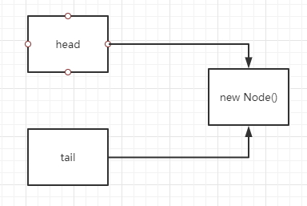

# JAVA

## 基础

### 对象结构

- 对象头(header)
  - markwork
    - 用于存储对象自身的运行时数据，如哈希码（HashCode）、GC分代年龄、锁状态标志、线程持有的锁、偏向线程ID、偏向时间戳等，这部分数据的长度在32位和64位的虚拟机（未开启压缩指针）中分别为32bit和64bit，官方称它为“MarkWord”。
  - Klass
    - 对象头的另外一部分是klass类型指针，即对象指向它的类元数据的指针，虚拟机通过这个指针来确定这个对象是哪个类的实例.
    - 一个 class 文件被 load 进去之后会在方法区创建一个 Klass 实例(实际是它的实现类 instanceKlass)，class文件的描述信息都会放在这个实例里面。然后会在堆中创建一个 KlassOop 的实例(实际是它的实现类 instanceKlassOop)，这个实例中有个 Klass* 类型的属性，指向了方法区的那个 instanceKlass 实例
  - 数组长度
    - 如果对象是一个数组, 那在对象头中还必须有一块数据用于记录数组长度.
- 实例数据(Instance data)
  - 
- 对齐填充(padding)
  - 

## 并发

### 线程

- 状态转换

  

- JAVA线程阻塞的代价

  - java线程的上下文切换需要操作系统接入,java的线程是映射到操作系统原生线程上的
  - 操作系统切换线程需要在用户态与内核态之间切换,因为用户态和内核态内存空间各自独立,故切换要传递变量和参数,这样系统消耗较大,费事

### 关键字

#### synchronized [参考链接](http://cmsblogs.com/?p=2071) [参考链接](https://blog.csdn.net/zqz_zqz/article/details/70233767?utm_medium=distribute.pc_relevant.none-task-blog-BlogCommendFromMachineLearnPai2-4.control&depth_1-utm_source=distribute.pc_relevant.none-task-blog-BlogCommendFromMachineLearnPai2-4.control) [参考链接](https://www.codercc.com/backend/basic/juc/concurrent-keywords/synchronized.html)

- 应用 : A a = new A();

- 锁普通方法 (锁的是A的实例)
- 锁静态方法 (锁的是A.class)
- 锁代码块
  - 对象(a,锁的是A的实例)
  - 类 (A.class,锁的是A.class)

- 问:当两个线程同时执行A类中的普通方法和静态方法是否互斥?答:不互斥,因为是两把不同的锁

- 原理(字节码层次,在java语言存在两种语法)
  - 语法
    - 锁 --> 代码块
      - 代码块在源码被编译成bytecode时,会在同步代码的入口位置和退出位置分别插入monitorenter,monitorexit字节指令
    - 锁 --> 方法
      - 在字节码层面没有特别的指令实现被synchronized修饰的方法,而是在Class文件的方法表中将该方法的access_flags字段中的synchronized标志位置1,表示该方法是同步方法并使用调用该方法的对象或者方法所属的Class在jvm的内部对象表示Klass作为对象锁
  - 对象头
    - synchronized用的锁时存在**对象头**里的
    - 对象头主要包括两部分数据(Mark Work, Klass Pointer)
      - Mark Work (标记字段)
      - Klass Pointer (类型指针)
  
- 锁状态

  - 偏向锁
    - 优点
      - 加锁和解锁不需要额外的消耗,和执行费同步方法相比仅存在纳秒级别的差距
    - 缺点
      - 如果线程间存在锁竞争,会带来额外的锁撤销消耗
    - 适用于只有一个线程访问同步代码块
  - 轻量级锁
    - 优点
      - 竞争的线程不会阻塞,提高程序的响应速度
    - 缺点
      - 如果始终得不到锁竞争的线程会使用自旋会消耗cpu
    - 追求响应时间,同步块执行速度非常快
  - 重量级锁
    - 优点
      - 线程竞争不使用自旋,不会消耗CPU
    - 缺点
      - 线程阻塞,响应时间慢
    - 追求吞吐量,同步块执行速度比较长

- [synchronized膨胀过程](https://blog.csdn.net/xueba8/article/details/88753443)

  

  - 

#### [volatile](https://ifeve.com/java-volatile关键字/)

- 功能责任

  - 可见性

    - 初衷
      - 在多线程的应用中,线程在操作变量时,出于性能考虑,每个线程可能会将变量从主内存拷贝到CPU缓存中,如果计算机有多个CPU,那么每个线程可能在不同的CPU中运行,也就意味着,每个线程都有可能把变量拷贝到各自的CPU缓存中,也就表示着,会出现同一个变量在不同线程中数据不一致,所以volatile应运而生.

  - 顺序性(防止**指令重排序**)

    | 是否能重排序Y/N | 第二个操作 | 第二个操作 | 第二个操作 |
    | :-------------: | :--------: | :--------: | :--------: |
    |   第一个操作    |  普通读写  | volatile读 | volatile写 |
    |    普通读写     |     Y      |     Y      |     N      |
    |   volatile读    |     N      |     N      |     N      |
    |   volatile写    |     Y      |     N      |     N      |

    举个例子,为什么volatile读后一个普通读不允许指令重排(A/B两个线程)

    

- 实现原理

  - Java内存屏障
    - LoadLoad屏障
      - 对于这样的语句Load1; LoadLoad; Load2，在Load2及后续读取操作要读取的数据被访问前，保证Load1要读取的数据被读取完毕。
    - StoreStore屏障
      - 对于这样的语句Store1; StoreStore; Store2，在Store2及后续写入操作执行前，保证Store1的写入操作对其它处理器可见。
    - LoadStore屏障
      - 对于这样的语句Load1; LoadStore; Store2，在Store2及后续写入操作被刷出前，保证Load1要读取的数据被读取完毕。
    - StoreLoad屏障
      - 对于这样的语句Store1; StoreLoad; Load2，在Load2及后续所有读取操作执行前，保证Store1的写入对所有处理器可见。**它的开销是四种屏障中最大的。在大多数处理器的实现中，这个屏障是个万能屏障，兼具其它三种内存屏障的功能**
  - volatile语义的内存屏障
    - 每个volatile写操作前都要插入StoreStore屏障,在写操作后插入StoreLoad屏障
    - 每个volatile读操作前都要插入LoadLoad屏障,在读操作后插入LoadStore屏障
  - final语义中的内存屏障
    - 写
      - 新建对象过程中,构造体中对final域的初始化和写入和这个对象赋值给其他引用变量,操作是不能重排序的
      - 在编译器写final域完毕，构造体结束之前，会插入一个StoreStore屏障，保证前面的对final写入对其他线程/CPU可见，并阻止重排序。
    - 读
      - 初次读包涵final域的对象引用和读取这个final域,这操作时不能重排序的(先赋值引用,在调用final值)
      - 在上述规则2中，两步操作不能重排序的机理就是在读final域前插入了LoadLoad屏障。
    - 大概意思,**必须保证一个对象的所有final域被写入完毕后才能引用和读取,这也是内存屏障起的作用**

  - 题外话:内存间的同步操作(一个变量从主内存拷贝到工作内存,从工作内存同步主内存)
    - lock(锁定) 作用于主内存变量，把一个变量标识为一条线程独占的状态
    - unlock(解锁) 作用于主内存变量，把一个处于锁定状态的变量释放,释放后的变量才可以被其它线程锁定 unlock之前必须将变量值同步回主内存
    - read(读取) 作用于主内存变量，把一个变量的值从主内存传输到工作内存，以便随后的load
    - load(载入) 作用于工作内存变量，把read从主内存中得到的变量值放入工作内存的变量副本
    - use(使用) 作用于工作内存变量，把工作内存中一个变量的值传递给执行引擎，每当虚拟机遇到一个需要使用到的变量的值得字节码指令时将会执行这个操作
    - assign(赋值) 作用于工作内存变量，把一个从执行引擎接收到的值赋给工作内存的变量，每当虚拟机遇到一个给变量赋值的字节码指令时执行这个操作
    - store(存储) 作用于工作内存变量，把工作内存中一个变量的值传送到主内存，以便随后的write操作使用
    - write(写入) 作用于主内存变量，把store操作从工作内存中得到的值放入主内存的变量中

  

- 经验之谈

  - 可以将对volatie变量的读写理解为一个刷新操作
    - 写入volatile变量时,线程中的所有变量(非volatile)也会触发写入主内存
    - 读volatile变量时,同样也会触发线程中所有变量从主内存中读取.
    - 所以在写volatile变量,尽可能放在最后,读读volatile放在最前


**LookSupport**

- 线程等待唤醒机制(相当于wait/notify 加强版)
- LockSupport通过许可（permit）实现线程挂起、挂起线程唤醒功能。permit可以理解为每个已启动线程维持的一个int类型状态位counter。线程分别通过执行LockSupport静态方法park()、unPark()方法来完成挂起、唤醒操作。
- 主要方法
    - java.util.concurrent.locks.LockSupport#park()
        - 唤醒条件
            - unpark()
                - 当线程执行park时,判断状态位counte为1,表示拥有许可,立马放行,并将状态位counter设置为0
                - 当线程执行park时,判断状态位counter为0,表示未获得许可,线程阻塞
        - 响应中断
            - 当其他线程调用了t.interrupt(),locksupport.park()会效应中断
    - java.util.concurrent.locks.LockSupport#unpark(Thread thread)
      - 现将当前状态位counter设置为1
      - 判断当前线程是否被挂起
          - 挂起,则唤起线程,并将counter设为0
          - 未挂起,无任何操作
- 面试题
  - 先执行unpark在执行park程序会出现什么情况?
    - 先执行unpark,执行线程与locksupport关联的许可(permit)会被设置成1,当执行park时,会进行状态位判断,因为许可被设置成了1,所以表示当前执行的线程拥有许可,立马放行,并将许可设置成0
  - 先唤醒两次,在阻塞两次会出现什么情况?
    - 会阻塞线程
    - 当执行两次unpark时,会将状态位设置为1,且仅为1,状态位counter最大只能设置为1,也就是许可permit最大为1,所以不管先执行几次unpark,都只能唤醒一个park

- **ThreadLocal**

     - private final int threadLocalHashCode = nextHashCode();

          - 从方法来看,每次生成ThreadLocal都会进行递增HASH_INCREMENT
     
          - ```java
               private static int nextHashCode() {
                   return nextHashCode.getAndAdd(HASH_INCREMENT);
          }
               ```

     - private static AtomicInteger nextHashCode = new AtomicInteger();

          - 类变量 也就是说每个ThreadLocal实例的nextHashCode是不一样的

     - private static final int HASH_INCREMENT = 0x61c88647;

     - static class ThreadLocalMap
     
          -  每一个Thread都会维护一个只属于当前Thread的ThreadLocalMap
     
          - ```java
               // ThreadLocalMap内部又维护了一个Entry,继承了WeakReference<ThreadLocal<?>>
               static class Entry extends WeakReference<ThreadLocal<?>> {
                   /** The value associated with this ThreadLocal. */
                   // 这个value值就是当前线程要存储的值
                   Object value;
                   Entry(ThreadLocal<?> k, Object v) {
                       // 而传进来的ThreadLocal 交给WeakReference,最后会放入 引用队列
                       super(k);
                       value = v;
                   }
               }
               private static final int INITIAL_CAPACITY = 16;
          private Entry[] table;
               private int size = 0;
               private int threshold;
               ```

          - ```
             
               ```
     
     - java.lang.ThreadLocal#set
     
          - ```java
               public void set(T value) {
                   // 获取当前线程
                   Thread t = Thread.currentThread();
                   ThreadLocalMap map = getMap(t);
                   if (map != null)
                       map.set(this, value);
                   else
                       // 第一次进来map肯定是为null,所以要创建个map
                       createMap(t, value);
               }
               // 获取ThreadLocalMap ,从这里可以看出,Thread中维护着一个ThreadLocalMap
               ThreadLocalMap getMap(Thread t) {
                   return t.threadLocals;
               }
               // Thread中的ThreadLocals 超时是null,此处创建一个ThreadLocalMap,key为ThreadLocal, value为set传入的值
               void createMap(Thread t, T firstValue) {
                   t.threadLocals = new ThreadLocalMap(this, firstValue);
               }
               // ThreadLocalMap的构造器,承接上边的createMap
               ThreadLocalMap(ThreadLocal<?> firstKey, Object firstValue) {
                   // 初始
                   table = new Entry[INITIAL_CAPACITY];
                   int i = firstKey.threadLocalHashCode & (INITIAL_CAPACITY - 1);
                   table[i] = new Entry(firstKey, firstValue);
                   size = 1;
                   setThreshold(INITIAL_CAPACITY);
               }
               // java.lang.ThreadLocal.ThreadLocalMap#set
               private void set(ThreadLocal<?> key, Object value) {
                   Entry[] tab = table;
                   int len = tab.length;
                 	// 初始len=16 ,并且len始终是2^n ,只有这样len-1的二进制表示的就是低位连续的N个1,
                 	// 假设当前线程初始值 threadLocalHashCode = 1640531527  十进制
                 	// len - 1 的       二进制是 1111, 进行补码 00000000 00000000 00000000 00001111
                   // threadLocalHashCode 的二进制位(直接补码) 01100001 11001000 10000110 01000111
                 	// 那么下边的计算得出结果为
                   // 00000000 00000000 00000000 00000111  --> 0111 -> 1*2^2 + 1*2^1 + 1*2^0-> 0+4+2+1=7
                 	// 分析到这也就确定了,当前线程占得table的坑是7,之后当前线程无论多少次ThreadLocal#set 都不会在改变
                 	// 原因在new ThreadLocal<T> 创建实例 时 threadLocalHashCode 的数值已经确定了.
                 	// 需要注意的是 每次new ThreadLocal<T>时threadLocalHashCode 都会以原子性做一个递增操作,而每次都是增加1640531527
                   int i = key.threadLocalHashCode & (len-1);
                   for (Entry e = tab[i];
                        e != null;
                        e = tab[i = nextIndex(i, len)]) {
                    	// e.get() 获取的是一个弱引用的ThreadLocal 	
                     	// 也就是或 当前线程绑定的ThreadLocalMap绑定的弱引用ThreadLocal
                       ThreadLocal<?> k = e.get();
                     	// 如果相等表示是替换value值
                       if (k == key) {
                           e.value = value;
                           return;
                       }
                       // 进入这个条件,也就是说明 出现了gc,并清除了弱引用
                       if (k == null) {
                          
                          replaceStaleEntry(key, value, i);
                          return;
                       }
                   }
                   tab[i] = new Entry(key, value);
                   int sz = ++size;
                   // 如果没有清理并且操作次数大于等于要扩容的条件则进行扩容
                   if (!cleanSomeSlots(i, sz) && sz >= threshold)
                       rehash();
               }
               // java.lang.ThreadLocal.ThreadLocalMap#cleanSomeSlots
               private boolean cleanSomeSlots(int i, int n) {
                   boolean removed = false;
                   Entry[] tab = table;
                   int len = tab.length;
                   do {
                       i = nextIndex(i, len);
                       Entry e = tab[i];
                       if (e != null && e.get() == null) {
                           n = len;
                           removed = true;
                           i = expungeStaleEntry(i);
                       }
                   } while ( (n >>>= 1) != 0);
                   return removed;
               }
               // 调整table大小,删除无用的数据(也就是e.get == null)情况
               // java.lang.ThreadLocal.ThreadLocalMap#rehash
               private void rehash() {
                   expungeStaleEntries();
                   // Use lower threshold for doubling to avoid hysteresis
                   if (size >= threshold - threshold / 4)
                       resize();
               }
               // java.lang.ThreadLocal.ThreadLocalMap#resize
               private void resize() {
                   Entry[] oldTab = table;
                   int oldLen = oldTab.length;
                   int newLen = oldLen * 2;
                   Entry[] newTab = new Entry[newLen];
                   int count = 0;
                   for (int j = 0; j < oldLen; ++j) {
                       Entry e = oldTab[j];
                       if (e != null) {
                           ThreadLocal<?> k = e.get();
                           if (k == null) {
                               e.value = null; // Help the GC
                           } else {
                               int h = k.threadLocalHashCode & (newLen - 1);
                               while (newTab[h] != null)
                                   h = nextIndex(h, newLen);
                               newTab[h] = e;
                               count++;
                           }
                       }
                   }
                   setThreshold(newLen);
                   size = count;
                   table = newTab;
               }
               
               // java.lang.ThreadLocal.ThreadLocalMap#replaceStaleEntry
               private void replaceStaleEntry(ThreadLocal<?> key, Object value,
                                              int staleSlot) {
                   Entry[] tab = table;
                   int len = tab.length;
                   Entry e;
                   // 记录将要删除的slot,这个在清理时是个重要的字段
                   int slotToExpunge = staleSlot;
                   //以staleSlot开始, 向前遍历N个e != null的节点,
                   for (int i = prevIndex(staleSlot, len); (e = tab[i]) != null; i = prevIndex(i, len))
                       if (e.get() == null)
                           // 如果e不为空,e的Key也就是ThreadLocal为空,记录下要删除的slot
                           slotToExpunge = i;
                   
               	// 以staleSlot开始,向后遍历N个 e!=nul的节点
                   for (int i = nextIndex(staleSlot, len);(e = tab[i]) != null; i = nextIndex(i, len)) {
                       ThreadLocal<?> k = e.get();
                       if (k == key) {
                           e.value = value;
                           tab[i] = tab[staleSlot];
                           // staleSlot是调用方法时的计算的槽,此处e赋值给他,代表这个就是最新的了
                           tab[staleSlot] = e;
                           if (slotToExpunge == staleSlot)
                               slotToExpunge = i;
                           cleanSomeSlots(expungeStaleEntry(slotToExpunge), len);
                           return;
                       }
                       if (k == null && slotToExpunge == staleSlot)
                           slotToExpunge = i;
                   }
                   // If key not found, put new entry in stale slot
                   tab[staleSlot].value = null;
                   tab[staleSlot] = new Entry(key, value);
                   // If there are any other stale entries in run, expunge them
                   if (slotToExpunge != staleSlot)
                       cleanSomeSlots(expungeStaleEntry(slotToExpunge), len);
               }
               
               // java.lang.ThreadLocal.ThreadLocalMap#expungeStaleEntry 
               // 清理方法,不做注释了
               private int expungeStaleEntry(int staleSlot) {
                   Entry[] tab = table;
                   int len = tab.length;
                	// 置空
                   tab[staleSlot].value = null;
                   tab[staleSlot] = null;
                   size--;
               
                   Entry e;
                   int i;
                   // 继寻找e!=null的下一个节点,
                   for (i = nextIndex(staleSlot, len); (e = tab[i]) != null; i = nextIndex(i, len)) {
                       ThreadLocal<?> k = e.get();
                       if (k == null) {
                           e.value = null;
                           tab[i] = null;
                           size--;
                       } else {
                           int h = k.threadLocalHashCode & (len - 1);
                           if (h != i) {
                               tab[i] = null;
                               while (tab[h] != null)
                                   h = nextIndex(h, len);
                               tab[h] = e;
                           }
                       }
                   }
                   return i;
               }
               
               ```
     
     - java.lang.ThreadLocal#get
     
          - ```java
               public T get() {
                   Thread t = Thread.currentThread();
                   ThreadLocalMap map = getMap(t);  // Thread.threadLocals
                   if (map != null) {
                       ThreadLocalMap.Entry e = map.getEntry(this);
                       if (e != null) {
                           @SuppressWarnings("unchecked")
                           T result = (T)e.value;
                           return result;
                       }
                   }
                   return setInitialValue();
               }
               // java.lang.ThreadLocal.ThreadLocalMap#getEntry
               private Entry getEntry(ThreadLocal<?> key) {
                   int i = key.threadLocalHashCode & (table.length - 1);
                   Entry e = table[i];
                   if (e != null && e.get() == key)
                       return e;
                   else
                       return getEntryAfterMiss(key, i, e);
               }
               
               // java.lang.ThreadLocal.ThreadLocalMap#getEntryAfterMiss
               // 该方法通过一个while条件获取entry,直到 找到与当先线程相等的ThreadLocal
               // 如果找不到,直接返回空
               // 该方法也涉及删除无效的entry
               private Entry getEntryAfterMiss(ThreadLocal<?> key, int i, Entry e) {
                   Entry[] tab = table;
                   int len = tab.length;
                   while (e != null) {
                       ThreadLocal<?> k = e.get();
                       if (k == key)
                           return e;
                       if (k == null)
                           expungeStaleEntry(i);
                       else
                           i = nextIndex(i, len);
                       e = tab[i];
                   }
                   return null;
               }
               ```
     
     - java.lang.ThreadLocal#remove
     
          - ```
               private void remove(ThreadLocal<?> key) {
                   Entry[] tab = table;
                   int len = tab.length;
                   int i = key.threadLocalHashCode & (len-1);
                   for (Entry e = tab[i];
                        e != null;
                        e = tab[i = nextIndex(i, len)]) {
                       if (e.get() == key) {
                           e.clear();
                           expungeStaleEntry(i);
                           return;
                       }
                   }
               }
               ```

### J.U.C

#### 中断

- 关键方法
  - java.lang.Thread#isInterrupted()   --- public boolean isInterrupted()
    - 会调用private native boolean isInterrupted(boolean ClearInterrupted) 本地方法,true代表重置,false代表不重置,此处ClearInterrupted=false
    -  测试线程是否已经中断。线程的中断状态不受该方法的影响
  - java.lang.Thread#interrupted   --- public static boolean interrupted()
    - 会调用private native boolean isInterrupted(boolean ClearInterrupted) 本地方法,true代表重置,false代表不重置,此处ClearInterrupted=true
    - 测试当前线程是否已经中断。如果线程处于中断状态返回true，否则返回false。同时该方法将清除的线程的中断状态。即，如果连续两次调用该方法，则第二次调用将返回 false。该方法可用于清除线程中断状态使用。
  - java.lang.Thread#interrupt ---- public void interrupt()
    - 中断线程

#### AQS (抽象的队列同步器) [源码解读](https://www.cnblogs.com/waterystone/p/4920797.html)

- 

- AQS中维护一个CLH变种的双端队列,和一个volatile 修饰的state字段

   - state 字段 0 值表示空闲没有任何线程占用,大于0表示有线程正在使用
   - Node 内部类
      - static final Node SHARED = new Node();   共享锁标识
      - static final Node EXCLUSIVE = null; // 共享锁
      - static final int CANCELLED =  1; 
      - static final int SIGNAL    = -1;
      - static final int CONDITION = -2;
      - static final int PROPAGATE = -3;
      - volatile int waitStatus; //初始值 0
      - volatile Node prev; 前指针
      - volatile Node next; 后指针
      - volatile Thread thread; 当前node的线程
      - Node nextWaiter;
   - Node head 头结点
   - Node tail 尾节点

- 流程 (以ReentrantLock为例)

   - new ReentrantLock() 初始化,默认使用非公平锁(NonfairSync)

   - lock

     - ```java
       final void lock() {
           if (compareAndSetState(0, 1))
               setExclusiveOwnerThread(Thread.currentThread());
           else
               acquire(1);
       ```

       

     - 当state=0时也就是说没有任何线程占用锁,cas操作成功,将state从0设置成1,并且返回true,然后设置拥有锁的线程,也就是当前线程

     - 当state !=0,也就是已经有线程占有锁了,表示cas操作失败,进入acquire(1);方法

     - ```java
       public final void acquire(int arg) {
           if (!tryAcquire(arg) &&
               acquireQueued(addWaiter(Node.EXCLUSIVE), arg))
               // 当acqioreQueued返回true则表示当前线程不是被unpark唤醒的,是被其他线程中断唤醒的,所以要自我中断一次,将中断标志位设为true
               // 原因是因为,当前线程在阻塞时没有及时响应中断信号,现在要进行补偿,这样的话,如果该线程在lock代码块内部调用sleep()之类的阻塞方法
               // 就可以抛出异常,响应中断
             selfInterrupt();
       }
       ```
       
     - 此时tryAcquire(arg)会再次尝试获取一下锁,如果成功后边的方法就不用再执行了

       - ```java
         protected final boolean tryAcquire(int acquires) {
             return nonfairTryAcquire(acquires);
         }
         final boolean nonfairTryAcquire(int acquires) {
             // 获取当前线程
             final Thread current = Thread.currentThread();
             int c = getState();
             // 如果c = 0 也就是state=0尝试cas强锁
             if (c == 0) {
                 // 强锁成功的话设置当前线程为持有锁线程并返回true
                 if (compareAndSetState(0, acquires)) {
                     setExclusiveOwnerThread(current);
                     return true;
                 }
             }
             // 如果c!=0 也就是state!=0判断,持有锁的线程是不是当前线程(重入锁逻辑)
             else if (current == getExclusiveOwnerThread()) {
                 int nextc = c + acquires;
                 if (nextc < 0) // overflow
                     throw new Error("Maximum lock count exceeded");
                 setState(nextc);
                 return true;
             }
             return false;
         }
         ```

     - 当tryAcquire(arg) 失败,则继续向后执行

       - ```java
         private Node addWaiter(Node mode) {
         	// 创建一个node节点,mode 区分为 共享锁/独占锁,此处是以ReentrantLock为例,
         	// 所以此处是独占锁Node.EXCLUSIVE
             Node node = new Node(Thread.currentThread(), mode);
             // 将尾节点赋值给pred
             Node pred = tail;
             if (pred != null) {
                 node.prev = pred;
                 // 将新创建的node设置成尾节点
                 if (compareAndSetTail(pred, node)) {
                     pred.next = node;
                     return node;
                 }
             }
             enq(node);
             return node;
         }
         private Node enq(final Node node) {
         	// 一个自旋
             for (;;) {
                 Node t = tail;
                 // 第一次进来t 肯定是null
                 if (t == null) { // Must initialize
                 	// 此处创建了一个node实例并将这个实例放置到头结点
                     // 该节点也叫哨兵节点/傀儡节点,只是占位使用
                     if (compareAndSetHead(new Node()))
                     	如果CAS设置成功 将将尾节点赋值
                         tail = head;
                 } else {
                     //当 t != null时进入此处
                     node.prev = t;
                     //CAS 操作将尾节点设置成enq入参的node
                     if (compareAndSetTail(t, node)) {
                         // CAS 操作成功,设置t的next节点为node并返回
                         t.next = node;
                         return t;
                     }
                 }
             }
         }
         ```

         - enq第一次图(t==null)
         - enq第二次图(t!=null)

     - enq方法执行完成后执行acquireQueued(final Node node, int arg) 方法

       - ```java
         final boolean acquireQueued(final Node node, int arg) {
             boolean failed = true;
             try {
                 boolean interrupted = false;
                 // 自旋
                 for (;;) {
                     // 获取node的前置节点,该方法会抛出一个npe异常
                     final Node p = node.predecessor();
                     //如果node的前置节点是头结点,则再次尝试抢锁
                     if (p == head && tryAcquire(arg)) {
                         // 抢锁成功设置当前节点为头节点也就是傀儡节点
                         setHead(node);
                         // 将之前的头结点next引用改为null,方便gc
                         // 换句话说就是之前的头结点p已经给任何node没有应用关系了
                         p.next = null; // help GC
                         failed = false;
                         return interrupted;
                     }
                     // 当shouldParkAfterFailedAcquire=true
                     // parkAndCheckInterrupt=false (表示未被中断)
                     // parkAndCheckInterrupt=true (表示被中断) 并赋值interrupted = true;
                     // 此时线程已被前一个node节点唤醒,并且前一个节点已经晋升为头结点,当前线程开始进入下一次自旋
                     if (shouldParkAfterFailedAcquire(p, node) &&
                         parkAndCheckInterrupt())
                         interrupted = true;
                 }
             } finally {
                 if (failed)
                     cancelAcquire(node);
             }
         }
         private void setHead(Node node) {
             head = node;
             node.thread = null;
             node.prev = null;
         }
         private static boolean shouldParkAfterFailedAcquire(Node pred, Node node) {
             int ws = pred.waitStatus;
             if (ws == Node.SIGNAL)
                 /*
                  * This node has already set status asking a release
                  * to signal it, so it can safely park.
                  */
                 return true;
             if (ws > 0) {
         		// 当被取消的线程才会进入这里
                 do {
                     node.prev = pred = pred.prev;
                 } while (pred.waitStatus > 0);
                 pred.next = node;
             } else {
         		// waitStatus的默认值是0,所以第一次进来会进入这里
                 // 执行一个CAS操作,将waitStatus 赋值成SINNAL(-1)
                 compareAndSetWaitStatus(pred, ws, Node.SIGNAL);
             }
             return false;
         }
         private final boolean parkAndCheckInterrupt() {
             // 挂起线程 阻塞在这里了,等待被unpark
             LockSupport.park(this);
             // 获取当前线程是否被中断过,并恢复默认中断状态(false)
             return Thread.interrupted();
         }
         ```

   - 释放锁

     - ```java
       public void unlock() {
           sync.release(1);
       }
       public final boolean release(int arg) {
           if (tryRelease(arg)) {
               Node h = head;
               if (h != null && h.waitStatus != 0)
                   unparkSuccessor(h);
               return true;
           }
           return false;
       }
       protected final boolean tryRelease(int releases) {
           int c = getState() - releases;
           // 在释放锁时,如果不是当前线程占有的锁,则抛出异常
           if (Thread.currentThread() != getExclusiveOwnerThread())
               throw new IllegalMonitorStateException();
           boolean free = false;
           // 如果c==0表示可以释放锁了,如果非0表示当前线程是重入锁
           if (c == 0) {
               free = true;
               setExclusiveOwnerThread(null);
           }
           // 直接setState值,而不是使用CAS,因为reentranLock的addWaiter(Node.EXCLUSIVE) 用的是排它锁,
           // 所以此时直接set即可,此时是没有线程来抢锁的
           setState(c);
           return free;
       }
       // node 传进来的是头结点,也是当前线程的node节点
       private void unparkSuccessor(Node node) {
               int ws = node.waitStatus;
               if (ws < 0)
                   compareAndSetWaitStatus(node, ws, 0);
               Node s = node.next;
               if (s == null || s.waitStatus > 0) {
                   s = null;
                   for (Node t = tail; t != null && t != node; t = t.prev)
                       if (t.waitStatus <= 0)
                           s = t;
               }
               if (s != null)
                   // 唤醒下一个线程
                   
                   LockSupport.unpark(s.thread);
           }
       ```

#### 线程池

- 使用线程池的好处
  - 降低资源消耗,通过重复利用已创建的线程减低线程的创建和销毁造成的消耗
  - 提高响应速度,基于线程复用,当任务到达时不需要等待线程创建就能立即执行
  - 提高线程的可管理性,线程是稀有资源,如果无线创建,不仅会消耗系统资源,还会降低系统的稳定性,使用线程池可以统一分配,调优监控

- Executor [ɪɡˈzekjətə(r)]

    - 题外话:有助于避免this逃逸问题

    - 结构

        - 任务

          - Runnable
          - Callable<T>

        - 任务执行(Executor接口)

          - executor执行方法

            - java.util.concurrent.Executor#execute(Runnable command);

          - submit执行方法(ExecutorService extends Executor)

            - ```java
              Future<?> submit(Runnable task); // 返回null表示执行完成
              ```

            - ```java
              <T> Future<T> submit(Runnable task, T result);
              ```

            - ```java
              <T> Future<T> submit(Callable<T> task) // 可实现Callable接口
              ```

        - 异步计算结果(Future)

          - submit后,返回的其实是FutureTask

    - 自带的几种线程池

        - newFixedThreadPool
            - 一共两个方法,①只设置线程数量,②设置线程数量和线程工厂方法
            - 返回一个固定数量的线程池,核心线程=最大线程,存活时间为0,队列为LinkedBlockingQueue(无限大小,integer.max)
        - newSingleThreadExecutor
            - 只创建一个线程,可自定义线程工厂
            - 队列使用LinedBlockingQueue
        - newCachedThreadPool
            - 核心线程为0,最大线程数为integer.max,存活时间60s,队列使用的是SynchronousQueue
            - 可以看出,这是一个无限的线程池,如果空闲线程超过60s,则回收线程
        - newScheduledThreadPool
            - 可设置核心线程数和线程工厂,而最大线程数是integer.max,队列使用的是DelayedWorkQueue
            - 可以看出,创建一个可以指定线程数量的线程池,该线程池自带延迟和周期性执行任务,类似定时器

- ThreadPoolExecutor 类

    ```java
    // 初始 -536870912
    // 该字段控制状态,ctl 封装了 两个字段
    // workerCount 有效的线程数量
    // runState 该字段表明当前线程池 是否是在运行或者停止等等
    // ctl一个变量同时存储runState和workerCount，其中runState占用高3位，workCount占用低29位
    // 每增加一个线程则ctl原子性加一
    private final AtomicInteger ctl = new AtomicInteger(ctlOf(RUNNING, 0));
    private static final int COUNT_BITS = Integer.SIZE - 3;  // 29
    // 00011111 11111111 11111111 11111111
    private static final int CAPACITY   = (1 << COUNT_BITS) - 1; // 536870911
    // runState is stored in the high-order bits 
    // 11100000 00000000 00000000 00000000
    private static final int RUNNING    = -1 << COUNT_BITS; // -536870912
    // 00000000 00000000 00000000 00000000
    private static final int SHUTDOWN   =  0 << COUNT_BITS; // 0
    // 00100000 00000000 00000000 00000000
    private static final int STOP       =  1 << COUNT_BITS; // 536870912
    // tidying  [ˈtaɪdiɪŋ]  使整洁;使整齐 ;使有条理;整理
    // 01000000 00000000 00000000 00000000
    private static final int TIDYING    =  2 << COUNT_BITS; // 1073741824
    // terminated [ˈtɜːmɪneɪtɪd] 终止,结束
    // 01100000 00000000 00000000 00000000
    private static final int TERMINATED =  3 << COUNT_BITS; // 1610612736
    
    // Packing and unpacking ctl
    // 解析出来 runState
    // CAPACITY取反 高三位 变成了 111
    // c 如果在 -1 到 -536870912 之间 则表示线程是在运行中状态
    private static int runStateOf(int c)     { return c & ~CAPACITY; }
    // worker线程数量
    private static int workerCountOf(int c)  { return c & CAPACITY; }
    private static int ctlOf(int rs, int wc) { return rs | wc; }
    ```

    

    - 构造方法参数说明

      - corePoolSize 线程池核心线程数量
      - maximumPoolSize 线程池最大线程数(注意:包涵核心线程)
      - keepAliveTime 当线程数大于核心线程数,多余的空闲线程存活最大时间
      - TimeUnit 时间单位
      - workQueen 任务队列
        - ArrayBlockingQueue 基于数组的有界队列,FIFO
        - LinkedBlockingQueue 链表结构,FIFO,默认integer.max,可设置大小
        - SynchronousQueue  一个不存储元素的阻塞队列,每次插入操作必须等待另一个线程调用移除操作,否则插入操作会处于阻塞状态.
        - PriorityBlockingQueue 具有优先级的无限阻塞队列,数组结构
      - ThreadFactory 线程工厂
        - 主要是对Thread一些参数设置
        - Thread.name 线程名字
        - Thread.daemon 设置线程是否是守护线程,默认false
        - Thread.priority 设置线程优先级 最小:1,最大:10
        - Thread.uncaughtExceptionHandler   [kɔːt]
          - 是为了捕获没有被捕获的异常,包括运行时异常,执行错误(内存溢出等)
          - 子线程抛出的异常等
      - RejectedExecutionHandle拒绝策略
        - AbortPolicy策略：该策略会直接抛出异常
        - CallerRunsPolicy 策略：只要线程池未关闭，该策略直接在调用者线程中，运行当前的被丢弃的任务。(会阻塞调用者线程)
        - DiscardOleddestPolicy策略： 该策略将丢弃最老的一个请求，也就是即将被执行的任务，并尝试再次提交当前任务。
        - DiscardPolicy策略：该策略默默的丢弃无法处理的任务，不予任何处理。

    - 其他变量说明

        - allowCoreThreadTimeOut 默认false,如果设置为true,当线程池空闲超时时可销毁核心线程.
        - completedTaskCount：线程池在运行过程中已完成的任务数量.
        - largestPoolSize：线程池里曾经创建过的最大线程数量。通过这个数据可以知道线程池是否曾经满过。如该数值等于线程池的最大大小， 则表示线程池曾经满过。

    - 线程池状态

        - RUNNING 可接受新任务
        - SHUTDOWN 拒接接受新任务,但是可以处理未完成的任务
        - STOP 拒绝新任务并抛弃阻塞队列中的任务,同时会中断正在处理的任务
        - TIDYING [ˈtaɪdiɪŋ]  所有任务都处理完了(包涵队列中的),当前线程池活动线程为0,将要调用terminated方法
        - TERMINATED [ˈtɜːmɪneɪtɪd] 终止状态,terminated方法调用完成后的状态

    - 线程池状态转换过程

        - running -> shutdown 
          - 显示调用了shutdown方法,或者饮隐式调用了线程池的finalize方法
          - 线程池重写了finalize方法,方法内部调用了shutdown方法
        - running 或 shutdown --> stop: 显示调用shutdownnow方法
        - shutdown -> tidying 当线程池和任务队列都完成后
        - stop -> tidying  当线程池为空时候
        - tidying -> terminated 当terminated方法hook方法执行完成后

    - 主要方法

        - shutdown
          - 正常关闭线程,调用该方法,线程不会立马关闭,会处理完未处理的任务再进行关闭.
        - shutdownNow
          - 非正常关闭,调用该方法,线程状态转换为stop,拒绝所有任务屏抛弃队列中的任务,中断正在处理的任务
          - 不过他会返回未处理的任务列表(队列中的)
        - isShutdown
          - 判断是否执行了shutdown或shutdownnow
          - 如果之前调用了shutdown或shutdownnow后返回true,否则false
        - isTerminated
          - 前提调用shutdown后
          - 就是判断线程池中所有任务是否完成
        - isTerminating
          - 程序正在执行shutdown或者shutdownNow之后,正在终止,但是尚未完全终止的过程中,则返回true

        - awaitTerminated
          - 当等待超时设定时间,会检测线程池是否已经关闭,若关闭则返回true,否则false

    - 执行流程图

      - 

      - 代码流程

        - 执行execute(Runnable **command**)方法
        - 核心线程判断
          - 如果当前工作线程小于核心线程
          - 调用addWorker(**command**, boolean core)
            - 创建一个工作线程,各种校验后启用
            - 然后在重写run方法里面调用runWorker(work w) 开始执行任务
        - 加入队列
          - 如果当前线程数已达到核心线程数阈值,则尝试将当前任务加入工作队列,加入成功后
          - 重新检查当前线程池是否是运行状态,如果不是运行状态了,则将任务从队列中移除,并且执行拒绝策略
          - 如果线程是运行状态则继续检查当前线程池是否还有线程(线程可能被销毁,核心线程也可能被销毁)
          - 如果线程池中真的没有线程了,则新建工作线程调用方法addWork(null, false);新建一个线程
        - 增加线程(最大线程数判断)
          - 按照上边的流程核心**线程已满**,**队列已满**,则尝试新创建线程
          - 调用方法addWork(**command**, false)
          - 如果当前线程池中工作线程小于设置的最大的线程数,则直接执行
          - 如果超过线程池的最大限度,则执行拒绝策略

      - addWorker(Runnable firstTask, boolean core) 方法流程解析

        写在前面,主要做两件事

        1.采用CAS操作将线程数+1

        2.新建一个线程并运行

        ```java
        private boolean addWorker(Runnable firstTask, boolean core) {
            retry:
            for (;;) {//大循环
                int c = ctl.get();
                int rs = runStateOf(c);
        				// 第一处判断
                // rs >= SHUTDOWN判断表示如果线程已经处于非运行状态,可进入第二个判断条件
                // 第二个判断解读
                // 最外层有个取反操作 注意这个取反操作下边会按照取反说明
                // 如果当前线程池的状态是STOP|TIDYING|TERMINATED一种则直接return false,侧面表达出就算有任务也不会创建线程了
                // 如果当前线程池状态是SHUTDOWN的话有以下两种情况
                // 1.如果firstTask != null,表示此时有新任务加入,直接返回false,不接受新任务了
                // 2.如果firstTask == null,workQueue为空,直接返回false,此时,无新任务,队列也空了,没必要创建线程
                // 总结:
                // 1.rs>SHUTDOWN 此时不再接受新任务,
                // 2.rs=SHUTDOWN 此时不再接受新任务,但是会执行队列中的任务
                if (rs >= SHUTDOWN &&
                    !(rs == SHUTDOWN && firstTask == null && !workQueue.isEmpty()))
                    return false;
        
                for (;;) {//小循环
                    int wc = workerCountOf(c);
                    // 是否超过最大线程数
                    // core = true 是否超过核心线程数
                    // core = false 是否超过最大线程数
                    if (wc >= CAPACITY ||
                        wc >= (core ? corePoolSize : maximumPoolSize))
                        return false;
                    // 原子性增加线程数量,执行成功直接跳出大循环,执行之后的逻辑
                    if (compareAndIncrementWorkerCount(c))
                        break retry;
                    c = ctl.get();  // Re-read ctl
                    // 判断线程池状态是否改变,如果改变了,重新进行最外边的大循环,未改变则重新进行for小循环
                    if (runStateOf(c) != rs)
                        continue retry;
                    // else CAS failed due to workerCount change; retry inner loop
                }
            }
            /********** 上边代码块主要是做状态校验和线程数原子性+1  *********************************************/
        
            boolean workerStarted = false;
            boolean workerAdded = false;
            Worker w = null;
            try {
                w = new Worker(firstTask);
                final Thread t = w.thread;
                if (t != null) {
                    final ReentrantLock mainLock = this.mainLock;
                    mainLock.lock();
                    try {
                        // Recheck while holding lock.
                        // Back out on ThreadFactory failure or if
                        // shut down before lock acquired.
                        int rs = runStateOf(ctl.get());
                        if (rs < SHUTDOWN ||
                            (rs == SHUTDOWN && firstTask == null)) {
                            if (t.isAlive()) // precheck that t is startable
                                throw new IllegalThreadStateException();
                            workers.add(w);
                            int s = workers.size();
                            if (s > largestPoolSize)
                                largestPoolSize = s;
                            workerAdded = true;
                        }
                    } finally {
                        mainLock.unlock();
                    }
                    if (workerAdded) {
                        // 这个t是worker类中的,下边详细解释
                        t.start();
                        workerStarted = true;
                    }
                }
            } finally {
                if (! workerStarted)
                    addWorkerFailed(w);
            }
            return workerStarted;
        }
        ```

      - Worker类解析

        ```java
        // 从下边代码中可以看出,Worker是ThreadPoolExecutor中的内部类并且实现了Runnable接口
        // 上边addWorker方法中有个w.thread(从new Worker实例中获取的),其实获取的Thread就是Worker自己
        // 看下边的构造方法,其实Thread引用的就是自己
        // 因此addWorker中的t.start(),最后执行的就是worker重写的run方法
        private final class Worker
            extends AbstractQueuedSynchronizer
            implements Runnable
        {
            private static final long serialVersionUID = 6138294804551838833L;
            final Thread thread;
            // 提交的任务线程
            Runnable firstTask;
            volatile long completedTasks;
            Worker(Runnable firstTask) {
                setState(-1); // inhibit interrupts until runWorker
                this.firstTask = firstTask;
                this.thread = getThreadFactory().newThread(this);
            }
            public void run() {
                runWorker(this);
            }
          ......... //下边略过
        }
        ```

      - runWorker(Worker w) 方法流程解析

        ```java
        final void runWorker(Worker w) {
            Thread wt = Thread.currentThread();
            // 提交的任务
            Runnable task = w.firstTask;
            w.firstTask = null; // 然后将Worker的任务置空
            w.unlock(); // allow interrupts
            boolean completedAbruptly = true;
            try {
                // 如果task不为空,则直接执行
                	// task不为空 只有两种情况
                	// 1.线程池executor时,线程数小于核心线程数
                	// 2.队列满了,尝试增加工作线程
                // 如果task为空则从getTask()中获取任务
                while (task != null || (task = getTask()) != null) {
                    w.lock();
                    // If pool is stopping, ensure thread is interrupted;
                    // if not, ensure thread is not interrupted.  This
                    // requires a recheck in second case to deal with
                    // shutdownNow race while clearing interrupt
                    if ((runStateAtLeast(ctl.get(), STOP) ||
                         (Thread.interrupted() &&
                          runStateAtLeast(ctl.get(), STOP))) &&
                        !wt.isInterrupted())
                        wt.interrupt();
                    try {
                        beforeExecute(wt, task);
                        Throwable thrown = null;
                        try {
                            task.run();
                        } catch (RuntimeException x) {
                            thrown = x; throw x;
                        } catch (Error x) {
                            thrown = x; throw x;
                        } catch (Throwable x) {
                            thrown = x; throw new Error(x);
                        } finally {
                            afterExecute(task, thrown);
                        }
                    } finally {
                        task = null;
                        w.completedTasks++;
                        w.unlock();
                    }
                }
                completedAbruptly = false;
            } finally {
                // 上边代码中可以看出
                // 当线程运行时出现异常,那么会退出循环计入该方法
                // 从getTask()方法中获取结果为null,则也会进入该方法
                processWorkerExit(w, completedAbruptly);
            }
        }
        ```

      - getTask() 方法解析

        ```java
        // 写在前面
        // 1.线程池中的线程复用关键
        // 2.Woker#run再调用runWorker,while代码块一直调用getTask方法,只要该方法返回不为空,则线程会一直处理
        // 3.getTask方法中首先是一个忙循环,在重点③中,如果timed一直等于true,就算每次从队列里读取的是空也会保证线程不会被销毁
        // 4.从⑤中可以看出,当从队列中获取空的数据时,timeOut就会被设为true
        // 5.当timeOut被设为true后从新走代码逻辑可以看出 关注重点②判断
        // 6.如果当前线程数>核心线程数或者allowCoreThreadTimeOut被设为true 那么timed就会被设置为true,进入if判断,重点⑥
        private Runnable getTask() {
            boolean timedOut = false; // Did the last poll() time out?
            // 忙循环 重点 ①
            for (;;) {
                int c = ctl.get();
                int rs = runStateOf(c);
                // Check if queue empty only if necessary.
                if (rs >= SHUTDOWN && (rs >= STOP || workQueue.isEmpty())) {
                    decrementWorkerCount();
                    return null;
                }
                int wc = workerCountOf(c);
                // Are workers subject to culling?
                // 如果allowCoreThreadTimeOut(true)
                // 或当运行线程数>核心线程数
                // timed = true
                // 重点②
                boolean timed = allowCoreThreadTimeOut || wc > corePoolSize;
                // 重点⑥
                // 1.第一个判断你不讲了,上边说了
                // 2.第二个判断,如果wc>1或者队列为空,则进行cas工作线程减1,返回空,进行线程销毁
                // 这块逻辑也能看出,核心线程也是可以回收的
                // 总结下
                // 1.当工作线程数大于核心线程且队列为空时,线程数-1,并返回空销毁当前线程
                // 2.当allowCoreThreadTimeOut=true时,并且⑤,也就是队列poll方法超时后,线程数-1,并销毁核心线程
                if ((wc > maximumPoolSize || (timed && timedOut))
                    && (wc > 1 || workQueue.isEmpty())) {
                    if (compareAndDecrementWorkerCount(c))
                        return null;
                    continue;
                }
                try {
                    // 当timed = true 表示从队列里读取任务,超时则是返回空
                    // 当timed = false 队列的task方法,会一直阻塞,等待有新任务添加
                    // 重点③
                    Runnable r = timed ?
                        workQueue.poll(keepAliveTime, TimeUnit.NANOSECONDS) :
                        workQueue.take();
                    if (r != null)
                        return r;
                    // 重点⑤
                    timedOut = true;
                } catch (InterruptedException retry) {
                    timedOut = false;
                }
            }
        }
        ```

    - processWorkerExit 线程退出方法

        ```java
        // 写在前边
        // 做线程销毁的收尾操作
        // 1.completedAbruptly=true时,先将线程计数-1
        // 2.移除workers中的worker
        // 4.尝试将线程池设置为terminated状态
        // 5.如果线程池状态是running|shutdown状态进入下边操作
        // 6.completedAbruptly=true时,调用addWorker(null, false)新增加工作线程
        // 7.completedAbruptly=false时,会有个最小线程判断,如果符合最小线程则正常退出到此结束了
        // 8.如果经过判断还需要线程处理队列中的消息会新增加一个工作线程继续工作
        // 注:该方法只是被runWorker方法内部调用,默认completedAbruptly=true,正常执行后会被设置为false,什么时候是true呢?异常情况下
        // 所以 一个面试题来了,如果线程池中的线程出现异常了,线程池怎么处理?答 线程池会新建个线程代替他
        private void processWorkerExit(Worker w, boolean completedAbruptly) {
            if (completedAbruptly) // If abrupt, then workerCount wasn't adjusted
                decrementWorkerCount();
            final ReentrantLock mainLock = this.mainLock;
            mainLock.lock();
            try {
                // 已完成任务统计
                completedTaskCount += w.completedTasks;
                workers.remove(w);
            } finally {
                mainLock.unlock();
            }
            // 尝试终结线程池
            tryTerminate();
            int c = ctl.get();
            if (runStateLessThan(c, STOP)) {
                if (!completedAbruptly) {
                    int min = allowCoreThreadTimeOut ? 0 : corePoolSize;
                    // 如果allowCoreThreadTimeOut=true ,切队列中不为空,将min设置为1
                    if (min == 0 && ! workQueue.isEmpty())
                        min = 1;
                    // 如果线程池中的工作线程>= min,则执行完成,正常退出,否则执行外边的addWorker,增加一个线程执行任务
                    if (workerCountOf(c) >= min)
                        return; // replacement not needed
                }
                addWorker(null, false);
            }
        }
        ```

    - 常见面试题

      - 线程池分配
        - 性质不同的任务可以用不同规模的线程池分开处理。
          - CPU密集型任务应配置尽可能小的线程，如配置cpu个数 +1个线程的线程池。
          -  由于IO密集型任务线程并不是一直在执行任务，则应配置尽可能多的线程，如2*cpu个数 。
          - 混合型的任务,将其拆分成一个CPU密集型任务和一个IO密集型任务
            - 拆分前提:
              - 如果cpu密集型任务和IO密集型任务执行时间相差不大,则进行拆分(IO密集型在处理IO时会让出cpu时间)
              - 这样分解后执行吞吐量会高于串行执行的吞吐量.
        - 优先级不同的任务可以使用优先级队列PriorityBlockingQueue来处理。它可以让优先级高的任务先执行。
        - 如果依赖数据库连接池的任务,因为线程提交sql后需要等待返回,等待时间越长,则cpu空闲时间越长,所以这种可以将线程数设置大点.
      - Worker为什么要继承AbstractQueuedSynchronizer?意义何在?
      - Worker为什么要实现Runnable接口?
      - 线程正在处理任务,断点了怎么办?
          - 借助于mysql redo,undo策略,线程池做事物管理(很麻烦.....)
          - 持久化,线程池是实现了序列化接口,可以在没处理多少数据后,序列化本地,记录下,等重启后先加载序列化文件恢复(会丢失数据)
      - 线程池为什么使用阻塞队列?
          - 一般的队列只能保证一个有限的缓冲区,如果超过了缓冲长度,就无法保证当前的任务了.
          - 阻塞队列自带阻塞,当没有任务时,则阻塞线程,释放cpu资源,如果非阻塞队列的话需要自己实现
      - 线程池中线程创建的时机
          - 小于核心线程
          - 队列满了,最大线程未满
          - 出异常了,将异常线程移除,新创建线程替换

      - 文章
          - [线程池实际场景分析](https://www.cnblogs.com/ll-love/p/13958311.html)


## 容器

### [HashMap](https://snailclimb.gitee.io/javaguide/#/docs/java/collection/HashMap(JDK1.8)源码+底层数据结构分析?id=hashmap-简介)

- 1.7

  - 数组+链表

  - 哈希冲突 --> 拉链法

  - hash方法

    ```java
    static int hash(int h) {
        // This function ensures that hashCodes that differ only by
        // constant multiples at each bit position have a bounded
        // number of collisions (approximately 8 at default load factor).
    
        h ^= (h >>> 20) ^ (h >>> 12);
        return h ^ (h >>> 7) ^ (h >>> 4);
    }
    ```

- 1.8

  - 数组+链表

  - 当链表长度>8,链表转为**红黑树**(但是,treeifyBin方法内部还有个判断,如果当前数组长度<64,那么先进行数组扩容,而不是转为红黑树),目的是为了减少搜索时间.

  - hash方法

    ```java
        static final int hash(Object key) {
          int h;
          // key.hashCode()：返回散列值也就是hashcode
          // ^ ：按位异或
          // >>>:无符号右移，忽略符号位，空位都以0补齐
          return (key == null) ? 0 : (h = key.hashCode()) ^ (h >>> 16);
      }
    ```

- loadFactor 负载因子

  - 控制数组存放数据的疏密程度
  - 如果loadfactor趋近于1,那么数组中存放的数据(entry)也就越多,hash碰撞的概率也就越大,查找效率就越低
  - 如果loadfactor越小,那么数组存放的数据也就越少,扩容次数也就越多,对空间越浪费
  - 至于为什么是0.75,一个数学的概念:[泊松分布](https://baike.baidu.com/item/泊松分布/1442110?fr=aladdin)

- capacity[kəˈpæsəti]  容量 默认 16

- threshold [ˈθreʃhəʊld]

  - threshold = capacity * loadfactor
  - 当size 大于等于threshold的时候,那么就需要数组扩容

- put方法

  - 1.8
    1. 如果table为null或者table.length==0,则进行resize扩容
    2. 通过 (n - 1) & hash 计算出将要插入的数组下标值X
       1. 如果tab[x] == NULL,则直接插入
       2. 如果tab[x] != NULL,如果将要插入的key与存在的key的hash值一样并且两个key也一样的新的value覆盖旧的value
          1. 如不满足,则进行判断tab[x]是否是树节点.
             1. 如果是树节点,则进行遍历插入
             2. 如果不是树节点,则进行链表遍历插入
                1. 如果链表长度小于8,则将最后的数据插入链表**尾节点**
                2. 否则调用**treeifyBin(Node<K,V>[] tab, int hash)**方法
                   1. 进入该方法首先判断tab是否为空,或者tab的长度<64,如果满足则只进行resize扩容,不转为红黑树
                   2. 如果上边不满足,则将tab[x]的链表转为红黑树
    3. 如果经历上边过程,存在相同的key插入(新值替换旧值)
       1. 执行afterNodeAccess(Node<K,V> p) { } HashMap的空方法,jdk中只有LinkedHashMap实现了
       2. 直接return,不做后续操作了
    4. modCount加一
    5. 如果size加一后>threshold,则进行扩容
    6. 最后执行 void afterNodeInsertion(boolean evict) { } HashMap的空方法,jdk中只有LinkedHashMap实现了
  - 1.7
    1. 如果定位到的数组位置没有元素 就直接插入。
    2. 如果定位到的数组位置有元素，遍历以这个元素为头结点的链表，依次和插入的key比较，如果key相同就直接覆盖，不同就采用**头插法插入元素**。

- get方法

  1. 根据hash(key)方法,计算出hash值
     1. 通过(n - 1) & hash 方法计算出tab数组的下标值x
        1. 判断tab[x] 第一个节点的hash值是否等于输入的key的hash值并且判断两个key是否相等,如果相等则直接return
        2. 如果第一个节点不是要找的元素
           1. tab[x] 是树结构,则进行查找,之后return;
           2. tab[x] 是链表,则遍历链表查找,之后return

- resize方法

  1. 第一次put 初始化,比如计算threshold = 16 * 0.75,数组初始化等

  2. 非第一次put

     1. 如果map中的数组超过1 << 30 最大值了,就不在扩容了,直接将threshold=integer.max后return了
     2. 将capacity扩容为以前的两倍,后判断下新的capacity小于1 <<30并且大于16,threshold也扩容以前的2倍

  3. 循环遍历旧的数组

  4. 判断数组中node的next是否为空

     1. 如果为空,直接在新的数组中赋值,比如tab[i] = node
     2. 不为空,说明该node不是链表,就是树
        1. 链表遍历插入
        2. 树直接插入

  5. [源码](https://blog.csdn.net/weixin_42340670/article/details/80503517?utm_medium=distribute.pc_relevant.none-task-blog-BlogCommendFromBaidu-3&depth_1-utm_source=distribute.pc_relevant.none-task-blog-BlogCommendFromBaidu-3)

     ```java
     final Node<K,V>[] resize() {
             Node<K,V>[] oldTab = table; //当前所有元素所在的数组，称为老的元素数组
             int oldCap = (oldTab == null) ? 0 : oldTab.length; //老的元素数组长度
             int oldThr = threshold;	// 老的扩容阀值设置
             int newCap, newThr = 0;	// 新数组的容量，新数组的扩容阀值都初始化为0
             if (oldCap > 0) {	// 如果老数组长度大于0，说明已经存在元素
                 // PS1
                 if (oldCap >= MAXIMUM_CAPACITY) { // 如果数组元素个数大于等于限定的最大容量（2的30次方）
                     // 扩容阀值设置为int最大值（2的31次方 -1 ），因为oldCap再乘2就溢出了。
                     threshold = Integer.MAX_VALUE;	
                     return oldTab;	// 返回老的元素数组
                 }
      
                /*
                 * 如果数组元素个数在正常范围内，那么新的数组容量为老的数组容量的2倍（左移1位相当于乘以2）
                 * 如果扩容之后的新容量小于最大容量  并且  老的数组容量大于等于默认初始化容量（16），那么新数组的扩容阀值设置为老阀值的2倍。（老的数组容量大于16意味着：要么构造函数指定了一个大于16的初始化容量值，要么已经经历过了至少一次扩容）
                 */
                 else if ((newCap = oldCap << 1) < MAXIMUM_CAPACITY &&
                          oldCap >= DEFAULT_INITIAL_CAPACITY)
                     newThr = oldThr << 1; // double threshold
             }
      
             // PS2
             // 运行到这个else if  说明老数组没有任何元素
             // 如果老数组的扩容阀值大于0，那么设置新数组的容量为该阀值
             // 这一步也就意味着构造该map的时候，指定了初始化容量。
             else if (oldThr > 0) // initial capacity was placed in threshold
                 newCap = oldThr;
             else {               // zero initial threshold signifies using defaults
                 // 能运行到这里的话，说明是调用无参构造函数创建的该map，并且第一次添加元素
                 newCap = DEFAULT_INITIAL_CAPACITY;	// 设置新数组容量 为 16
                 newThr = (int)(DEFAULT_LOAD_FACTOR * DEFAULT_INITIAL_CAPACITY); // 设置新数组扩容阀值为 16*0.75 = 12。0.75为负载因子（当元素个数达到容量了4分之3，那么扩容）
             }
      
             // 如果扩容阀值为0 （PS2的情况）
             if (newThr == 0) {
                 float ft = (float)newCap * loadFactor;
                 newThr = (newCap < MAXIMUM_CAPACITY && ft < (float)MAXIMUM_CAPACITY ?
                           (int)ft : Integer.MAX_VALUE);  // 参见：PS2
             }
             threshold = newThr; // 设置map的扩容阀值为 新的阀值
             @SuppressWarnings({"rawtypes","unchecked"})
                 // 创建新的数组（对于第一次添加元素，那么这个数组就是第一个数组；对于存在oldTab的时候，那么这个数组就是要需要扩容到的新数组）
                 Node<K,V>[] newTab = (Node<K,V>[])new Node[newCap];
             table = newTab;	// 将该map的table属性指向到该新数组
             if (oldTab != null) {	// 如果老数组不为空，说明是扩容操作，那么涉及到元素的转移操作
                 for (int j = 0; j < oldCap; ++j) { // 遍历老数组
                     Node<K,V> e;
                     if ((e = oldTab[j]) != null) { // 如果当前位置元素不为空，那么需要转移该元素到新数组
                         oldTab[j] = null; // 释放掉老数组对于要转移走的元素的引用（主要为了使得数组可被回收）
                         if (e.next == null) // 如果元素没有有下一个节点，说明该元素不存在hash冲突
                             // PS3
                             // 把元素存储到新的数组中，存储到数组的哪个位置需要根据hash值和数组长度来进行取模
                             // 【hash值  %   数组长度】   =    【  hash值   & （数组长度-1）】
                             //  这种与运算求模的方式要求  数组长度必须是2的N次方，但是可以通过构造函数随意指定初始化容量呀，如果指定了17,15这种，岂不是出问题了就？没关系，最终会通过tableSizeFor方法将用户指定的转化为大于其并且最相近的2的N次方。 15 -> 16、17-> 32
                             newTab[e.hash & (newCap - 1)] = e;
      
                             // 如果该元素有下一个节点，那么说明该位置上存在一个链表了（hash相同的多个元素以链表的方式存储到了老数组的这个位置上了）
                             // 例如：数组长度为16，那么hash值为1（1%16=1）的和hash值为17（17%16=1）的两个元素都是会存储在数组的第2个位置上（对应数组下标为1），当数组扩容为32（1%32=1）时，hash值为1的还应该存储在新数组的第二个位置上，但是hash值为17（17%32=17）的就应该存储在新数组的第18个位置上了。
                             // 所以，数组扩容后，所有元素都需要重新计算在新数组中的位置。
      
      
                         else if (e instanceof TreeNode)  // 如果该节点为TreeNode类型
                             ((TreeNode<K,V>)e).split(this, newTab, j, oldCap);  // 此处单独展开讨论
                         else { // preserve order
                             Node<K,V> loHead = null, loTail = null;  // 按命名来翻译的话，应该叫低位首尾节点
                             Node<K,V> hiHead = null, hiTail = null;  // 按命名来翻译的话，应该叫高位首尾节点
                             // 以上的低位指的是新数组的 0  到 oldCap-1 、高位指定的是oldCap 到 newCap - 1
                             Node<K,V> next;
                             // 遍历链表
                             do {  
                                 next = e.next;
                                 // 这一步判断好狠，拿元素的hash值  和  老数组的长度  做与运算
                                 // PS3里曾说到，数组的长度一定是2的N次方（例如16），如果hash值和该长度做与运算，那么该hash值可参与计算的有效二进制位就是和长度二进制对等的后几位，如果结果为0，说明hash值中参与计算的对等的二进制位的最高位一定为0.
                                 //因为数组长度的二进制有效最高位是1（例如16对应的二进制是10000），只有*..0**** 和 10000 进行与运算结果才为00000（*..表示不确定的多个二进制位）。又因为定位下标时的取模运算是以hash值和长度减1进行与运算，所以下标 = (*..0**** & 1111) 也= (*..0**** & 11111) 。1111是15的二进制、11111是16*2-1 也就是31的二级制（2倍扩容）。
                                 // 所以该hash值再和新数组的长度取摸的话mod值也不会放生变化，也就是说该元素的在新数组的位置和在老数组的位置是相同的，所以该元素可以放置在低位链表中。
                                 if ((e.hash & oldCap) == 0) {  
                                     // PS4
                                     if (loTail == null) // 如果没有尾，说明链表为空
                                         loHead = e; // 链表为空时，头节点指向该元素
                                     else
                                         loTail.next = e; // 如果有尾，那么链表不为空，把该元素挂到链表的最后。
                                     loTail = e; // 把尾节点设置为当前元素
                                 }
      
                                 // 如果与运算结果不为0，说明hash值大于老数组长度（例如hash值为17）
                                 // 此时该元素应该放置到新数组的高位位置上
                                 // 例：老数组长度16，那么新数组长度为32，hash为17的应该放置在数组的第17个位置上，也就是下标为16，那么下标为16已经属于高位了，低位是[0-15]，高位是[16-31]
                                 else {  // 以下逻辑同PS4
                                     if (hiTail == null)
                                         hiHead = e;
                                     else
                                         hiTail.next = e;
                                     hiTail = e;
                                 }
                             } while ((e = next) != null);
                             if (loTail != null) { // 低位的元素组成的链表还是放置在原来的位置
                                 loTail.next = null;
                                 newTab[j] = loHead;
                             }
                             if (hiTail != null) {  // 高位的元素组成的链表放置的位置只是在原有位置上偏移了老数组的长度个位置。
                                 hiTail.next = null;
                                 newTab[j + oldCap] = hiHead; // 例：hash为 17 在老数组放置在0下标，在新数组放置在16下标；    hash为 18 在老数组放置在1下标，在新数组放置在17下标；                   
                             }
                         }
                     }
                 }
             }
             return newTab; // 返回新数组
         }
     ```

     

     1. 关于下边(e.hash & oldCap) == 0的疑惑(如果等于0则新数组的下标还是用原数组的下标)
        1. 首先确定的是链表中的hash值并不一定是相等的,而是经过(n - 1) & hash 相等的下标
        2. 所以当tab扩容一倍后,同链表在进行(n - 1) & hash 就不一定相等了.
           1. 首先确定的是key的hashcode是不会变的,所以扰动函数计算出来的hashcode也不会变
           2. 数组的下标是通过(n - 1) & hash
        3. 举例,在扰动函数后key计算的hash = 1
           1. 当tab的长度为16时,链表中包涵hash=1,hash=17,hash=33等元素
              1. ( 16 - 1) & 1 = 1
              2. ( 16 - 1) & 17 = 1
              3. ( 16 - 1) & 33 = 1
           2. 所以可以看出,当tab长度为16时,这几个key定位数组的下标都是1
           3. 当扩容后tab的长度就变成了32
              1. ( 32 - 1) & 1 = 1
              2. ( 32 - 1) & 17 = 17
              3. ( 32 - 1) & 33 = 1
           4. 可以看出1,33经过tab扩容后下标还是1,而hash=17的下标变成了17
           5. 通过源码中e.hash & oldcap == 0 我们可以发现规律,1 & 16 = 0,33&16=0,而 17 & 16 = 16
           6. 最后个人觉得,作者这样写是为了性能

     ```java
     // 此处是扩容时 链表的处理方法
     // loHead，下标不变情况下的链表头
     // loTail，下标不变情况下的链表尾
     // hiHead，下标改变情况下的链表头
     // hiTail，下标改变情况下的链表尾
     Node<K, V> loHead = null, loTail = null; // 按命名来翻译的话，应该叫低位首尾节点
     Node<K, V> hiHead = null, hiTail = null; // 按命名来翻译的话，应该叫高位首尾节点
     // 以上的低位指的是新数组的 0  到 oldCap-1 、高位指定的是oldCap 到 newCap - 1
     Node<K, V> next;
     do {
     	next = e.next;
     	if ((e.hash & oldCap) == 0) {
     		if (loTail == null) {
     			loHead = e;
     		}
     		else {
     			loTail.next = e;
     		}
     		loTail = e;
     	}
     	else {
     		if (hiTail == null) {
     			hiHead = e;
     		}
     		else {
     			hiTail.next = e;
     		}
     		hiTail = e;
     	}
     } while ((e = next) != null);
     if (loTail != null) {
     	loTail.next = null;
     	newTab[j] = loHead;
     }
     if (hiTail != null) {
     	hiTail.next = null;
     	newTab[j + oldCap] = hiHead;
     }
     ```

- 常见面试题

  - 为什么hashmap每次扩容都是2的幂次?

    - 是为了数据的均匀分布减少hash冲突,原理看下边

    - 基于这个问题,首先可以确定的是,每次get,put,remove时,都会对当前key进行hash计算,计算出的hash值根据(n-1) &hash来定位该key在数组中的下标x.

    - hashmap中的 (N - 1) & hash   其中N是hashmap中数组的长度 tab.length

    - 从上边可以得知,计算出hash后有个数组下标的定位,(n-1) & hash就是关键,如果不同的key,定位到相同的下标,也就是碰撞了

    - 下边例子看下为什么是2的幂次

      | (N - 1)  & hash | n - 1 | &    | Hash |      |
      | --------------- | ----- | ---- | ---- | ---- |
      | (15 - 1) & 4    | 1110  | &    | 0100 | 0100 |
      | (15 - 1) & 5    | 1110  | &    | 0101 | 0100 |
      | (16 - 1) & 4    | 1111  | &    | 0100 | 0100 |
      | (16 - 1) & 5    | 1111  | &    | 0101 | 0101 |

      从上边的例子可以看出,n-1如果n是2的幂数,那么二进制中的所有数都是1,此时 & hash,那么就可以保留hash相应的完整的二进制,相反的如果长度不是2的幂次,则会出现hash碰撞的可用性的大大出现

    - 那么hash(key) 中的hash方法(扰动函数)为什么这么写

      - ```java
        static final int hash(Object key) {
                int h;
                return (key == null) ? 0 : (h = key.hashCode()) ^ (h >>> 16);
            }
        ```

      - 首先>>>16位,16正好是32bit的一半,自己的高半区与低半区做异或,是为了混合原始的哈希码的高位和地位,来加大地位的随机性,而且混合后的地位掺杂高位的部分特征,这样也会把高位的信息也保留下来了

    - 最后使hash()方法得出的hash值与 (n - 1) 做与运算,为什么做与运算呢?如果不做与运算,key.hashcode大约40亿的映射空间,这么大的范围无法写入内存

  - HashMap 什么时候将链表转化成红黑树,又什么时候将红黑树转化为链表

    - 链表 --> 红黑树
      - put时,当链表长度大于等于8并且当前数组的长度大于64时,会将链表转化为红黑树
    - 红黑树 --> 链表
      - remove时,在removeTreeNode方法时有个判断就是当树的root节点为空或root的右节点为空或root的左节点为空,root的左节点的左节点为空时退化
      - 扩容时,在java.util.HashMap.TreeNode#split方法中当low,high两个treeNode的长度小于6时,退化为链表

  - 为什么使用红黑树

    - 链表长度过长,那么插入和查找的效率就很低
    - AVL树,插入删除节点,整体性能不如红黑树,avl每个节点高度不能大于1,所以要维护这个结构比较耗性能,主要还是左旋右旋改变与维护avl高度问题,红黑树比他好的就是只需要改变颜色即可
    - 红黑树的整体查找,增加删除的效率都比较高.
    - 跳表,需要元素之间需要排序关系,还有就是跳表用空间换时间问题
    
  - HashMap什么时候扩容
  
    - 第一次put的时候,hashmap懒加载,new hashmap只是确定了负载因子等参数
    - 还是put的时候,当put完成后,判断当前map的数量如果大于阈值则进行扩容
    - 当链表大于等于8时,要转为红黑树,但是tab的长度小于64,则进行扩容

### [ConcurrentHashMap](https://blog.csdn.net/programmer_at/article/details/79715177)

- 原理
  - CAS + synchronized 保证并发安全
  - 数组 + 链表 + 红黑树
- 成员变量
  - table,数组,默认null,在第一次put时初始化,默认大小为16,扩容为2的幂
  - nextTable,默认null,扩容时新生成的数组,大小为原来的两倍
  - sizeCtl,默认为0,主要用来table初始化,扩容操作
    - -1 代表table正在初始化
    - -N 代表有N-1个线程正在进行扩容
    - 0 默认值,表示没有被初始化
    - 大于0 表示初始化或下一次扩容的阈值
  - Node,保存key,value以及key的hash值,其中value和next都用了volatile修饰,保证可见性
  - ForwardingNode
    - 一个特殊的node节点,hash值为-1,其中存储着nextTable引用
    - 在table扩容时,该节点才会发挥作用,作为一个占位符放在table中表示当前节点已被移动或当前节点为null
  - basecount (long), counterCells (CounterCell[])   [ˈkaʊntə(r)]   [sel]
    - 这两个参数用于获取concurrenthashmap的 size的
    - 当不存在并发时,数量获取使用basecount
    - 存在并发时,通过countercells遍历获取size大小
- 类变量
- initTable() 流程说明
  - 一个while循环,条件为table为空或者table的长度为0
  - 初始化的关键两处判断
    - sizeCtl < 0的话,表示有线程正在初始化,源码中遇到这个情况,直接调用Thread.yield方法让出cpu时间
    - 另一处就是通过cas操作将成员变量将sizeCtl设置为-1,如果成功,则进行初始化.
  - 关于初始化时,sizeCtl的赋值公式  n - (n >>> 2) 推导下
    - n - (n / 4)
    - 4n/4n - n/4
    - 3n/4n
    - 0.75n
- put() 方法 流程说明
  - 局部变量 bincount,初始化时为0
    - 当bincount>=8时则进行转化红黑树
  - 首先key或value其中一个为空,直接抛异常,说明concurrenthashmap不允许空的key或者空的value
  - 之后就是一个for忙循环,直到数据插入为止
    - 如果table为空或者长度为0则进行初始化(可以看出,是懒加载)
    - 经过计算hash之后定位插入key的下标x,根据下标x获取数据,判断x下标是否已经被其他key占用了(hash冲突)
      - 如果x下标没有被其他key占用,则直接通过cas插入数据,如果cas插入成功,直接break,否则重新循环走逻辑
    - 如果上一步判断计算出的下标x,被其他key占用了,此处先进行判断当前是否在扩容f.hash == MOVE表示正在扩容,则先协助扩容,之后在更新值.**helpTransfer(Node<K,V>[] tab, Node<K,V> f)**稍后仔细解释这个方法
    - 如果hash冲突了,则第一步先锁住冲突的链表头
      - 插入时判断下是链表还是红黑树,根据表头的hash值判断,如果hash>=0表示是链表否则是红黑树
      - 链表插入
        - 遍历链表,并且bincount做自增
          - 遍历时如果hash值相等并且两个key也相等,则进行覆盖,之后break
          - 或者遍历到链表末端则新值插入之后break
      - 红黑树插入(putTreeVal)
        - 没啥说的,如果插入方法返回值不为空,则进行新值覆盖旧值
    - 在for忙循环的最后一步则是判断是否转化为红黑树 treeifyBin 方法
  - 最后最后调用addcount(1L, bincount)方法,该方法后边会详细说
- [addCount(long x, int check) 方法](https://juejin.cn/post/6844903607901372423#comment)
  - 参数说明
    - x 在putval时 x = 1
    - check, putval时,传入的是bincount,并且bincount局部变量默认是0,当hash冲突时如果是链表表示的就是链表的长度
  - 代码说明 略
  - 主要作用
    - 对table的长度+1,无论是使用basecount还是通过countercells.当countercell被初始化就优先使用他,不再使用basecount
    - 检查是否需要扩容或者正在扩容,如果需要扩容就调用扩容方法,如果正在扩容就协助扩容
- [transfer](https://www.jianshu.com/p/f6730d5784ad) 扩容方法
  - 首先构建一个nextTable,大小为table的两倍
  - 把table的数据复制到nextTable中
  - 重点: 在扩容过程中,依然支持并发插入,更新操作
    - 再扩容过程中,遍历整个table,当前节点为空,则CAS操作在当前位置放入fwd(fwd中存在nextTable引用)
    - 如果当前节点已经为fwd(他的hash= -1 (move)),则说明已经有线程处理完成了,直接跳过
    - 当前节点为红黑树或链表,移动到nextTable的相关位置,移动完成后用unsafe.putobjectvolatile在tab的原位置赋值fwd,表示当前节点已处理完成
- remove 方法
  - 关键流程,在删除节点时,如果该节点是树结构
  - 则会调用java.util.concurrent.ConcurrentHashMap.TreeBin#removeTreeNode 方法
  - 该方法内部有个判断,如果树太小则会返回 true,否则返回false
  - 如果返回是true,则会将红黑树转化为链表
- clear 方法
  - 遍历table
  - 如果节点为空,跳过
  - 如果发现当前节点的hash = -1 (MOVE) 则是在扩容,先协助扩容,然后重头再遍历restart
  - 如果是正常节点,syn锁住,然后进行删除(链表或红黑树 while尾节点置空操作),最后利用cas将tab当当前节点置空
- 哈希探针
  
  - [文章](https://blog.csdn.net/L__ear/article/details/106528892)
- bug集合
  
- [CSDN](https://blog.csdn.net/anlian523/article/details/107328200)
  
- 面试问题

  - ConcurrentHashMap的若一致性?

    - https://my.oschina.net/hosee/blog/675423
    - happen before

  - ConcurrentHashMap的迭代是强一致还是若一致?

    - 若一致
    - hashmap是强一致性,因为在迭代的时候hashmap中维护了modCount参数

  - ConcurrentHashMap 的并发度是什么？

    - 并发度可以理解为程序运行时能够同时更新 ConccurentHashMap且不产生锁竞争的最大线程数
    - 在JDK1.7中，实际上就是ConcurrentHashMap中的分段锁个数，即Segment[]的数组长度，默认是16，这个值可以在构造函数中设置。
    - 如果并发度设置的过小，会带来严重的锁竞争问题；如果并发度设置的过大，原本位于同一个Segment内的访问会扩散到不同的Segment中，CPU cache命中率会下降，从而引起程序性能下降。
    - 在JDK1.8中，已经摒弃了Segment的概念，选择了Node数组+链表+红黑树结构，并发度大小依赖于数组的大小

  - JDK1.7 与 JDK1.8 中ConcurrentHashMap 的区别？

    - 数据结构：取消了 Segment 分段锁的数据结构，取而代之的是数组+链表+红黑树的结构。
    - 保证线程安全机制：JDK1.7 采用 Segment 的分段锁机制实现线程安全，其中 Segment 继承自 ReentrantLock 。JDK1.8 采用`CAS+synchronized`保证线程安全。
    - 锁的粒度：JDK1.7 是对需要进行数据操作的 Segment 加锁，JDK1.8 调整为对每个数组元素加锁（Node）。
    - 链表转化为红黑树：定位节点的 hash 算法简化会带来弊端，hash 冲突加剧，因此在链表节点数量大于 8（且数据总量大于等于 64）时，会将链表转化为红黑树进行存储。
    - 查询时间复杂度：从 JDK1.7的遍历链表O(n)， JDK1.8 变成遍历红黑树O(logN)。

  - 如何提高插入效率?

    - 从扩容操作入手
      - 配置合理的容量和负载因子,减少扩容事件发生
      - 避免锁升级
        - 在 put 方法中会使用 synchonized 对首节点进行加锁，而锁本身也是分等级的，因此我们的主要思路就是尽可能的避免锁升级。我们可以将数据通过 ConcurrentHashMap 的 spread 方法进行预处理，这样我们可以将存在哈希冲突的数据放在一个桶里面，每个桶都使用单线程进行 put 操作，这样的话可以保证锁仅停留在偏向锁这个级别，不会升级，从而提升效率。

  - concurrenthashmap的get put是非原子操作,如果对一个key进行安全操作?

    - java.util.concurrent.ConcurrentHashMap#replace(K, V, V)方法 当前key,旧值,新值

      ```java
      while (true) {
         Integer old = concurrentHashMap.get("yang");
         if (concurrentHashMap.replace("yang", old, old + 1)) {
            break;
         }
      }
      ```

  - 什么时候触发扩容?
    - 当新增加节点时,如果链表长度大于8,则会调用treeifybin方法,试图树化,如果tab的长度小于64,则会进行扩容,不树化
    - 新增加节点后,addcount统计tab中的节点个数大于阈值(sizeCtl),会触发transfer方法,重新调整节点位置
  - 扩容过程
    
    - 上边transfer有说明
  - concurrenthashmap与hashmap的size统计有何不同?
    - 前者使用basecount和counterCell,考虑到并发
    - 后者使用一个size字段
  - ConcurrentHashMap中的哈希探针作用?
  - 什么时候链表转化为红黑树,又什么时候将红黑树转为链表
    - 链表 -> 红黑树
      - 链表长度>=8,并且tab的长度大于74
    - 红黑树 -> 链表
      - remove时,在removeTreeNode方法时有个判断就是当树的root节点为空或root的右节点为空或root的左节点为空,root的左节点的左节点为空时退化.与hashmap一样
      - 扩容时树节点<= 6 转化为链表
  - 为什么链表长度达到阈值8 才转为红黑树
    
    - 红黑树插入为O(lgn),查询为O(lgn)，链表插入为O(1)，查询为O(n)。个数少时，插入删除成本高，用链表；个数多时，查询成本高，用红黑树。需要定一个值，比这个值大就转红黑树，比这个值小就转链表，而且要避免频繁的转换。根据泊松分布，在负载因子0.75（HashMap默认）的情况下，单个hash槽内元素个数为8的概率小于百万分之一，将7作为一个分水岭，等于7时不做转换，大于等于8才转红黑树，小于等于6才转链表。
  - ConcurrentHash为什么不支持key或value为null
    - Doug li
      - (ConcurrentHashMaps, ConcurrentSkipListMaps)这些考虑并发安全的容器中不允许null值的出现的主要原因是他可能会**在并发的情况下带来难以容忍的二义性**。而在非并发安全的容器中，这样的问题刚好是可以解决的。在map容器里面，调用map.get(key)方法得到的值是null，那你无法判断这个key是在map里面没有映射过，还是这个key在map里面根本就不存在。这种情况下，在非并发安全的map中，你可以通过**map.contains(key)**的方法来判断。但是在考虑并发安全的map中，在两次调用的过程中，这个值是有可能被改变的。
    - [如果以前用的是hashmap可以存放null,现在要转换成concurrenthashmap如果解决](https://mp.weixin.qq.com/s?__biz=Mzg3NjU3NTkwMQ==&mid=2247505071&idx=1&sn=5b9bbe01a71cbfae4d277dd21afd6714&source=41#wechat_redirect)
      - 切面
        - 切put方法,判断如果为空使用默认值替换
      - 声明一个static final Object NULL = new Object(),用null替换所有null的地方
  - ConcurrentHashMap 的 put 方法执行逻辑是什么？
    - 根据 key 计算出 hash 值；
    - 判断是否需要进行初始化；
    - 定位到 Node，拿到首节点 f，判断首节点 f：
      - 如果为 null ，则通过 CAS 的方式尝试添加；
      - 如果为 `f.hash = MOVED = -1` ，说明其他线程在扩容，参与一起扩容；
      - 如果都不满足 ，synchronized 锁住 f 节点，判断是链表还是红黑树，遍历插入；
    - 当在链表长度达到 8 的时候，数组扩容或者将链表转换为红黑树。

### [LinkedHashMap](http://www.tianxiaobo.com/2018/01/24/LinkedHashMap-源码详细分析（JDK1-8）/)

- 维护一个双向链表,可以控制顺序(插入顺序和访问顺序),默认插入顺序
- linkedhashmap继承hashmap大多数方法都是hashmap的
- 面试题
  - LRU实现
    - 设置为访问顺序(accessOrder=true)
    - 实现removeEldesEntry方法
    - 因为每次访问key,会把key放到链表尾端,所以当实现removeEldesEntry方法返回为true会删除头结点

### [Arraylist](https://snailclimb.gitee.io/javaguide/#/docs/java/collection/ArrayList源码+扩容机制分析)

## JDK一些类

### sun.misc.Unsafe

# 数据结构与算法

https://www.jianshu.com/p/23b84ba9a498


# spring

## 事务

## MVC调用过程

- DispatcherServlet
  - 继承FrameworkServlet  extends HttpServletBean implements ApplicationContextAware
    - FrameworkServlet中有个内部类ContextRefreshListener implements ApplicationListener<ContextRefreshedEvent>
    - 有个事件回调,最终会触发DispatchrServlet重写的onRefresh方法,后初始化MVC的九大组件

- 组件

  - MultipartResolver
  - LocaleResolver
  - ThemeResolver  
  - HandlerMapping -- List包装(可多个)
  - HandlerAdapter  -- List包装(可多个)
  - HandlerExceptionResolver -- List包装(可多个)
  - RequestToViewNameTranslator
  - ViewResolver -- List包装(可多个)
  - FlashMapManager 真正的实现类SessionFlashMapManager
    - session保存
    - 内部存储List<FlashMap>
    - 一个FlashMap中保存一套Redirect转发需要传递的参数

- MVC调用流程

  - 客户端发送请求,到达DispacherServlet
  - MultipartResolver:会校验request中是否包含文件,如果包含文件,则将原始的请求(javax中的HttpServletRequest进行包装转换)
  - HandlerMapping: 根据request 查找HandlerMapping匹配项查找相关HandlerExecutionChain
    - 此处主要做的就是找出HandlerExecutionChain
    - 再找chain的同时,动态的插入拦截器,为什么动态插入呢?细想下,在用户配置拦截器时,是可以动态根据路径配置拦截器,所以说拦截器根据url起作用的也就是此处实现的
  - HandlerExecutionChain(该类包含(HandlerIntercepter,Handler处理器))
    - 如果根据上步没找到相关的handlerExecution两种处理
      - **抛异常 会被特殊处理 以后再讨论**
      - 返回404 response.sendError(404)
  - HandlerAdapter
    - 上述获取到chain后然后从chain中的handler中去匹配List<HandlerAdapter> 如果支持,则返回响应的HandlerAdapter
    - 然后执行HandlerAdapter.handle,也就是调用Controller
  - ModelAndView:上述调用handle后返回

  - ViewResolver:拿到ModelAndView后做处理试图映射


## [Bean生命周期](https://www.jianshu.com/p/1dec08d290c1)

- 宏观
  - 实例化 Instantiation [ɪnˌstænʃiˈeɪʃən] 
  - 属性赋值 Populate  [ˈpɒpjuleɪt] 
  - 初始化 Initialization [ɪˌnɪʃəlaɪˈzeɪʃn] 
  - bean销毁 Destruction [dɪˈstrʌkʃn]
- 细节(主要逻辑AbstractAutowireCapableBeanFactory#doCreateBean,该方法包涵实例化,属性赋值,初始化)
  - 主要方法
    - AbstractAutowireCapableBeanFactory#createBeanInstanc
      - autowireConstructor
      - instantiateBean
    - AbstractAutowireCapableBeanFactory#populateBean
    - AbstractAutowireCapableBeanFactory#initializeBean
  - 扩展点(一下顺序是按照bean创建顺序)
    - InstantiationAwareBeanPostProcessor extends BeanPostProcessor  // bean实例化之前(doCreateBean)调用,可自行扩展接口,自己实例化bean对象
    - BeanPostProcessor
    - Aware接口,在初始化方法内(initializeBean)最开始的时候,也就是属性赋值之后,初始化之前
      - BeanNameAware	
      - BeanClassLoaderAware
      - BeanFactoryAware
    - InitializingBean 如果bean实现了该接口,则回调afterPropertiesSet方法
    - DisposableBean 类似于InitializingBean接口,声明周期的销毁阶段,以ConfigurableApplicationContext#close()方法作为入口，实现是通过循环取所有实现了DisposableBean接口的Bean然后调用其destroy()方法 。

## [Bean 循环依赖](https://juejin.cn/post/6844903968238206990)

- 三级缓存
  - 1.singletonObjects 完全初始化好的bean,可以从该缓存取出直接使用
  - 2.earlySingletonObjects  提前暴光的bean,尚未装配属性的bean 也就是说在这个Map里的Bean不是完整的，甚至还不能称之为“Bean”，只是一个Instance.
  - 3.singletonFactories 存放实例化完成的Bean工厂。
- 过程
  - 总体角度来说bean的创建大致分为三个阶段1.实例化,2属性赋值,3.初始化
  - 假设A引用了B,B也引用A
  - 实例化阶段(cratebean)
    - getSingleton(beanName)
      - 当A开始创建的时候,也就是bean生成,将调用getBean(A) ,在创建A之前会先调用一个方法**getSingleton(A)**
      - 先从以及缓存(**singletonObjects**中获取A),当然此时是第一次创建A,以及缓存中肯定是没有A的
      - 继续判断A是否是正在创建状态(**singletonsCurrentlyInCreation**),此时肯定是没有,所以直接返回一个空的bean回来.
    - getSingleton(String beanName, ObjectFactory<?> **singletonFactory**)
      - 实例化前置处理器不在此范围(InstantiationAwareBeanPostProcessor)经过上一步的判断最终A==null,流程继续往下走.
      - 再从**singletonObjects**中获取A,此时A还是空,开始真正的实例化A,先向singletonCurrentlyInCreation中放入A,表示A正在创建中(与第一步相呼应)
      - 然后开始执行**singoletonFactory**的回调方法getObjectA),执行createBean,一系列操作A已经成功实例化,并将A加入到**singletonFactories**中也就是三级缓存.
    - 此时A已经实例化了,并且已经将A放入了singletonFactries中(其实放入的是一个回调函数,但是里面做一些列操作后会返回A的实例)经过实例化阶段目前可以的出结论就是A已经实例化了并且包涵A的工厂已经存入三级缓存,并且关键的创建中状态标识也将A名字放入了singletonCurrentlyInCreation中
  - 属性赋值阶段(populateBean)
    - 该阶段关键点是获取beanPostprocessor实现接口的列表,并且循环处理,此处关键类为:**CommonAnnotationBeanPostProcessor**或者**AutowiredAnnotationBeanPostProcessor**(此处讲的是filed注入方式),执行postProcessProperties方法,首先先获取要注入的数据,此时是A引入了B,所以获取B的InjectionMetadata属性之后开始注入,要注入B,先要获取B的bean,所以要进行getBean(B),getbean(b)就回到了B的实例化阶段.........
    - 经过一列列操作到了B属性赋值,B引用了A,则进行getBean(A),则开始进入getSingletion方法获取A,首先去一级缓存中拿看看有没有,结果是没有的,如果没有,在判断A是不是在创建当中,关键点来了就是SingletonCurrentlyInCreation中之前A已经做了创建中的标识,此时满足情况,则继续从二级缓存**earlySingletionObjects**中拿A的信息,结果没有,如果没有则继续从三级缓存**singletonFactries**中获取A的工厂,发下拿到了(之前存放的),则通过回调函数getObject()获取A的实例,并将A的实例放入二级缓存,并移除A的三级缓存,(A由三级缓存升级为二级缓存),并返回.此时B拿到了A提前曝光的实例,并注入进来.
  - 初始化(initializeBean)
    - 上文讲到B已经成功的引入A的实例了(A是完全的实例),后开始初始化B,按照执行顺序是先执行invokeAwareMethods方法(前提是B实现了 相关的Aware),比如BeanNameAware,BeanFactoryAware,BeanClassLoaderAware.在执行初始化的前置处理器,自定义的初始化方法,例如B里使用了@PostConstruct.然后是初始化的后置处理器.
    - 注:初始化处理器(InstantiationAwareBeanPostProcessor中就包涵),初始化后再调用一次getSingleton(beanName, false),此处主要作用是从earlySingletonObjects中的获取B的提现暴光的实例,不过此处是拿不到,以为此时的B还在三级缓存中,不过此时的B已经是完全bean了,并且返回,此处方法栈执行结束.
    - 继续走完getSingleton(String beanName, ObjectFactory<?> singletonFactory)剩下的方法,删除singletonsCurrentlyInCreation存的B,将B完全的bean加入到singletonObjects中,并且移除B的三级缓存.
  - A属性赋值初始化
    - 回到A的属性赋值,也就是getBean(B)的方法地方.开始获取B的数据肯定是先执行getSingleton方法,发现有B,因为B在上面创建后的最后收尾工作就是将B放入,一级缓存,并且删除三级缓存,此时A获取到了B的实例并且注入了,继续走初始化流程值到走完,删除singletonsCurrentlyInCreation存的A,开始走getSingleton(String beanName, ObjectFactory<?> singletonFactory)后续方法,也就是回调函数之后的方法,主要就是收尾工作,将A升级到一级缓存,并且清理清理二级三级缓存.

## spring.handles 文件

## BeanFactory 和 FactoryBean<T>

- 两个都是接口
- beanFactory提供了IOC容器基本的形式,给了具体的IOC容器的实现规范,在spring中所有的bean都是由beanFactory进行管理
- factoryBean,这个bean不是简单的bean,而是一个能生产或修改对象生成的工厂bean

## ApplicationContext和BeanFactory的区别

- 都是接口
- BeanFactory 是spring最原始的接口,针对原始接口的实现类功能单一,每次获取对象时才会创建对象
- ApplicationContext继承了BeanFactory,拥有beanFactory的所有功能,并且扩展了很多高级特性
  - 国际化MessageSource
  - 发布应用上下文时间功能ApplicationEventPublisher
  - 环境组件EnvironmentCapable

## spring一些类说明

## class

- AbstractAutowireCapableBeanFactory
  - 实例化bean
  - 属性填充
  - 初始化bean
  - 三级缓存
- DefaultListableBeanFactory
- AbstractApplicationContext
- LazyInitializationBeanFactoryPostProcessor
- AbstractBeanDefinition
- PostProcessorRegistrationDelegatez
- SimpleApplicationEventMulticaster
- ConfigurationClassPostProcessor
- CommonAnnotationBeanPostProcessor
  - 类层次
    - 继承 InitDestroyAnnotationBeanPostProcessor   
    - 实现 InstantiationAwareBeanPostProcessor
    - 实现 BeanFactoryAware
    - 实现 Serializable
  - 
- AutowiredAnnotationBeanPostProcessor
  - 间接实现两种BeanPostProcessor
    - SmartInstantiationAwareBeanPostProcessor
      - determineCandidateConstructors(构造器实例化推断)
        - 调用时机:实例化之前
        - 在实例化bean之前调用,用来推断是否是通过有参构造器实例化还是用无参构造器初始化.
          - AbstractAutowireCapableBeanFactory#autowireConstructor(有参数构造器构建)
          - AbstractAutowireCapableBeanFactory#instantiateBean (无参构造器实例化)
        - lookup处理,如果存在lookup注解,则包装一个 LookupOverride override = new LookupOverride(method, lookup.value())类,然后将lookup包装后实例 放入 RootBeanDefinition.methodOverrides(字段中维护了一个Set集合,说明可以有多个lookup注解) 字段中,便于以后使用,CGLIB提升.
      - postProcessProperties
        - 调用时机:实例化之后,填充属性
        - 属性注入 包括@autowired  @value  @javax.inject.Inject
        - 内部类
          - AutowiredFieldElement extends InjectionMetadata.InjectedElement
          - AutowiredMethodElement extends InjectionMetadata.InjectedElement
          - 以上两个类包装 要注入的属性
    - MergedBeanDefinitionPostProcessor
      - postProcessMergedBeanDefinition
        - 调用时机:目标bean实例化后
  - 实现 BeanFactoryAware,主要作用 aware回调 setBeanFactory
  - 实现 PriorityOrdered 接口
    - 用于排序,该接口继承Order接口,无任何方法,算是个标识,在排序逻辑中PriorityOrdered比Order接口更强
- SimpleTypeConverter
- ResourceEditorRegistrar
  - registerCustomEditors
- PropertyPlaceholderHelper
- SmartInitializingSingleton
- PropertySourcesPropertyResolver
- AbstractPropertyResolver
- AbstractBeanFactory
- SimpleInstantiationStrategy
- InitDestroyAnnotationBeanPostProcessor

## interface

- InstantiationAwareBeanPostProcessor
- MergedBeanDefinitionPostProcessor
  - void postProcessMergedBeanDefinition(RootBeanDefinition beanDefinition, Class<?> beanType, String beanName)
    - 在bean实例化之后,立即调用可以修改beandefinition中的properties ,或缓存一些meta信息例如
  - void resetBeanDefinition(String beanName) 
    - 该方法是根据beanName 重置beandefinition
- BeanPostProcessor
  - Object postProcessBeforeInitialization(Object bean, String beanName)
    - 该方法在bean属性注入之后执行,自定义 init方法或InitializingBean的afterPropertiesSet方法之前
    - 返回一个原始bean或包装后的bean,如果返回null,就不会在执行后续的BeanPostProcessors的子类了
  - Object postProcessAfterInitialization(Object bean, String beanName)
    - 在执行InitializingBean#afterPropertiesSet()方法或自定义init方法后执行
    - 返回一个原始的bean或包装过的bean,如果返回null,就不会在执行后续的BeanPostProcessors的子类了
- BeanDefinition
- ApplicationContext
- BeanFactoryPostProcessors
- Lifecycle
- DisposableBean
- ApplicationContextInitializer
- ConversionService
- ObjectFactory<T>
  - objectfactory设计是用来对特定bean进行加工的，比如需要进行aop代理，需要对bean个性化的时候可以用objectfactory包装一下，objectprovider一般是spring内部实现某一个功能时可能有考虑不到的地方，spring抽象一个接口类型然后通过objectprovide来进行延长查找你实现了这些接口的类，一般会设计成链式调用，我个人的理解是objectfactory用来增强bean的功能，objectprovide+特点功能扩展接口，来实现把我们的功能和spring内部逻辑整合，比如@configurationpropertys不能解析spel表达式但是spring提供了扩展接口和objectprovide功能，我通过这2个地方扩展出来使得@configurationpropertys也能像@value一样支持spel表达式（springboot2.3才支持的！）
- InstantiationStrategy
- InjectionMetadata
- CglibSubclassingInstantiationStrategy
- DestructionAwareBeanPostProcessor

## Spring boot是如何内嵌TOMCAT的?

### 关键类

- ApplicationContextFactory
- WebApplicationType
- AnnotationConfigServletWebServerApplicationContext

- ServletWebServerApplicationContext
- ServletWebServerFactory
- TomcatServletWebServerFactory

### 流程

- 确定应用上下文 createApplicationContext()
  - springboot在启动时(run方法),经过一系列操作后,会创建应用上下文**ConfigurableApplicationContext**(默认是Servlet容器)
- 刷新上下文 refreshContext(ConfigurableApplicationContext context)
  - 其实就是调用自己的(ServletWebServerApplicationContext)context.refresh() 方法,内部又调用(AbstractApplicationContext)supper.refresh()
- 真正进入tomcat流程 AbstractApplicationContext#refresh方法块中,onRefresh() 开始创建
- ServletWebServerApplicationContext#createWebServer 内部会创建tomcat,并且会添加DispatcherServlet

## Spring annotation

- @LookUp,单例引用原型(prototype)
  - 解释:Spring容器中单例A通过@Autowired或@resource 引入原型Bean,会出现原型bean变成了单例,而不是每次调用都会创建成新的实例所以lookup可以解决

## Springboot 启动流程

- 前置说明
  - springboot maven配置中必须要是用特有的maven插件spring-boot-maven-plugin
  - 正因为这个,springboot项目在打包的时候会特殊处理
  - 打包后解压会看到META-INFO文件夹里有个文件MANIFEST.MF
  - MANIFEST.MF 文件个别说明
    - Main-Class: org.springframework.boot.loader.JarLauncher
    - Start-Class: com.example.Spring
  - JarLauncher是springboot真正的启动类,当执行 **java -jar xxxx.jar** 时,会执行JarLauncher,之后会通过反射执行我们写的spring main方法
- 代码流程
  - 起始类:SpringApplication.run(Spring.class, args);
    - SpringApplication.run(MySpring.class, args);
    - new SpringApplication(primarySources).run(args);时,构造方法内做的几件事
      - new SpringApplication(PrimarySource) 时主要做了几件事
        - 保存主类(MySpring.class) 以后会用得到
        - 确定web类型(webApplicationType) 此处默认是SERVLET
        - 扫描当前路径下META-INF/spring.factories文件的，加载ApplicationContextInitializer接口实例
        - 扫描当前路径下META-INF/spring.factories文件的，加载ApplicationListener接口实例
        - mainApplicationClass保存初始化后的MySpring实例
    - run
      - 开启计时器(StopWatch)
      - 加载监听器SpringApplicationRunListeners并启动,开发者可通过META-INF/spring.factories中自定义,需增加构造方法接受SpringApplication和String[] 
      - 准备环境ConfigurableEnvironment
      - 创建spring上下文 ConfigurableApplicationContext,创建时会根据webApplicationType创建,此处默认创建的servlet的上下文AnnotationConfigServletWebServerApplicationContext
      - 准备上下文(prepareContext)
        - 设置上下文的environment
      - 刷新上下文(refreshContext)
        - 
- 扩展

## spring面试题

-  [Spring AOP的实现原理](https://blog.csdn.net/wyl6019/article/details/80136000)
  - 常用术语
    - target：目标类，需要被代理的类，如service
    - joinpoint：连接点，指那些可能被拦截的方法，如目标类的所有方法
    - pointCut：切入点，已经被增强的连接点，如addUser()
    - advice：增强/通知，增强代码，如before()/after()
    - weaving：组装方面来创建一个被通知对象。这可以在编译时完成（例如使用AspectJ编译器），也可以在运行时完成。Spring和其他纯Java AOP框架一样，在运行时完成织入。
    - Aspect:一个关注点的模块化，这个关注点实现可能另外横切多个对象。事务管理是J2EE应用中一个很好的横切关注点例子。方面用Spring的 Advisor或拦截器实现。
    - Introduction:添加方法或字段到被通知的类。 Spring允许引入新的接口到任何被通知的对象。例如，你可以使用一个引入使任何对象实现 IsModified接口，来简化缓存。Spring中要使用Introduction, 可有通过DelegatingIntroductionInterceptor来实现通知，通过DefaultIntroductionAdvisor来配置Advice和代理类要实现的接口
-  Spring事物的隔离级别
   - TransactionDefinition.ISOLATION_DEFAULT：使用后端数据库默认的隔离界别，MySQL默认采用的REPEATABLE_READ隔离级别，Oracle默认采用的READ_COMMITTED隔离级别。
   -  TransactionDefinition.ISOLATION_READ_UNCOMMITTED：最低的隔离级别，允许读取，允许读取尚未提交的的数据变更，可能会导致脏读、幻读或不可重复读。
   -  TransactionDefinition.ISOLATION_READ_COMMITTED：允许读取并发事务已经提交的数据，可以阻止脏读，但是幻读或不可重复读仍有可能发生。
   -  TransactionDefinition.ISOLATION_REPEATABLE_READ：对同一字段的多次读取结果都是一致的，除非数据是被本身事务自己所修改，可以阻止脏读和不可重复读，但幻读仍有可能发生。
   -  TransactionDefinition.ISOLATION_SERIALIZABLE：最高的隔离级别，完全服从ACID的隔离级别。所有的事务依次逐个执行，这样事务之间就完全不可能产生干扰，也就说，该级别可以阻止脏读、不可重复读以及幻读。但是这将严重影响程序的性能。通常情况下也不会用到该级别。
-  讲讲Spring事务的传播属性
   - PROPAGATION_SUPPORTS: 如果存在一个事务，支持当前事务。如果没有事务，则非事务的执行。
   - PROPAGATION_REQUIRED: 如果当前事务存在，方法将会在该事务中运行。否则，会启动一个新的事务。
   - PROPAGATION_REQUIRED_NEW: 创建新事物,如果当前存在事物,则挂起当前事物
   - PROPAGATION_MANDATORY: 如果已经存在一个事务，支持当前事务。如果没有一个活动的事务，则抛出异常.
   - PROPAGATION_NOT_SUPPORTED: 如果存在当前事务，在该方法运行期间，当前事务将被挂起。
   - PROPAGATION_NEVER: 如果当前正有一个事务在运行，则会抛出异常。
   - PROPAGATION_NESTED: 表示如果当前已经存在一个事务,那么该方法将会嵌套事务中执行,嵌套的事务可以独立于当前事务进行单独的提交或者回滚,如果当前事务不存在,那么其行为与PROPAGATION_REQUIRED一样
-  spring事务失效场景
   -  Private 方法标记事务 失效的
   -  事务方法调用当前类的其它方法 失效  -- AspectJ(exposeProxy = true) 可以解决,AopContext.currentProxy()
   -  事务方法捕获异常未抛出
   -  接口标记事务注解 失效  -- AspectJ(exposeProxy = true) 可以解决 ,AopContext.currentProxy()
   -  数据源没有配置事务管理器 (目前Springboot自动配置,引入jdbc包或者mybatis)
   -  抛出的异常类错误,spring事务默认回滚异常捕获是RuntimeException
   -  事务注解,事务传播级别使用了不以事务运行,@Transactional(propagation = Propagation.NOT_SUPPORTED)
-  Spring 使用 READ_UNCOMMITTED 级别 Mysql使用RR级别会怎样
   -  其实只要配置的Spring事务隔离级别数据库支持的话,spring在执行时会先设置数据库会话事务隔离界别
   -  set [作用域] transaction isolation level [事务隔离级别]
   -  SET [SESSION | GLOBAL] TRANSACTION ISOLATION LEVEL {READ UNCOMMITTED | READ COMMITTED | REPEATABLE READ | SERIALIZABLE}
-  Spring 事务 中 调用四个方法,每个方法开通新的事务,并且使用不同的隔离级别会怎样?
   -  举例,当RR级别先插入一条数据,后调用一个RU级别的方法,RU级别的方法可以读到RR方法未提交的事务
   -  说白了最终还是走的mysql的数据级别
- DispatcherServlet初始化过程
-  spring 如何管理事务
   - 编程式
   - 声明式
- 文章
  - [详细回答](https://blog.csdn.net/a745233700/article/details/80959716)

# DUBBO

# MYSQL

## [索引](https://www.cnblogs.com/liqiangchn/category/960323.html)

###  MyISAM

-   MyISAM索引文件和数据文件是分离的
-   B+Tree叶节点的data域存放的是数据记录的地址。
-   在索引检索的时候，首先按照B+Tree搜索算法搜索索引，如果指定的Key存在，则取出其 data 域的值，然后以 data 域的值为地址读取相应的数据记录。这被称为“非聚簇索引”。

### InnoDB

-   其数据文件本身就是索引文件。
-   其表数据文件本身就是按B+Tree组织的一个索引结构，树的叶节点data域保存了完整的数据记录。这个索引的key是数据表的主键，因此InnoDB表数据文件本身就是主索引。这被称为“聚簇索引（或聚集索引）”。
-   其余的索引都作为辅助索引，辅助索引的data域存储相应记录主键的值而不是地址，这也是和MyISAM不同的地方。**在根据主索引搜索时，直接找到key所在的节点即可取出数据；在根据辅助索引查找时，则需要先取出主键的值，再走一遍主索引。** **因此，在设计表的时候，不建议使用过长的字段作为主键，也不建议使用非单调的字段作为主键，这样会造成主索引频繁分裂。**

 - ## [哈希索引](https://www.zhihu.com/question/67094336)

   	-   **底层的数据结构就是哈希表，因此在绝大多数需求为单条记录查询的时候，可以选择哈希索引，查询性能最快**
         	-   **mysql的 Memory存储引擎显示的支持了哈希索引**
            	-   **InnoDB引擎有一个特殊的功能叫做自适应哈希索引,当Innodb注意到默写索引值被使用的非常频繁时,他会在内存中机遇B-tree索引只上在创建一个哈希索引,这样就能让b-tree也具有哈希索引的一些优点,注:这是完全自动的,内部行为,用户无法控制和配置的,如果有必要可以关闭这个功能.**
   
- 辅助索引

  - 空间索引,主要用于地理空间数据类型
  - 全文索引,查找文本中的关键字,用于全文检索
  - 普通索引,最基本的索引,没有限制,唯一的任务就是加快对数据的访问速度.
  - 唯一索引,与普通索引类似,但是唯一索引值必须唯一,允许空值,单是是组合索引,则列值的组合必须唯一.
  - 主键索引,innodb聚簇索引
  - 组合索引
  
- 拓展

    - [索引下推(index conditoin pushdown 简称ICP)](https://blog.csdn.net/sinat_29774479/article/details/103470244)
        - 概述
            - 在不使用ICP的情况下，在使用**非主键索引（又叫普通索引或者二级索引）**进行查询时,存储引擎通过索引检索到数据,然后返回给MySQL服务器，服务器然后判断数据是否符合条件 。
            - 在使用ICP的情况下,如果存在某些被索引的列的判断条件时,MySQL服务器将这一部分判断条件传递给存储引擎,然后由存储引擎通过判断索引是否符合MySQL服务器传递的条件,只有当索引符合条件时才会将数据检索出来返回给MySQL服务器 
        - 注意项
            - innodb引擎只适用于二级索引(辅助索引), 因为innodb的聚簇索引会将正行数据读到innodb的缓冲区,ICP的主要目的减少IO次数就是去了意义,因为数据已经在内存中了,不需要在读取了
            - 引用子查询不能下推
            - 调用存储过程的条件不能下推,因为存储引擎无法调用位于Mysql服务器中的存储过程
            - 触发条件不能下推
        - 工作过程
            - 不使用: 获取下一行数据,首先读取索引信息,然后根据索引将正行数据读出来,然后通过where条件判断当前条件是否符合
            - 使用: 获取下一行索引信息,检索索引中的存储列信息是否符合索引条件,如果符合将整行数据读出来,如果不符合则跳过读取下一行,用剩余的判断条件,判断慈航数据是否符合,符合则返回数据

## 事务

### ACID

- **原子性（Atomicity）：** 事务是最小的执行单位，不允许分割。事务的原子性确保动作要么全部完成，要么完全不起作用；
- **一致性（Consistency）：** 执行事务后，数据库从一个正确的状态变化到另一个正确的状态；
- **隔离性（Isolation）：** 并发访问数据库时，一个用户的事务不被其他事务所干扰，各并发事务之间数据库是独立的；
- **持久性（Durability）：** 一个事务被提交之后。它对数据库中数据的改变是持久的，即使数据库发生故障也不应该对其有任何影响。

### **并发事务带来的问题**

- **脏读（Dirty read）** 
  - 当一个事务正在访问数据并且对数据进行了修改，而这种修改还没有提交到数据库中，这时另外一个事务也访问了这个数据，然后使用了这个数据。因为这个数据是还没有提交的数据，那么另外一个事务读到的这个数据是“脏数据”，依据“脏数据”所做的操作可能是不正确的。
  - 指一个线程中的事务读取到了另外一个线程中未提交的数据。
- **丢失修改（Lost to modify）**
  
  -  指在一个事务读取一个数据时，另外一个事务也访问了该数据，那么在第一个事务中修改了这个数据后，第二个事务也修改了这个数据。这样第一个事务内的修改结果就被丢失，因此称为丢失修改。 例如：事务1读取某表中的数据A=20，事务2也读取A=20，事务1修改A=A-1，事务2也修改A=A-1，最终结果A=19，事务1的修改被丢失。
- **不可重复读（Unrepeatableread）**  <!--**mysql的默认级别**--> 
  - 指在一个事务内多次读同一数据。在这个事务还没有结束时，另一个事务也访问该数据。那么，在第一个事务中的两次读数据之间，由于第二个事务的修改导致第一个事务两次读取的数据可能不太一样。这就发生了在一个事务内两次读到的数据是不一样的情况，因此称为不可重复读。
  - 指一个线程中的事务读取到了另外一个线程中提交的update的数据。
- **幻读（Phantom read）**
  -  幻读与不可重复读类似。它发生在一个事务（T1）读取了几行数据，接着另一个并发事务（T2）插入了一些数据时。在随后的查询中，第一个事务（T1）就会发现多了一些原本不存在的记录，就好像发生了幻觉一样，所以称为幻读。
  - 指一个线程中的事务读取到了另外一个线程中提交的insert的数据。
- **特别说明不可重复读的重点是修改比如多次读取一条记录发现其中某些列的值被修改，幻读的重点在于新增或者删除比如多次读取一条记录发现记录增多或减少了。**

- **隔离级别**

  - **READ-UNCOMMITTED(读取未提交)：** 最低的隔离级别，允许读取尚未提交的数据变更，**可能会导致脏读、幻读或不可重复读**。

  - **READ-COMMITTED(读取已提交)：** 允许读取并发事务已经提交的数据，**可以阻止脏读，但是幻读或不可重复读仍有可能发生**。

  - **REPEATABLE-READ(可重复读)：** 对同一字段的多次读取结果都是一致的，除非数据是被本身事务自己所修改，**可以阻止脏读和不可重复读，但幻读仍有可能发生**。

  - **SERIALIZABLE(可串行化)：** 最高的隔离级别，完全服从ACID的隔离级别。所有的事务依次逐个执行，这样事务之间就完全不可能产生干扰，也就是说，**该级别可以防止脏读、不可重复读以及幻读**。

    

  - | 隔离级别         | 脏读 | 不可重复读 | 幻影读 |
    | ---------------- | ---- | ---------- | ------ |
    | READ-UNCOMMITTED | √    | √          | √      |
    | READ-COMMITTED   | ×    | √          | √      |
    | REPEATABLE-READ  | ×    | ×          | √      |
    | SERIALIZABLE     | ×    | ×          | ×      |

  - 特别说明mysql默认的隔离级别是 **可重复读**  使用的是next-key lock锁因此可以避免幻读产生,所以说mysql的可重复读已经完全可以保证事务的隔离要求.既达到了sql标准的可串行化隔离级别
  
- 事物的开始时间

  - 一般我们会认为begin/start transaction 是事物的开始时间点,其实是错误的,事务的真正开始时间点(LSN) 是start transaction 之后执行的第一条语句,不管什么语句,不管成功与否.但是如果你想要达到将 start transaction 作为事务开始的时间点，那么我们必须使用 2
    1. **START TRANSACTION** 时，是第一条语句的执行时间点，就是事务开始的时间点，第一条select语句建立一致性读的snapshot；
    2. **START TRANSACTION WITH consistent snapshot** 时，则是立即建立本事务的一致性读snapshot，当然也开始事务了；
  
- 总结

  - 原子性: undo log,实现回滚
  - 持久性: redo log 从而达到故障后恢复
  - 隔离性: 使用锁和mvcc,使用的优化思想有读写分离,读读并行,读写并行
  - 一致性: 通过回滚,以及恢复,和在并发环境下的隔离达到的一致性

## [锁](https://blog.csdn.net/Saintyyu/article/details/91269087?utm_medium=distribute.pc_relevant.none-task-blog-BlogCommendFromBaidu-1.control&depth_1-utm_source=distribute.pc_relevant.none-task-blog-BlogCommendFromBaidu-1.control)

- 表锁

  - 存储引擎支持
    - innodb
    - Myisam
  - 概要
    - 对整张表枷锁
    - 实现简单,资源消耗较少
    - 加锁快
    - 不会出现死锁
    - **触发锁冲突的概率较高**

- 行锁
  - 存储引擎支持
    - innodb
    - Myisam
  - 概要
    - 只对行加锁
    - 减少数据库操作冲突
    - 并发度高
    - 加锁开销大,加锁慢
    - **会出现死锁**
  - 行锁也分几种
    - **Record Lock**:   对索引项加锁,锁定符合条件的行,**其他事务不能修改和删除加锁项**
    - **Gap Lock:**对索引项的**'间歇'**进行加锁,锁定的范围(对第一条记录之前的间歇或最后一条将要记录后的间歇加锁),不包含索引项本身,其他事务不能再缩范围内插入数据,**这样就防止别的事务新增幻影行.**
    - **Next-Key Lock:** 锁定索引项本身和索引范围,既Record lock + gap lock的结合,可解决幻读的问题
- 以上三种锁注意事项
    - innodb对于行的查询使用next-key lock
    - Next-locking keying为了解决Phantom Problem幻读问题
    - 当查询的索引含有唯一属性时，将next-key lock降级为record key
    - Gap锁设计的目的是为了阻止多个事务将记录插入到同一范围内，而这会导致幻读问题的产生
    - 有两种方式显式关闭gap锁：（除了外键约束和唯一性检查外，其余情况仅使用record lock） A. 将事务隔离级别设置为RC B. 将参数innodb_locks_unsafe_for_binlog设置为1
  
- 锁分类

  - 共享锁(S)

    - **Share Locks**,也可称之为读锁
    - 例如事务T对数据A加S锁,则事务T只能读A,其他事务也只能对数据A加S锁,而不能加X锁,直到T释放了A锁.

  - 排它锁(X)

    - **Exclusive lock**又称之为写锁
    - 例如事务T对数据A加X锁,则只允许T读取和修改数据A,其他事务不能再对数据A进行任何类型的锁,直到T释放了A上的锁.

  - [意向锁](https://dev.mysql.com/doc/refman/8.0/en/innodb-locking.html#innodb-intention-locks)(**表级**)

    - 当一个事务需要给自己需要的某个资源加锁的时候,如果遇到一个共享锁正在锁定自己需要的资源的时候,自己可以在加一个共享锁,**不过不能加排他锁.**但是,如果遇到自己需要锁定的资源已经被一个排它锁占有之后,则只能等待该锁定的资源被释放之后,自己才能获取锁定的资源,并添加自己的锁.**而意向锁的作用来了,当一个事务在需要获取一个被锁定的资源时,如果遇到自己需要的资源已经被排它锁占用的时候,该事物可以需要锁定行的表上面增加一个合适的意向锁,如果自己需要一个共享锁,那么就在表上面增加一个意向共享锁,而如果是需要的是某行(或者某些行)上面添加一个排它锁的话,则先在表面增加一个意向排它锁,意向共享锁可以同时存在多个,但是意向排它锁同时存在一个.**

    - **在一个事务想获取一个共享锁之前,他必须先获取一个意向共享锁**

    - **在一个事务想获取一个排它锁之前,他必须先获取一个意向排它锁**

    - **InnoDB 支持多粒度锁,允许行锁和表锁共存**

    - **注意事项**
  
    - **上面说的意向锁是表级锁,表示是一个意向,仅仅表示事务正在读或者写某一行记录,在真正加行锁时才会判断是否冲突.意向锁是innodb自动加的,不需要用户干预**
    
  - **IX,IS是表级锁,不会和行级的X,S发生冲突,只会和表级的X,S发生冲突.**
    
    - InnoDB的锁兼容机制情况
  
      - |                |  S   | X    | IS   | IX   |
        | -------------- | :--: | ---- | ---- | ---- |
        | 共享锁(S)      | 兼容 | 冲突 | 兼容 | 冲突 |
        | 排它锁(X)      | 冲突 | 冲突 | 冲突 | 冲突 |
      | 意向共享锁(IS) | 兼容 | 冲突 | 兼容 | 兼容 |
      | 意向排它锁(IX) | 冲突 | 冲突 | 兼容 | 兼容 |
  
      
  
- **插入意向锁（Insert Intention Locks）**
  
  - 插入意向锁是一种**特殊的间歇锁**,但是不同于间歇锁的是,该锁只用于并发插入操作.如果说间歇锁锁住的是一个区间,那么插入意向锁锁住的就是一个点,
  
- **自增锁（Auto-inc Locks）**
  
  - **预测锁** 
  
  - 死锁和避免死锁
  
    - 概念1
      - **InnoDB的行锁是基于索引实现,所以说如果查询没有命中任何索引,那么Innodb则会使用表锁.另外,Innodb的行锁时针对索引,不针对数据记录,那么访问不同的行,如果使用相同的索引,那么仍然会出现锁冲突.需要注意的是在通过以下**
      - **`select * from table lock in share mode;`**
      - **`select * from table for update;`**
      - **如果表中没有定义任何索引,那么Innodb会创建一个隐藏的聚簇索引并使用这个索引来加锁**
    - 概念2
      - MyISAM 总是一次性获取全部锁
      - InnoDB的锁则是逐步获得,当两个事务都需要获取对方持有的锁,导致双方互相等待,这就产生了死锁,发生死锁后,InnoDB一般可以检测到,并使一个事务释放锁回退,另一个则可以获取锁完成事务.
    - 避免死锁
      - 通过表级锁减少死锁产生概率
      - 多个程序尽量约定相同的顺序访问表(哲学家就餐问题)
      - 同一个事务尽可能做到一次锁定所需要的所有资源

## [**MVCC** (Multiversion Concurrency Control)](https://dev.mysql.com/doc/refman/8.0/en/innodb-multi-versioning.html)

- ### **概括**

  - innodb实在undolog中实现的,通过undolog可以找回数据的历史版本.找回的数据历史版本可以提供给用户读(按照隔离级别的定义,有些读请求只能看到比较老的数据版本),也可以在回滚的时候覆盖数据页上的数据,在innodb内部中,会记录一个全局的活跃的读写事务数组,主要用来判断事务的可见性
  - 可以认为mvcc是行级锁的一个变种,但是它在很多情况下避免了加锁操作,因此开销更低,虽然实现机制有所不同,单大都实现了非阻塞读操作,写操作也只锁定必要的行
  - mvcc的实现有很多种,典型的有乐观并发控制和悲观并发控制
  - mvcc只能在RC和RR两个隔离级别下工作,其他两个隔离级别与mvcc不兼容,因为RU总是读最新的数据行,不符合当前事务版本的数据行,而serializable会对所有读写加锁
  - innodb的mvcc是通过每行记录后面保存的两个隐藏列来事先的,但是并不准确,[官方文档](https://dev.mysql.com/doc/refman/8.0/en/innodb-multi-versioning.html)` InnoDB`向数据库中存储的每一行添加三个字段(DB_TRX_ID,DB_ROLL_PTR,DB_ROW_ID),而不是两个,这三个字段后面说.

- ### [**快照度(一致性读)**](https://dev.mysql.com/doc/refman/8.0/en/innodb-consistent-read.html)

  - **Consistent Nonlocking Reads**(读取undolog中已提交的数据,所以他的读取是非阻塞读取)
  - [**RR和RC隔离界别中一致性读的区别**](https://www.cnblogs.com/digdeep/p/4947694.html)
    - 不同点主要是判断是否提交的**某个时间点**
    - RR
      - RR隔离级别下生成快照的时间点并不是以begin开始的时间作为快照的建立时间点,而是以第一条select语句的时间点作为快照的建立时间点
    - RC
      - 事务中每一次读取都是以当前的时间点作为判断是否提交的实际点，也即是 reads its own fresh snapshot.
    - **RC是语句级多版本(事务的多条只读语句，创建不同的ReadView，代价更高)，RR是事务级多版本(一个ReadView)**

- innodb在数据库每行数据的三个字段

  - 事物ID(DB_TRX_ID): 用来标识最近一次对本行数据做修改(insert|update)的事务标识符,既最后一次(insert|update)本行记录的事务id
  - 回滚指针(DB_ROLL_PTR): 指写入回滚段(rollback sement)的 undo log record(撤销日志记录)
  - DB_ROW_ID: 包含一个随着新行插入而单调自增的行ID,**当由innodb自动产生的聚集索引时,聚集索引会包括这个行ID,否则这个行ID不会出现在任何索引中.**结合聚簇索引的知识点,我的理解是,如果我们表中没有主键或合适的唯一索引,也就是无法生成聚簇索引的时候,innodb会帮我们自动生成聚集索引,单聚簇索引会引用DB_ROW_ID的值来作为主键,如果我们有自己的主键或者合适的唯一索引,那么聚簇索引中也就不会包含DB_ROW_ID

- 三个字段一些理解

  - DB_TRX_ID

    - insert时：创建事务版本号=当前事务DB_TRX_ID
    - update时：旧数据的创建事务版本号不变，复制新增一条记录，创建事务版本号=当前事务DB_TRX_ID
    - delect时：创建事务版本号不变，删除事务版本号=当前事务事务DB_TRX_ID
    - select时：只查询创建事务版本号<=当前事务DB_TRX_ID的记录

  - 1、事务A第一次查询数据，当前DB_TRX_ID=1003，查询create_DB_TRX_ID <= 1003的记录，查出2条记录

    | id   | name | age  | position   | create_DB_TRX_ID | del_DB_TRX_ID |
    | ---- | ---- | ---- | ---------- | ---------------- | ------------- |
    | 1    | 张三 | 24   | 初级程序员 | 1001             | nul           |
    | 2    | 李四 | 25   | 初级程序员 | 1002             | null          |

    

    2、事务B新增一条数据，当前DB_TRX_ID=1004，现在数据表为：

    | id   | name | age  | position   | create_DB_TRX_ID | del_DB_TRX_ID |
    | ---- | ---- | ---- | ---------- | ---------------- | ------------- |
    | 1    | 张三 | 24   | 初级程序员 | 1001             | nul           |
    | 2    | 李四 | 25   | 初级程序员 | 1002             | null          |
    | 3    | 王五 | 28   | 初级程序员 | 1004             | null          |

    3、事务A第二次查询数据，当前DB_TRX_ID还是使用第一次查询时的DB_TRX_ID=1003，查询create_DB_TRX_ID <= 1003的记录，结果还是2条记录，没有问题，mysql通过mvcc解决了快照读时的幻读问题

    4、事务A执行sql：update from users set position='中级程序员' where age > 25;

    更新了数据，当前DB_TRX_ID=1003，查询create_DB_TRX_ID <= 1003的记录，查出3条记录，跟第一次查询的结果不一样，出现幻读问题

    | id   | name | age  | position   | create_DB_TRX_ID | del_DB_TRX_ID |
    | ---- | ---- | ---- | ---------- | ---------------- | ------------- |
    | 1    | 张三 | 24   | 初级程序员 | 1001             | nul           |
    | 2    | 李四 | 25   | 初级程序员 | 1002             | null          |
    | 3    | 王五 | 28   | 初级程序员 | 1004             | 1003          |
    | 4    | 王五 | 28   | 中级程序员 | 1003             | null          |

    对于这种情况,间歇锁是可以解决的,但是不完美,当查询的索引含有唯一属性时,那么next lock key(record key + gap lock)会降级为行锁(record key),这种情况 还是会存在幻读

## log

### undo-log

- 用来回滚行记录到某个版本,一般是逻辑日志,根据每行进行记录
- 当我们对记录做了变更时就会产生undo记录,5.6以后可以使用独立的undo表空间

- undo记录存储的老版本数据,当一个旧的事务需要读取数据时,为了能读取到老版本的数据,需要顺着undo链找到满足其可见性的记录,当版本链很长时,可以以为是个耗时的操作.

- 大多数对数据的变更操作(insert,delete,update),其中insert操作在事务提交前只对当前事物可见,因此undo日志可以在事务提交后直接删除,另外在innodb中update和delete产生的undo日志被归成一类,即**update_undo**

- **在回滚段中undo logs分为 insert undo log 和 update undo log**
  - **insert undo log : 事务对insert新记录时产生的undolog, 只在事务回滚时需要, 并且在事务提交后就可以立即丢弃。**
  - **update undo log : 事务对记录进行delete和update操作时产生的undo log, 不仅在事务回滚时需要, 一致性读也需要，所以不能随便删除，只有当数据库所使用的快照中不涉及该日志记录，对应的回滚日志才会被purge线程删除。**
- 回滚日志保证了事务的原子性

### **redo-log**

-  通常是物理日志,记录的是数据页的物理修改,而不是某一行或某几行修改成怎样怎样
- 他是用来恢复提交后的物理数据页(恢复数据页,且只能恢复到最后一次提交的位置)
- 结构
  - 内存中的日志缓冲(redo log buffer)
  - 磁盘上的重做日志文件(redo log file)
- innodb通过force log at commit机制实现事务的持久性,在事务提交的时候,必须先将该事务的所有事务日志写入到磁盘上的redo log file和undo log file

### **bin-log**

- 作用
  - 二进制文件
  - 记录mysql数据更新或者潜在更新(比如delete语句执行删除而实际并没有符合条件的数据)
  - mysql主从复制
- 三种工作模式
  - Row level
    -  用到mmysql的特殊功能如存储过程,触发器,函数
    - 日志中会记录每一行数据被修改的情况,然后在slave端对相同的数据进行修改
      - 优点: 能清楚记录的每一行数据被修改的细节
      - 缺点: 数据量太大
  - Statement level (默认)
    - 每一条被修改数据的sql都会记录到master的bin-log中,slave在复制的时候sql进程会解析成和原来master端执行过的相同sql在执行,在主从同步一般不建议用,因为有些语句不支持,比如UUID函数,LOAD DATA INFILE (快速导入)语句等
    - 优点: 解决了Row level下的缺点,不需要记录每一行数据的变化,减少bin-log日志量,节约磁盘IO,提高性能
    - 缺点: 容易出现主从复制不一致
  - Mixed(混合模式)
    - 结合了Row level和Statement level的优点，同时binlog结构也更复杂。

## MySql架构

- Server层
  - 连接器
    - 身份校验
    - 需注意一旦身份校验成功,就算被改了权限,如果该用户不断开,则该权限也不会受影响
  - 查询缓存
    - 执行查询语句时会优先查询缓存(8.0移除)
    - 存储以 KEY-VALUE形式存放,value为结果集,key是**查询预计**
    - 如果一个表频繁更新,使用缓存没有必要
  - 分析器
    - 没有命中缓存,SQL语句就会经过分析器,分析这条sql具体干嘛,sql是否正确
    - 第一步,词法分析,一条sql有少个字符串组成,首先提取关键字,比如select,提取出查询的表,字段名字,条件等等
    - 第二步,语法分析,判断sql是否正确,是否符合mysql语法.
  - 优化器
    - 按照MySql认为最优的方案执行
  - 执行器
    - 执行语句,然后从存储引擎中返回数据
    - 执行时首先校验用户权限
- 存储引擎
  - 主要负责数据的存储和读取
- sql执行流程
  - 查询: 权限校验---》查询缓存---》分析器---》优化器---》权限校验---》执行器---》引擎
  - 更新: 分析器----》权限校验----》执行器---》引擎---redo log prepare---》binlog---》redo log commit

## 常见面试题

### 使用自增主键或有序主键好处

- 数据结构考虑,那就是MySql的innodb使用的是B+TREE,是一种平衡树,如果使用的是非自增或无序的,那么就伴随着每次插入数据,Mysql都要做一次再平衡,浪费性能,而,自增或有序的数据,则直接加入最后一个节点即可
- 页分裂问题,mysql底层是以数据页为单位存储的,如果一个页写满了,mysql会申请一个新的数据页,如果使用的是无序主键,那么为了保证索引有序(B+TREE),mysql就会把上一个数据页中的部分数据迁移到新的数据页上,从而造成了页分裂,如果大量移动数据在这个过程中会严重影响插入效率.也会产生碎片,如果要解决这个问题就需要**optimize  [ˈɒptɪmaɪz] TABLE**来重建表并优化填充页面。

### mvcc

- 分类

  - 快照读: 读取的记录是可见的版本,不需要加锁

    - RR隔离级别,开启事务后第一个select
    - RC隔离级别,每次select都会生成快照
    - 实现方式,undolog和mvcc
- 当前读: 读取的是记录的最新版本，并且，当前读返回的记录，都会加上锁，保证其他事务不会再并发修改这条记录
  
  - select .... lock in share mode
    - select .... for update 在事务中才会生效,仅适用于innodb
    - update.delete,insert
    - 实现方式是next-key lock

### 索引的一些问题

- 数据结构
  - b+tree索引: 所有数据存储在叶子节点,复杂度为O(logn),适应范围查找
  - 哈希索引: 适合等值查找,检索效率高,一步到位
- 物理存储纬度
  - 聚簇索引: 聚簇索引就是以主键创建索引,在叶子节点存储表中的数据
  - 非聚簇索引: 以非主键创建索引,在叶子节点存储的是主键和索引列
- 逻辑纬度
  - 主键索引: 
    - 不允许有空值 
    -  ALTER TABLE `table_name` ADD PRIMARY KEY ( `column` ) 
  - 普通索引: 
    - 允许空值和重复值  
    - ALTER TABLE `table_name` ADD INDEX index_name ( `column` )
  - 联合索引: 
    - 多个字段创建的索引,查询时遵循最左匹配原则 
    - ALTER TABLE `table_name` ADD INDEX index_name ( `column1`, `column2`, `column3` )
  - 唯一索引: 
    - 值必须唯一,允许空值  
    - ALTER TABLE `table_name` ADD UNIQUE (`column` ) 
  - 空间索引: 
    - 遵循OpenGIS几何数据模型规则
    -  ALTER TABLE `table_name` ADD FULLTEXT ( `column` )
  - 前缀索引
    - index(field(10)) ,使用该字段的前十个字符串建立索引
    - 前提条件是,前缀的标识度高,比如密码就建立前缀索引,因为密码几乎各不相同
    - 操作难度在于前缀索引截取的长度,我们可以利用`select count(*)/count(distinct left(password,prefixLen));`，通过从调整`prefixLen`的值（从1自增）查看不同前缀长度的一个平均匹配度，接近1时就可以了（表示一个密码的前`prefixLen`个字符几乎能确定唯一一条记录）
- 为什么选择b+tree作为索引结构
  - 与BTREE对比
    - b+tree只在叶子节点存储数据,而btree的非叶子节点也存储数据,所以b+tree单个节点数据量更小,在相同的磁盘IO次数下,b+tree能查询更多的节点
    - b+tree叶子节点使用的是单链表,适合MySql常见的基于范围的顺序查找,而Btree无法做到这一点
  - 与二叉树比较优势
    - 概念
      - 每个节点最多两个子树,分别称为左子树和右子树
      - 左子节点的值小于当前节点的值,右子节点的值大于当前节点的值
      - 顶端的节点称为根节点,没有子节点的节点称为叶子节点
    - 从二叉树的概念可看出,每个父节点最多有两个子节点意味着搜索时的复杂度为O(logN),比B+tree高出不少,二叉树也可能出现一种特殊情况退化成链表复杂度更高
  - 与平衡二叉树比较
    - 平衡二叉树每次的插入或者更新,都需要左旋右旋维持平衡,维护代价太大
    - 如果数据量大,数的高度就会很高,因为数据存在磁盘,那么每次从磁盘读取一个节点,操作的IO次数随之增多
- 索引失效
  - 查询条件包含or，**可能**导致索引失效
    - or两边条件字段,A,B如A不是索引字段,B是索引字段,则B索引失效
    - or两边条件字段,A,B都是索引字段,索引不会失效,如果A,B是范围判断例如<,>不等判断,覆盖率低则索引生效(搜索出来的数据少)
  - 如果字段类型是字符串，where时一定用引号括起来，否则索引失效
  - like通配符可能导致索引失效。
    - select * from table where  name like '333%' 索引生效
    - select * from table where  name like '%333%' 索引失效
    - 如果是覆盖索引则索引生效
  - 联合索引,不符合**最左原则**则索引失效  待商榷..
  - 左连接查询或者右连接查询查询关联的字段编码格式不一样，可能导致索引失效。
  - mysql认为使用全表扫描要比使用索引快,则不使用索引。

### sql执行很慢原因

- 偶尔很慢
  - 数据库在刷脏页
  - 拿不到锁(其他程序,在锁这行数据,或锁表)
- 一直很慢
  - 未使用索引
  - 为正确使用索引,索引未生效
  - 

- mysql刷新脏页是什么
  - 比如我们要向数据库中插入或更新一条数据的时候,数据库会在内存中把数据更新,但是更新后不会立马同步持久化到磁盘中,而是把更新的记录写入redo log中,等到数据库空闲时,在通过redo log里的日志把最新的数据同步到磁盘,但是当内存数据页跟磁盘数据页不一致的时候,我们称这个内存页为**脏页**
  - 脏页的四种场景
    - redolog写满: redo log里的容量是有限的,如果数据库一直很忙,更新有很频繁,这个时候redo log很快就会被写满,这个时候就没办法等空闲的时候再去把数据同步到磁盘,**只能暂停其他操作**,**全身心的把数据同步到磁盘中去**,而这个时候就会出现平时正常的SQL突然变得很慢.
    - **内存不够**:  如果一次性查询的数据比较多,恰好碰到了所查的数据不再内存中,需要申请内存,而此时恰好内存不足,就需要淘汰一部分内存数据页,如果是干净页,就直接释放,**如果是脏页,那么就需要进行刷脏页操作**
    - MySql认为系统**空闲**的时候:这时系统没什么压力(开始刷脏页)
    - Mysql正常关闭的时候: mysql会把内存的脏页都flush到磁盘上,这样下次Mysql启动的时候,就可以直接从磁盘上读取数据,启动速度会很快

### 索引为什么选择b+tree

- 从底层的数据结构以及结合磁盘IO分析
- 聚簇索引与非聚集索引(使用非聚集索引的查询过程)

### 非聚簇索引查找过程

- 二级索引的叶子结点存储的是主键(不是指针)
- 假设一次查询首先根据where条件(条件为二级索引),查找出来,之后在根据主键查找整条数据
- 如果出现覆盖索引就不需要回表了(一次扫描索引树)

### drop、truncate、delete区别

- Drop: 删除内容和定义,释放空间,执行drop语句,便是将此表的结构一起删除了
- Truncate: 删除内容,释放空间,但是不删除定义(保留表数据结构),只是清空数据
- Delete: 如果有where条件,则按照条件删除,否则全表删除

# redis

## 常见数据结构

### String

- 数据结构
  - SDS
- 使用场景
  - 计数器(PV)
  - token保存等
  - 分布式锁

### list

- 数据结构
  -  双向列表,可以通过lpush和rpop写入和读取消息
- 使用场景
- 简单的消息队列
  - 注意项,当lpop没有消息时,适当的sleep,这样可以减少服务器压力
  - 如果不想sleep,可以使用blpop,在没有消息时,他会阻塞住,直到消息过来
- 注意,生产后消费了消费就没了

### hash

- 数据结构
  - 类似于java中的Hashmap,内部实现也差不多(数组+链表)
- 使用场景
  - 存储对象,比如一个对象多个属性,id,name,sex,修改的话可以单独修改name

### set

- 数据结构
  - 类似于java的HashSet,redis中是无序集合
- 使用场景
- 可以实现交集,并集等操作,可以用来做共同好友功能

### zSet

- 数据结构
  - 跳表
- 使用场景
  - 对权重排序,排行榜等等
  - 可以用来做延时队列
    - 拿时间戳作为score,消费者使用zrangebyscore指令获取N秒之前的数据轮询处理.

### BitMap

- 位图,其实就是byte数组,二进制表示只有0,1两个数字
- 8个bit组成的一个byte
- 命令
  - 设置值 
    - SETBIT key offset value
    - setbit sign:userid:23333 23 1  设置key  第24位 为 1, 返回值返回之前的值
    - 注意 这里设置的是bit位 
  - 获取值
    - GETBIT key offset
    - 注意 这里offset是bit位
  - 统计数量
    - bitcount key 
    - bitcount key start end
    - 注意 这里的 start end 是 byte,比如 bitcount key 0 0 获取的是 前八个bit位
- 需注意的是设置和读取的offset都是bit值,统计中的start end 是byte
- 使用场景
  - 用户签到

### HyperLogLog

- 命令
  - PFADD key value
  - PFCOUNT key
  - PFMERGE destkey sourcekey
- PF是什么?
  - 它是 HyperLogLog 这个数据结构的发明人 Philippe Flajolet 的首字母缩写

- 实用场景
  - 用来做基数统计的(UV)
    - 什么是基数?
      - 比如数据集 {1, 3, 5, 7, 5, 7, 8}， 那么这个数据集的基数集为 {1, 3, 5 ,7, 8}, 基数(不重复元素)为5
  - 可以解决很多精度要求不高的统计需求
  - 如果我们想知道某一个值是否在hyperloglog里是无能为力的,他没有提供这个方法

### 布隆过滤器

- 原理
  - 是由一串很长的二进制向量组成的,可以看成二进制数组,既然是二进制里面不是0,就是1,初始值是0,例如下面
  - |0|1|0|0|0|0|0|1|1|0|0|0|0|0|0|0|0|0|0|0|0|0|0|0|0|0|0|0|0|0|0|0|0|0|0|0|0|0|0|0|0|0|
  - 当我们向布隆过滤器加入元素时,我们通过多个hash函数算出一个值,比如hash1(key)=1,hash2(key)=7,hash3(key) = 8,那么我们将该key值第二个格子设为1,第8个格子设置为1,第9个格子设置为1
  - 之后判断该值是否在过滤器中,就可以通过自定义的几个hash函数算出各个的值,只要有一个不是1,我们就可以说该值肯定不存在这个布隆过滤器中
- 优点
  - 二进制组成的数组,内存占用极少,插入查找极快
- 缺点
  - 随着数据越来越多误判率也会增加,无法判断数据一定存在,无法删除数据
- 在redis中布隆过滤器是以一个插件的形式加入

## 持久化

### RDB(快照) 

- 在某个时间点上创建副本,redis默认持久化
- 作用
  - 科技将快照复制到其他服务器从而创建有相同数据的服务器副本(redis 主从结构,主要提升redis性能)
  - 服务器重启时使用
- 配置(Redis.conf)
  - save 900 1 表示在上次创建快照后900s,如果有一个key发生变化则redis会自动触发bgsave命令创建快照
- 对过期键处理
  - 如果服务器以主服务器模式运行,那么载入RDB文件时,程序会对文件中保存的键进行检查,未过期的加载到数据库,如果过期则忽略.
  - 如果服务器以从服务器模式运行,那么载入RDB文件时,文件保存的所有键,不论是否过期,都会被加载到数据库中.因为主从服务器在进行数据同步的时候,从服务器的数据库会被清空,所以一般来说过期键载入也不会对服务器有影响

### AOF(追加文件)

- 开启AOF后执行每一条更改数据的命令,则redis就会将该命令写入硬盘中的AOF文件
- 配置(Redis.conf)
  - 开启  appendonly yes
  - 持久化三种方式
    - appendfsync always   每次修改数据都会写入AOF文件,性能低
    - appendfsync everysec 每秒同步一次,显示地将多个写命令同步到硬盘
    - appendfsync no   让操作系统决定何时同步
- 过期键处理
  - AOF追加写入
    - 如果数据库中某个键已经过期了,但是他还没被惰性删除或者定期删除,那么AOF文件不会因为这个过期键产生任何影响,换句话说就是不管他
    - 当过期键被删除时,那么程序会向AOF追加一个DEL命令,来显示记录该键被删除.
  - AOF重写
    - 在执行AOF重写过程中,程序会对数据库中键做检查,已过期的键不会被保存到重写后的AOF文件中.

### 4.0后持久化(混合模式)

- RDB和AOF混合持久化(默认关闭 )
- 开启配置(AOF也需要开启)
  - appendonly yes
  - aof-use-rdb-preamble yes

## 过期相关

### Redis是如何判断数据是否过期?

- redis维护一个**过期字典**,来保存数据的过期时间
  - 过期字典的键指向数据库中的某一个key
  - 过期字典的值是一个long类型,保存键的过期时间(毫秒经度UNIX时间戳)

### 过期的数据是如何删除的?

- 定时删除(立即删除)
  - 当设置一个过期键时,创建一个回调事件,当过期时间达到时,由**时间处理器**自行执行删除键操作
  - 优点
    - 对内存友好,保证了键过期立即被删除掉,内存也随之释放.
  - 缺点
    - 对CPU是最不友好的,因为删除操作占用cpu时间,如果碰到cpu忙碌时(比如在做交集或排序等计算),会给cpu带来额外的压力
  - 题外话: redis的事件处理器对时间处理器的处理方式是**无序链表**,那么查找一个key的时间复杂度O(N),所以不适合处理大量的时间事件
- 懒惰删除
  - 某个键过期,不会立马被删除掉,而是等待下一次使用时,才会检查到过期,并且删除
  - 优点
    - 对CPU友好
  - 缺点
    - 浪费内存
- 定期删除(基于以上两种的折中方法)
  - 每隔一段时间执行一次删除操作,并且通过限制删除操作的执行时间和频率来减少对cpu时间的影响
  - 实现关键activeExpireCycle
    - 函数每次运行时,都会从一定数量的数据库中取出一定数量的随机键进行检查删除
    - 有个全局变量current_db会记录当前activeExpireCycle函数检查的进度,并且在下一次activeExpireCycle函数调用时,接着上一次的处理进度处理
    - 随着activeExpireCycle的不断执行,服务器中的所有数据库都会被检查一遍后,current_db重置为0,然后开始新的一轮检查工作

### 内存淘汰策略

- 主要是账号怎对redis内存已满

- volatile-lru(least recently used) 从已设置过期时间的数据集中挑选最近最少使用的数据淘汰
- volatile-ttl 从已设置过期时间的数据集中选择快过期的数据进行淘汰
- volatile-random 从已设置过期时间的数据集中随机淘汰数据
- allkeys-lru(least recently used) 当内存不足以容纳新写入的数据时,在键空间中,移除最近最少使用的key
- no-eviction 禁止驱逐数据,也就是说当内存不足以容纳新的数据,新的写入操作会报错
- volatile-lfu(least-frequently-used) 从已设置过期时间的数据集中挑选最不常用的数据进行淘汰
- allkeys-lfu 当内存不足以容纳新写入数据时,在键空间中,移除最不经常使用的key


## 雪崩|穿透|击穿

### 穿透

- 就是大量请求的key不存在与缓存中,导致请求直接打到数据库中
- 解决办法
  - 做好参数校验比如id<0,或者手机号格式不正确等等
  - 缓存无效的key,这种情况不能根本解决问题,比如恶意攻击每次都用不同的key,这样会导致redis中会有大量无用的key,如果非要这种,就设置个失效时间
  - 布隆过滤器

### 击穿

- 指的是一个热点key,访问非常频繁,当这个key失效的瞬间,大量请求打进来,直接请求到数据库中
- 解决办法
  - 缓存永不过期
  - zk或redis实现互斥锁,等待第一个请求构建玩缓存后,释放锁,其他的请求才能通过这个key访问资源

### 雪崩

- 出现情景
  1. reids服务不可用,导致所有请求打到数据库中
  2. 系统缓存模块宕机,造成系统所有请求都访问数据库
- 解决办法
  - 针对第一种情况,采用redis集群
  - 第二种情况就是如果缓存失效问题就在失效时间基础上再加入随机失效时间,或者缓存永远不失效

## redis为什么那么快

### 基于内存实现

- 数据全部放在内存里,类似于HashMap,HashMap的优势就是查找和操作的时间复杂度是O(1)

### 数据结构简单

- 对数据操作也简单,Redis的数据结构都是专门进行设计的

### 单线程

- 参考文章

  -  [为什么 Redis 选择单线程模型](https://draveness.me/whys-the-design-redis-single-thread/)
  - [Redis 6.0与老版性能对比评测](https://mp.weixin.qq.com/s?__biz=MzAwMDU1MTE1OQ==&mid=2653551383&idx=1&sn=dbb30be126970c4d442e9db5c443e1c2&chksm=813a6a8fb64de39967c5f8e9c643563294741a7cb39c667127270feb4e812de0bb98ba2e871a&mpshare=1&scene=1&srcid=&sharer_sharetime=1565068625684&sharer_shareid=7fe10533209031e06134f7321e5b8faa#rd)
  - [Redis6.0新特性及面试题](https://mp.weixin.qq.com/s/FZu3acwK6zrCBZQ_3HoUgw)

- 实现原理

  - **文件事件处理器(file event handler)** 

    - 概念

      - redis基于Reactor模式设计开发了自己的一套高效的事件处理模型.
      - 文件事件处理器是单线程运行的,所以我们一般说redis是单线程模型.

    - 主要构成

      - 多个socket(客户端连接)
      - IO多路复用程序(支持多个客户端连接的关键)
      - 文件事件分派器(将socket关联到相应的事件处理器)
      - 事件处理器(连接应答处理器,命令请求处理器,命令回复处理器)

    - 处理流程

      

      

- 优点
  - 避免了不必要的上线文切换和竞争条件
  - 不存在多线程的切换而消耗CPU
  - 不用考虑锁的问题,不存在加锁释放锁操作,也不会出现死锁问题导致的性能损耗

- 4.0 增加多线程主要是针对一些大键值对的删除操作命令,这些命令就会使用主处理外的其它线程处理'异步处理'

- 6.0之前主要还是单线程处理

  - 为什么之前不使用多线程?
    - 单线程变成容易维护
    - redis已经很快了,性能瓶颈不再是CPU,主要是内存和网络
    - 多线程会有死锁,线程上线文切换问题,甚至会影响性能
  - 6.0为什么引入多线程?
    - 提高网络IO读写性能(算是redis中的一个性能瓶颈)
    - 多线程只在网络数据的读写这类耗时操作上使用了,执行命令仍然是单线程执行,所以不必担心线程安全问题

### IO多路复用

- 通过select,poll,epoll监听来自客户端的大量连接(或者说多个socket)
-  I/O 多路复用技术的使用让 Redis 不需要额外创建多余的线程来监听客户端的大量连接，降低了资源的消耗
- 根据套接字关联到不同的事件处理器

## 事物

- 参考文章
  - [知乎](https://zhuanlan.zhihu.com/p/43897838)
- redis不支持回滚,也就是说不支持**原子性**( 事务是最小的执行单位，不允许分割。事务的原子性确保动作要么全部完成，要么完全不起作用)

## [高可用](https://www.codedump.info/post/20190409-redis-sentinel/)

### 要求

- 数据备份(冗余)数据冗余在不同的节点,防止数据丢失
- 故障自动切换
- 在线扩容(缩容) 可以根据需要动态增加,减少服务实例

### 主从复制

- 概念
  - 类似于mysql主从同步,从一台redis数据(主节点)复制到其他redis服务器(从节点),且数据复制是单项的,只能从主节点到从节点
  - redis主从复制支持**主从同步**和**从从同步**(后续版本新增,减少主节点的同步负担)
- 原理

  - 旧版本全量复制
    - 原理
      1. 从服务器启动后向主服务器发送**sync**命令
      2. 主服务器收到sync命令后,使用**bgsave**命令生成新的rdb文件,将这个文件同步给从服务器,从服务器清除自己的数据后,载入这个rdb文件.这样状态就会和主服务器执行bgsave命令的时候一致
      3. 然后主服务器将保存在**命令缓冲区**的写命令同步给从服务器,从服务器执行这些命令,这样主从状态就一致了
    - 缺点
      - 全量复制,最大的问题就是,从服务器断线重连后,即便有一部分数据,也需要进行全量复制,效率低
  - 新版本全量复制实现(redis2.8版本)
    - 新版本redis使用psyn命令来代替sync命令,该命令既可以实现完整的全同步也可以实现部分同步
    - 复制偏移量(offset)
      - 执行复制的双方,主从服务器,分别会维护一个复制的偏移量
        - 主服务器每次向从服务器同步N个字节数据之后,将会修改自己的复制偏移量+N
        - 从服务器每次从主服务器同步N个字节数据之后,将会修改自己的复制偏移量+N
    - 复制积压缓冲区(默认1MB)
      - 复制积压缓冲区是有master维护的一个固定长度的FIFO队列,他的作用是缓存已经传播出的命令,当master进行命令传播时,不仅将命令发送给slave,还会将命令写入复制积压缓冲区里面
    - 如何区分全部复制,还是部分复制
      - 服务器运行ID
        - 每个redis服务器,都有其运行ID,运行ID是由服务器在启动的时候自动生成,主服务器会将自己的运行ID发送给从服务器,而从服务器会将主服务器的运行ID保存起来
      - 从服务器redis断线重连之后进行同步操作,就是根据运行ID来判断同步进度
        - 如果从服务器上面保存的主服务器运行ID与当前主服务器运行ID一致,则认为这次断线重连的就是之前复制的主服务器,主服务器可以尝试**部分同步操作**
        - 否则,如果前后两次主服务器运行ID把不同,则进行**完全同步流程**
      - psync命令流程
        1. 客户端向服务器发送slaveof命令,让当前服务器成为slave
        2. 当前服务器根据是否保存master runid来判断是否是第一次复制,如果是第一次同步跳转到3,否则跳转到4
        3. 向master发送 **PSYNC ? -1** 命令,来进行完全同步
        4. 向master发送 psync runid offset
           - 非全量(continue)
             - master接收到psync命令后,首先判断runid是否与本机id一致,如果一致则会再次判断offset偏移量和本机的偏移量相差有没有超过复制积压缓冲区的大小,如果没有就给slave发送continue,此时slave只需等待**master传回失去连接期间的丢失命令**;
           - 全量(fullresync runid offset 或 -err)
             - 如果runid和本机id不一致或者双方offset差距超过了复制积压缓冲区的大小,那么master就会返回**fullresync runid offset**,slave将runid保存起来,并进行完全同步
             - 如果master返回 -err,那么表示master服务器版本低于2.8,识别不了psync命令,此时slave服务器将向master服务器发送sync命令,进行全量同步

- 优缺点
  - 优点
    - 高可靠性
      - 一方面采用双机主备架构,能够在主库出现故障时自动进行主备切换,从库提升为主库提供服务,保证服务平稳运行
      - 另一方面,开启数据持久化功能和配置合理的备份策略,能有效的解决数据误操作和数据异常丢失的问题
    - 读写分离策略: 从节点可以扩展主节点的读能力,有效应对大并发量的读操作
  - 缺点
    - 故障恢复复杂,如果没有 Redis HA系统,当主节点出现故障时,需要手动将一个从节点晋升为主节点,同时需要通知业务方案变更配置,并且需要让其他从库节点复制新主库节点,整个过程需要人为干预,比较繁琐
    - 主库写能力受到单机限制,可以考虑**[分片](https://www.cnblogs.com/shiw27/p/8360485.html)**
    - 主库的存储能力受到单机的限制,可以考虑**[Pika](https://www.cnblogs.com/ExMan/p/11529059.html)**
    - redis主节点低于2.8版本问题,必须全量同步
    - COW机制,导致极端情况下主库内存溢出,程序异常退出或宕机;主库节点生成不备份文件导致服务器磁盘IO和CPU资源消耗,发送GB大小的备份文件导致服务器出口带宽暴增,阻塞请求等等,建议升级新版本[(**reids 4.0重大改进,更好的复制,混合RDB+AOF**)](https://www.cnblogs.com/xuwc/p/14013436.html)

### 哨兵

- 原理
  - redis使用一组哨兵(sentinel) 节点来监控主从redis服务的可用性
  - 一旦发现redis主节点失效,将选举出一个哨兵节点作为领导者(leader)
  - 哨兵的领导者再从剩余的从redis节点中选出一个reids节点作为新的主节点redis对外服务
- 两部分
  - 哨兵节点(sentinel)集群  (2n+1) n>= 1的节数个
    - 负责监控节点运行情况
    - 故障发现
    - 故障转移
    - 配置中心
    - 客户端通知
  - 数据节点集群: 即正常服务客户端请求的redis节点,有主从之分
- 问题
  - 如果对redis数据节点进行监控?
  - 如何确定一个redis数据节点失效?
  - 如何选出一个哨兵节点的领导者?
  - 哨兵节点选择的主redis节点依据是什么?
- 三个监控任务
  - 哨兵节点通过三个定时监控空个任务监控redis数据节点的服务可用性
  - info命令
    - 每隔10s,每隔哨兵节点都会向主从redis服务器发送info命令,获取新的拓扑结构信息
      - 拓扑结构信息
        - 本节点角色:主或者从
        - 主从节点地址,端口信息
    - 这样,哨兵节点就能从info命令中自动获取到从节点信息,因此后续才加入的节点信息,不需要显示配置就能自动感知
  - 向\_sentinel\_:hello频道同步信息(pub/sub)
    - 每隔2s,每隔哨兵节点都会向redis数据节点\_sentinel\_:hello频道同步自身得到的主节点信息及当前哨兵节点的信息,由于其他哨兵节点也订阅了这个频道,因此实际上这个操作可以交换哨兵节点之间的主节点以及哨兵节点的信息
    - 两件事
      - 发现新的哨兵节点,如果有新的哨兵节点加入,此时保存下来新的哨兵节点,后续与该哨兵节点建立连接
      - 交换主节点状态信息,作为后续客观判断主节点下线的依据
  - ping:向数据节点做心跳探测
    - 每隔1S,每隔哨兵节点向主从数据节点和其他sentinel节点发送ping命令,做心跳探测,这个心跳探测是后续主管判断数据节点下线的依据.
- 主观下线和客观下线
  - 主观下线
    - 在心跳探测任务中,如果在配置**down-after-milliseconds**之后,没有收到有效的回复,那个就认为该数据节点**主观下线**
    - 之所以称之为**主观下线**,因为在一个分布式的系统中,有多个机器一起联动工作,网络可能出现各种状态,任凭一个节点的判断,还不足认为一个数据节点下线了,这就需要后面的**客观下线**
  - 客观下线
    - 当一个哨兵认为主节点主观下线时,该哨兵节点需要通过**sentinel is-master-down-by addr**命令向其他哨兵节点咨询该主节点是否下线,如果**超过半数**的节点都回答了下线,此时认为主节点**客观下线**
- 选举哨兵领导者
  - 正如前面所说,当有主节点下线,需要选出一个哨兵节点的领导者,已完成后续选择新的主节点工作
  - 选举的大概流程
    1. 每个哨兵节点通过向其他哨兵节点发送**sentinel is-master-down-by addr**命令来申请成为哨兵领导者.
    2. 每个哨兵节点在收到命令时,只允许给第一个节点投票,其他节点命令,直接拒绝
    3. 如果第一个哨兵节点收到了半数以上的同意票,则升级为哨兵领导者
    4. 如果前三步没有在规定的时间选出一个哨兵领导者,则重新进入下一轮投票
- 选出新的主节点(master)
  - 过滤掉不健康的数据节点
    - 主观下线.
    - 断线的从节点.
    - 五秒内没有回复过哨兵节点ping命令的节点.
    - 与主节点失联的从节点.
  - 选择slave-priority(从节点优先级)最高的从节点,如果存在则返回,不存在则继续走流程.
  - 选择复制偏移量最大的从节点,这就意味着从节点上面的数据最完整,如果存在则返回,不存在继续走流程.
  - 到了这一步所有剩余的从节点状态都是一样的,选择runid最小的从节点.
- 提升新的主节点
  - 哨兵领导者向上一步选出的从节点发送**slaveof no one**命令,让该节点成为主节点
  - 哨兵领导者向剩余的从节点发送命令,让他们成为新的主节点的从节点
  - 哨兵节点集合会将原来主节点更新为从节点,当其回复之后命令他去复制新的主节点数据
- 其他说明
  - slave-priority
    - 仅适用于sentinel模块(unstable,M-S集群管理和监控),需要额外的配置文件支持
    - slave的权重默认为100
    - 当master失效后,sentinel将会从salve列表中找到权重最低(>0)的slave,并提升为master
    - 如果权重值为0,表示此slave为**观察**者,不参加master选举
- 优缺点
  - 优点
    - redis sentinel集群部署简单
    - 能够解决redis主从模式下的高可用切换问题
    - 方便实现redis数据节点的线形扩展,轻松突破redis自身的单线程瓶颈,可以满足大容量或高性能的业务需求
    - 可以实现一套sentinel监控一组redis数据节点或多组数据节点
  - 缺点
    - 部署相对于redis主从模式要复杂些,原理理解更复杂
    - 资源浪费,redis数据节点中的slave作为备份节点不提供服务
    - redis sentinel主要针对redis数据节点的主节点高可用切换,对reids数据节点做失败判定为主观下线和客观下线两种,对redis从节点做主管下线操作,不能执行故障转移
    - 不能解决读写分离问题,实现起来复杂

### 集群

- 介绍
  - 自动将数据进行分片,每个master上放一部分数据
  - 提供内置的高可用支持,部分master不可用时,还可以继续工作
- 关于端口
  - 在redis cluster架构下,每个redis要开放两个端口,比如一个是6379,另一个就是加一万,比如16379
  - 16379端口是用来进行节点通信的,也就是cluster bus的东西,cluster bus的通信,用来进行**故障检测,配置更新,故障转移授权**.cluster bus用另一种二进制协议,**gossip**协议,用于节点间进行高效的数据交换,占用更少的网络带宽和处理时间.
- 节点间的内部通信
  - 基本通信原理(两种方式)
    - 集中式
      - 集中式是将集群元数据(节点信息,故障等等)几种存储在某个节点上.集中式元数据集中存储的一个典型代表,就是大数据领域的**storm**.他是分布式的大数据实时计算引擎.是集中式的元数据存储的结构,底层基于zk对所有元数据进行存储维护
      - 优点
        - 元数据的读取和更新,时效性很好,一旦元数据出现了变更,就立即更新到集中式的存储中,其他节点读取的时候就可以感知到
      - 缺点
        - 所有的元数据的更新压力全部集中在一个地方,可能导致元数据存储有压力
    - gossip[ˈɡɒsɪp]协议
      - 所有节点都持有一份元数据,不同的节点如果出现元数据变更,就不断将元数据发送给其他的节点,让其他节点进行元数据变更
      - 优点
        - 元数据比较分散,不是集中在一个地方,更新请求会陆续打到所有节点上更新,降低了压力
      - 缺点
        - 元数据有延迟,可能导致集群中的一些操作会有一些滞后
  - ping消息探入
    - ping时会携带一些元数据,如果很频繁,可能会加重网络负担
  - 集群模式下redis key寻址(分布式寻址算法)
    - hash算法(大量缓存重建)
      - 对于一个key,首先计算hash值,然后对节点取模,然后打在不同的master节点上,一旦某个master节点宕机,所有请求过来,都会基于最新的剩余的master取模,尝试读取数据,这样导致大部分的请求过来,无法拿到有效的缓存,导致大量流量打到数据库
    - [一致性hash算法](https://zhuanlan.zhihu.com/p/98030096)(自动缓存迁移) + 虚拟节点(自动负载均衡)
      - [与hash算法比较](https://blog.csdn.net/cy973071263/article/details/104497894)
        - 假设有四台redis服务器,用hash算法,我们对key进行hash取模 hash(key) / 4 得到的值一定落到某个redis上,如果其中一个宕机,或者增加一个服务器,所有的数据都乱了
        - 一致性hash算法,只会影响部分数据
    - redis cluster的hash slot算法
      - redis cluster有固定的16384个hash slot,对每个key计算CRC16计算,然后对16384取模,可以获取key对应的hash solt
      - 关于客户端的api,如果让他们走同一个hash slot,可以通过hash tag实现
      - 如果一个机器宕机,另外两个节点不受影响,因为key找到是hash slot,不是机器
  - redis cluster的高可用与主备切换原理(和哨兵非常类似)
    - 判断节点宕机
      - 如果一个节点认为另一个节点宕机,那么就是pfail,主观宕机,如果多个节点都认为一个节点宕机了,那么就是fail,客观宕机,几乎跟哨兵原理一样
      - 在**cluster-node-timeout**内,某个节点一直没返回pong,那么就会被认为pfail
      - 如果一个节点认为某个节点pfail了,那么就会在gossit ping消息中,ping给其他节点,如果超过半数的节点都认为pfail了,那么就会变成fail
    - 从节点过滤
      - 对宕机的master node,从其所有的slave node中,选择一个切换成master node
      - 检查每个slave node 与master node的断开连接时间,如果超过了**cluster-node-timeout * cluster-slave-validity-factor(从节点有效因子,默认为10)**,那么就没资格切换城成master
    - 从节点选举
      - 每个从节点,都根据自己对master复制数据的offset,来使者一个选举时间,offset越大(复制数据越多)的从节点选举时间越靠前,选举时间越靠前,优先进行选举
      - 所有的master node 开始对slave选举投票,给要进行选举的slave进行投票,如果大部分master node(n/2 + 1) 都投给了某个从节点,那么选举通过,那个从节点可以切换成master
      - [另外一种说法](https://blog.csdn.net/m0_37609579/article/details/100609618)

## 面试

- redis

# mongodb

# elasticsearch

### 简介

- elasticSearch是一个分布式可扩展的实时搜索引擎和分析引擎,建立在全文搜索引擎Apache lucene(TM) 基础上的搜索引擎,除了这些还可以做以下工作

  - 分布式实时文件存储,并将每一个字段都编入索引,使其可以被搜索
  - 实时分析的分布式搜索引擎
  - 可扩展到上百台服务器,处理**PB**级别的结构化和非结构化的数据

- es的文件存储是面向文档型的数据库,一条数据就是一个文档,用JSON作为序列化

- 简单对比

  | 关系型数据库 |     数据库      |       表       |         行          |     列     |
  | :----------: | :-------------: | :------------: | :-----------------: | :--------: |
  |    **es**    | **索引(index)** | **类型(Type)** | **文档(documents)** | **fields** |

索引

集群

gc

https://www.cnblogs.com/aspirant/p/11323890.html

